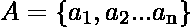
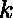
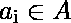
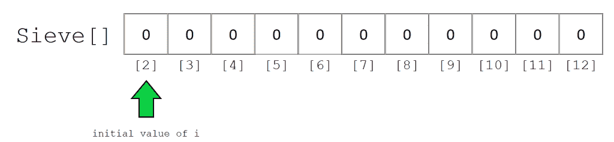
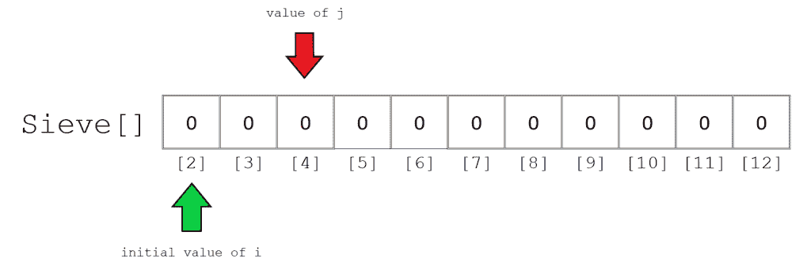
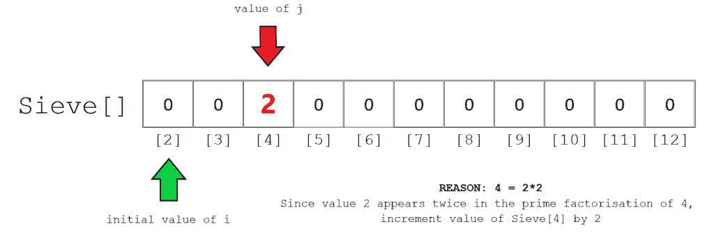
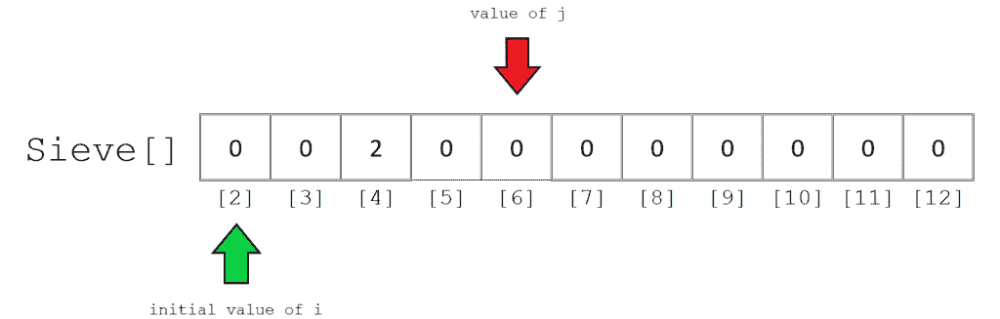
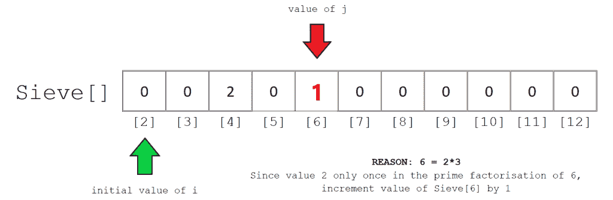
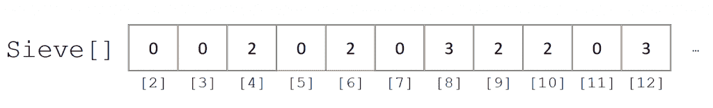

# 检查给定数组的每个元素是否都是 K 个素数的乘积

> 原文:[https://www . geesforgeks . org/check-如果给定数组的每个元素都是 k 个素数的乘积/](https://www.geeksforgeeks.org/check-if-each-element-of-the-given-array-is-the-product-of-exactly-k-prime-numbers/)

给定一组数字和的值，检查每个数字是否可以精确地表示为素数的乘积。对于数组的每个元素，如果条件满足，则打印“是”，否则打印“否”。
**注:**重复质数也可考虑。例如，如果 k = 2，则 n = 4 (=2*2)是有效输入。
我们来考虑一下数字 36。36 可以分解为 2*2*3*3。因此，它是 4 个素数的乘积。如果 k 值为 4，则输出应为**是**。对于 k 的其他值，输出应为**否**。
**更多示例:**

```
Input:  arr[] = {30, 8, 12}, K = 3 
Output: YES, YES, YES
30 = 2*3*5
8 = 2*2*2
12 = 2*3*2

Input: arr[] = {30, 16, 32}, k = 5
Output: NO, NO, YES
Only 32 can be represented as product of 
5 prime numbers.
```

在本文中，我们将检查给定的数是否可以精确地表示为 **k** 素数的乘积。我们将要使用的基本概念只是厄拉多塞的[筛子的一个变体。
**推荐:**](https://en.wikipedia.org/wiki/Sieve_of_Eratosthenes) [如何构建厄拉多塞的筛子](https://www.geeksforgeeks.org/sieve-of-eratosthenes/)

> **关键区别:**在 screen 中，我们不用存储二进制值(如果数字不是质数，则为 0，如果数字是质数，则为 1)，而是可以存储组成那个数字的(重复)质数因子有多少。这种修改是在其构建过程中完成的。

创建这种改良筛的一般程序如下:

1.  创建一个满是 0 的数组来存储连续整数的列表(2，3，4 … 10^6).
2.  让 I 的值最初设置为 2。这是我们的第一个素数。
3.  通过将其值存储为 j，循环遍历 I 的所有倍数(2*i，3*i …直到 10^6)。继续步骤 3 和 4。
4.  计算使用 I 可以分解 j 的次数，并将结果存储到变量计数中。
5.  当数字 j 不能用 I 进一步分解时，用计数值增加筛[j]的值。
6.  最后，在整数列表中找到下一个大于 I 的素数。如果没有这样的号码，则终止该过程。否则，从第 2 步开始。

**举例说明:**
**STEP 1:**
初始化后的空筛阵如下图所示。为了简单起见，我们只关注索引 2 到 12。所有索引最初存储的值都是 0。
现在，我们要取的第一个素数是 2。这是 i.
的值



**STEP 2:**
初始化变量 j，保存从 2*i 开始的 I 的每个后续倍数的值，在本例中为 4。



**STEP 3:**
第三步涉及 j 的素因式分解的计算，更具体地说，我们只是对当你因式分解 j 时 I 出现的次数感兴趣
计算过程很简单。只要用 I 除 j 的值，直到得到一个不能被 I 整除的数，这里，4 可以被 2 除两次。4/2 产生 2，2/2 产生 1，1 不能被 2 整除，循环停止。因此，我们用计数变量的值更新 screen[4]的值，即 2。



**STEP 4:**
我们可以用类似的方式继续其他元素。接下来，j 的值是 6。6 只能被 2 除一次。因此，筛[6]的值为 1。





最终的计算筛数组应该如下所示。请注意，任何存储值 0 的索引都代表一个不是 2 个或更多素数乘积的数。这包括所有质数，0 和 1。
第二点需要注意的是，我们只需要勾选



以下是上述方法的实现:

## C++

```
// C++ program to check if each element of
// the given array is a product of exactly
// K prime factors

#include <iostream>
#define MAX 1000000
using namespace std;

// initialise the global sieve array
int Sieve[MAX] = { 0 };

// Function to generate Sieve
void constructSieve()
{
    // NOTE: k value is necessarily more than 1
    // hence, 0, 1 and any prime number cannot be
    // represented as product of
    // two or more prime numbers

    for (int i = 2; i <= MAX; i++) {
        if (Sieve[i] == 0) {
            for (int j = 2 * i; j <= MAX; j += i) {
                int temp = j;
                while (temp > 1 && temp % i == 0) {
                    Sieve[j]++;
                    temp = temp / i;
                }
            }
        }
    }
}

// Function to check if each number of array
// satisfies the given condition
void checkElements(int A[], int n, int k)
{
    for (int i = 0; i < n; i++) {
        if (Sieve[A[i]] == k) {
            cout << "YES\n";
        }
        else {
            cout << "NO\n";
        }
    }
}

// Driver Code
int main()
{
    // first construct the sieve
    constructSieve();

    int k = 3;
    int A[] = { 12, 36, 42, 72 };
    int n = sizeof(A) / sizeof(int);

    checkElements(A, n, k);

    return 0;
}
```

## Java 语言(一种计算机语言，尤用于创建网站)

```
// Java program to check if each element of
// the given array is a product of exactly
// K prime factors
import java.util.*;

class GFG
{

    static int MAX = 1000000;

    // initialise the global sieve array
    static int[] Sieve = new int[MAX+1];

    // Function to generate Sieve
    static void constructSieve()
    {
        // NOTE: k value is necessarily more than 1
        // hence, 0, 1 and any prime number cannot be
        // represented as product of
        // two or more prime numbers

        for (int i = 2; i <= MAX; i++)
        {
            if (Sieve[i] == 0)
            {
                for (int j = 2 * i; j <= MAX; j += i)
                {
                    int temp = j;
                    while (temp > 1 && temp % i == 0)
                    {
                        Sieve[j]++;
                        temp = temp / i;
                    }
                }
            }
        }
    }

    // Function to check if each number of array
    // satisfies the given condition
    static void checkElements(int A[], int n, int k)
    {
        for (int i = 0; i < n; i++)
        {
            if (Sieve[A[i]] == k)
            {
                System.out.println("YES");
            }
            else
            {
                System.out.println("No");
            }

        }
    }

    // Driver Code
    public static void main(String[] args)
    {
        // first construct the sieve
        constructSieve();

        int k = 3;
        int A[] = {12, 36, 42, 72};
        int n = A.length;

        checkElements(A, n, k);
    }
}

// This code contributed by Rajput-Ji
```

## 蟒蛇 3

```
# Python3 program to check if each element of
# the given array is a product of exactly
# K prime factors

MAX = 1000000

# initialise the global sieve array
Sieve = [0]*(MAX + 1)

# Function to generate Sieve
def constructSieve() :

    # NOTE: k value is necessarily more than 1
    # hence, 0, 1 and any prime number cannot be
    # represented as product of
    # two or more prime numbers

    for i in range(2, MAX + 1) :
        if (Sieve[i] == 0) :
            for j in range(2*i, MAX + 1, i) :
                temp = j;
                while (temp > 1 and temp % i == 0) :
                    Sieve[j] += 1;
                    temp = temp // i;

# Function to check if each number of array
# satisfies the given condition
def checkElements(A, n, k) :

    for i in range(n) :
        if (Sieve[A[i]] == k) :
            print("YES");

        else :
            print("NO");

# Driver Code
if __name__ == "__main__" :

    # first construct the sieve
    constructSieve();

    k = 3;
    A = [ 12, 36, 42, 72 ];
    n = len(A);

    checkElements(A, n, k);

# This code is contributed by AnkitRai01
```

## C#

```
// C# program to check if each element of
// the given array is a product of exactly
// K prime factors
using System;

class GFG
{

    static int MAX = 1000000;

    // initialise the global sieve array
    static int[] Sieve = new int[MAX+1];

    // Function to generate Sieve
    static void constructSieve()
    {
        // NOTE: k value is necessarily more than 1
        // hence, 0, 1 and any prime number cannot be
        // represented as product of
        // two or more prime numbers

        for (int i = 2; i <= MAX; i++)
        {
            if (Sieve[i] == 0)
            {
                for (int j = 2 * i; j <= MAX; j += i)
                {
                    int temp = j;
                    while (temp > 1 && temp % i == 0)
                    {
                        Sieve[j]++;
                        temp = temp / i;
                    }
                }
            }
        }
    }

    // Function to check if each number of array
    // satisfies the given condition
    static void checkElements(int []A, int n, int k)
    {
        for (int i = 0; i < n; i++)
        {
            if (Sieve[A[i]] == k)
            {
                Console.WriteLine("YES");
            }
            else
            {
                Console.WriteLine("No");
            }

        }
    }

    // Driver Code
    public static void Main()
    {
        // first construct the sieve
        constructSieve();

        int k = 3;
        int []A = {12, 36, 42, 72};
        int n = A.Length;

        checkElements(A, n, k);
    }
}

// This code contributed by anuj_67...
```

## java 描述语言

```
<script>

// Javascript program to check if each element of
// the given array is a product of exactly
// K prime factors

const MAX = 1000000;

// initialise the global sieve array
let Sieve = new Array(MAX).fill(0);

// Function to generate Sieve
function constructSieve()
{
    // NOTE: k value is necessarily more than 1
    // hence, 0, 1 and any prime number cannot be
    // represented as product of
    // two or more prime numbers

    for (let i = 2; i <= MAX; i++) {
        if (Sieve[i] == 0) {
            for (let j = 2 * i; j <= MAX; j += i)
            {
                let temp = j;
                while (temp > 1 && temp % i == 0)
                {
                    Sieve[j]++;
                    temp = parseInt(temp / i);
                }
            }
        }
    }
}

// Function to check if each number of array
// satisfies the given condition
function checkElements(A, n, k)
{
    for (let i = 0; i < n; i++) {
        if (Sieve[A[i]] == k) {
            document.write("YES<br>");
        }
        else {
            document.write("NO<br>");
        }
    }
}

// Driver Code

    // first construct the sieve
    constructSieve();

    let k = 3;
    let A = [ 12, 36, 42, 72 ];
    let n = A.length;

    checkElements(A, n, k);

</script>
```

**Output:** 

```
YES
NO
YES
NO
```

**时间复杂度:**O(n * log(logn))
T3】空间复杂度 : O(MAX)，其中 MAX 为 10 <sup>6</sup> 。