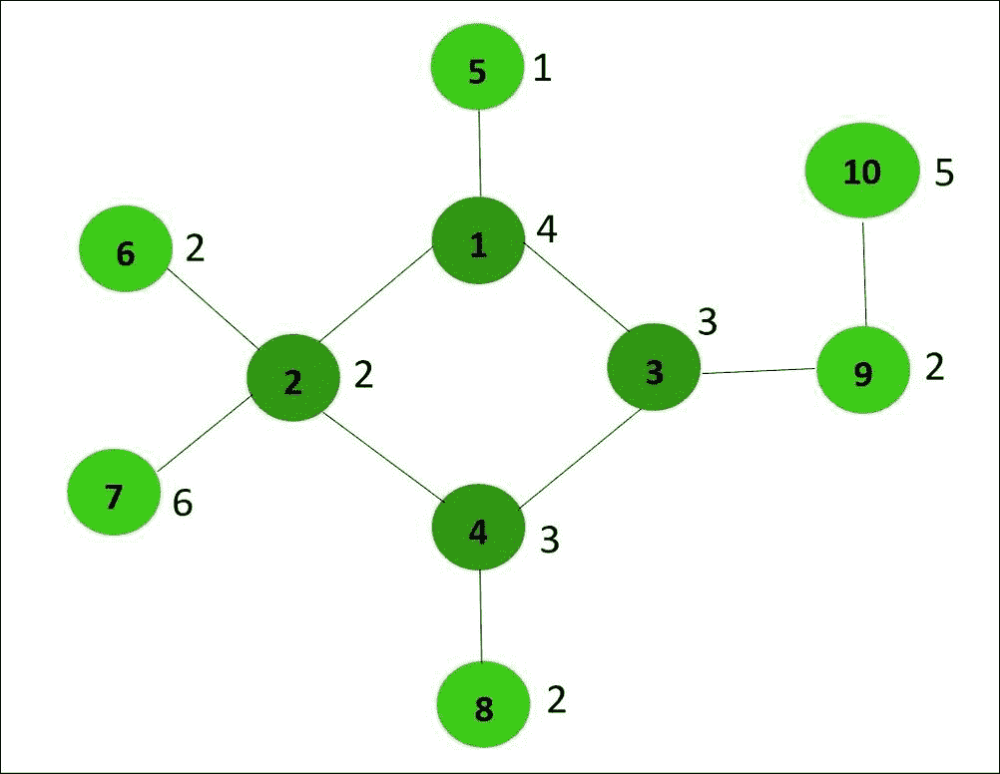
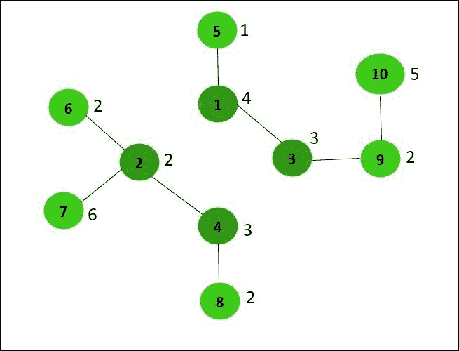
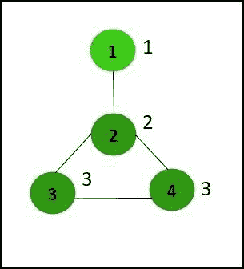

# 通过从循环中移除边来检查是否可以从给定的图中获得相等的和分量

> 原文:[https://www . geesforgeks . org/check-if-equal-sum-components-可以通过从循环中移除边来从给定的图中获得/](https://www.geeksforgeeks.org/check-if-equal-sum-components-can-be-obtained-from-given-graph-by-removing-edges-from-a-cycle/)

给定一个仅包含一个循环的具有 **N** 顶点和 **N** 边的无向[图](https://www.geeksforgeeks.org/graph-data-structure-and-algorithms/)，以及一个大小为 **N** 的数组**arr【】**，其中 **arr[i]** 表示 **i <sup>th</sup> 节点**的值，任务是检查该循环是否可以分为两个组件，使得两个组件中所有节点值的总和为

**示例:**

> **输入:** N = 10，arr[] = {4，2，3，3，1，2，6，2，2，2，5}，edge[]= { {1，2}，{ 1，3}，{2，6}，{2，7}，{2，4}，{4，8}，{4，3}，{3，9}，{9，10} }
> 
> 
> 
> **输出:**是
> **说明:**通过去掉边 1-2 和 3-4，生成的两个分量的所有节点值之和等于 15。
> 
> [](https://media.geeksforgeeks.org/wp-content/uploads/20201128031955/BreakingBadBreak.jpg)
> 
> **输入:** N= 4，arr[] = {1，2，3，3}，边[] = {{1，2}，{2，3}，{3，4}，{2，4}}
> 
> 
> 
> **输出:**否
> **解释:**不存在通过从循环中移除边来获得两个相等和分量的可能方法。

**方法:**解决这个问题的思路是首先找到属于循环的[部分的节点。然后，将不是循环一部分的每个节点的值添加到循环中最近的节点。最后一步包括检查周期是否可以分成两个相等的和分量。以下是步骤:](https://www.geeksforgeeks.org/print-nodes-which-are-not-part-of-any-cycle-in-a-directed-graph/)

*   第一步是使用[找到属于循环一部分的所有节点，并使用 DFS](https://www.geeksforgeeks.org/detect-cycle-undirected-graph/) 在无向图中检测循环。
*   在给定的图上执行 [DFS 遍历，并执行以下操作:](https://www.geeksforgeeks.org/depth-first-search-or-dfs-for-a-graph/)
    *   将当前节点标记为已访问。对于连接到当前节点的每个未访问节点，递归执行每个节点的 DFS 遍历。
    *   如果当前节点的相邻节点已经被访问，并且与当前节点的前一个节点不同，那么这意味着当前节点是周期的一部分。[回溯](https://www.geeksforgeeks.org/backtracking-algorithms/)直到到达该特定的相邻节点，以找到属于该循环的所有节点，并将它们存储在[向量](https://www.geeksforgeeks.org/vector-in-cpp-stl/) **循环【】**中。
*   求**inccycle[]**中每个节点的值之和，并将此和加到当前的**inccycle[]**节点值上。
*   找出**周期[]** 中存在的所有节点的值的总和，并将其存储在变量**中**中。如果 **totalSum** 的值为奇数，则打印**“否”**，因为奇数和的周期不能分成两个相等的和分量。
*   否则，检查 **totalSum/2** 的值是否存在于**inccycle【】**中，然后打印**“是”**否则打印**“否”**。

下面是上述方法的实现:

## C++

```
// C++ program for the above approach
#include <bits/stdc++.h>
using namespace std;

// Recursive function to find all the
// nodes that are part of the cycle
void findNodesinCycle(int u, bool* vis,
                      int* prev,
                      vector<int> adj[],
                      vector<int>& inCycle)
{
    // Mark current node as visited
    vis[u] = true;

    for (int v : adj[u]) {

        // If node v is not visited
        if (!vis[v]) {

            prev[v] = u;

            // Recursively find cycle
            findNodesinCycle(v, vis, prev,
                             adj, inCycle);

            // If cycle is detected then
            // return the previous node
            if (!inCycle.empty())
                return;
        }

        // If node is already visited
        // and not equal to prev[u]
        else if (v != prev[u]) {
            int curr = u;
            inCycle.push_back(curr);

            // Backtrack all vertices
            // that are part of cycle
            // and store them in inCycle
            while (curr != v) {
                curr = prev[curr];
                inCycle.push_back(curr);
            }

            // As the cycle is detected
            // return the previous node
            return;
        }
    }
}

// Function to add the value of each
// node which is not part of the cycle
// to its nearest node in the cycle
int sumOfnonCycleNodes(
    int u, vector<int> adj[],
    vector<int> inCycle, bool* vis,
    int arr[])
{
    // Mark the current node as visited
    vis[u] = true;

    // Stores the value of required sum
    int sum = 0;

    for (int v : adj[u]) {

        // If v is not already visited
        // and not present in inCycle
        if (!vis[v]

            && find(inCycle.begin(),
                    inCycle.end(), v)
                   == inCycle.end()) {

            // Add to sum and call the
            // function recursively
            sum += (arr[v - 1]
                    + sumOfnonCycleNodes(
                          v, adj, inCycle,
                          vis, arr));
        }
    }

    // Return the value of sum
    return sum;
}

// Function that add the edges
// to the graph
void addEdge(vector<int> adj[],
             int u, int v)
{
    adj[u].push_back(v);
    adj[v].push_back(u);
}

// Utility Function to check if the cycle
// can be divided into two same sum
bool isBreakingPossible(vector<int> adj[],
                        int arr[], int N)
{
    // Stores all the nodes that are
    // part of the cycle
    vector<int> inCycle;

    // Array to check if a node is
    // already visited or not
    bool vis[N + 1];

    // Initialize vis to false
    memset(vis, false, sizeof vis);

    // Array to store the previous node
    // of the current node
    int prev[N + 1];

    // Initialize prev to 0
    memset(prev, 0, sizeof prev);

    // Recursive function call
    findNodesinCycle(1, vis, prev,
                     adj, inCycle);

    memset(vis, false, sizeof vis);

    // Update value of each inCycle
    // node
    for (int u : inCycle) {

        // Add sum of values of all
        // required node to current
        // inCycle node value
        arr[u - 1] += sumOfnonCycleNodes(
            u, adj, inCycle, vis, arr);
    }

    // Stores total sum of values of
    // all nodes present in inCycle
    int tot_sum = 0;

    // Find the total required sum
    for (int node : inCycle) {
        tot_sum += arr[node - 1];
    }

    // If value of tot_sum is odd
    // then return false
    if (tot_sum % 2 != 0)
        return false;

    int req_sum = tot_sum / 2;

    // Create an empty map
    unordered_map<int, int> map;

    // Initialise map[0]
    map[0] = -1;

    // Maintain the sum of values of
    // nodes so far
    int curr_sum = 0;

    for (int i = 0; i < inCycle.size(); i++) {

        // Add the current node value
        // to curr_sum
        curr_sum += arr[inCycle[i] - 1];

        // If curr_sum - req_sum in map
        // then there is a subarray of
        // nodes with sum of their values
        // equal to req_sum
        if (map.find(curr_sum - req_sum)
            != map.end()) {
            return true;
        }

        map[curr_sum] = i;
    }

    // If no such subarray exists
    return false;
}

// Function to check if the cycle can
// be divided into two same sum
void checkCycleDivided(int edges[][2],
                       int arr[],
                       int N)
{
    vector<int> adj[N + 1];

    // Traverse the given edges
    for (int i = 0; i < N; i++) {

        int u = edges[i][0];
        int v = edges[i][1];

        // Add the edges
        addEdge(adj, u, v);
    }

    // Print the result
    cout << (isBreakingPossible(
                 adj, arr, N)
                 ? "Yes"
                 : "No");
}

// Driver Code
int main()
{
    int N = 10;
    int edges[][2] = { { 1, 2 }, { 1, 5 }, { 1, 3 }, { 2, 6 }, { 2, 7 }, { 2, 4 }, { 4, 8 }, { 4, 3 }, { 3, 9 }, { 9, 10 } };
    int arr[] = { 4, 2, 3, 3, 1,
                  2, 6, 2, 2, 5 };

    // Function Call
    checkCycleDivided(edges, arr, N);

    return 0;
}
```

## Java 语言(一种计算机语言，尤用于创建网站)

```
// Java program for the above approach
import java.util.*;
class GFG
{

  // Recursive function to find all the
  // nodes that are part of the cycle
  static void findNodesinCycle(int u, boolean[] vis,
                               int[] prev,
                               ArrayList<ArrayList<Integer>> adj,
                               ArrayList<Integer> inCycle)
  {

    // Mark current node as visited
    vis[u] = true;
    for (int v : adj.get(u))
    {

      // If node v is not visited
      if (!vis[v])
      {
        prev[v] = u;

        // Recursively find cycle
        findNodesinCycle(v, vis, prev,
                         adj, inCycle);

        // If cycle is detected then
        // return the previous node
        if (inCycle.size() > 0)
          return;
      }

      // If node is already visited
      // and not equal to prev[u]
      else if (v != prev[u])
      {
        int curr = u;
        inCycle.add(curr);

        // Backtrack all vertices
        // that are part of cycle
        // and store them in inCycle
        while (curr != v)
        {
          curr = prev[curr];
          inCycle.add(curr);
        }

        // As the cycle is detected
        // return the previous node
        return;
      }
    }
  }

  // Function to add the value of each
  // node which is not part of the cycle
  // to its nearest node in the cycle
  static int sumOfnonCycleNodes(
    int u, ArrayList<ArrayList<Integer>> adj,
    ArrayList<Integer> inCycle, boolean[] vis,
    int arr[])
  {

    // Mark the current node as visited
    vis[u] = true;

    // Stores the value of required sum
    int sum = 0;

    for (int v : adj.get(u))
    {

      // If v is not already visited
      // and not present in inCycle
      if (!vis[v]
          && !inCycle.contains(v))
      {

        // Add to sum and call the
        // function recursively
        sum += (arr[v - 1] + sumOfnonCycleNodes(
          v, adj, inCycle, vis, arr));
      }
    }

    // Return the value of sum
    return sum;
  }

  // Utility Function to check if the cycle
  // can be divided into two same sum
  static boolean isBreakingPossible(ArrayList<ArrayList<Integer>> adj,
                                    int arr[], int N)
  {

    // Stores all the nodes that are
    // part of the cycle
    ArrayList<Integer> inCycle = new ArrayList<>();

    // Array to check if a node is
    // already visited or not
    boolean[] vis = new boolean[N + 1];

    // Array to store the previous node
    // of the current node
    int[] prev = new int[N + 1];

    // Recursive function call
    findNodesinCycle(1, vis, prev,
                     adj, inCycle);

    Arrays.fill(vis,false);

    // Update value of each inCycle
    // node
    for (Integer u : inCycle)
    {

      // Add sum of values of all
      // required node to current
      // inCycle node value
      arr[u - 1] += sumOfnonCycleNodes(
        u, adj, inCycle, vis, arr);
    }

    // Stores total sum of values of
    // all nodes present in inCycle
    int tot_sum = 0;

    // Find the total required sum
    for (int node : inCycle)
    {
      tot_sum += arr[node - 1];
    }

    // If value of tot_sum is odd
    // then return false
    if (tot_sum % 2 != 0)
      return false;
    int req_sum = tot_sum / 2;

    // Create an empty map
    Map<Integer, Integer> map = new HashMap<>();

    // Initialise map[0]
    map.put(0, -1);

    // Maintain the sum of values of
    // nodes so far
    int curr_sum = 0;
    for (int i = 0; i < inCycle.size(); i++)
    {

      // Add the current node value
      // to curr_sum
      curr_sum += arr[inCycle.get(i) - 1];

      // If curr_sum - req_sum in map
      // then there is a subarray of
      // nodes with sum of their values
      // equal to req_sum
      if (map.containsKey(curr_sum - req_sum))
      {
        return true;
      }
      map.put(curr_sum, i);
    }

    // If no such subarray exists
    return false;
  }

  // Function to check if the cycle can
  // be divided into two same sum
  static void checkCycleDivided(int edges[][],
                                int arr[], int N)
  {
    ArrayList<ArrayList<Integer>> adj = new ArrayList<>();

    for(int i = 0; i <= N; i++)
      adj.add(new ArrayList<>());

    // Traverse the given edges
    for (int i = 0; i < N; i++)
    {

      int u = edges[i][0];
      int v = edges[i][1];

      // Add the edges
      adj.get(u).add(v);
      adj.get(v).add(u);
    }

    // Print the result
    System.out.print(isBreakingPossible(
      adj, arr, N) ? "Yes" : "No");
  }

  // Driver code
  public static void main (String[] args)
  {
    int N = 10;
    int edges[][] = { { 1, 2 }, { 1, 5 },
                     { 1, 3 }, { 2, 6 },
                     { 2, 7 }, { 2, 4 },
                     { 4, 8 }, { 4, 3 },
                     { 3, 9 }, { 9, 10 } };
    int arr[] = { 4, 2, 3, 3, 1,
                 2, 6, 2, 2, 5 };

    // Function Call
    checkCycleDivided(edges, arr, N);
  }
}

// This code is contributed by offbeat
```

## 蟒蛇 3

```
# Python3 program for the above approach

# Recursive function to find all the
# nodes that are part of the cycle
def findNodesinCycle(u):
    global adj, pre, inCycle, vis
    vis[u] = True
    for v in adj[u]:

        # If node v is not visited
        if (not vis[v]):
            pre[v] = u

            # Recursively find cycle
            findNodesinCycle(v)

            # If cycle is detected then
            # return the previous node
            if (len(inCycle) > 0):
                return

        # If node is already visited
        # and not equal to prev[u]
        elif (v != pre[u]):
            curr = u
            inCycle.append(curr)

            # Backtrack all vertices
            # that are part of cycle
            # and store them in inCycle
            while (curr != v):
                curr = pre[curr]
                inCycle.append(curr)

            # As the cycle is detected
            # return the previous node
            return

# Function to add the value of each
# node which is not part of the cycle
# to its nearest node in the cycle
def sumOfnonCycleNodes(u, arr):
    global adj, pre, inCycle, vis
    vis[u] = True

    # Stores the value of required sum
    sum = 0
    for v in adj[u]:

        # If v is not already visited
        # and not present in inCycle
        if (not vis[v]) and (v not in inCycle):

            # Add to sum and call the
            # function recursively
            sum += (arr[v - 1] + sumOfnonCycleNodes(v, arr))

    # Return the value of sum
    return sum

# Function that add the edges
# to the graph
def addEdge(u, v):
    global adj
    adj[u].append(v)
    adj[v].append(u)

# Utility Function to check if the cycle
# can be divided into two same sum
def isBreakingPossible(arr, N):

    # Stores all the nodes that are
    global adj, vis, pre

    # Recursive function call
    findNodesinCycle(1,)

    for i in range(N + 1):
        vis[i] = False

    # Update value of each inCycle
    # node
    for u in inCycle:

        # Add sum of values of all
        # required node to current
        # inCycle node value
        arr[u - 1] += sumOfnonCycleNodes(u, arr)

    # Stores total sum of values of
    # all nodes present in inCycle
    tot_sum = 0

    # Find the total required sum
    for node in inCycle:
        tot_sum += arr[node - 1]

    # If value of tot_sum is odd
    # then return false
    if (tot_sum % 2 != 0):
        return False

    req_sum = tot_sum // 2

    # Create an empty map
    map = {}

    # Initialise map[0]
    map[0] = -1

    # Maintain the sum of values of
    # nodes so far
    curr_sum = 0
    for i in range(len(inCycle)):

        # Add the current node value
        # to curr_sum
        curr_sum += arr[inCycle[i] - 1]

        # If curr_sum - req_sum in map
        # then there is a subarray of
        # nodes with sum of their values
        # equal to req_sum
        if ((curr_sum - req_sum) in map):
            return True
        map[curr_sum] = i

    # If no such subarray exists
    return False

# Function to check if the cycle can
# be divided into two same sum
def checkCycleDivided(edges, arr, N):
    global adj

    # Traverse the given edges
    for i in range(N):

        u = edges[i][0]
        v = edges[i][1]

        # Add the edges
        addEdge(u, v)

    # Print the result
    print("Yes" if isBreakingPossible(arr, N) else "No")

# Driver Code
if __name__ == '__main__':
    N = 10
    edges= [[1, 2], [1, 5], [1, 3],
            [2, 6], [2, 7], [2, 4],
            [4, 8], [4, 3], [3, 9],
            [9, 10]]
    arr, adj, vis =  [4, 2, 3, 3, 1,
                     2, 6, 2, 2, 5], [[] for i in range(N + 1)], [False for i in range(N+1)]

    inCycle, pre =[], [0 for i in range(N+1)]
    checkCycleDivided(edges, arr, N)

    # This code is contributed by mohit kumar 29
```

## C#

```
// C# program for the above approach
using System;
using System.Collections.Generic;

public class GFG
{

  // Recursive function to find all the
  // nodes that are part of the cycle
  static void findNodesinCycle(int u, bool[] vis,int[] prev,
                               List<List<int>> adj,List<int> inCycle)
  {

    // Mark current node as visited
    vis[u] = true;

    foreach(int v in adj[u])
    {

      // If node v is not visited
      if (!vis[v])
      {
        prev[v] = u;

        // Recursively find cycle
        findNodesinCycle(v, vis, prev,adj, inCycle);

        // If cycle is detected then
        // return the previous node
        if (inCycle.Count > 0)
          return;
      }

      // If node is already visited
      // and not equal to prev[u]
      else if (v != prev[u])
      {
        int curr = u;
        inCycle.Add(curr);

        // Backtrack all vertices
        // that are part of cycle
        // and store them in inCycle

        while (curr != v)
        {
          curr = prev[curr];
          inCycle.Add(curr);
        }

        // As the cycle is detected
        // return the previous node
        return;
      }
    }
  }

  // Function to add the value of each
  // node which is not part of the cycle
  // to its nearest node in the cycle
  static int sumOfnonCycleNodes(int u, List<List<int>> adj,List<int> inCycle, bool[] vis,int[] arr)
  {
    // Mark the current node as visited
    vis[u] = true;

    // Stores the value of required sum
    int sum = 0;

    foreach(int v in adj[u])
    {
      // If v is not already visited
      // and not present in inCycle
      if (!vis[v] && !inCycle.Contains(v))
      {
        // Add to sum and call the
        // function recursively
        sum += (arr[v - 1] + sumOfnonCycleNodes(v, adj, inCycle, vis, arr));
      }
    }

    // Return the value of sum
    return sum;
  }

  // Utility Function to check if the cycle
  // can be divided into two same sum
  static bool isBreakingPossible(List<List<int>> adj,int[] arr, int N)
  {

    // Stores all the nodes that are
    // part of the cycle
    List<int> inCycle = new List<int>();

    // Array to check if a node is
    // already visited or not
    bool[] vis = new bool[N + 1];

    // Array to store the previous node
    // of the current node
    int[] prev = new int[N + 1];

    // Recursive function call
    findNodesinCycle(1, vis, prev, adj, inCycle);

    // Update value of each inCycle
    // node
    foreach(int u in inCycle)
    {

      // Add sum of values of all
      // required node to current
      // inCycle node value
      arr[u - 1] += sumOfnonCycleNodes(u, adj, inCycle, vis, arr);
    }

    // Stores total sum of values of
    // all nodes present in inCycle
    int tot_sum = 0;

    // Find the total required sum
    foreach(int node in inCycle)
    {
      tot_sum += arr[node - 1];
    }

    // If value of tot_sum is odd
    // then return false
    if (tot_sum % 2 != 0)
      return false;
    int req_sum = tot_sum / 2;

    // Create an empty map
    Dictionary<int, int> map = new Dictionary<int, int>();

    // Initialise map[0]
    map.Add(0, -1);

    // Maintain the sum of values of
    // nodes so far
    int curr_sum = 0;
    for (int i = 0; i < inCycle.Count; i++)
    {

      // Add the current node value
      // to curr_sum
      curr_sum += arr[inCycle[i] - 1];

      // If curr_sum - req_sum in map
      // then there is a subarray of
      // nodes with sum of their values
      // equal to req_sum
      if (map.ContainsKey(curr_sum - req_sum))
      {
        return true;
      }
      map.Add(curr_sum, i);
    }

    // If no such subarray exists
    return false;
  }

  // Function to check if the cycle can
  // be divided into two same sum
  static void checkCycleDivided(int[,] edges,int[] arr, int N)
  {
    List<List<int>> adj = new List<List<int>>();
    for(int i = 0; i <= N; i++)
    {
      adj.Add(new List<int>());

    }

    // Traverse the given edges
    for (int i = 0; i < N; i++)
    {

      int u = edges[i,0];
      int v = edges[i,1];

      // Add the edges
      adj[u].Add(v);
      adj[v].Add(u);
    }

    // Print the result
    Console.Write(isBreakingPossible(adj, arr, N) ? "Yes" : "No");
  }

  // Driver code
  static public void Main (){
    int N = 10;
    int[,] edges = { { 1, 2 }, { 1, 5 },
                    { 1, 3 }, { 2, 6 },
                    { 2, 7 }, { 2, 4 },
                    { 4, 8 }, { 4, 3 },
                    { 3, 9 }, { 9, 10 } };
    int[] arr = { 4, 2, 3, 3, 1,
                 2, 6, 2, 2, 5 };

    // Function Call
    checkCycleDivided(edges, arr, N);
  }
}

// This code is contributed by avanitrachhadiya2155
```

## java 描述语言

```
<script>

// JavaScript program for the above approach

// Recursive function to find all the
  // nodes that are part of the cycle
function findNodesinCycle(u,vis,prev,adj,inCycle)
{
    // Mark current node as visited
    vis[u] = true;
    for (let v=0;v< adj[u].length;v++)
    {

      // If node v is not visited
      if (!vis[adj[u][v]])
      {
        prev[adj[u][v]] = u;

        // Recursively find cycle
        findNodesinCycle(adj[u][v], vis, prev,
                         adj, inCycle);

        // If cycle is detected then
        // return the previous node
        if (inCycle.length > 0)
          return;
      }

      // If node is already visited
      // and not equal to prev[u]
      else if (adj[u][v] != prev[u])
      {
        let curr = u;
        inCycle.push(curr);

        // Backtrack all vertices
        // that are part of cycle
        // and store them in inCycle
        while (curr != adj[u][v])
        {
          curr = prev[curr];
          inCycle.push(curr);
        }

        // As the cycle is detected
        // return the previous node
        return;
      }
    }
}

// Function to add the value of each
  // node which is not part of the cycle
  // to its nearest node in the cycle
function sumOfnonCycleNodes(u,adj,inCycle,vis,arr)
{
    // Mark the current node as visited
    vis[u] = true;

    // Stores the value of required sum
    let sum = 0;

    for (let v=0;v< adj[u].length;v++)
    {

      // If v is not already visited
      // and not present in inCycle
      if (!vis[adj[u][v]]
          && !inCycle.includes(adj[u][v]))
      {

        // Add to sum and call the
        // function recursively
        sum += (arr[adj[u][v] - 1] + sumOfnonCycleNodes(
          adj[u][v], adj, inCycle, vis, arr));
      }
    }

    // Return the value of sum
    return sum;
}

// Utility Function to check if the cycle
  // can be divided into two same sum
function isBreakingPossible(adj,arr,N)
{
    // Stores all the nodes that are
    // part of the cycle
    let inCycle = [];

    // Array to check if a node is
    // already visited or not
    let vis = new Array(N + 1);

    // Array to store the previous node
    // of the current node
    let prev = new Array(N + 1);

    // Recursive function call
    findNodesinCycle(1, vis, prev,
                     adj, inCycle);

    for(let i=0;i<vis.length;i++)
    {
        vis[i]=false;
    }

    // Update value of each inCycle
    // node
    for (let u=0;u< inCycle.length;u++)
    {

      // Add sum of values of all
      // required node to current
      // inCycle node value
      arr[inCycle[u] - 1] += sumOfnonCycleNodes(
        inCycle[u], adj, inCycle, vis, arr);
    }

    // Stores total sum of values of
    // all nodes present in inCycle
    let tot_sum = 0;

    // Find the total required sum
    for (let node=0;node< inCycle.length;node++)
    {
      tot_sum += arr[inCycle[node] - 1];
    }

    // If value of tot_sum is odd
    // then return false
    if (tot_sum % 2 != 0)
      return false;
    let req_sum = tot_sum / 2;

    // Create an empty map
    let map = new Map();

    // Initialise map[0]
    map.set(0, -1);

    // Maintain the sum of values of
    // nodes so far
    let curr_sum = 0;
    for (let i = 0; i < inCycle.length; i++)
    {

      // Add the current node value
      // to curr_sum
      curr_sum += arr[inCycle[i] - 1];

      // If curr_sum - req_sum in map
      // then there is a subarray of
      // nodes with sum of their values
      // equal to req_sum
      if (map.has(curr_sum - req_sum))
      {
        return true;
      }
      map.set(curr_sum, i);
    }

    // If no such subarray exists
    return false;
}

// Function to check if the cycle can
  // be divided into two same sum
function checkCycleDivided(edges,arr,N)
{
    let adj = [];

    for(let i = 0; i <= N; i++)
      adj.push([]);

    // Traverse the given edges
    for (let i = 0; i < N; i++)
    {

      let u = edges[i][0];
      let v = edges[i][1];

      // Add the edges
      adj[u].push(v);
      adj[v].push(u);
    }

    // Print the result
    document.write(isBreakingPossible(
      adj, arr, N) ? "Yes" : "No");
}

  // Driver code
let N = 10;
let edges  = [[ 1, 2 ], [ 1, 5 ],
                     [ 1, 3 ], [ 2, 6 ],
                     [ 2, 7 ], [ 2, 4 ],
                     [ 4, 8 ], [ 4, 3 ],
                     [ 3, 9 ], [ 9, 10 ]];
let arr=[4, 2, 3, 3, 1,
                 2, 6, 2, 2, 5];
// Function Call
checkCycleDivided(edges, arr, N);

// This code is contributed by patel2127

</script>
```

**Output:** 

```
Yes
```

***时间复杂度:**O(N)*
T5**辅助空间:** O(N)