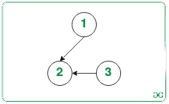
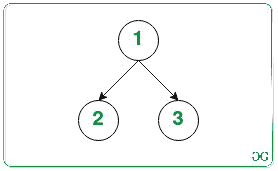
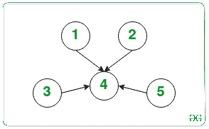

# 检查每个节点是否可以通过最多 N/2 个给定操作从树的一个节点访问

> 原文:[https://www . geesforgeks . org/check-如果每个节点都可以通过最多 n-2 个给定操作从树中的一个节点访问/](https://www.geeksforgeeks.org/check-if-every-node-can-me-made-accessible-from-a-node-of-a-tree-by-at-most-n-2-given-operations/)

给定一个由 **N** 个节点组成的[有向树](https://www.geeksforgeeks.org/convert-directed-graph-into-a-tree/)，任务是检查给定树中是否存在一个节点，以便通过从树中移除任何有向边并最多在树中的任何一对节点之间添加另一个有向边[T5】层 T7】T8(N/2)次来到达所有其他节点。如果存在这样的节点，则打印**“是”**。否则，打印**“否”**。](https://www.geeksforgeeks.org/ceil-floor-functions-cpp/)

**示例:**

> **输入:** N = 3
> 
> [](https://media.geeksforgeeks.org/wp-content/cdn-uploads/20210219144559/DirectedGraph539414Ex1.jpg)
> 
> **输出:**是
> T3】说明:T5】移除边 2 - > 3，插入边 1 - > 3。
> 
> [](https://media.geeksforgeeks.org/wp-content/cdn-uploads/20210219144541/DirectedGraph539414Explanation1.jpg)
> 
> 因此，剩余的两个节点(2，3)现在都可以从节点 1 访问。
> 所需操作数为 1，即< =楼层(3/2) (= 1)。
> **输入:** N = 5
> 
> [](https://media.geeksforgeeks.org/wp-content/cdn-uploads/20210219144523/DirectedGraph539414Example2.jpg)
> 
> **输出:**否

**方法:**解决这个问题的思路基于以下观察:

*   每个节点应该至少有一个父节点，即每个节点应该至少有 1 个 [**索引**](https://www.geeksforgeeks.org/finding-in-and-out-degrees-of-all-vertices-in-a-graph/) ，以使树可以从所需节点访问。
*   可以得出结论，如果每个节点的**至少有 1 个**索引，那么所有其他节点都可以被访问。
*   因此，任务简化为寻找具有 **0 度**的节点数量，并检查其是否至多为 **N / 2** 。

按照以下步骤解决问题:

*   将树中每个节点的[入度存储在大小为 **(N + 1)** 的辅助](https://www.geeksforgeeks.org/finding-in-and-out-degrees-of-all-vertices-in-a-graph/)[阵](https://www.geeksforgeeks.org/introduction-to-arrays/) **A[]** 中。
*   将此数组初始化为[地图](https://www.geeksforgeeks.org/map-associative-containers-the-c-standard-template-library-stl/)中所有**(键值)**对的 **A【键】=对**。
*   初始化一个变量，比如说**把**计数为 **0，**来存储入度等于 **0** 的节点数。
*   [遍历数组](https://www.geeksforgeeks.org/c-program-to-traverse-an-array/) **A[]** 和[计算值为 **0**](https://www.geeksforgeeks.org/counting-frequencies-of-array-elements/) 的数组元素数量，并将其存储在变量 **count** 中。
*   完成上述步骤后，如果**计数**的值最多为**楼层(N/2)** ，则打印**“是”**。否则，打印**“否”**。

下面是上述方法的实现:

## C++

```
// C++ program for the above approach
#include<bits/stdc++.h>
using namespace std;

void findNode(map<int, int> mp, int n)
{

    // Store the indegree
    // of every node
    int a[n];

    for(int i = 0; i < n; i++)
    {
        a[i] = mp[i + 1];
    }

    // Store the nodes having
    // indegree equal to 0
    int count0 = 0;

    // Traverse the array
    for(int i = 0; i < n; i++)
    {

        // If the indegree
        // of i-th node is 0
        if (a[i] == 0)
        {

            // Increment count0 by 1
            count0++;
        }
    }

    count0 -= 1;

    // If the number of operations
    // needed is at most floor(n/2)
    if (count0 <= floor(((double)n) /
                        ((double)2)))
    {
        cout << "Yes";
    }

    // Otherwise
    else
        cout << "No";
}

// Driver Code
int main()
{

    // Given number of nodes
    int N = 3;

    // Given Directed Tree
    map<int, int> mp;
    mp[1] = 0;
    mp[2] = 2;
    mp[3] = 0;

    findNode(mp, N);
}

// This code is contributed by SURENDRA_GANGWAR
```

## Java 语言(一种计算机语言，尤用于创建网站)

```
// Java program for the above approach
import java.io.*;
import java.util.HashMap;

class GFG {

    // Function to check if there is a
    // node in tree from where all other
    // nodes are accessible or not
    public static void
    findNode(HashMap<Integer, Integer> map,
             int n)
    {

        // Store the indegree
        // of every node
        int[] a = new int[n];

        for (int i = 0; i < n; i++) {
            a[i] = map.getOrDefault(i + 1, 0);
        }

        // Store the nodes having
        // indegree equal to 0
        int count0 = 0;

        // Traverse the array
        for (int i = 0; i < n; i++) {

            // If the indegree
            // of i-th node is 0
            if (a[i] == 0) {

                // Increment count0 by 1
                count0++;
            }
        }

        count0 -= 1;

        // If the number of operations
        // needed is at most floor(n/2)
        if (count0
            <= Math.floor(((double)n)
                          / ((double)2))) {
            System.out.println("Yes");
        }

        // Otherwise
        else
            System.out.println("No ");
    }

    // Driver Code
    public static void main(String[] args)
    {
        // Given number of nodes
        int N = 3;

        // Given Directed Tree
        HashMap<Integer, Integer> map
            = new HashMap<>();

        map.put(1, 0);
        map.put(2, 2);
        map.put(3, 0);

        findNode(map, N);
    }
}
```

## 蟒蛇 3

```
# python 3 program for the above approach

def findNode(mp, n):

    # Store the indegree
    # of every node
    a = [0]*n

    for i in range(n):

        a[i] = mp[i + 1]

    # Store the nodes having
    # indegree equal to 0
    count0 = 0

    # Traverse the array
    for i in range(n):

        # If the indegree
        # of i-th node is 0
        if (a[i] == 0):

            # Increment count0 by 1
            count0 += 1

    count0 -= 1

    # If the number of operations
    # needed is at most floor(n/2)
    if (count0 <= (n) /
            (2)):

        print("Yes")

    # Otherwise
    else:
        print("No")

# Driver Code
if __name__ == "__main__":

    # Given number of nodes
    N = 3

    # Given Directed Tree
    mp = {}
    mp[1] = 0
    mp[2] = 2
    mp[3] = 0

    findNode(mp, N)
```

## C#

```
// C# program for the above approach
using System;
using System.Collections.Generic;

public class GFG{

    // Function to check if there is a
    // node in tree from where all other
    // nodes are accessible or not
    public static void
    findNode(Dictionary<int, int> map,
             int n)
    {

        // Store the indegree
        // of every node
        int[] a = new int[n];

        for (int i = 0; i < n; i++) {
            if(map.ContainsKey(i+1))
            a[i] = map[i + 1];
            else
            a[i] = 0;
        }

        // Store the nodes having
        // indegree equal to 0
        int count0 = 0;

        // Traverse the array
        for (int i = 0; i < n; i++) {

            // If the indegree
            // of i-th node is 0
            if (a[i] == 0) {

                // Increment count0 by 1
                count0++;
            }
        }

        count0 -= 1;

        // If the number of operations
        // needed is at most floor(n/2)
        if (count0
            <= Math.Floor(((double)n)
                          / ((double)2))) {
            Console.WriteLine("Yes");
        }

        // Otherwise
        else
            Console.WriteLine("No ");
    }

    static public void Main ()
    {

   // Given number of nodes
        int N = 3;

        // Given Directed Tree
        Dictionary<int, int> map
            = new Dictionary<int, int>();

       map[1]= 0;
        map[2] = 2;
        map[3] = 0;

        findNode(map, N);
    }
}

// This code is contributed by offbeat
```

## java 描述语言

```
<script>

// Javascript program for the above approach

function findNode(mp, n)
{

    // Store the indegree
    // of every node
    var a = new Array(n);

    var i;
    for(i = 0; i < n; i++)
    {
        a[i] = mp[i + 1];
    }

    // Store the nodes having
    // indegree equal to 0
    var count0 = 0;

    // Traverse the array
    for(i = 0; i < n; i++)
    {

        // If the indegree
        // of i-th node is 0
        if (a[i] == 0)
        {

            // Increment count0 by 1
            count0++;
        }
    }

    count0 -= 1;

    // If the number of operations
    // needed is at most floor(n/2)
    if (count0 <= parseInt(n/2))
    {
        document.write("Yes");
    }

    // Otherwise
    else
        document.write("No");
}

// Driver Code

    // Given number of nodes
    var N = 3;

    // Given Directed Tree
    var mp = new Map();
    mp.set(1,0);
    mp.set(2,2);
    mp.set(3,0);
    mp[1] = 0;
    mp[2] = 2;
    mp[3] = 0;

    findNode(mp, N);

</script>
```

**Output:** 

```
Yes
```

***时间复杂度:** O(N)*
***辅助空间:** O(N)*