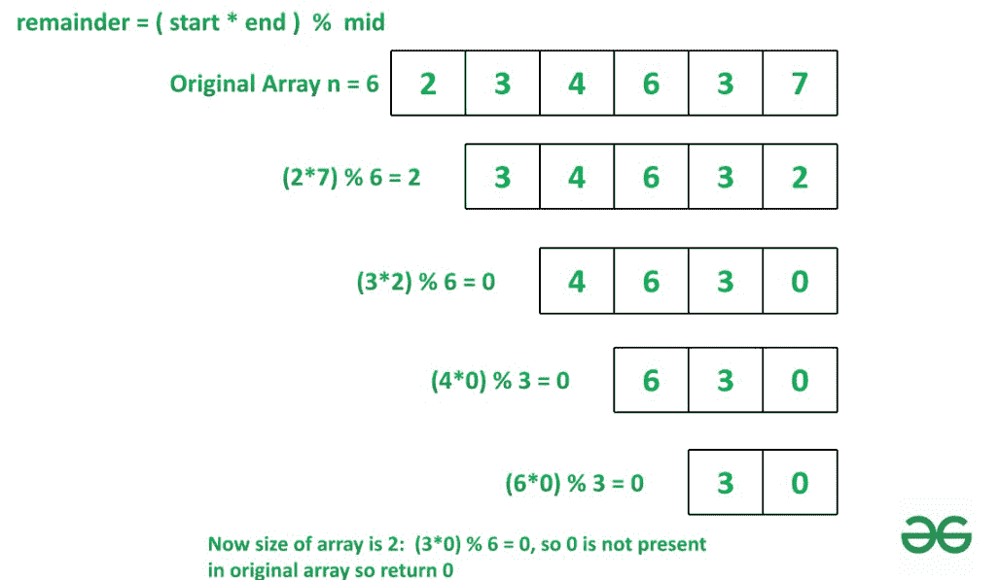

# 根据给定条件

减少最终余数，检查原始数组中是否存在最终余数

> 原文:[https://www . geeksforgeeks . org/check-if-final-余数-存在于原始数组中-通过基于给定条件对其进行约简/](https://www.geeksforgeeks.org/check-if-final-remainder-is-present-in-original-array-by-reducing-it-based-on-given-conditions/)

给定一个自然数的[数组](https://www.geeksforgeeks.org/introduction-to-arrays/)**arr【】**，任务是从前面移除一个元素，从末端移除一个元素，并找到它们的乘积，然后用数组的中间元素除乘积，并将我们得到的余数追加到数组的末尾，并继续相同的操作，直到数组的大小变为 2。

现在，当最后一个数组只包含两个元素时，两个元素的乘积除以原始数组的大小，如果剩余部分存在于原始数组中，我们必须打印**“是”**，否则**“否”**。

**示例:**

> **输入:** arr[] = {2，3，4，6，3，7}
> **输出:**否
> **解释:**
> 以下是对给定数组元素执行的操作:
> 从前后弹出元素，中间除，从后面将余数插入数组。
> 1。mid = 6，front = 2，rear = 7 余数将为(2*7) % 6 = 2 将数组修改为 arr={3，4，6，3，2}
> 2。mid = 6，front = 3，rear = 2 余数将为(3*2) % 6 = 0 将数组修改为 arr={4，6，3，0}
> 3。mid = 3，front = 4，rear = 0 余数将为(4*0) % 3 = 0 将数组修改为 arr={6，3，0}
> 4。mid = 3，front = 6，rear = 0 余数将为(6*0) % 3 = 0 将数组修改为 arr={3，0}
> 在以下操作后，arr 的大小为=2 so (3*0) % 6 = 0，并且 0 不在 arr 中，因此返回“否”
> **输入:**arr[=[2，3，4，8，5，7]
> **输出:**是
> 缩减数组将为[5，4]【T24】

**天真方法:**

*   将**中间**作为数组的中间元素。
*   从前面和后面弹出元素，取出它的产品，用中间元素分割产品。(从前面弹出元素需要 **O(N)时间**)。
*   从后面将余数插入一个数组，继续下去，直到数组的大小变成 2。
*   现在用元素的乘积除以原始数组的大小，检查余数是否存在于原始数组中。

下面是实现上述方法的步骤:

*   将原始数组复制到另一个数组，并对该数组执行操作。
*   以**中间**为中间元素，前后弹出元素，取其积除以**中间**。
*   把我们从后面分成数组后得到的余数加上去。
*   重复**步骤 2** 直到数组长度等于 **2** 。
*   最后取剩余元素的乘积除以 **n** 。
*   如果原始数组打印中存在余数**“是”**否则打印**“否”**。



下面是上述算法的实现。

## C++

```
#include <bits/stdc++.h>
using namespace std;

int Reduced(vector<int> a, int n)
{
    // copying original array
    vector<int> original_array;
    original_array = a;

    // loop till length of array become 2.
    while (a.size() != 2)
    {

        // find middle element
        int mid = a.size() / 2;

        int mid_ele = a[mid];

        // pop element from front and rear
        int start = a[0];
        a.erase(a.begin());
        int end = a[a.size() - 1];
        a.pop_back();

        // find remainder
        int rmd = (start * end) % mid_ele;

        // append remainder to a
        a.push_back(rmd);

        // now since length of array is 2
        // take product and divide it by n
        int remainder = (a[0] * a[1]) % n;

        // if remainder is present is original array
        // return 1, else return 0
        for (int i = 0; i < original_array.size(); i++)
        {
            if (original_array[i] == remainder)
            {
                return 1;
            }
        }
    }
    return 0;
}

int main()
{
    vector<int> Arr = {2, 3, 4, 8, 5, 7};
    int N = Arr.size();

    // calling function Reduced
    int x = Reduced(Arr, N);

    // if x = 1 print YES else NO
    if (x)
        cout << ("YES");
    else
        cout << ("NO");

    return 0;
}

// This code is contributed by Potta Lokesh
```

## 蟒蛇 3

```
# Python program to implement above approach

def Reduced(a, n):
    # copying original array
    original_array = a[:]

    # loop till length of array become 2.
    while len(a) != 2:

        # find middle element
        mid = len(a)//2
        mid_ele = a[mid]

        # pop element from front and rear
        start = a.pop(0)
        end = a.pop()

        # find remainder
        rmd = (start * end) % mid_ele

        # append remainder to a
        a.append(rmd)

    # now since length of array is 2
    # take product and divide it by n
    remainder = (a[0]*a[1]) % n

    # if remainder is present is original array
    # return 1, else return 0
    if remainder in original_array:
        return 1
    return 0

Arr = [2, 3, 4, 8, 5, 7]
N = len(Arr)

# calling function Reduced
x = Reduced(Arr, N)

# if x = 1 print YES else NO
if x:
    print("YES")
else:
    print("NO")
```

## C#

```
using System;
using System.Collections.Generic;
class GFg
{
    static int Reduced(List<int> a, int n)
    {
        // copying original array
        List<int> original_array = new List<int>(a);

        // loop till length of array become 2.
        while (a.Count != 2) {

            // find middle element
            int mid = a.Count / 2;

            int mid_ele = a[mid];

            // pop element from front and rear
            int start = a[0];
            a.RemoveAt(0);
            int end = a[a.Count - 1];
            a.RemoveAt(a.Count - 1);

            // find remainder
            int rmd = (start * end) % mid_ele;

            // append remainder to a
            a.Add(rmd);

            // now since length of array is 2
            // take product and divide it by n
            int remainder = (a[0] * a[1]) % n;

            // if remainder is present is original array
            // return 1, else return 0
            for (int i = 0; i < original_array.Count; i++) {
                if (original_array[i] == remainder) {
                    return 1;
                }
            }
        }
        return 0;
    }

  // Driver code
    public static void Main()
    {
        List<int> Arr
            = new List<int>() { 2, 3, 4, 8, 5, 7 };
        int N = Arr.Count;

        // calling function Reduced
        int x = Reduced(Arr, N);

        // if x = 1 print YES else NO
        if (x > 0)
            Console.WriteLine("YES");
        else
            Console.WriteLine("NO");
    }
}

// This code is contributed by ukasp.
```

## java 描述语言

```
<script>
function Reduced(a, n)
{
    // copying original array
    let original_array = [];
    original_array = a;

    // loop till length of array become 2.
    while (a.length != 2)
    {

        // find middle element
        let mid = Math.floor(a.length / 2);

        let mid_ele = a[mid];

        // pop element from front and rear
        let start = a[0];
        a.shift();
        let end = a[a.length - 1];
        a.pop();

        // find remainder
        let rmd = (start * end) % mid_ele;

        // append remainder to a
        a.push(rmd);

        // now since length of array is 2
        // take product and divide it by n
        let remainder = (a[0] * a[1]) % n;

        // if remainder is present is original array
        // return 1, else return 0
        for (let i = 0; i < original_array.length; i++)
        {
            if (original_array[i] == remainder)
            {
                return 1;
            }
        }
    }
    return 0;
}

// Driver code
    let Arr = [2, 3, 4, 8, 5, 7];
    let N = Arr.length;

    // calling function Reduced
    let x = Reduced(Arr, N);

    // if x = 1 print YES else NO
    if (x)
        document.write("YES");
    else
        document.write("NO");

// This code is contributed by gfgking.
</script>
```

**Output:** 

```
YES
```

**时间复杂度:**o(n^2)
T3】辅助空间: O(N)

**高效方法(使用** [**双指针算法**](https://www.geeksforgeeks.org/two-pointers-technique/) **)** :

*   取开始为 **0** ，结束为 **n-1** ，取开始和结束之和求中间指标，除以 2。
*   求运算后的余数，用余数替换最后一个元素
*   继续进行上述操作，直到 start 等于 end-1。
*   现在数组将剩下两个元素，取 **arr** 的元素，将其乘积除以 **n** ，并检查剩余部分是否存在于原始数组中。

下面是实现上述方法的步骤:

*   将原始数组复制到另一个数组，并对该数组执行操作。
*   初始开始为 **0** ，结束为 **n-1**
*   求中间指数为开始和结束的和除以 **2** 。
*   通过将**开始**和**结束**元素相乘，除以中间元素来求余数。
*   用余数替换结束元素，从 **1** 开始递增，保持结束与 **n-1** 相同。
*   重复步骤 **3** 直到开始等于**结束-1** 。
*   取数组索引开始和结束处元素的乘积，除以 **n** 。
*   如果原始数组打印中存在余数**“是”**否则**“否”**。