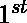
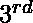

# 通过加减一些 X

检查给定的间隔是否可以不重叠

> 原文:[https://www . geeksforgeeks . org/check-if-给定间隔-可以通过加减某些-x/](https://www.geeksforgeeks.org/check-if-given-intervals-can-be-made-non-overlapping-by-adding-subtracting-some-x/) 使其不重叠

给定一个包含 **N** 间隔的数组**arr【】**，任务是检查间隔是否可以加或减 X，之后是否没有重叠的间隔。这里 X 可以是任何实数。

**示例:**

> **输入:** arr[] = {[1，3]，[2，4]，[4，5]，[5，6]}
> **输出:** YES
> **说明:**
> 我们可以在和区间中加上 X = 1000
> ans 在和区间中减去 X = 1000。
> 
> **输入:** arr[] = {[1，2]，[3，4]，[5，6]}
> **输出:**是
> **说明:**
> 无区间重叠。
> 
> **输入:** arr[] = {[1，4]，[2，2]，[2，3]}
> **输出:**否
> **说明:**
> 不存在区间不重叠的可能 X。

**方法:**想法是在[嵌套循环](https://www.geeksforgeeks.org/nested-loops-in-c-with-examples/)的帮助下，将每个间隔作为一对进行比较，然后针对每个间隔检查它们是否重叠。如果任何三个间隔彼此重叠，那么就没有办法增加任何值 **X** 来形成不重叠。
我们可以使用[联合查找或不相交集合数据结构](https://www.geeksforgeeks.org/union-find/)来发现三个间隔中是否存在相互重叠。

下面是上述方法的实现:

## C++

```
// C++ implementation to check if the
// intervals can be non-overlapping 
// by adding or subtracting X to
// each interval
#include <bits/stdc++.h>
using namespace std;

// Function to check if two intervals 
// overlap with each other
bool checkOverlapping(vector<int> a,
                      vector<int> b)
{
    if (a[0] < b[0])
    {
        a.swap(b);
    }

    // Condition to check if the
    // intervals overlap
    if (b[0]<= a[0]<= b[1])
        return true;

    return false;
}

// Function to check if there 
// is a existing overlapping 
// intervals
int find(int a[], int i)
{
    if (a[i] == i)
        return i;

    // Path compression
    a[i] = find(a, a[i]);
    return a[i];
}

// Union of two intervals
// Returns True 
// if there is a overlapping 
// with the same another interval
bool Union(int a[], int x, int y)
{
    int xs = find(a, x);
    int ys = find(a, y);

    if (xs == ys)
    {

        // Both have same
        // another 
        // overlapping interval
        return true;
    }
    a[ys]= xs;
    return false;
}

// Function to check if the intervals
// can be added by X to form 
// non-overlapping intervals
bool checkNonOverlapping(vector<vector<int>> arr,
                         int n)
{
    int dsu[n + 1];
    for(int i = 0; i < n + 1; i++)
        dsu[i] = i;

    for(int i = 0; i < n; i++)
    {
        for(int j = i + 1; j < n; j++)
        {

            // If the intervals 
            // overlaps
            // we will union them
            if (checkOverlapping(arr[i], arr[j]))
            {
                if (Union(dsu, i, j))
                {
                    return false;
                }
            }
        }
    }

    // There is no cycle
    return true;
}

// Driver Code  
int main()
{
    vector<vector<int>> arr ={ { 1, 4 },
                               { 2, 2 },
                               { 2, 3 } };
    int n = arr.size();

    if (checkNonOverlapping(arr,n))
    {
        cout << "YES" << endl;
    }
    else
    {
        cout << "NO" << endl;
    }
    return 0;
}

// This code is contributed by divyeshrabadiya07
```

## Java 语言(一种计算机语言，尤用于创建网站)

```
// Java implementation to check if the
// intervals can be non-overlapping by
// by adding or subtracting
// X to each interval
import java.io.*;
import java.util.*;

class GFG{

// Function to check if two intervals
// overlap with each other
public static Boolean checkOverlapping(
    ArrayList<Integer> a, ArrayList<Integer> b)
{
    if (a.get(0) < b.get(0))
    {
        int temp = a.get(0);
        a.set(0, b.get(0));
        b.set(0, temp);

        temp = a.get(1);
        a.set(1, b.get(1));
        b.set(1, temp);
    }

    // Condition to check if the
    // intervals overlap
    if (b.get(0) <= a.get(0) &&
        a.get(0) <= b.get(1))
        return true;

    return false;
}

// Function to check if there
// is a existing overlapping
// intervals
public static int find(ArrayList<Integer> a, int i)
{
    if (a.get(i) == i)
    {
        return i;  
    }

    // Path compression
    a.set(i,find(a, a.get(i)));
    return a.get(i);
}

// Union of two intervals Returns True.
// If there is a overlapping
// with the same another interval
public static Boolean union(ArrayList<Integer> a,
                            int x, int y)
{
    int xs = find(a, x);
    int ys = find(a, y);

    if (xs == ys)
    {

        // Both have same
        // another overlapping
        // interval
        return true;
    }
    a.set(ys, xs);
    return false;
}

// Function to check if the intervals
// can be added by X to form
// non-overlapping intervals
public static Boolean checkNonOverlapping(
    ArrayList<ArrayList<Integer>> arr, int n)
{
    ArrayList<Integer> dsu = new ArrayList<Integer>();
    for(int i = 0; i < n + 1; i++)
    {
        dsu.add(i);
    }

    for(int i = 0; i < n; i++)
    {
        for(int j = i + 1; j < n; j++)
        {

            // If the intervals
            // overlaps we will
            // union them
            if (checkOverlapping(arr.get(i),
                                 arr.get(j)))
            {
                if (union(dsu, i, j))
                {
                    return false;
                }
            }
        }
    }

    // There is no cycle
    return true;
}

// Driver Code
public static void main(String[] args)
{
    ArrayList<
    ArrayList<Integer>> arr = new ArrayList<
                                  ArrayList<Integer>>();
    arr.add(new ArrayList<Integer>(Arrays.asList(1, 4)));
    arr.add(new ArrayList<Integer>(Arrays.asList(2, 2)));
    arr.add(new ArrayList<Integer>(Arrays.asList(2, 3)));

    int n = arr.size();

    if (checkNonOverlapping(arr,n))
    {
        System.out.println("YES");
    }
    else
    {
        System.out.println("NO");
    }
}
}

// This code is contributed by avanitrachhadiya2155
```

## 蟒蛇 3

```
# Python3 implementation to check if
# the intervals can be non-overlapping by
# by adding or subtracting
# X to each interval

# Function to check if two intervals
# overlap with each other
def checkOverlapping(a, b):
    a, b = max(a, b), min(a, b)

    # Condition to check if the
    # intervals overlap
    if b[0]<= a[0]<= b[1]:
        return True
    return False

# Function to check if there
# is a existing overlapping
# intervals
def find(a, i):
    if a[i]== i:
        return i

    # Path compression
    a[i]= find(a, a[i])
    return a[i]

# Union of two intervals
# Returns True
# if there is a overlapping
# with the same another interval
def union(a, x, y):    
    xs = find(a, x)
    ys = find(a, y)
    if xs == ys:

        # Both have same
        # another
        # overlapping interval
        return True
    a[ys]= xs
    return False

# Function to check if the intervals
# can be added by X to form
# non-overlapping intervals
def checkNonOverlapping(arr, n):
    dsu =[i for i in range(n + 1)]
    for i in range(n):
        for j in range(i + 1, n):

            # If the intervals
            # overlaps
            # we will union them
            if checkOverlapping(arr[i], \
                               arr[j]):
                if union(dsu, i, j):
                    return False

    # There is no cycle
    return True

# Driver Code
if __name__ == "__main__":
    arr =[[1, 4], [2, 2], [2, 3]]
    n = len(arr)
    print("YES" if checkNonOverlapping\
       (arr, n) else "NO")
```

## C#

```
// C# implementation to check if
// the intervals can be non-overlapping by
// by adding or subtracting
// X to each interval
using System;
using System.Collections.Generic;
class GFG {

    // Function to check if two intervals
    // overlap with each other
    static bool checkOverlapping(List<int> a, List<int> b)
    {
        if(a[0] < b[0])
        {
            int temp = a[0];
            a[0] = b[0];
            b[0] = temp;

            temp = a[1];
            a[1] = b[1];
            b[1] = temp;
        }

        // Condition to check if the
        // intervals overlap
        if(b[0] <= a[0] && a[0] <= b[1])
            return true;
        return false;
    }

    // Function to check if there
    // is a existing overlapping
    // intervals
    static int find(List<int> a, int i)
    {
        if(a[i] == i)
        {
            return i;  
        }

        // Path compression
        a[i] = find(a, a[i]);
        return a[i];
    }

    // Union of two intervals
    // Returns True
    // if there is a overlapping
    // with the same another interval
    static bool union(List<int> a, int x, int y)
    {
        int xs = find(a, x);
        int ys = find(a, y);
        if(xs == ys)
        {
            // Both have same
            // another
            // overlapping interval
            return true;
        }

        a[ys] = xs;
        return false;
    }

    // Function to check if the intervals
    // can be added by X to form
    // non-overlapping intervals
    static bool checkNonOverlapping(List<List<int>> arr, int n)
    {
        List<int> dsu = new List<int>();
        for(int i = 0; i < n + 1; i++)
        {
            dsu.Add(i);
        }
        for(int i = 0; i < n; i++)
        {
            for(int j = i + 1; j < n; j++)
            {
                // If the intervals
                // overlaps
                // we will union them
                if(checkOverlapping(arr[i], arr[j]))
                {
                    if(union(dsu, i, j))
                    {
                        return false;
                    }
                }
            }
        }

        // There is no cycle
        return true;
    }

  static void Main() {
    List<List<int>> arr = new List<List<int>>();
    arr.Add(new List<int> { 1, 4 });
    arr.Add(new List<int> { 2, 2 });
    arr.Add(new List<int> { 2, 3 });

    int n = arr.Count;

    if (checkNonOverlapping(arr,n))
    {
        Console.WriteLine("YES");
    }
    else
    {
        Console.WriteLine("NO");
    }
  }
}

// This code is contributed by divyes072019
```

## java 描述语言

```
<script>

// JavaScript implementation to check if
// the intervals can be non-overlapping by
// by adding or subtracting
// X to each interval

// Function to check if two intervals
// overlap with each other
function checkOverlapping(a, b)
{
    if(a[0] < b[0])
    {
        var temp = a[0];
        a[0] = b[0];
        b[0] = temp;

        temp = a[1];
        a[1] = b[1];
        b[1] = temp;
    }

    // Condition to check if the
    // intervals overlap
    if(b[0] <= a[0] && a[0] <= b[1])
        return true;
    return false;
}

// Function to check if there
// is a existing overlapping
// intervals
function find(a, i)
{
    if(a[i] == i)
    {
        return i;  
    }

    // Path compression
    a[i] = find(a, a[i]);
    return a[i];
}

// Union of two intervals
// Returns True
// if there is a overlapping
// with the same another interval
function union(a, x, y)
{
    var xs = find(a, x);
    var ys = find(a, y);
    if(xs == ys)
    {
        // Both have same
        // another
        // overlapping interval
        return true;
    }

    a[ys] = xs;
    return false;
}

// Function to check if the intervals
// can be added by X to form
// non-overlapping intervals
function checkNonOverlapping(arr, n)
{
    var dsu = [];
    for(var i = 0; i < n + 1; i++)
    {
        dsu.push(i);
    }
    for(var i = 0; i < n; i++)
    {
        for(var j = i + 1; j < n; j++)
        {
            // If the intervals
            // overlaps
            // we will union them
            if(checkOverlapping(arr[i], arr[j]))
            {
                if(union(dsu, i, j))
                {
                    return false;
                }
            }
        }
    }

    // There is no cycle
    return true;
}

var arr = Array();
arr.push([1, 4 ]);
arr.push([2, 2 ]);
arr.push([2, 3 ]);

var n = arr.length;

if (checkNonOverlapping(arr,n))
{
    document.write("YES");
}
else
{
    document.write("NO");
}

</script>
```

**Output:** 

```
NO
```