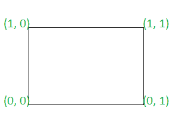
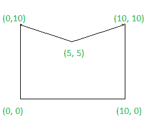

# 检查给定的多边形是否为凸多边形

> 原文:[https://www . geesforgeks . org/check-if-给定多边形是凸多边形还是非凸多边形/](https://www.geeksforgeeks.org/check-if-given-polygon-is-a-convex-polygon-or-not/)

给定一个 [2D 阵](https://www.geeksforgeeks.org/multidimensional-arrays-in-java/) **点【】【】**，表格的每一行 **{X，Y}** ，以顺时针或逆时针顺序表示一个[多边形](https://en.wikipedia.org/wiki/Polygon)的坐标，任务是检查该多边形是否是一个[凸多边形](https://en.wikipedia.org/wiki/Convex_polygon)。如果发现是真的，则打印**“是”**。否则，打印**“否”**。

> 在凸多边形中，所有内角都小于或等于 **180** 度

**示例:**

> **输入:** arr[] = { (0，0)，(0，1)，(1，1)，(1，0) }
> **输出:**是
> T6】说明:
> 
> 
> 
> 因为多边形的所有内角都小于 180 度。因此，所需的输出是“是”。
> 
> **输入:** arr[] = {(0，0)，(0，10)，(5，5)，(10，10)，(10，0)}
> **输出:**否
> **说明:**
> 
> 
> 
> 因为多边形的所有内角都不小于 180 度。因此，需要的输出是 No。

**方法:**按照以下步骤解决问题:

*   [遍历数组](https://www.geeksforgeeks.org/c-program-to-traverse-an-array/)，检查多边形任意两条相邻边的[叉积](https://www.geeksforgeeks.org/program-dot-product-cross-product-two-vector/)方向是否相同。如果发现属实，则打印**“是”**。
*   否则，打印**“否”**。

**以下是上述方法的实现:**

## C++

```
// C++ program to implement
// the above approach

#include <bits/stdc++.h>
using namespace std;

// Utility function to find cross product
// of two vectors
int CrossProduct(vector<vector<int> >& A)
{
    // Stores coefficient of X
    // direction of vector A[1]A[0]
    int X1 = (A[1][0] - A[0][0]);

    // Stores coefficient of Y
    // direction of vector A[1]A[0]
    int Y1 = (A[1][1] - A[0][1]);

    // Stores coefficient of X
    // direction of vector A[2]A[0]
    int X2 = (A[2][0] - A[0][0]);

    // Stores coefficient of Y
    // direction of vector A[2]A[0]
    int Y2 = (A[2][1] - A[0][1]);

    // Return cross product
    return (X1 * Y2 - Y1 * X2);
}

// Function to check if the polygon is
// convex polygon or not
bool isConvex(vector<vector<int> >& points)
{
    // Stores count of
    // edges in polygon
    int N = points.size();

    // Stores direction of cross product
    // of previous traversed edges
    int prev = 0;

    // Stores direction of cross product
    // of current traversed edges
    int curr = 0;

    // Traverse the array
    for (int i = 0; i < N; i++) {

        // Stores three adjacent edges
        // of the polygon
        vector<vector<int> > temp
            = { points[i],
                points[(i + 1) % N],
                points[(i + 2) % N] };

        // Update curr
        curr = CrossProduct(temp);

        // If curr is not equal to 0
        if (curr != 0) {

            // If direction of cross product of
            // all adjacent edges are not same
            if (curr * prev < 0) {
                return false;
            }
            else {
                // Update curr
                prev = curr;
            }
        }
    }
    return true;
}

// Driver code
int main()
{
    vector<vector<int> > points
        = { { 0, 0 }, { 0, 1 },
            { 1, 1 }, { 1, 0 } };

    if (isConvex(points)) {
        cout << "Yes"
             << "\n";
    }
    else {
        cout << "No"
             << "\n";
    }
}
```

## Java 语言(一种计算机语言，尤用于创建网站)

```
// Java program to implement
// the above approach
class GFG
{

// Utility function to find cross product
// of two vectors
static int CrossProduct(int A[][])
{
    // Stores coefficient of X
    // direction of vector A[1]A[0]
    int X1 = (A[1][0] - A[0][0]);

    // Stores coefficient of Y
    // direction of vector A[1]A[0]
    int Y1 = (A[1][1] - A[0][1]);

    // Stores coefficient of X
    // direction of vector A[2]A[0]
    int X2 = (A[2][0] - A[0][0]);

    // Stores coefficient of Y
    // direction of vector A[2]A[0]
    int Y2 = (A[2][1] - A[0][1]);

    // Return cross product
    return (X1 * Y2 - Y1 * X2);
}

// Function to check if the polygon is
// convex polygon or not
static boolean isConvex(int points[][])
{
    // Stores count of
    // edges in polygon
    int N = points.length;

    // Stores direction of cross product
    // of previous traversed edges
    int prev = 0;

    // Stores direction of cross product
    // of current traversed edges
    int curr = 0;

    // Traverse the array
    for (int i = 0; i < N; i++) {

        // Stores three adjacent edges
        // of the polygon
        int temp[][]= { points[i],
                points[(i + 1) % N],
                points[(i + 2) % N] };

        // Update curr
        curr = CrossProduct(temp);

        // If curr is not equal to 0
        if (curr != 0) {

            // If direction of cross product of
            // all adjacent edges are not same
            if (curr * prev < 0) {
                return false;
            }
            else {
                // Update curr
                prev = curr;
            }
        }
    }
    return true;
}

// Driver code
public static void main(String [] args)
{
    int points[][] = { { 0, 0 }, { 0, 1 },
            { 1, 1 }, { 1, 0 } };

    if (isConvex(points))
    {
        System.out.println("Yes");
    }
    else
    {
        System.out.println("No");
    }
}
}

// This code is contributed by chitranayal
```

## 蟒蛇 3

```
# Python3 program to implement
# the above approach

# Utility function to find cross product
# of two vectors
def CrossProduct(A):

    # Stores coefficient of X
    # direction of vector A[1]A[0]
    X1 = (A[1][0] - A[0][0])

    # Stores coefficient of Y
    # direction of vector A[1]A[0]
    Y1 = (A[1][1] - A[0][1])

    # Stores coefficient of X
    # direction of vector A[2]A[0]
    X2 = (A[2][0] - A[0][0])

    # Stores coefficient of Y
    # direction of vector A[2]A[0]
    Y2 = (A[2][1] - A[0][1])

    # Return cross product
    return (X1 * Y2 - Y1 * X2)

# Function to check if the polygon is
# convex polygon or not
def isConvex(points):

    # Stores count of
    # edges in polygon
    N = len(points)

    # Stores direction of cross product
    # of previous traversed edges
    prev = 0

    # Stores direction of cross product
    # of current traversed edges
    curr = 0

    # Traverse the array
    for i in range(N):

        # Stores three adjacent edges
        # of the polygon
        temp = [points[i], points[(i + 1) % N],
                           points[(i + 2) % N]]

        # Update curr
        curr = CrossProduct(temp)

        # If curr is not equal to 0
        if (curr != 0):

            # If direction of cross product of
            # all adjacent edges are not same
            if (curr * prev < 0):
                return False
            else:

                # Update curr
                prev = curr

    return True

# Driver code
if __name__ == '__main__':

    points = [ [ 0, 0 ], [ 0, 1 ],
               [ 1, 1 ], [ 1, 0 ] ]

    if (isConvex(points)):
        print("Yes")
    else:
        print("No")

# This code is contributed by SURENDRA_GANGWAR
```

## C#

```
// C# program to implement
// the above approach
using System;

class GFG
{

// Utility function to find cross product
// of two vectors
static int CrossProduct(int [,]A)
{
    // Stores coefficient of X
    // direction of vector A[1]A[0]
    int X1 = (A[1, 0] - A[0, 0]);

    // Stores coefficient of Y
    // direction of vector A[1]A[0]
    int Y1 = (A[1, 1] - A[0, 1]);

    // Stores coefficient of X
    // direction of vector A[2]A[0]
    int X2 = (A[2, 0] - A[0, 0]);

    // Stores coefficient of Y
    // direction of vector A[2]A[0]
    int Y2 = (A[2, 1] - A[0, 1]);

    // Return cross product
    return (X1 * Y2 - Y1 * X2);
}

// Function to check if the polygon is
// convex polygon or not
static bool isConvex(int [,]points)
{
    // Stores count of
    // edges in polygon
    int N = points.GetLength(0);

    // Stores direction of cross product
    // of previous traversed edges
    int prev = 0;

    // Stores direction of cross product
    // of current traversed edges
    int curr = 0;

    // Traverse the array
    for (int i = 0; i < N; i++) {

        // Stores three adjacent edges
        // of the polygon
        int []temp1 = GetRow(points, i);
        int []temp2 = GetRow(points, (i + 1) % N);
        int []temp3 = GetRow(points, (i + 2) % N);
        int [,]temp = new int[points.GetLength(0),points.GetLength(1)];
        temp = newTempIn(points, temp1, temp2, temp3);

        // Update curr
        curr = CrossProduct(temp);

        // If curr is not equal to 0
        if (curr != 0) {

            // If direction of cross product of
            // all adjacent edges are not same
            if (curr * prev < 0) {
                return false;
            }
            else {
                // Update curr
                prev = curr;
            }
        }
    }
    return true;
}
public static int[] GetRow(int[,] matrix, int row)
  {
    var rowLength = matrix.GetLength(1);
    var rowVector = new int[rowLength];

    for (var i = 0; i < rowLength; i++)
      rowVector[i] = matrix[row, i];

    return rowVector;
  }
    public static int[,] newTempIn(int[,] points, int []row1,int []row2, int []row3)
  {
    int [,]temp= new int[points.GetLength(0), points.GetLength(1)];

    for (var i = 0; i < row1.Length; i++){
          temp[0, i] = row1[i];
        temp[1, i] = row2[i];
        temp[2, i] = row3[i];
    }
    return temp;
  }

// Driver code
public static void Main(String [] args)
{
    int [,]points = { { 0, 0 }, { 0, 1 },
            { 1, 1 }, { 1, 0 } };

    if (isConvex(points))
    {
        Console.WriteLine("Yes");
    }
    else
    {
        Console.WriteLine("No");
    }
}
}

// This code is contributed by 29AjayKumar
```

## java 描述语言

```
<script>

// JavaScript program to implement
// the above approach

// Utility function to find cross product
// of two vectors
function CrossProduct(A)
{
    // Stores coefficient of X
    // direction of vector A[1]A[0]
    var X1 = (A[1][0] - A[0][0]);

    // Stores coefficient of Y
    // direction of vector A[1]A[0]
    var Y1 = (A[1][1] - A[0][1]);

    // Stores coefficient of X
    // direction of vector A[2]A[0]
    var X2 = (A[2][0] - A[0][0]);

    // Stores coefficient of Y
    // direction of vector A[2]A[0]
    var Y2 = (A[2][1] - A[0][1]);

    // Return cross product
    return (X1 * Y2 - Y1 * X2);
}

// Function to check if the polygon is
// convex polygon or not
function isConvex(points)
{
    // Stores count of
    // edges in polygon
    var N = points.length;

    // Stores direction of cross product
    // of previous traversed edges
    var prev = 0;

    // Stores direction of cross product
    // of current traversed edges
    var curr = 0;

    // Traverse the array
    for (i = 0; i < N; i++) {

        // Stores three adjacent edges
        // of the polygon
        var temp= [ points[i],
                points[(i + 1) % N],
                points[(i + 2) % N] ];

        // Update curr
        curr = CrossProduct(temp);

        // If curr is not equal to 0
        if (curr != 0) {

            // If direction of cross product of
            // all adjacent edges are not same
            if (curr * prev < 0) {
                return false;
            }
            else {
                // Update curr
                prev = curr;
            }
        }
    }
    return true;
}

// Driver code

var points = [ [ 0, 0 ], [ 0, 1 ],
        [ 1, 1 ], [ 1, 0 ] ];

if (isConvex(points))
{
    document.write("Yes");
}
else
{
    document.write("No");
}

// This code is contributed by 29AjayKumar

</script>
```

**Output:** 

```
Yes
```

***时间复杂度:**O(N)*
T5**辅助空间:** O(1)