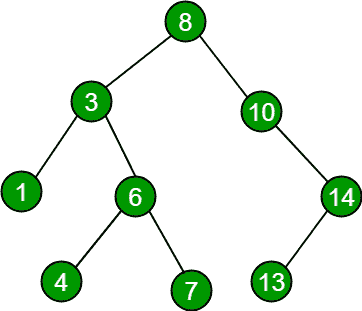

# 检查给定的排序子序列是否存在于二叉查找树

> 原文:[https://www . geeksforgeeks . org/check-if-given-sorted-sub-sequence-exists-in-binary-search-tree/](https://www.geeksforgeeks.org/check-if-given-sorted-sub-sequence-exists-in-binary-search-tree/)

给定一个[二叉查找树](https://www.geeksforgeeks.org/binary-search-tree-set-1-search-and-insertion/)和一个排序的子序列。任务是检查给定的排序子序列是否存在于二叉查找树。



**例:**

```
// For above binary search tree
Input : seq[] = {4, 6, 8, 14}
Output: "Yes"

Input : seq[] = {4, 6, 8, 12, 13}
Output: "No"
```

一个**简单的解决方案**是将**有序遍历**存储在一个辅助数组中，然后通过将排序后的子序列的元素与树的有序遍历一一匹配，我们就可以知道子序列是否存在于 BST 中。这种方法的时间复杂度是 O(n)，但是它需要额外的空间 O(n)来存储数组中的遍历。
一个**有效的解决方案**是在我们以**的方式遍历 BST 时匹配子序列的元素，以便于**的方式。我们将**索引**作为给定排序子序列的迭代器，开始给定 bst 的有序遍历，如果**当前节点**与**seq【index】**匹配，则通过递增 1 向前移动**索引**，如果**索引==n** 表示给定子序列的所有元素都已经匹配，并且作为排序子序列存在于给定 BST 中。

## C++

```
// C++ program to find if given array exists as a
// subsequence in BST
#include<bits/stdc++.h>
using namespace std;

// A binary Tree node
struct Node
{
    int data;
    struct Node *left, *right;
};

// A utility function to create a new BST node
// with key as given num
struct Node* newNode(int num)
{
    struct Node* temp = new Node;
    temp->data = num;
    temp->left = temp->right = NULL;
    return temp;
}

// A utility function to insert a given key to BST
struct Node* insert(struct Node* root, int key)
{
    if (root == NULL)
        return newNode(key);
    if (root->data > key)
        root->left = insert(root->left, key);
    else
        root->right = insert(root->right, key);
    return root;
}

// function to check if given sorted sub-sequence exist in BST
// index --> iterator for given sorted sub-sequence
// seq[] --> given sorted sub-sequence
void seqExistUtil(struct Node *ptr, int seq[], int &index)
{
    if (ptr == NULL)
        return;

    // We traverse left subtree first in Inorder
    seqExistUtil(ptr->left, seq, index);

    // If current node matches with se[index] then move
    // forward in sub-sequence
    if (ptr->data == seq[index])
        index++;

    // We traverse left subtree in the end in Inorder
    seqExistUtil(ptr->right, seq, index);
}

// A wrapper over seqExistUtil. It returns true
// if seq[0..n-1] exists in tree.
bool seqExist(struct Node *root, int seq[], int n)
{
    // Initialize index in seq[]
    int index = 0;

    // Do an inorder traversal and find if all
    // elements of seq[] were present
    seqExistUtil(root, seq, index);

    // index would become n if all elements of
    // seq[] were present
    return (index == n);
}

// driver program to run the case
int main()
{
    struct Node* root = NULL;
    root = insert(root, 8);
    root = insert(root, 10);
    root = insert(root, 3);
    root = insert(root, 6);
    root = insert(root, 1);
    root = insert(root, 4);
    root = insert(root, 7);
    root = insert(root, 14);
    root = insert(root, 13);

    int seq[] = {4, 6, 8, 14};
    int n = sizeof(seq)/sizeof(seq[0]);

    seqExist(root, seq, n)? cout << "Yes" :
                            cout << "No";

    return 0;
}
```

## Java 语言(一种计算机语言，尤用于创建网站)

```
// Java program to find if given array
// exists as a subsequence in BST
import java.util.*;

class GFG
{

// A binary Tree node
static class Node
{
    int data;
    Node left, right;
};

//structure of int class
static class INT
{
    int a;
}

// A utility function to create a new BST node
// with key as given num
static Node newNode(int num)
{
    Node temp = new Node();
    temp.data = num;
    temp.left = temp.right = null;
    return temp;
}

// A utility function to insert a given key to BST
static Node insert( Node root, int key)
{
    if (root == null)
        return newNode(key);
    if (root.data > key)
        root.left = insert(root.left, key);
    else
        root.right = insert(root.right, key);
    return root;
}

// function to check if given sorted
// sub-sequence exist in BST index -.
// iterator for given sorted sub-sequence
// seq[] -. given sorted sub-sequence
static void seqExistUtil( Node ptr, int seq[], INT index)
{
    if (ptr == null)
        return;

    // We traverse left subtree
    // first in Inorder
    seqExistUtil(ptr.left, seq, index);

    // If current node matches
    // with se[index] then move
    // forward in sub-sequence
    if (ptr.data == seq[index.a])
        index.a++;

    // We traverse left subtree
    // in the end in Inorder
    seqExistUtil(ptr.right, seq, index);
}

// A wrapper over seqExistUtil.
// It returns true if seq[0..n-1]
// exists in tree.
static boolean seqExist( Node root, int seq[], int n)
{
    // Initialize index in seq[]
    INT index = new INT();

    index.a = 0;

    // Do an inorder traversal and find if all
    // elements of seq[] were present
    seqExistUtil(root, seq, index);

    // index would become n if all
    // elements of seq[] were present
    return (index.a == n);
}

// Driver code
public static void main(String args[])
{
    Node root = null;
    root = insert(root, 8);
    root = insert(root, 10);
    root = insert(root, 3);
    root = insert(root, 6);
    root = insert(root, 1);
    root = insert(root, 4);
    root = insert(root, 7);
    root = insert(root, 14);
    root = insert(root, 13);

    int seq[] = {4, 6, 8, 14};
    int n = seq.length;

    if(seqExist(root, seq, n))
        System.out.println("Yes");
    else
        System.out.println("No");
}
}

// This code is contributed by Arnab Kundu
```

## 蟒蛇 3

```
# Python3 program to find if given array
# exists as a subsequence in BST
class Node:

    # Constructor to create a new node
    def __init__(self, data):
        self.data = data
        self.left = None
        self.right = None

# A utility function to insert a
# given key to BST
def insert(root, key):
    if root == None:
        return Node(key)
    if root.data > key:
        root.left = insert(root.left, key)
    else:
        root.right = insert(root.right, key)
    return root

# function to check if given sorted
# sub-sequence exist in BST index .
# iterator for given sorted sub-sequence
# seq[] . given sorted sub-sequence
def seqExistUtil(ptr, seq, index):
    if ptr == None:
        return

    # We traverse left subtree
    # first in Inorder
    seqExistUtil(ptr.left, seq, index)

    # If current node matches with se[index[0]]
    # then move forward in sub-sequence
    if ptr.data == seq[index[0]]:
        index[0] += 1

    # We traverse left subtree in
    # the end in Inorder
    seqExistUtil(ptr.right, seq, index)

# A wrapper over seqExistUtil. It returns
# true if seq[0..n-1] exists in tree.
def seqExist(root, seq, n):

    # Initialize index in seq[]
    index = [0]

    # Do an inorder traversal and find if
    # all elements of seq[] were present
    seqExistUtil(root, seq, index)

    # index would become n if all elements
    # of seq[] were present
    if index[0] == n:
        return True
    else:
        return False

# Driver Code
if __name__ == '__main__':
    root = None
    root = insert(root, 8)
    root = insert(root, 10)
    root = insert(root, 3)
    root = insert(root, 6)
    root = insert(root, 1)
    root = insert(root, 4)
    root = insert(root, 7)
    root = insert(root, 14)
    root = insert(root, 13)

    seq = [4, 6, 8, 14]
    n = len(seq)
    if seqExist(root, seq, n):
        print("Yes")
    else:
        print("No")

# This code is contributed by PranchalK
```

## C#

```
// C# program to find if given array
// exists as a subsequence in BST
using System;

class GFG
{

// A binary Tree node
public class Node
{
    public int data;
    public Node left, right;
};

// structure of int class
public class INT
{
    public int a;
}

// A utility function to create a new BST node
// with key as given num
static Node newNode(int num)
{
    Node temp = new Node();
    temp.data = num;
    temp.left = temp.right = null;
    return temp;
}

// A utility function to insert a given key to BST
static Node insert( Node root, int key)
{
    if (root == null)
        return newNode(key);
    if (root.data > key)
        root.left = insert(root.left, key);
    else
        root.right = insert(root.right, key);
    return root;
}

// function to check if given sorted
// sub-sequence exist in BST index -.
// iterator for given sorted sub-sequence
// seq[] -. given sorted sub-sequence
static void seqExistUtil( Node ptr, int []seq, INT index)
{
    if (ptr == null)
        return;

    // We traverse left subtree
    // first in Inorder
    seqExistUtil(ptr.left, seq, index);

    // If current node matches
    // with se[index] then move
    // forward in sub-sequence
    if (ptr.data == seq[index.a])
        index.a++;

    // We traverse left subtree
    // in the end in Inorder
    seqExistUtil(ptr.right, seq, index);
}

// A wrapper over seqExistUtil.
// It returns true if seq[0..n-1]
// exists in tree.
static bool seqExist( Node root, int []seq, int n)
{
    // Initialize index in seq[]
    INT index = new INT();

    index.a = 0;

    // Do an inorder traversal and find if all
    // elements of seq[] were present
    seqExistUtil(root, seq, index);

    // index would become n if all
    // elements of seq[] were present
    return (index.a == n);
}

// Driver code
public static void Main(String []args)
{
    Node root = null;
    root = insert(root, 8);
    root = insert(root, 10);
    root = insert(root, 3);
    root = insert(root, 6);
    root = insert(root, 1);
    root = insert(root, 4);
    root = insert(root, 7);
    root = insert(root, 14);
    root = insert(root, 13);

    int []seq = {4, 6, 8, 14};
    int n = seq.Length;

    if(seqExist(root, seq, n))
        Console.WriteLine("Yes");
    else
        Console.WriteLine("No");
}
}

/* This code contributed by PrinciRaj1992 */
```

## java 描述语言

```
<script>

// JavaScript program to find if given array
// exists as a subsequence in BST

// A binary Tree node
class Node
{
    constructor()
    {
        this.data = 0;
        this.left = null;
        this.right = null;
    }
};

// structure of int class
class INT
{
    constructor()
    {
        this.a = 0;
    }
}

// A utility function to create a new BST node
// with key as given num
function newNode(num)
{
    var temp = new Node();
    temp.data = num;
    temp.left = temp.right = null;
    return temp;
}

// A utility function to insert a given key to BST
function insert( root, key)
{
    if (root == null)
        return newNode(key);
    if (root.data > key)
        root.left = insert(root.left, key);
    else
        root.right = insert(root.right, key);
    return root;
}

// function to check if given sorted
// sub-sequence exist in BST index -.
// iterator for given sorted sub-sequence
// seq[] -. given sorted sub-sequence
function seqExistUtil( ptr, seq, index)
{
    if (ptr == null)
        return;

    // We traverse left subtree
    // first in Inorder
    seqExistUtil(ptr.left, seq, index);

    // If current node matches
    // with se[index] then move
    // forward in sub-sequence
    if (ptr.data == seq[index.a])
        index.a++;

    // We traverse left subtree
    // in the end in Inorder
    seqExistUtil(ptr.right, seq, index);
}

// A wrapper over seqExistUtil.
// It returns true if seq[0..n-1]
// exists in tree.
function seqExist( root, seq, n)
{
    // Initialize index in seq[]
    var index = new INT();

    index.a = 0;

    // Do an inorder traversal and find if all
    // elements of seq[] were present
    seqExistUtil(root, seq, index);

    // index would become n if all
    // elements of seq[] were present
    return (index.a == n);
}

// Driver code
var root = null;
root = insert(root, 8);
root = insert(root, 10);
root = insert(root, 3);
root = insert(root, 6);
root = insert(root, 1);
root = insert(root, 4);
root = insert(root, 7);
root = insert(root, 14);
root = insert(root, 13);
var seq = [4, 6, 8, 14];
var n = seq.length;
if(seqExist(root, seq, n))
    document.write("Yes");
else
    document.write("No");

</script>
```

**输出:**

```
Yes
```

**时间复杂度:** O(n)
本文由 [**沙莎克·米什拉(古卢)**](https://www.facebook.com/shashank.mishra.92167) 供稿。如果你喜欢 GeeksforGeeks 并想投稿，你也可以使用[write.geeksforgeeks.org](https://write.geeksforgeeks.org)写一篇文章或者把你的文章邮寄到 review-team@geeksforgeeks.org。看到你的文章出现在极客博客主页上，帮助其他极客。
如果发现有不正确的地方，或者想分享更多关于上述话题的信息，请写评论。