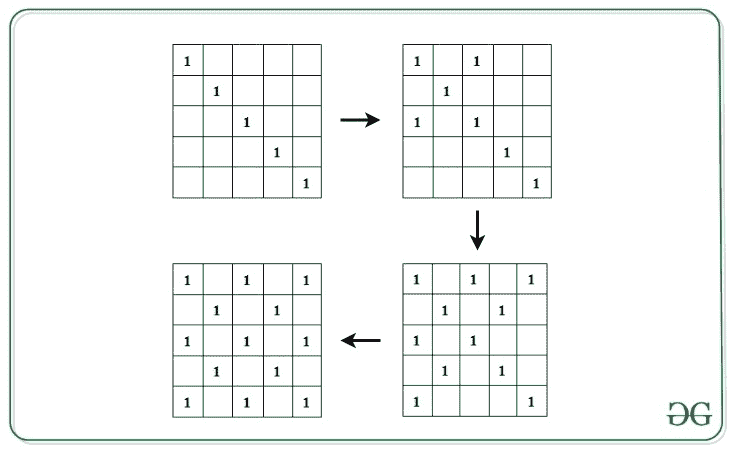
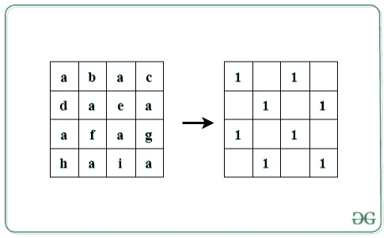

# 检查给定的字符串是否满足以下条件

> 原文:[https://www . geesforgeks . org/check-如果给定字符串满足以下条件/](https://www.geeksforgeeks.org/check-if-given-string-satisfies-the-following-conditions/)

给定长度为 **L** 的[弦](https://www.geeksforgeeks.org/string-data-structure/) **S** ，其中 **L** 为[完美正方形](https://www.geeksforgeeks.org/check-if-given-number-is-perfect-square-in-cpp/)，任务是检查给定弦是否满足以下条件:

*   将字符串的字符按行插入到尺寸为 **√L x √L** 的正方形[矩阵](https://www.geeksforgeeks.org/category/data-structures/matrix/) **A[][]** 中。
*   用 **0** s 初始化另一个矩阵 **M[][]** ，用 **1** 填充左对角线。现在，对于出现在左对角线的 **1** ，用 **1** s 填充其对应的右对角线。



*   现在，检查包含 **1** 的矩阵 **M[][]** 中的所有索引是否包含 **A[][]** 中的相同字符。

如果条件满足，打印**“是”。**否则，打印**“否”**。

**示例:**

> **输入:**S = " abacdaeafaghaia "
> T3】输出:是
> T6】说明:T8】
> 
> 
> 
> **输入:**S =
> 输出:否

**方法:**思路是[遍历矩阵](https://www.geeksforgeeks.org/traverse-a-given-matrix-using-recursion/) **A[][]** 其中其在矩阵 **M[][]** 中对应的字符为 **1** 。按照以下步骤解决问题:

*   矩阵的尺寸计算为 **N = √L** 。
*   通过访问每个单元格来迭代左对角线，其中 **1 < = i < = N** 。
*   对于单元格**A【I】【I】**处左对角线的每个元素，用 **i** 初始化变量 **x** 和 **y** ，并通过访问字符**S【x * N+y】**和**S【y * N+x】**遍历其对应的右对角线，每次递减**x**1 并每次递增 **y** 而 **x** 不小于 **0** ， **y** 小于 **N** 。
*   如果在上述步骤中发现所有字符都相同，则打印**“是”**。否则，如果发现不匹配，打印**“否”**。

下面是上述方法的实现:

## C++

```
// C++ program for the above approach

#include <bits/stdc++.h>
using namespace std;

// Function to check if given string
// satisfies the given conditions
void isValid(string s)
{

    // Dimensions
    int n = sqrt(s.length());

    char check = s[0];

    // Left diagonal
    for (int i = 0; i < n; i++) {
        int x = i, y = i;

        // Right diagonal
        while (x >= 0 && y < n) {
            if (s[(n * x) + y] != check
                || s[(n * y) + x] != check) {

                // Conditions not satisfied
                cout << "No" << endl;
                return;
            }
            x--;
            y++;
        }
    }

    // Print Yes
    cout << "Yes" << endl;
}

// Driver Code
int main()
{

    // Given String
    string str = "abacdaeaafaghaia";

    // Function call
    isValid(str);

    return 0;
}
```

## Java 语言(一种计算机语言，尤用于创建网站)

```
// Java program for the above approach
import java.util.*;

class GFG{

// Function to check if given string
// satisfies the given conditions
static void isValid(String s)
{

    // Dimensions
    int n = (int)Math.sqrt(s.length());

    char check = s.charAt(0);

    // Left diagonal
    for(int i = 0; i < n; i++)
    {
        int x = i, y = i;

        // Right diagonal
        while (x >= 0 && y < n)
        {
            if (s.charAt((n * x) + y) != check ||
                s.charAt((n * y) + x) != check)
            {

                // Conditions not satisfied
                System.out.print("No");
                return;
            }
            x--;
            y++;
        }
    }

    // Print Yes
    System.out.print("Yes");
}

// Driver Code
public static void main(String[] args)
{

    // Given String
    String str = "abacdaeaafaghaia";

    // Function call
    isValid(str);
}
}

// This code is contributed by code_hunt
```

## 蟒蛇 3

```
# Python3 program for the above approach
import math

# Function to check if given string
# satisfies the given conditions
def isValid(s):

    # Dimensions
    n = int(math.sqrt(len(s)))
    check = s[0]

    # Left diagonal
    for i in range(n):
        x = i
        y = i

        # Right diagonal
        while (x >= 0 and y < n):
            if (s[n * x + y] != check or
                s[n * x + x] != check):

                # Conditions not satisfied
                print("No")
                return

            x -= 1
            y += 1

    # Print Yes
    print("Yes")

# Driver Code

# Given String
str = "abacdaeaafaghaia"

# Function call
isValid(str)

# This code is contributed by avanitrachhadiya2155
```

## C#

```
// C# program for the above approach 
using System;

class GFG{

// Function to check if given string
// satisfies the given conditions
static void isValid(string s)
{

    // Dimensions
    int n = (int)Math.Sqrt(s.Length);

    char check = s[0];

    // Left diagonal
    for(int i = 0; i < n; i++)
    {
        int x = i, y = i;

        // Right diagonal
        while (x >= 0 && y < n)
        {
            if (s[(n * x) + y] != check ||
                s[(n * y) + x] != check)
            {

                // Conditions not satisfied
                Console.Write("No");
                return;
            }
            x--;
            y++;
        }
    }

    // Print Yes
    Console.Write("Yes");
}

// Driver code
public static void Main()
{

    // Given String
    string str = "abacdaeaafaghaia";

    // Function call
    isValid(str);
}
}

// This code is contributed by sanjoy_62
```

## java 描述语言

```
<script>

// Javascript program to implement
// the above approach

// Function to check if given string
// satisfies the given conditions
function isValid(s)
{

    // Dimensions
    let n = Math.sqrt(s.length);

    let check = s[0];

    // Left diagonal
    for(let i = 0; i < n; i++)
    {
        let x = i, y = i;

        // Right diagonal
        while (x >= 0 && y < n)
        {
            if (s[(n * x) + y]!= check ||
                s[(n * y) + x] != check)
            {

                // Conditions not satisfied
                document.write("No");
                return;
            }
            x--;
            y++;
        }
    }

    // Print Yes
    document.write("Yes");
}

    // Driver Code

    // Given String
    let str = "abacdaeaafaghaia";

    // Function call
    isValid(str);

// This code is contributed by souravghosh0416.
</script>
```

**Output:** 

```
Yes
```

***时间复杂度:** O(L)其中 **L** 是给定字符串的长度。*
***辅助空间:** O(L)*