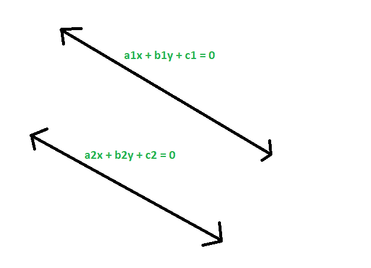
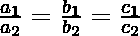

# 检查给定的两条直线是否相同

> 原文:[https://www . geesforgeks . org/check-if-给定两条直线是否相同/](https://www.geeksforgeeks.org/check-if-given-two-straight-lines-are-identical-or-not/)

给定两条直线，分别具有方程 **a1x + b1y + c1 = 0** 和 **a2x + b2y + c2 = 0** 的系数，任务是检查直线是否相同。
**例:**

> **输入:** a1 = -2，b1 = 4，c1 = 3，a2 = -6，b2 = 12，c2 = 9
> **输出:**给定直线相同
> T6】输入: a1 = 12，b1 = 3，c1 = 8，a2 = 7，b2 = -12，C2 = 0
> T9】输出:给定直线不相同



**接近** :

1.  给定方程，
    **a1x+b1y+C1 = 0**
    T4【a2x+b2y+C2 = 0

2.  将它们转换为斜率截距形式，我们得到
    **y =(-a1/B1)x+(-C1/B1)**
    T4】y =(-a2/B2)x+(-C2/B2)

3.  现在，如果这些线是相同的，那么斜率和截距必须相等，
    所以，
    T2-a1/B1 =-a2/B2T4**或者，a1/a2 = B1/B2**T7 也是，
    T9】-C1/B1 =-C2/B2T11**所以，C1/C2 = B1/B2**T14】
4.  所以，如果两条给定的直线是相同的，那么系数应该是成比例的。
    

**以下是上述方法的实施**

## C++

```
// C++ program to check if
// given two straight lines
// are identical or not

#include <bits/stdc++.h>
using namespace std;

// Function to check if they are identical
void idstrt(double a1, double b1,
            double c1, double a2,
            double b2, double c2)
{
    if ((a1 / a2 == b1 / b2)
        && (a1 / a2 == c1 / c2)
        && (b1 / b2 == c1 / c2))
        cout << "The given straight"
             << " lines are identical"
             << endl;

    else
        cout << "The given straight"
             << " lines are not identical"
             << endl;
}

// Driver Code
int main()
{
    double a1 = -2, b1 = 4,
           c1 = 3, a2 = -6,
           b2 = 12, c2 = 9;
    idstrt(a1, b1, c1, a2, b2, c2);
    return 0;
}
```

## Java 语言(一种计算机语言，尤用于创建网站)

```
// Java program to check if
// given two straight lines
// are identical or not
class GFG
{

// Function to check if they are identical
static void idstrt(double a1, double b1,
                    double c1, double a2,
                    double b2, double c2)
{
    if ((a1 / a2 == b1 / b2)
        && (a1 / a2 == c1 / c2)
        && (b1 / b2 == c1 / c2))
        System.out.println( "The given straight"
        +" lines are identical");

    else
        System.out.println("The given straight"
            + " lines are not identical");
}

// Driver Code
public static void main(String[] args)
{
    double a1 = -2, b1 = 4,
            c1 = 3, a2 = -6,
            b2 = 12, c2 = 9;
    idstrt(a1, b1, c1, a2, b2, c2);
}
}

// This code has been contributed by 29AjayKumar
```

## 蟒蛇 3

```
# Python3 program to check if
# given two straight lines
# are identical or not

# Function to check if they are identical
def idstrt(a1, b1, c1, a2, b2, c2):
    if ((a1 // a2 == b1 // b2) and
        (a1 // a2 == c1 // c2) and
        (b1 // b2 == c1 // c2)):
        print("The given straight lines",
                         "are identical");
    else:
        print("The given straight lines",
                     "are not identical");

# Driver Code
a1, b1 = -2, 4
c1, a2 = 3,-6
b2, c2 = 12,9
idstrt(a1, b1, c1, a2, b2, c2)

# This code is contributed
# by mohit kumar
```

## C#

```
// C# program to check if
// given two straight lines
// are identical or not
using System;

class GFG
{

// Function to check if they are identical
static void idstrt(double a1, double b1,
                    double c1, double a2,
                    double b2, double c2)
{
    if ((a1 / a2 == b1 / b2)
        && (a1 / a2 == c1 / c2)
        && (b1 / b2 == c1 / c2))
        Console.WriteLine( "The given straight"
        +" lines are identical");

    else
        Console.WriteLine("The given straight"
            + " lines are not identical");
}

// Driver Code
public static void Main(String[] args)
{
    double a1 = -2, b1 = 4,
            c1 = 3, a2 = -6,
            b2 = 12, c2 = 9;
    idstrt(a1, b1, c1, a2, b2, c2);
}
}

// This code contributed by Rajput-Ji
```

## 服务器端编程语言（Professional Hypertext Preprocessor 的缩写）

```
<?php

// PHP program to check if
// given two straight lines
// are identical or not

// Function to check if they are identical
function idstrt($a1, $b1,
            $c1, $a2,
            $b2, $c2)
{
    if (($a1 / $a2 == $b1 / $b2)
        && ($a1 / $a2 == $c1 / $c2)
        && ($b1 / $b2 == $c1 / $c2))
        echo "The given straight lines are identical","\n";

    else
        echo "The given straight lines are not identical","\n";
}

    // Driver Code
    $a1 = -2; $b1 = 4;
    $c1 = 3; $a2 = -6;
    $b2 = 12; $c2 = 9;
    idstrt($a1, $b1, $c1, $a2, $b2, $c2);

    // This code is contributed by Ryuga

?>
```

## java 描述语言

```
<script>

// javascript program to check if
// given two straight lines
// are identical or not

// Function to check if they are identical
function idstrt(a1 , b1,
                    c1 , a2,
                    b2 , c2)
{
    if ((a1 / a2 == b1 / b2)
        && (a1 / a2 == c1 / c2)
        && (b1 / b2 == c1 / c2))
        document.write( "The given straight"
        +" lines are identical");

    else
        document.write("The given straight"
            + " lines are not identical");
}

// Driver Code

var a1 = -2, b1 = 4,
        c1 = 3, a2 = -6,
        b2 = 12, c2 = 9;
idstrt(a1, b1, c1, a2, b2, c2);

// This code contributed by Princi Singh

</script>
```

**Output:** 

```
The given straight lines are identical
```