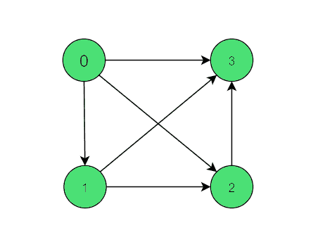

# 检查有向图的一个顶点的引入边是否等于顶点本身

> 原文:[https://www . geesforgeks . org/check-如果有向图的一个顶点中的传入边等于或不等于顶点本身/](https://www.geeksforgeeks.org/check-if-incoming-edges-in-a-vertex-of-directed-graph-is-equal-to-vertex-itself-or-not/)

给定一个具有 **V** 顶点和 **E** 边的**有向图 G(V，E)** ，任务是检查对于给定图的所有顶点，一个顶点中的引入边是否等于该顶点本身。

**示例:**

> **输入:**
> 
> 
> 
> **输出:**是
> **解释:**
> 对于顶点 0 有 0 条引入边，对于顶点 1 有 1 条引入边。顶点 2 和 3 也一样。

**方法:**思路是遍历每个顶点的邻接表，从 I 开始递增每个有传入边的顶点的边数，对每个顶点重复上述步骤，然后检查所有顶点的入度是否等于顶点值。

下面是上述方法的实现:

## C++

```
// C++ implementation to check if the
// incoming edges in a vertex of directed
// graph is equal to the vertex itself or not

#include <bits/stdc++.h>
using namespace std;

// A utility function to
// add an edge in an
// directed graph
void add_edge(vector<int> adj[],
              int x, int y)
{
    adj[x].push_back(y);
}

// Function to check that given graph
// in-degree value equal to vertex value
bool Indegree(vector<int> adj[], int v)
{
    // Create array indeg
    // initialized to zero
    int indeg[v] = { 0 };

    // Traversing across all
    // vertex to compute
    // in degree value
    for (int i = 0; i < v; i++) {
        for (int j = 0; j < adj[i].size(); j++) {
            indeg[adj[i][j]]++;
        }
    }

    // check in degree value
    // equal to vertex value
    for (int i = 0; i < v; i++) {
        if (i == indeg[i])
            continue;
        else
            return false;
    }
    return true;
}

// Driver code
int main()
{

    int v = 4;

    // To store adjacency list of graph
    vector<int> adj[v];
    add_edge(adj, 0, 1);
    add_edge(adj, 1, 2);
    add_edge(adj, 0, 2);
    add_edge(adj, 0, 3);
    add_edge(adj, 1, 3);
    add_edge(adj, 2, 3);

    if (Indegree(adj, v))
        cout << "Yes";

    else
        cout << "No";
}
```

## Java 语言(一种计算机语言，尤用于创建网站)

```
// Java implementation to check if the
// incoming edges in a vertex of directed
// graph is equal to the vertex itself or not
import java.util.*;

class GFG{

// A utility function to
// add an edge in an
// directed graph
static void add_edge(Vector<Integer> adj[],
                     int x, int y)
{
    adj[x].add(y);
}

// Function to check that given graph
// in-degree value equal to vertex value
static boolean Indegree(Vector<Integer> adj[],
                        int v)
{

    // Create array indeg
    // initialized to zero
    int indeg[] = new int[v];

    // Traversing across all
    // vertex to compute
    // in degree value
    for(int i = 0; i < v; i++)
    {
        for(int j = 0; j < adj[i].size(); j++)
        {
            indeg[adj[i].get(j)]++;
        }
    }

    // Check in degree value
    // equal to vertex value
    for(int i = 0; i < v; i++)
    {
        if (i == indeg[i])
            continue;
        else
            return false;
    }
    return true;
}

// Driver code
public static void main(String[] args)
{

    int v = 4;

    // To store adjacency list of graph
    @SuppressWarnings("unchecked")
    Vector<Integer> []adj = new Vector[v];
    for(int i = 0; i < adj.length; i++)
        adj[i] = new Vector<Integer>();

    add_edge(adj, 0, 1);
    add_edge(adj, 1, 2);
    add_edge(adj, 0, 2);
    add_edge(adj, 0, 3);
    add_edge(adj, 1, 3);
    add_edge(adj, 2, 3);

    if (Indegree(adj, v))
        System.out.print("Yes");
    else
        System.out.print("No");
}
}

// This code is contributed by Amit Katiyar
```

## 蟒蛇 3

```
# Python3 implementation to check if the
# incoming edges in a vertex of directed
# graph is equal to the vertex itself or not

# A utility function to
# add an edge in an
# directed graph
def add_edge(adj, x, y):

    adj[x] = adj[x] + [y]

# Function to check that given graph
# in-degree value equal to vertex value
def Indegree(adj, v):

    # Create array indeg
    # initialized to zero
    indeg = [0] * v

    # Traversing across all
    # vertex to compute
    # in degree value
    for i in range(v):
        for j in range(len(adj[i])):
            indeg[adj[i][j]] += 1

    # Check in degree value
    # equal to vertex value
    for i in range(v):
        if(i == indeg[i]):
            continue
        else:
            return False

    return True

# Driver code
if __name__ == '__main__':

    v = 4

    # To store adjacency list of graph
    adj = [[]] * 4
    add_edge(adj, 0, 1)
    add_edge(adj, 1, 2)
    add_edge(adj, 0, 2)
    add_edge(adj, 0, 3)
    add_edge(adj, 1, 3)
    add_edge(adj, 2, 3)

    if(Indegree(adj, v)):
        print("Yes")
    else:
        print("No")

# This code is contributed by Shivam Singh
```

## C#

```
// C# implementation to check if the
// incoming edges in a vertex of directed
// graph is equal to the vertex itself or not
using System;
using System.Collections.Generic;

class GFG{

// A utility function to
// add an edge in an
// directed graph
static void add_edge(List<int> []adj,
                     int x, int y)
{
    adj[x].Add(y);
}

// Function to check that given graph
// in-degree value equal to vertex value
static bool Indegree(List<int> []adj,
                          int v)
{

    // Create array indeg
    // initialized to zero
    int []indeg = new int[v];

    // Traversing across all
    // vertex to compute
    // in degree value
    for(int i = 0; i < v; i++)
    {
        for(int j = 0; j < adj[i].Count; j++)
        {
            indeg[adj[i][j]]++;
        }
    }

    // Check in degree value
    // equal to vertex value
    for(int i = 0; i < v; i++)
    {
        if (i == indeg[i])
            continue;
        else
            return false;
    }
    return true;
}

// Driver code
public static void Main(String[] args)
{

    int v = 4;

    // To store adjacency list of graph
    List<int> []adj = new List<int>[v];
    for(int i = 0; i < adj.Length; i++)
        adj[i] = new List<int>();

    add_edge(adj, 0, 1);
    add_edge(adj, 1, 2);
    add_edge(adj, 0, 2);
    add_edge(adj, 0, 3);
    add_edge(adj, 1, 3);
    add_edge(adj, 2, 3);

    if (Indegree(adj, v))
        Console.Write("Yes");
    else
        Console.Write("No");
}
}

// This code is contributed by Amit Katiyar
```

## java 描述语言

```
<script>

// JavaScript implementation to check if the
// incoming edges in a vertex of directed
// graph is equal to the vertex itself or not

// A utility function to
// add an edge in an
// directed graph
function add_edge(adj, x, y)
{
    adj[x].push(y);
}

// Function to check that given graph
// in-degree value equal to vertex value
function Indegree(adj, v)
{
    // Create array indeg
    // initialized to zero
    var indeg = Array(v).fill(0);

    // Traversing across all
    // vertex to compute
    // in degree value
    for (var i = 0; i < v; i++) {
        for (var j = 0; j < adj[i].length; j++) {
            indeg[adj[i][j]]++;
        }
    }

    // check in degree value
    // equal to vertex value
    for (var i = 0; i < v; i++) {
        if (i == indeg[i])
            continue;
        else
            return false;
    }
    return true;
}

// Driver code
var v = 4;

// To store adjacency list of graph
var adj = Array.from(Array(v), ()=> new Array());
add_edge(adj, 0, 1);
add_edge(adj, 1, 2);
add_edge(adj, 0, 2);
add_edge(adj, 0, 3);
add_edge(adj, 1, 3);
add_edge(adj, 2, 3);
if (Indegree(adj, v))
    document.write( "Yes");
else
    document.write( "No");

</script>
```

**Output:** 

```
Yes
```

***时间复杂度:** O(V + E)*
***辅助空间复杂度:** O(V)*