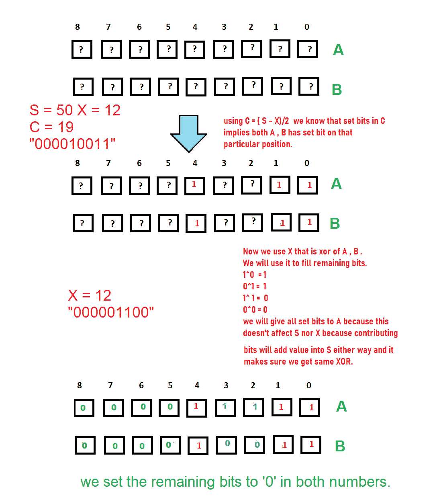

# 检查是否可以构造一个大小为 N 的数组，其和为 S，异或值为 X

> 原文:[https://www . geesforgeks . org/check-如果有可能构建一个大小为 n 的数组，该数组的和为 s，异或值为 x/](https://www.geeksforgeeks.org/check-if-it-is-possible-to-construct-an-array-of-size-n-having-sum-as-s-and-xor-value-as-x/)

给定三个数字 **N，S** 和 **X** ，任务是找出是否有可能构造一个长度为 **N** 的序列 **A** ，其中每个**A【I】>= 0**为 **1 < =i < =N** ，序列中所有数字的和等于 **S** ，[按位异或](https://www.geeksforgeeks.org/bitwise-operators-in-c-cpp/)

**示例:**

> **输入:** N = 3，S = 10，X = 4
> **输出:**是
> **解释:**可能的序列之一是{4，3，3}，其中和等于 10，异或等于 4
> 
> **输入:** N = 1，S = 5，X = 3
> T3】输出:否

**方法:**让我们考虑以下测试用例。

**情况-1:** 当 **N** 等于 **1** 时，很容易看出当 **(S** 等于 **X)** 时，则只返回“**是**”否则“**否**”。

**情况-2:** 当 **N** 大于等于 **3** 时，使用公式 **(a + b) = (a xor b) + 2(a 和 b)** 这里可以看到 **(a + b) = S** 和 **(a xor b) = X** 所以方程变成 **S = X + 2(a.b)。**所以， **(S-X)** 应该是平的，因为右边我们有 **2(a.b)。**所以可以说是 S 是奇数那么 X 是奇数，如果 S 是偶数那么 X 只是偶数，(S-X)也是偶数这可以通过 **(S%2 == X%2)** 也 **S > = X** 来检查，否则 A.B 变成负数这是不可能的。

**病例-3:** 对于病例 **N** 等于 **3，** 类似于 **A + B + C = S** 和 **A^B^C = X.** 使用属性 **A^A = 0** 和**0^a = a =>x+(s–x)/2+(s–x)/2 = x+(s-x)=>x+(s–x)/2+(s–x)/2 = s**也是这样:**x ^((s–x)/2 ^ = X ^ 0 = X.** 因此，证明了对于 **N == 3** 总会有这样的顺序，我们可以只返回“**是**”。

**情况-4:** 当 **N == 2** 和 **(S%2 == X%2)** 和 **S > = X** 时，假设 **A + B == S** 和 **(A^B) == X** ,则 **( A 和 B) == (S-X)/2** 由上面讨论的等式得出。让 **C = A.B.** 仔细观察可以发现，只有当该位置的 A 位和 B 位为“1”时，C 位才为“1”，否则为“关”。而 X 是 A 的异或，B 只有在 i <sup>第</sup>个位置有不同的位时才有 on 位，A 有“0”，B 有“1”或者正好相反:所以看这个序列，把每个位分配到变量 **A** 和 **B 中，C =(S–X)/2。**从 C - >中指定 A 和 B**A = C，B = C**

现在将 **X** 添加到 **A** 或 **B** 中，将所有的 1 分配到 **A** 中，并将所有的 0 分配到 **B** 中，因此当我们对两个数字进行异或运算时，添加到 A 中的“1”位将与添加到 B 中的“0”位正好相反。有趣的是，当 c 的设置位与 x 的一些设置位重合时，它将不会给出 x 的期望 xor，现在， **A = C + X，B = C.** 现在 **A+B = ( C + X) + C = S** 并且当 XOR A.B 等于 x 时，那么可以确定当 **A + B == S** 和**(a^b)= x 时，存在这样的对；**



按照以下步骤解决问题:

*   如果 **S** 大于等于 **X、**且 **S%2** 等于 **X%2** ，则执行以下步骤，否则返回**号**
    *   如果 **n** 大于等于 **3，**则返回**是。**
    *   如果 **n** 等于 **1、**，如果 **S** 等于 **X、**则返回**是**否则返回**否**
    *   如果 **n** 等于 **2，**将变量 **C** 初始化为 **(S-X)/2** ，将变量 **A** 和 **B** 设置为 **C** ，并将值 **X** 加到变量 **A** 上，如果 **A^B** 等于 **X，**则打印

**下面是上述方法的实现。**

## **C++**

```
// C++ program for the above approach
#include <bits/stdc++.h>
using namespace std;

// Function to find if any sequence is
// possible or not.
string findIfPossible(int N, int S, int X)
{
    if (S >= X and S % 2 == X % 2) {

        // Since, S is greater than equal to
        // X, and either both are odd or even
        // There always exists a sequence
        if (N >= 3) {
            return "Yes";
        }
        if (N == 1) {

            // Only one case possible is
            // S == X or NOT;
            if (S == X) {
                return "Yes";
            }
            else {
                return "No";
            }
        }

        // Considering the above conditions true,
        // check if XOR of S^(S-X) is X or not
        if (N == 2) {

            int C = (S - X) / 2;
            int A = C;
            int B = C;
            A = A + X;
            if (((A ^ B) == X)) {
                return "Yes";
            }
            else {
                return "No";
            }
        }
    }
    else {
        return "No";
    }
}

// Driver Code
int main()
{

    int N = 3, S = 10, X = 4;

    cout << findIfPossible(N, S, X);

    return 0;
}
```

## **Java 语言(一种计算机语言，尤用于创建网站)**

```
// Java program for the above approach
import java.io.*;
import java.util.*;

class GFG{

// Function to find if any sequence is
// possible or not.
static void findIfPossible(int N, int S, int X)
{
    if ((S >= X) && (S % 2 == X % 2)) {

        // Since, S is greater than equal to
        // X, and either both are odd or even
        // There always exists a sequence
        if (N >= 3) {
            System.out.println("Yes");
        }
        if (N == 1) {

            // Only one case possible is
            // S == X or NOT;
            if (S == X) {
                System.out.println("Yes");
            }
            else {
                System.out.println("No");
            }
        }

        // Considering the above conditions true,
        // check if XOR of S^(S-X) is X or not
        if (N == 2) {

            int C = (S - X) / 2;
            int A = C;
            int B = C;
            A = A + X;
            if (((A ^ B) == X)) {
                System.out.println("Yes");
            }
            else {
                System.out.println("No");
            }
        }
    }
    else {
        System.out.println("No");
    }
}

// Driver code
public static void main(String args[])
{
    int N = 3, S = 10, X = 4;

    findIfPossible(N, S, X);

}
}

// This code is contributed by code_hunt.
```

## **蟒蛇 3**

```
# Python program for the above approach
# Function to find if any sequence is
# possible or not.
def findIfPossible( N,  S,  X):

    if (S >= X and S % 2 == X % 2):
        # Since, S is greater than equal to
        # X, and either both are odd or even
        # There always exists a sequence
        if (N >= 3):
            return "Yes"

        if (N == 1):

            # Only one case possible is
            # S == X or NOT
            if (S == X):
                return "Yes"
            else:
                return "No"

        # Considering the above conditions true,
        # check if XOR of S^(S-X) is X or not
        if (N == 2):
            C = (S - X) // 2
            A = C
            B = C
            A = A + X
            if (((A ^ B) == X)):
                return "Yes"
            else:
                return "No"
    else:
        return "No"

# Driver Code
N = 3
S = 10
X = 4

print(findIfPossible(N, S, X))

# This code is contributed by shivanisinghss2110
```

## **C#**

```
// C# program for the above approach
using System;

public class GFG{

// Function to find if any sequence is
// possible or not.
static void findIfPossible(int N, int S, int X)
{
    if ((S >= X) && (S % 2 == X % 2)) {

        // Since, S is greater than equal to
        // X, and either both are odd or even
        // There always exists a sequence
        if (N >= 3) {
            Console.WriteLine("Yes");
        }
        if (N == 1) {

            // Only one case possible is
            // S == X or NOT;
            if (S == X) {
                Console.WriteLine("Yes");
            }
            else {
                Console.WriteLine("No");
            }
        }

        // Considering the above conditions true,
        // check if XOR of S^(S-X) is X or not
        if (N == 2) {

            int C = (S - X) / 2;
            int A = C;
            int B = C;
            A = A + X;
            if (((A ^ B) == X)) {
                Console.WriteLine("Yes");
            }
            else {
                Console.WriteLine("No");
            }
        }
    }
    else {
        Console.WriteLine("No");
    }
}

// Driver code
public static void Main(String []args)
{
    int N = 3, S = 10, X = 4;

    findIfPossible(N, S, X);

}
}

// This code is contributed by Princi Singh
```

## **java 描述语言**

```
<script>
        // JavaScript Program to implement
        // the above approach

        // Function to find if any sequence is
        // possible or not.
        function findIfPossible(N, S, X) {
            if (S >= X && S % 2 == X % 2) {

                // Since, S is greater than equal to
                // X, and either both are odd or even
                // There always exists a sequence
                if (N >= 3) {
                    return "Yes";
                }
                if (N == 1) {

                    // Only one case possible is
                    // S == X or NOT;
                    if (S == X) {
                        return "Yes";
                    }
                    else {
                        return "No";
                    }
                }

                // Considering the above conditions true,
                // check if XOR of S^(S-X) is X or not
                if (N == 2) {

                    let C = (S - X) / 2;
                    let A = C;
                    let B = C;
                    A = A + X;
                    if (((A ^ B) == X)) {
                        return "Yes";
                    }
                    else {
                        return "No";
                    }
                }
            }
            else {
                return "No";
            }
        }

        // Driver Code
        let N = 3, S = 10, X = 4;

        document.write(findIfPossible(N, S, X));

// This code is contributed by Potta Lokesh
    </script>
```

****Output**

```
Yes
```** 

*****时间复杂度:**O(1)*
T5**辅助空间:** O(1)**