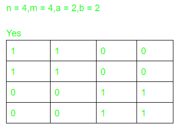

# 检查是否可以创建一个矩阵，使得每一行都有 A 1，每一列都有 B 1

> 原文:[https://www . geesforgeks . org/check-如果有可能创建一个矩阵，那么每一行都有一个 1，每一列都有一个 B- 1/](https://www.geeksforgeeks.org/check-if-it-is-possible-to-create-a-matrix-such-that-every-row-has-a-1s-and-every-column-has-b-1s/)

给定四个整数 **N，M，A，B** ，其中 N 是行数，M 是列数，任务是检查是否可以创建维度的二进制矩阵 **N x M** ，使得每行具有 **A** 数量的 **1s** ，每列具有 **B** 数量的 **1s** 。如果任何这样的矩阵是可能的，那么打印它否则打印**-1”**。

**示例:**

> **输入:** N = 3，M = 6，A = 2，B = 1
> **输出:**
> 1 1 0 0 0 0 0
> 0 1 0 0
> 0 0 0 1 1
> **说明:**
> 每行有 A 个即 2，每列有 B 个即 1。
> 
> **输入:** N = 2，M = 2，A = 2，B = 1
> **输出:**否
> **解释:**
> 不可能创建这样一个 2×2 矩阵，其中每行有 2 个 1，每列有 1 个 1，因为以下两个观察:
> **1。**每行放两个 1，因此我们永远无法在每列放一个 1。
> 1 1
> 1 1
> 
> **2。**每列放一个 1，因此我们不可能每行都有两个 1。
> 1 0
> 0 1*T5】*

**方法:**思路是观察，由于每行应该正好有 A **1s** ，每列应该正好有 B **1s** ，因此所有行 **A * N** 中的 1 个数应该等于所有列 **B * M** 中的 1 个数。因此，当且仅当 **A*N = B*M** 时，期望矩阵存在。下图为:

[](https://media.geeksforgeeks.org/wp-content/uploads/20200810235144/pic.PNG)

1.  找到任意数字 **0 < d < M** ，使得 **(d * N)%M == 0** ，其中 **A % B** 是将 **A** 除以 **B** 的余数。
2.  在所需矩阵的第一行，在**【1，A】**位置插入。
3.  在 **i <sup>第</sup>行**中，放入那些，如同在**I–1**行中一样，但是循环地向右移动 **d** 。

下面是上述方法的实现:

## C++

```
// C++ program for the above approach
#include <bits/stdc++.h>
using namespace std;

// Number of rows
const int n = 3;

// Number of columns
const int m = 6;

// Function that prints the matrix
// if it exists
void printMatrix(int arr[][m],
                 string ans)
{
    if (ans == "No")
        cout << "No\n";
    else {
        // Print if matrix exists
        for (int i = 0; i < n; i++) {
            for (int j = 0; j < m; j++)
                cout << arr[i][j] << " ";
            cout << '\n';
        }
    }
}

// Function to check if it is possible
// to create a matrix such that every
// row has A 1s & every column has B 1s
void createMatrix(int a, int b)
{
    int matrix[n][m], row[n], col[m];

    // Initialize all matrix
    // entries equal to 0
    for (int i = 0; i < n; i++) {
        for (int j = 0; j < m; j++) {
            matrix[i][j] = 0;
        }
    }

    // Initialize the number of
    // ones required in every row
    for (int i = 0; i < n; i++)
        row[i] = a;

    // Initialize the number of
    // ones required in each column
    for (int i = 0; i < m; i++)
        col[i] = b;

    int l = 0, d = 0;

    // Check if the total number of
    // ones required in every row is
    // not equal to total number of
    // ones required in every column
    // then print No
    if (n * a != m * b)
        printMatrix(matrix, "No");

    else {

        for (int i = 0; i < n; i++) {
            int j;
            if (l == m)
                l = 0;

            for (j = l; j < m; j++) {

                if (row[i] > 0 && col[j] > 0) {

                    // Fill a one if there is a
                    // place to be filled
                    matrix[i][j] = 1;

                    // Decrease the number of
                    // ones required in ith row
                    row[i]--;

                    // Decrease the number of
                    // ones required in jth column
                    col[j]--;
                    d = j;
                }
            }
            l = d + 1;
            if (row[i] != 0) {

                for (j = 0; j < m; j++) {

                    if (row[i] > 0 && col[j] > 0) {

                        // Fill a one if there is
                        // a place to be filled
                        matrix[i][j] = 1;

                        // Decrease the number of 1s
                        // required in ith row
                        row[i]--;
                        // Decrease the number of 1s
                        // required in jth column
                        col[j]--;
                        l = j + 1;
                    }
                    // Break the loop if no place
                    // is left for ones to filled
                    if (row[i] == 0)
                        break;
                }
            }
        }

        // Function call to print the matrix
        printMatrix(matrix, "Yes");
    }
}

// Driver Code
int main()
{

    // Number of ones required
    // in every row
    int a = 2;

    // Number of ones required
    // in every column
    int b = 1;

    // Function call
    createMatrix(a, b);
    return 0;
}
```

## Java 语言(一种计算机语言，尤用于创建网站)

```
// Java program for the above approach
import java.util.*;

class GFG{

// Number of rows
static int n = 3;

// Number of columns
static int m = 6;

// Function that prints the matrix
// if it exists
static void printMatrix(int arr[][],
                        String ans)
{
    if (ans == "No")
        System.out.print("No\n");
    else
    {

        // Print if matrix exists
        for(int i = 0; i < n; i++)
        {
            for(int j = 0; j < m; j++)
                System.out.print(arr[i][j] + " ");
            System.out.println();
        }
    }
}

// Function to check if it is possible
// to create a matrix such that every
// row has A 1s & every column has B 1s
static void createMatrix(int a, int b)
{
    int [][]matrix = new int[n][m];
    int []row = new int[n];
    int []col = new int[m];

    // Initialize all matrix
    // entries equal to 0
    for(int i = 0; i < n; i++)
    {
        for(int j = 0; j < m; j++)
        {
            matrix[i][j] = 0;
        }
    }

    // Initialize the number of
    // ones required in every row
    for(int i = 0; i < n; i++)
        row[i] = a;

    // Initialize the number of
    // ones required in each column
    for(int i = 0; i < m; i++)
        col[i] = b;

    int l = 0, d = 0;

    // Check if the total number of
    // ones required in every row is
    // not equal to total number of
    // ones required in every column
    // then print No
    if (n * a != m * b)
        printMatrix(matrix, "No");

    else
    {
        for(int i = 0; i < n; i++)
        {
            int j;
            if (l == m)
                l = 0;

            for(j = l; j < m; j++)
            {
                if (row[i] > 0 && col[j] > 0)
                {

                    // Fill a one if there is a
                    // place to be filled
                    matrix[i][j] = 1;

                    // Decrease the number of
                    // ones required in ith row
                    row[i]--;

                    // Decrease the number of
                    // ones required in jth column
                    col[j]--;
                    d = j;
                }
            }
            l = d + 1;
            if (row[i] != 0)
            {
                for(j = 0; j < m; j++)
                {
                    if (row[i] > 0 && col[j] > 0)
                    {

                        // Fill a one if there is
                        // a place to be filled
                        matrix[i][j] = 1;

                        // Decrease the number of 1s
                        // required in ith row
                        row[i]--;
                        // Decrease the number of 1s
                        // required in jth column
                        col[j]--;
                        l = j + 1;
                    }

                    // Break the loop if no place
                    // is left for ones to filled
                    if (row[i] == 0)
                        break;
                }
            }
        }

        // Function call to print the matrix
        printMatrix(matrix, "Yes");
    }
}

// Driver Code
public static void main(String[] args)
{

    // Number of ones required
    // in every row
    int a = 2;

    // Number of ones required
    // in every column
    int b = 1;

    // Function call
    createMatrix(a, b);
}
}

// This code is contributed by amal kumar choubey
```

## 蟒蛇 3

```
# Python3 program for the above approach

# Number of rows
n = 3

# Number of columns
m = 6

# Function that prints the matrix
# if it exists
def printMatrix(arr, ans):

    if (ans == "No"):
        print("No")

    else:

        # Print if matrix exists
        for i in range(n):
            for j in range(m):
                print(arr[i][j], end = " ")

            print()

# Function to check if it is possible
# to create a matrix such that every
# row has A 1s & every column has B 1s
def createMatrix(a, b):

    matrix = [[0 for i in range(m)]
                 for i in range(n)]
    row = [a for i in range(n)]
    col = [b for i in range(m)]

    l = 0
    d = 0

    # Check if the total number of
    # ones required in every row is
    # not equal to total number of
    # ones required in every column
    # then prNo
    if (n * a != m * b):
        printMatrix(matrix, "No")

    else:
        for i in range(n):
            j = 0

            if (l == m):
                l = 0

            for j in range(l, m):
                if (row[i] > 0 and col[j] > 0):

                    # Fill a one if there is a
                    # place to be filled
                    matrix[i][j] = 1

                    # Decrease the number of
                    # ones required in ith row
                    row[i] -= 1

                    # Decrease the number of
                    # ones required in jth column
                    col[j] -= 1
                    d = j

            l = d + 1
            if (row[i] != 0):
                for j in range(m):
                    if (row[i] > 0 and col[j] > 0):

                        # Fill a one if there is
                        # a place to be filled
                        matrix[i][j] = 1

                        # Decrease the number of 1s
                        # required in ith row
                        row[i] -= 1

                        # Decrease the number of 1s
                        # required in jth column
                        col[j] -= 1
                        l = j + 1

                    # Break the loop if no place
                    # is left for ones to filled
                    if (row[i] == 0):
                        break

        # Function call to print matrix
        printMatrix(matrix, "Yes")

# Driver Code
if __name__ == '__main__':

    # Number of ones required
    # in every row
    a = 2

    # Number of ones required
    # in every column
    b = 1

    # Function call
    createMatrix(a, b)

# This code is contributed by mohit kumar 29
```

## C#

```
// C# program for the above approach
using System;
class GFG{

// Number of rows
static int n = 3;

// Number of columns
static int m = 6;

// Function that prints the matrix
// if it exists
static void printMatrix(int [,]arr,
                        String ans)
{
    if (ans == "No")
        Console.Write("No\n");
    else
    {

        // Print if matrix exists
        for(int i = 0; i < n; i++)
        {
            for(int j = 0; j < m; j++)
                Console.Write(arr[i, j] + " ");
            Console.WriteLine();
        }
    }
}

// Function to check if it is possible
// to create a matrix such that every
// row has A 1s & every column has B 1s
static void createMatrix(int a, int b)
{
    int [,]matrix = new int[n, m];
    int []row = new int[n];
    int []col = new int[m];

    // Initialize all matrix
    // entries equal to 0
    for(int i = 0; i < n; i++)
    {
        for(int j = 0; j < m; j++)
        {
            matrix[i, j] = 0;
        }
    }

    // Initialize the number of
    // ones required in every row
    for(int i = 0; i < n; i++)
        row[i] = a;

    // Initialize the number of
    // ones required in each column
    for(int i = 0; i < m; i++)
        col[i] = b;

    int l = 0, d = 0;

    // Check if the total number of
    // ones required in every row is
    // not equal to total number of
    // ones required in every column
    // then print No
    if (n * a != m * b)
        printMatrix(matrix, "No");

    else
    {
        for(int i = 0; i < n; i++)
        {
            int j;
            if (l == m)
                l = 0;

            for(j = l; j < m; j++)
            {
                if (row[i] > 0 && col[j] > 0)
                {

                    // Fill a one if there is a
                    // place to be filled
                    matrix[i,j] = 1;

                    // Decrease the number of
                    // ones required in ith row
                    row[i]--;

                    // Decrease the number of
                    // ones required in jth column
                    col[j]--;
                    d = j;
                }
            }
            l = d + 1;
            if (row[i] != 0)
            {
                for(j = 0; j < m; j++)
                {
                    if (row[i] > 0 && col[j] > 0)
                    {

                        // Fill a one if there is
                        // a place to be filled
                        matrix[i,j] = 1;

                        // Decrease the number of 1s
                        // required in ith row
                        row[i]--;
                        // Decrease the number of 1s
                        // required in jth column
                        col[j]--;
                        l = j + 1;
                    }

                    // Break the loop if no place
                    // is left for ones to filled
                    if (row[i] == 0)
                        break;
                }
            }
        }

        // Function call to print the matrix
        printMatrix(matrix, "Yes");
    }
}

// Driver Code
public static void Main(String[] args)
{

    // Number of ones required
    // in every row
    int a = 2;

    // Number of ones required
    // in every column
    int b = 1;

    // Function call
    createMatrix(a, b);
}
}

// This code is contributed by gauravrajput1
```

## java 描述语言

```
<script>

// JavaScript program for the above approach

// Number of rows
let n = 3;

// Number of columns
let m = 6;

// Function that prints the matrix
// if it exists
function printMatrix(arr,
                        ans)
{
    if (ans == "No")
        document.write("No\n");
    else
    {

        // Print if matrix exists
        for(let i = 0; i < n; i++)
        {
            for(let j = 0; j < m; j++)
                document.write(arr[i][j] + " ");
            document.write("<br/>");
        }
    }
}

// Function to check if it is possible
// to create a matrix such that every
// row has A 1s & every column has B 1s
function createMatrix(a, b)
{
    let matrix = new Array(n);
    // Loop to create 2D array using 1D array
    for (var i = 0; i < matrix.length; i++) {
        matrix[i] = new Array(2);
    }
    let row = Array.from({length: n}, (_, i) => 0);
    let col = Array.from({length: m}, (_, i) => 0);

    // Initialize all matrix
    // entries equal to 0
    for(let i = 0; i < n; i++)
    {
        for(let j = 0; j < m; j++)
        {
            matrix[i][j] = 0;
        }
    }

    // Initialize the number of
    // ones required in every row
    for(let i = 0; i < n; i++)
        row[i] = a;

    // Initialize the number of
    // ones required in each column
    for(let i = 0; i < m; i++)
        col[i] = b;

    let l = 0, d = 0;

    // Check if the total number of
    // ones required in every row is
    // not equal to total number of
    // ones required in every column
    // then print No
    if (n * a != m * b)
        printMatrix(matrix, "No");

    else
    {
        for(let i = 0; i < n; i++)
        {
            let j;
            if (l == m)
                l = 0;

            for(j = l; j < m; j++)
            {
                if (row[i] > 0 && col[j] > 0)
                {

                    // Fill a one if there is a
                    // place to be filled
                    matrix[i][j] = 1;

                    // Decrease the number of
                    // ones required in ith row
                    row[i]--;

                    // Decrease the number of
                    // ones required in jth column
                    col[j]--;
                    d = j;
                }
            }
            l = d + 1;
            if (row[i] != 0)
            {
                for(j = 0; j < m; j++)
                {
                    if (row[i] > 0 && col[j] > 0)
                    {

                        // Fill a one if there is
                        // a place to be filled
                        matrix[i][j] = 1;

                        // Decrease the number of 1s
                        // required in ith row
                        row[i]--;
                        // Decrease the number of 1s
                        // required in jth column
                        col[j]--;
                        l = j + 1;
                    }

                    // Break the loop if no place
                    // is left for ones to filled
                    if (row[i] == 0)
                        break;
                }
            }
        }

        // Function call to print the matrix
        printMatrix(matrix, "Yes");
    }
}

// Driver Code

     // Number of ones required
    // in every row
    let a = 2;

    // Number of ones required
    // in every column
    let b = 1;

    // Function call
    createMatrix(a, b);

</script>
```

**Output:** 

```
1 1 0 0 0 0 
0 0 1 1 0 0 
0 0 0 0 1 1
```

***时间复杂度:** O(N*M)*
***辅助空间:** O(N*M)*