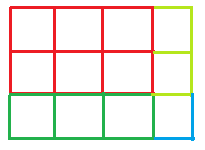

# 检查是否可以执行给定的网格划分

> 原文:[https://www . geeksforgeeks . org/check-如果有可能执行给定的网格划分/](https://www.geeksforgeeks.org/check-if-it-is-possible-to-perform-the-given-grid-division/)

给定代表网格大小的两个整数 **N** 和 **M** 。也给定一个大小为 **P** 的整数数组 **arr[]** ，它表示给定的网格被分成 **P** 部分，每个部分由网格中的 **arr[i]** 单元组成。任务是检查是否有可能以给定的方式划分网格。
**示例:**

> **输入:** arr[] = {6，3，2，1}，N = 3，M = 4
> T3】输出:是
> 
> 
> 
> **输入:** arr[] = {4，2，2}，N = 3，M = 2
> T3】输出:否

**方法:**为了使分割成为可能，所有部分的单元之和必须等于给定网格中的单元总数，即所有阵列元素之和必须等于 N * m。
下面是上述方法的实现:

## C++

```
// C++ implementation of the approach
#include <bits/stdc++.h>
using namespace std;

// Function that returns true if it is possible to
// divide the grid satisfying the given conditions
bool isPossible(int arr[], int p, int n, int m)
{

    // To store the sum of all the
    // cells of the given parts
    int sum = 0;
    for (int i = 0; i < p; i++)
        sum += arr[i];

    // If the sum is equal to the total number
    // of cells in the given grid
    if (sum == (n * m))
        return true;
    return false;
}

// Driver code
int main()
{
    int n = 3, m = 4;
    int arr[] = { 6, 3, 2, 1 };
    int p = sizeof(arr) / sizeof(arr[0]);

    if (isPossible(arr, p, n, m))
        cout << "Yes";
    else
        cout << "No";

    return 0;
}
```

## Java 语言(一种计算机语言，尤用于创建网站)

```
// Java implementation of the approach
import java.util.*;
class GFG
{

// Function that returns true if it is possible to
// divide the grid satisfying the given conditions
static boolean isPossible(int arr[], int p,
                          int n, int m)
{

    // To store the sum of all the
    // cells of the given parts
    int sum = 0;
    for (int i = 0; i < p; i++)
        sum += arr[i];

    // If the sum is equal to the total number
    // of cells in the given grid
    if (sum == (n * m))
        return true;
    return false;
}

// Driver code
public static void main(String[] args)
{
    int n = 3, m = 4;
    int arr[] = { 6, 3, 2, 1 };
    int p = arr.length;

    if (isPossible(arr, p, n, m))
        System.out.println("Yes");
    else
        System.out.println("No");
}
}

// This code is contributed by Princi Singh
```

## 蟒蛇 3

```
# Python3 implementation of the approach

# Function that returns true if
# it is possible to divide the grid
# satisfying the given conditions
def isPossible(arr, p, n, m):

    # To store the sum of all the
    # cells of the given parts
    sum = 0;
    for i in range(p):
        sum += arr[i];

    # If the sum is equal to the total number
    # of cells in the given grid
    if (sum == (n * m)):
        return True;
    return False;

# Driver code
if __name__ == '__main__':

    n = 3;
    m = 4;
    arr = [6, 3, 2, 1];
    p = len(arr);

    if (isPossible(arr, p, n, m)):
        print("Yes");
    else:
        print("No");

# This code is contributed by Rajput-Ji
```

## C#

```
// C# implementation of the approach
using System;

class GFG
{

// Function that returns true if it is possible to
// divide the grid satisfying the given conditions
static bool isPossible(int []arr, int p,
                       int n, int m)
{

    // To store the sum of all the
    // cells of the given parts
    int sum = 0;
    for (int i = 0; i < p; i++)
        sum += arr[i];

    // If the sum is equal to the total number
    // of cells in the given grid
    if (sum == (n * m))
        return true;
    return false;
}

// Driver code
public static void Main(String[] args)
{
    int n = 3, m = 4;
    int []arr = { 6, 3, 2, 1 };
    int p = arr.Length;

    if (isPossible(arr, p, n, m))
        Console.WriteLine("Yes");
    else
        Console.WriteLine("No");
}
}

// This code is contributed by Rajput-Ji
```

## java 描述语言

```
<script>

// Javascript implementation of the approach

// Function that returns true if it is possible to
// divide the grid satisfying the given conditions
function isPossible(arr, p, n, m)
{

    // To store the sum of all the
    // cells of the given parts
    var sum = 0;
    for (var i = 0; i < p; i++)
        sum += arr[i];

    // If the sum is equal to the total number
    // of cells in the given grid
    if (sum == (n * m))
        return true;
    return false;
}

// Driver code
var n = 3, m = 4;
var arr = [ 6, 3, 2, 1 ];
var p = arr.length;
if (isPossible(arr, p, n, m))
    document.write( "Yes");
else
    document.write( "No");

</script>
```

**Output:** 

```
Yes
```