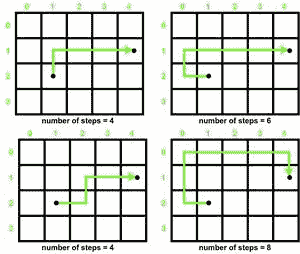

# 检查在无限矩阵中是否有可能以偶数步到达目的地

> 原文:[https://www . geeksforgeeks . org/检查无限矩阵中的偶数步数是否有可能到达目的地/](https://www.geeksforgeeks.org/check-if-it-is-possible-to-reach-destination-in-even-number-of-steps-in-an-infinite-matrix/)

给定一个**源**和**目的地**在一个**矩阵[][]** 的**无限**行和列中，任务是找出是否可能在一个**偶数**步数内从**源**到达**目的地**。另外，只能将**上移**、**下移**、**左移**、**右移**。

**示例:**

> **输入:**来源= {2，1}，目的地= {1，4 }
> T3】输出:是
> 
> **输入:**来源= {2，2}，目的地= {1，4}
> 输出:否

**观察:**

观察到**如果最短路径到达目的地所需的步数是偶数，那么每隔一条路线到达目的地所需的步数将永远是偶数**。此外，到达目标点的方法有无限多种。从 4×5 矩阵中的(1，2)到达(4，1)的一些路径如下:



**所需的最小步数=4**

因此，我们的问题简化为在矩阵中找到从源到达目的地所需的最小步数[，这可以通过简单地取 **X** 坐标和 **Y** 坐标之差的**绝对**值的](https://www.geeksforgeeks.org/find-minimum-numbers-moves-needed-move-one-cell-matrix-another/)[和](https://www.geeksforgeeks.org/sum-function-python/)来轻松计算。

[](https://media.geeksforgeeks.org/wp-content/uploads/20210625021819/UntitledDiagram20.jpg)

下面是上述方法的实现:

## C++

```
// C++ Program for the above approach
#include <bits/stdc++.h>
using namespace std;

// Function to check destination can be
// reached from source in even number of
// steps
void IsEvenPath(int Source[], int Destination[])
{
    // Coordinates differences
    int x_dif = abs(Source[0] - Destination[0]);
    int y_dif = abs(Source[1] - Destination[1]);

    // minimum number of steps required
    int minsteps = x_dif + y_dif;

    // Minsteps is even
    if (minsteps % 2 == 0)
        cout << "Yes";

    // Minsteps is odd
    else
        cout << "No";
}

// Driver Code
int main()
{
    // Given Input
    int Source[] = { 2, 1 };
    int Destination[] = { 1, 4 };

    // Function Call
    IsEvenPath(Source, Destination);

    return 0;
}
```

## Java 语言(一种计算机语言，尤用于创建网站)

```
// Java program for the above approach
import java.lang.*;
import java.util.*;

class GFG{

// Function to check destination can be
// reached from source in even number of
// steps
static void IsEvenPath(int Source[], int Destination[])
{

    // Coordinates differences
    int x_dif = Math.abs(Source[0] - Destination[0]);
    int y_dif = Math.abs(Source[1] - Destination[1]);

    // Minimum number of steps required
    int minsteps = x_dif + y_dif;

    // Minsteps is even
    if (minsteps % 2 == 0)
        System.out.println("Yes");

    // Minsteps is odd
    else
        System.out.println("No");
}

// Driver code
public static void main(String[] args)
{

    // Given Input
    int Source[] = { 2, 1 };
    int Destination[] = { 1, 4 };

    // Function Call
    IsEvenPath(Source, Destination);
}
}

// This code is contributed by sanjoy_62
```

## 蟒蛇 3

```
# Python3 program for the above approach

# Function to check destination can be
# reached from source in even number of
# steps
def IsEvenPath(Source, Destination):

    # Coordinates differences
    x_dif = abs(Source[0] - Destination[0])
    y_dif = abs(Source[1] - Destination[1])

    # Minimum number of steps required
    minsteps = x_dif + y_dif

    # Minsteps is even
    if (minsteps % 2 == 0):
        print("Yes")

    # Minsteps is odd
    else:
        print("No")

# Driver Code
if __name__ == '__main__':

    # Given Input
    Source = [ 2, 1 ]
    Destination = [ 1, 4 ]

    # Function Call
    IsEvenPath(Source, Destination)

# This code is contributed by mohit kumar 29
```

## C#

```
// C# program for the above approach
using System;

class GFG{

// Function to check destination can be
// reached from source in even number of
// steps
static void IsEvenPath(int[] Source, int[] Destination)
{

    // Coordinates differences
    int x_dif = Math.Abs(Source[0] - Destination[0]);
    int y_dif = Math.Abs(Source[1] - Destination[1]);

    // Minimum number of steps required
    int minsteps = x_dif + y_dif;

    // Minsteps is even
    if (minsteps % 2 == 0)
        Console.WriteLine("Yes");

    // Minsteps is odd
    else
        Console.WriteLine("No");
}

// Driver code
public static void Main(string[] args)
{
    // Given Input
    int[] Source = { 2, 1 };
    int[] Destination = { 1, 4 };

    // Function Call
    IsEvenPath(Source, Destination);
}
}

// This code is contributed by code_hunt.
```

## java 描述语言

```
<script>
       // JavaScript Program for the above approach

       // Function to check destination can be
       // reached from source in even number of
       // steps
       function IsEvenPath(Source, Destination)
       {

           // Coordinates differences
           let x_dif = Math.abs(Source[0] - Destination[0]);
           let y_dif = Math.abs(Source[1] - Destination[1]);

           // minimum number of steps required
           let minsteps = x_dif + y_dif;

           // Minsteps is even
           if (minsteps % 2 == 0)
               document.write("Yes");

           // Minsteps is odd
           else
               document.write("No");
       }

       // Driver Code

       // Given Input
       let Source = [2, 1];
       let Destination = [1, 4];

       // Function Call
       IsEvenPath(Source, Destination);

   // This code is contributed by Potta Lokesh
   </script>
```

**Output**

```
Yes
```

***时间复杂度:**O(1)*
T5**辅助空间:** O(1)