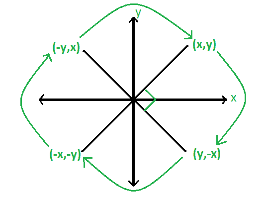

# 通过旋转向量 A，加上向量 C，检查是否有可能到达向量 B

> 原文:[https://www . geesforgeks . org/通过旋转矢量 a 并向其添加矢量 c 来检查是否有可能到达矢量 b/](https://www.geeksforgeeks.org/check-if-it-is-possible-to-reach-vector-b-by-rotating-vector-a-and-adding-vector-c-to-it/)

给定三个二维矢量坐标 **A** 、 **B** 和 **C** 。任务是对向量 **A** 执行任意次以下操作，得到向量 **B** :

*   顺时针旋转向量 90 度。
*   给它加上向量 C。

打印*“是”* B 使用上述操作获得，否则打印*“否”。*
**例:**

```
Input: Vector A: 2 3, Vector B: 2 3, Vector C: 0 0
Output: YES
The given vector A has coordinate (2, 3) and we need to 
convert this vector A to vector B which is also (2, 3). 
By rotating vector A 4 times by 90 degrees and adding
it to vector C(0, 0) will give us vector B(2, 3).

Input: Vector A: 0 0, Vector B: 1 1, Vector C: 2 2
Output: NO
```



下面是解决这个问题的分步算法:

*   将二维坐标的三个向量初始化为 A ( a，B)，B ( x，y)和 C ( p，q)。
*   向量 A 的坐标可以是任意象限。因此，为所有象限初始化一个检查函数，并检查它是否为真。
*   找到 a-x 和 b-y，这将告诉我们需要多少才能到达向量 b。
*   初始化 d = p*p + q*q。如果 d = 0，那么你不需要在向量 a 中添加任何东西
*   如果 D > 0，则检查 a*p + b*q 和 b * p–a * q 是否在“D”的倍数内，这样就有可能得到向量 b。

以下是上述算法的实现:

## C++

```
// C++ program to Check if it is
// possible to reach vector B by
// Rotating vector A and adding
// vector C to it any number of times

#include <bits/stdc++.h>
using namespace std;
#define ll long long

// function to check if vector B is
// possible from vector A
ll check(ll a, ll b, ll p, ll q)
{
    ll d = p * p + q * q;

    // if d = 0, then you need to add nothing to vector A
    if (d == 0)
        return a == 0 && b == 0;
    else
        return (a * p + b * q) % d == 0 && (b * p - a * q) % d == 0;
}

bool check(int a, int b, int x, int y, int p, int q)
{
    // for all four quadrants
    if (check(a - x, b - y, p, q)
        || check(a + x, b + y, p, q)
        || check(a - y, b + x, p, q)
        || check(a + y, b - x, p, q))
        return true;
    else
        return false;
}

// Driver code
int main()
{
    // initialize all three
    // vector coordinates

    int a = -4, b = -2;
    int x = 0, y = 0;
    int p = -2, q = -1;

    if (check(a, b, x, y, p, q))
        cout << "Yes";
    else
        cout << "No";

    return 0;
}
```

## Java 语言(一种计算机语言，尤用于创建网站)

```
// Java program to Check if it is
// possible to reach vector B by
// Rotating vector A and adding
// vector C to it any number of times.

public class GFG {

    // function to check if vector B is
    // possible from vector A
    static boolean check(long a, long b, long p, long q)
    {
        long d = p * p + q * q;

        // if d = 0, then you need to add nothing to vector A
        if (d == 0)
            return a == 0 && b == 0;
        else
            return (a * p + b * q) % d == 0 && (b * p - a * q) % d == 0;
    }

    static boolean check(int a, int b, int x, int y, int p, int q)
    {
        // for all four quadrants
        if (check(a - x, b - y, p, q)
            || check(a + x, b + y, p, q)
            || check(a - y, b + x, p, q)
            || check(a + y, b - x, p, q))
            return true;
        else
            return false;
    }

    // Driver code
    public static void main(String args[])
    {
        // initialize all three
        // vector coordinates

        int a = -4, b = -2;
        int x = 0, y = 0;
        int p = -2, q = -1;

        if (check(a, b, x, y, p, q))
            System.out.println("Yes");
        else
            System.out.println("No");

    }
    // This Code is contributed by ANKITRAI1
}
```

## 蟒蛇 3

```
# Python3 program to Check if it
# is possible to reach vector B
# by Rotating vector A and adding
# vector C to it any number of times

# function to check if vector B
# is possible from vector A
def check(a, b, p, q):

    d = p * p + q * q;

    # if d = 0, then you need to
    # add nothing to vector A
    if (d == 0):
        return a == 0 and b == 0;
    else :
        return ((a * p + b * q) % d == 0 and
                (b * p - a * q) % d == 0);

def checks(a, b, x, y, p, q):

    # for all four quadrants
    if (check(a - x, b - y, p, q) or
        check(a + x, b + y, p, q) or
        check(a - y, b + x, p, q) or
        check(a + y, b - x, p, q)):
        return True;
    else:
        return False;

# Driver code

# initialize all three
# vector coordinates
a = -4;
b = -2;
x = 0;
y = 0;
p = -2;
q = -1;

if (checks(a, b, x, y, p, q)):
    print( "Yes");
else:
    print ("No");

# This code is contributed
# by Shivi_Aggarwal
```

## C#

```
// C# program to Check if it is
// possible to reach vector B by
// Rotating vector A and adding
// vector C to it any number of times.
using System;
class GFG
{

// function to check if vector B is
// possible from vector A
static bool check(long a, long b,
                  long p, long q)
{
    long d = p * p + q * q;

    // if d = 0, then you need to
    // add nothing to vector A
    if (d == 0)
        return a == 0 && b == 0;
    else
        return (a * p + b * q) % d == 0 &&
               (b * p - a * q) % d == 0;
}

static bool check(int a, int b, int x,
                  int y, int p, int q)
{
    // for all four quadrants
    if (check(a - x, b - y, p, q) ||
        check(a + x, b + y, p, q) ||
        check(a - y, b + x, p, q) ||
        check(a + y, b - x, p, q))
        return true;
    else
        return false;
}

// Driver code
public static void Main()
{
    // initialize all three
    // vector coordinates
    int a = -4, b = -2;
    int x = 0, y = 0;
    int p = -2, q = -1;

    if (check(a, b, x, y, p, q))
        Console.Write("Yes");
    else
        Console.Write("No");
}
}

// This code is contributed
// by ChitraNayal
```

## 服务器端编程语言（Professional Hypertext Preprocessor 的缩写）

```
<?php
// PHP program to Check if it is
// possible to reach vector B by
// Rotating vector A and adding
// vector C to it any number of times

// function to check if vector B is
// possible from vector A
function check($a, $b, $p, $q)
{
    $d = $p * $p + $q * $q;

    // if d = 0, then you need to add nothing to vector A
    if ($d == 0)
        return ( $a == 0 && $b == 0);
    else
        return (($a * $p + $b * $q) % $d == 0 &&
                ($b * $p - $a * $q) % $d == 0);
}

function check1($a, $b, $x, $y, $p, $q)
{
    // for all four quadrants
        if (check($a - $x, $b - $y, $p, $q)
        || check($a + $x, $b + $y, $p, $q)
        || check($a - $y, $b + $x, $p, $q)
        || check($a + $y, $b - $x, $p, $q))
        return true;
    else
        return false;
}

// Driver code

    // initialize all three
    // vector coordinates

    $a = -4;
    $b = -2;
    $x = 0;
    $y = 0;
    $p = -2;
    $q = -1;

    if (check1($a, $b, $x, $y, $p, $q))
        echo "Yes";
    else
        echo "No";

// This Code is contributed by mits
?>
```

## java 描述语言

```
<script>

// Javascript program to Check if it is
// possible to reach vector B by
// Rotating vector A and adding
// vector C to it any number of times.

// Function to check if vector B is
// possible from vector A
function _check(a, b, p, q)
{
    var d = p * p + q * q;

    // If d = 0, then you need
    // to add nothing to vector A
    if (d == 0)
        return a == 0 && b == 0;
    else
        return (a * p + b * q) % d == 0 &&
               (b * p - a * q) % d == 0;
}

function check(a, b, x, y, p, q)
{

        // for all four qua
    // for all four quadrants
    if (_check(a - x, b - y, p, q)
        || _check(a + x, b + y, p, q)
        || _check(a - y, b + x, p, q)
        || _check(a + y, b - x, p, q))
        return true;
    else
        return false;
}

// Driver code

// Initialize all three
// vector coordinates
var a = -4, b = -2;
var x = 0, y = 0;
var p = -2, q = -1;

if (check(a, b, x, y, p, q))
    document.write("Yes");
else
    document.write("No");

// This code is contributed by Kirti

</script>
```

**Output:** 

```
Yes
```