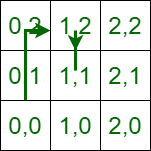

# 检查是否可以通过在相邻的四个方向上移动来在给定的时间内移动所有的点

> 原文:[https://www . geesforgeks . org/check-如果有可能，通过在相邻的四个方向上移动来移动给定时间的所有点/](https://www.geeksforgeeks.org/check-if-it-is-possible-to-travel-all-points-in-given-time-by-moving-in-adjacent-four-directions/)

给定 3 个[数组](https://www.geeksforgeeks.org/array-data-structure/) **X[]，Y[]，**和 **T[]** 所有大小 **N** 其中 **X[i]** 和 **Y[i]** 代表 **i-th** 坐标， **T[i]** 代表以秒为单位的时间。发现有可能从起始坐标 **(0，0)** 及时到达所有坐标 **(X[i]，Y[I])****T[I]**。指针可以在四个方向上移动 **( x +1，y)，(x-1，y)，(x，y + 1)** 和 **(x，y-1)。**从一个坐标到另一个坐标需要 **1** 秒，不能待在自己的宫殿里。

**示例:**

> **输入:** N = 2，X[] = {1，1}，
> Y[] = {2，1}，
> T[] = {3，6 }
> T5】输出:是
> T8】说明:这样假设 2D 矩阵:
> 
> 
> 
> 在上面的矩阵中，每个点被定义为 x 和 y 坐标，在 3 秒内从(0，0 ) -> ( 0，1 ) -> ( 1，1 ) -> ( 1，2)然后在第 6 秒从(1，2 ) -> ( 1，1 ) -> ( 1，0 ) -> ( 1，1)。所以，是的，有可能在给定的时间内到达所有的坐标。
> 
> **输入:** N = 1，X[] = {100 }，
> Y[] = {100 }，
> T[]= { 2 }
> T5】输出:否
> T8】说明:从坐标(0，0)不可能在 2 秒内到达坐标 X 和 Y。

**方法:**解决这个问题的思路是基于从**第 I**点移动到 **(i+1)第**点需要**ABS(X[I+1]–X[I])+ABS(Y[I+1]–Y[I])**时间。在第一点的情况下，前一点是 **(0，0)。**所以，如果这个时间小于 **T[i]** 就可以了，否则就违反了条件。按照以下步骤解决问题:

*   使**三个**变量 **currentX、currentY、currentTime** 并初始化为**零**。
*   使**布尔**变量**为可能的**和**将**初始化为**真**。
*   [使用变量 **i** 迭代范围](https://www.geeksforgeeks.org/range-based-loop-c/)**【0，N)** ，并执行以下任务:
    *   如果**(ABS(X[I]–current tx)+ABS(Y[I]–current))**大于**(T[I]–current time)**则使**为可能的**为假。
    *   否则，如果**((ABS(X[I]–current tx)+ABS(Y[I]–current))% 2**不等于****(T[I]–current time)% 2**，则使**为可能的**为假。**
    *   **否则**将 **currentX、currentY** 和 **currentTime** 的前值**更改为**的、Yi 和 Ti。****
*   **执行上述步骤后，返回**的值**作为答案。**

**下面是上述方法的实现。**

## **C++**

```
// C++ program for the above approach
#include <bits/stdc++.h>
using namespace std;

// Function to check if it is possible
// to traverse all the points.
bool CheckItisPossible(int X[], int Y[],
                       int T[], int N)
{

    // Make 3 variables to store given
    // ith values
    int currentX = 0, currentY = 0,
        currentTime = 0;

    // Also, make a bool variable to
    // check it is possible
    bool IsPossible = true;

    // Now, iterate on all the coordinates
    for (int i = 0; i < N; i++) {

        // check first condition
        if ((abs(X[i] - currentX)
             + abs(Y[i] - currentY))
            > (T[i] - currentTime)) {
            // means thats not possible to
            // reach current coordinate
            // at Ithtime from previous coordinate
            IsPossible = false;
            break;
        }
        else if (((abs(X[i] - currentX)
                   + abs(Y[i] - currentY))
                  % 2)
                 > ((T[i] - currentTime) % 2)) {
            // means thats not possible to
            // reach current coordinate
            // at Ithtime from previous coordinate
            IsPossible = false;
            break;
        }
        else {
            // If both above conditions are false
            // then we change the values of current
            // coordinates
            currentX = X[i];
            currentY = Y[i];
            currentTime = T[i];
        }
    }

    return IsPossible;
}

// Driver Code
int main()
{
    int X[] = { 1, 1 };
    int Y[] = { 2, 1 };
    int T[] = { 3, 6 };
    int N = sizeof(X[0]) / sizeof(int);
    bool ans = CheckItisPossible(X, Y, T, N);

    if (ans == true) {
        cout << "Yes"
             << "\n";
    }
    else {
        cout << "No"
             << "\n";
    }
    return 0;
}
```

## **Java 语言(一种计算机语言，尤用于创建网站)**

```
// Java program for the above approach
public class GFG {

    // Function to check if it is possible
    // to traverse all the points.
    static boolean CheckItisPossible(int X[], int Y[],
                        int T[], int N)
    {

        // Make 3 variables to store given
        // ith values
        int currentX = 0, currentY = 0,
            currentTime = 0;

        // Also, make a bool variable to
        // check it is possible
        boolean IsPossible = true;

        // Now, iterate on all the coordinates
        for (int i = 0; i < N; i++) {

            // check first condition
            if ((Math.abs(X[i] - currentX) +
                 Math.abs(Y[i] - currentY)) > (T[i] - currentTime)) {

                // means thats not possible to
                // reach current coordinate
                // at Ithtime from previous coordinate
                IsPossible = false;
                break;
            }
            else if (((Math.abs(X[i] - currentX) +
                       Math.abs(Y[i] - currentY)) % 2) > ((T[i] - currentTime) % 2)) {
                // means thats not possible to
                // reach current coordinate
                // at Ithtime from previous coordinate
                IsPossible = false;
                break;
            }
            else {
                // If both above conditions are false
                // then we change the values of current
                // coordinates
                currentX = X[i];
                currentY = Y[i];
                currentTime = T[i];
            }
        }

        return IsPossible;
    }

    // Driver Code
    public static void main(String[] args)
    {
        int X[] = { 1, 1 };
        int Y[] = { 2, 1 };
        int T[] = { 3, 6 };
        int N = X.length;
        boolean ans = CheckItisPossible(X, Y, T, N);

        if (ans == true) {
            System.out.println("Yes");
        }
        else {
            System.out.println("No");
        }
    }
}

// This code is contributed by AnkThon
```

## **蟒蛇 3**

```
# python program for the above approach

# Function to check if it is possible
# to traverse all the points.
def CheckItisPossible(X, Y, T, N):

        # Make 3 variables to store given
        # ith values
    currentX = 0
    currentY = 0
    currentTime = 0

    # Also, make a bool variable to
    # check it is possible
    IsPossible = True

    # Now, iterate on all the coordinates
    for i in range(0, N):

                # check first condition
        if ((abs(X[i] - currentX)
             + abs(Y[i] - currentY))
                > (T[i] - currentTime)):
             # means thats not possible to
             # reach current coordinate
             # at Ithtime from previous coordinate
            IsPossible = False
            break

        elif (((abs(X[i] - currentX)
                + abs(Y[i] - currentY))
               % 2)
              > ((T[i] - currentTime) % 2)):
            # means thats not possible to
            # reach current coordinate
            # at Ithtime from previous coordinate
            IsPossible = False
            break

        else:
           # If both above conditions are false
           # then we change the values of current
           # coordinates
            currentX = X[i]
            currentY = Y[i]
            currentTime = T[i]

    return IsPossible

# Driver Code
if __name__ == "__main__":

    X = [1, 1]
    Y = [2, 1]
    T = [3, 6]
    N = len(X)
    ans = CheckItisPossible(X, Y, T, N)

    if (ans == True):
        print("Yes")
    else:
        print("No")

    # This code is contributed by rakeshsahni
```

## **C#**

```
// C# program for the above approach
using System;

class GFG {

    // Function to check if it is possible
    // to traverse all the points.
    static bool CheckItisPossible(int []X, int []Y,
                        int []T, int N)
    {

        // Make 3 variables to store given
        // ith values
        int currentX = 0, currentY = 0,
            currentTime = 0;

        // Also, make a bool variable to
        // check it is possible
        bool IsPossible = true;

        // Now, iterate on all the coordinates
        for (int i = 0; i < N; i++) {

            // check first condition
            if ((Math.Abs(X[i] - currentX) +
                 Math.Abs(Y[i] - currentY)) > (T[i] - currentTime)) {

                // means thats not possible to
                // reach current coordinate
                // at Ithtime from previous coordinate
                IsPossible = false;
                break;
            }
            else if (((Math.Abs(X[i] - currentX) +
                       Math.Abs(Y[i] - currentY)) % 2) > ((T[i] - currentTime) % 2)) {
                // means thats not possible to
                // reach current coordinate
                // at Ithtime from previous coordinate
                IsPossible = false;
                break;
            }
            else {
                // If both above conditions are false
                // then we change the values of current
                // coordinates
                currentX = X[i];
                currentY = Y[i];
                currentTime = T[i];
            }
        }

        return IsPossible;
    }

    // Driver Code
    public static void Main()
    {
        int []X = { 1, 1 };
        int []Y = { 2, 1 };
        int []T = { 3, 6 };
        int N = X.Length;
        bool ans = CheckItisPossible(X, Y, T, N);

        if (ans == true) {
            Console.Write("Yes");
        }
        else {
            Console.Write("No");
        }
    }
}

// This code is contributed by Samim Hossain Mondal.
```

## **java 描述语言**

```
<script>
// Javascript program for the above approach

// Function to check if it is possible
// to traverse all the points.
function CheckItisPossible(X, Y, T, N)
{

    // Make 3 variables to store given
    // ith values
    let currentX = 0, currentY = 0,
        currentTime = 0;

    // Also, make a bool variable to
    // check it is possible
    let IsPossible = true;

    // Now, iterate on all the coordinates
    for (let i = 0; i < N; i++) {

        // check first condition
        if ((Math.abs(X[i] - currentX)
             + Math.abs(Y[i] - currentY))
            > (T[i] - currentTime)) {
            // means thats not possible to
            // reach current coordinate
            // at Ithtime from previous coordinate
            IsPossible = false;
            break;
        }
        else if (((Math.abs(X[i] - currentX)
                   + Math.abs(Y[i] - currentY))
                  % 2)
                 > ((T[i] - currentTime) % 2)) {
            // means thats not possible to
            // reach current coordinate
            // at Ithtime from previous coordinate
            IsPossible = false;
            break;
        }
        else {
            // If both above conditions are false
            // then we change the values of current
            // coordinates
            currentX = X[i];
            currentY = Y[i];
            currentTime = T[i];
        }
    }

    return IsPossible;
}

// Driver Code
let X = [ 1, 1 ];
let Y = [ 2, 1 ];
let T = [ 3, 6 ];
let N = X.length;
let ans = CheckItisPossible(X, Y, T, N);

if (ans == true) {
    document.write("Yes" + "\n");
}
else {
    document.write("No" + "\n");
}

// This code is contributed by Samim Hossain Mondal.
</script>
```

****Output**

```
Yes
```** 

*****时间复杂度:**O(N)*
T5**辅助空间:** O(1)**