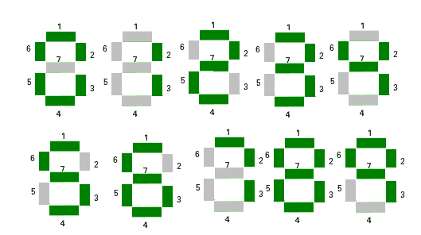

# 如果显示在七段显示

中，检查一个数字的镜像是否相同

> 原文:[https://www . geesforgeks . org/check-if-mirror-image-of-number-is-if-display-in-segment-display/](https://www.geeksforgeeks.org/check-if-mirror-image-of-a-number-is-same-if-displayed-in-seven-segment-display/)

给定一个正数 **n** 。任务是检查在[七线段](https://en.wikipedia.org/wiki/Seven-segment_display)上显示的数字镜像是否等于给定的数字。一个数的[镜像](https://en.wikipedia.org/wiki/Mirror_image)是该数的反射复制，看起来几乎相同，但在垂直于镜面的方向上是相反的。
**举例:**

```
Input : n = 101
Output: Yes
Mirror image of 101 is 101 on seven line segment. So, print "Yes".

Input : n = 020
Output : No
```



观察显示在七个线段上的每个数字，只有数字 0、1、8 在其镜像中保持不变。所以，一个数字要等于它的镜像，它应该只包含 0，1，8 位数字。另外，注意，为了使两个数字相等，它们对应的位置数字应该相同。因此，镜像也应该在其对应的数字位置包含相同的数字。所以，数字也应该是回文。
以下是该方法的实施:

## C++

```
// C++ Program to check if mirror image of a number is
// same if displayed in seven segment display
#include <bits/stdc++.h>
using namespace std;

// Return "Yes", if the mirror image of number
// is same as the given number
// Else return "No"
string checkEqual(string S)
{
    // Checking if the number contain only 0, 1, 8.
    for (int i = 0; i < S.size(); i++) {
        if (S[i] != '1' && S[i] != '0' && S[i] != '8') {
            return "No";
        }
    }

    int start = 0, end = S.size() - 1;

    // Checking if the number is palindrome or not.
    while (start < end) {

        // If corresponding index is not equal.
        if (S[start] != S[end]) {
            return "No";
        }

        start++;
        end--;
    }

    return "Yes";
}
int main()
{
    string S = "101";

    cout << checkEqual(S) << endl;
    return 0;
}
```

## Java 语言(一种计算机语言，尤用于创建网站)

```
// Java Program to check if
// mirror image of a number
// is same if displayed in
// seven segment display
import java.io.*;

class GFG
{

// Return "Yes", if the
// mirror image of number
// is same as the given
// number Else return "No"
static String checkEqual(String S)
{
    // Checking if the number
    // contain only 0, 1, 8.
    for (int i = 0;
             i < S.length(); i++)
    {
        if (S.charAt(i) != '1' &&
            S.charAt(i) != '0' &&
            S.charAt(i) != '8')
        {
            return "No";
        }
    }

    int start = 0,
        end = S.length() - 1;

    // Checking if the number
    // is palindrome or not.
    while (start < end)
    {

        // If corresponding
        // index is not equal.
        if (S.charAt(start) !=
            S.charAt(end))
        {
            return "No";
        }

        start++;
        end--;
    }

    return "Yes";
}

// Driver Code
public static void main (String[] args)
{
    String S = "101";

    System.out.println(checkEqual(S));
}
}

// This code is contributed
// by anuj_67.
```

## 蟒蛇 3

```
# Python3 Program to check if mirror
# image of a number is same if displayed
# in seven segment display

# Return "Yes", if the mirror image
# of number is same as the given number
# Else return "No"
def checkEqual(S):

    # Checking if the number contain
    # only 0, 1, 8.
    for i in range(len(S)):
        if (S[i] != '1' and S[i] != '0'
                        and S[i] != '8'):
            return "No";

    start = 0;
    end = len(S) - 1;

    # Checking if the number is
    # palindrome or not.
    while (start < end):

        # If corresponding index is not equal.
        if (S[start] != S[end]):
            return "No";

        start += 1;
        end -= 1;

    return "Yes";

# Driver Code
S = "101";
print(checkEqual(S));

# This code is contributed by mits
```

## C#

```
// C# Program to check if mirror image
// of a number is same if displayed in
// seven segment display
using System;

class GFG
{

// Return "Yes", if the mirror image
// of number is same as the given
// number Else return "No"
static string checkEqual(string S)
{
    // Checking if the number
    // contain only 0, 1, 8.
    for (int i = 0; i < S.Length; i++)
    {
        if (S[i] != '1' &&
            S[i] != '0' &&
            S[i] != '8')
        {
            return "No";
        }
    }

    int start = 0, end = S.Length - 1;

    // Checking if the number is
    // palindrome or not.
    while (start < end)
    {

        // If corresponding index is not equal.
        if (S[start] !=
            S[end])
        {
            return "No";
        }

        start++;
        end--;
    }

    return "Yes";
}

// Driver Code
public static void Main()
{
    string S = "101";

    Console.WriteLine(checkEqual(S));
}
}

// This code is contributed
// by mits
```

## 服务器端编程语言（Professional Hypertext Preprocessor 的缩写）

```
<?php
// PHP Program to check if mirror image
// of a number is same if displayed in
// seven segment display

// Return "Yes", if the mirror image
// of number is same as the given number
// Else return "No"
function checkEqual($S)
{
    // Checking if the number contain
    // only 0, 1, 8.
    for ($i = 0; $i < strlen($S); $i++)
    {
        if ($S[$i] != '1' && $S[$i] != '0' &&
                             $S[$i] != '8')
        {
            return "No";
        }
    }

    $start = 0;
    $end = strlen($S) - 1;

    // Checking if the number is
    // palindrome or not.
    while ($start < $end)
    {

        // If corresponding index is not equal.
        if ($S[$start] != $S[$end])
        {
            return "No";
        }

        $start++;
        $end--;
    }

    return "Yes";
}

// Driver Code
$S = "101";
echo checkEqual($S);

// This code is contributed by ajit
?>
```

## java 描述语言

```
<script>

// Javascript Program to check if mirror image of a number is
// same if displayed in seven segment display

// Return "Yes", if the mirror image of number
// is same as the given number
// Else return "No"
function checkEqual(S)
{
    // Checking if the number contain only 0, 1, 8.
    for (var i = 0; i < S.length; i++) {
        if (S[i] != '1' && S[i] != '0' && S[i] != '8') {
            return "No";
        }
    }

    var start = 0, end = S.length - 1;

    // Checking if the number is palindrome or not.
    while (start < end) {

        // If corresponding index is not equal.
        if (S[start] != S[end]) {
            return "No";
        }

        start++;
        end--;
    }

    return "Yes";
}

var S = "101";
document.write( checkEqual(S));

</script>
```

**输出**T2】

```
Yes
```