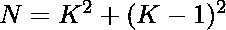

# 检查 N 是否可以表示为两个连续整数的平方和

> 原文:[https://www . geesforgeks . org/check-if-n-可以表示为两个连续整数的平方和/](https://www.geeksforgeeks.org/check-if-n-can-be-represented-as-sum-of-squares-of-two-consecutive-integers/)

给定一个整数 **N** ，任务是检查 **N** 是否可以表示为两个连续整数的平方和。

**示例:**

> **输入:** N = 5
> **输出:**是
> **解释:**
> 整数 5 = 1 <sup>2</sup> + 2 <sup>2</sup> 其中 1 和 2 是连续的数字。
> 
> **输入:**13
> T3】输出:是
> T6】解释:T8】13 = 2<sup>2</sup>+3<sup>2</sup>

**方法:**这个方程可以表示为:

> = >
> =>
> =>

最后，检查使用此公式计算的值是否为整数，这意味着 N 可以表示为两个连续整数的平方和

下面是上述方法的实现:

## C++

```
// C++ implementation to check that
// a number is sum of squares of 2
// consecutive numbers or not

#include <bits/stdc++.h>
using namespace std;

// Function to check that the
// a number is sum of squares of 2
// consecutive numbers or not
bool isSumSquare(int N)
{
    float n
        = (2 + sqrt(8 * N - 4))
          / 2;

    // Condition to check if the
    // a number is sum of squares of 2
    // consecutive numbers or not
    return (n - (int)n) == 0;
}

// Driver Code
int main()
{
    int i = 13;

    // Function call
    if (isSumSquare(i)) {
        cout << "Yes";
    }
    else {
        cout << "No";
    }
    return 0;
}
```

## Java 语言(一种计算机语言，尤用于创建网站)

```
// Java implementation to check that
// a number is sum of squares of 2
// consecutive numbers or not
import java.lang.Math;

class GFG{

// Function to check that the
// a number is sum of squares of 2
// consecutive numbers or not
public static boolean isSumSquare(int N)
{
    double n = (2 + Math.sqrt(8 * N - 4)) / 2;

    // Condition to check if the
    // a number is sum of squares of 2
    // consecutive numbers or not
    return(n - (int)n) == 0;
}

// Driver code
public static void main(String[] args)
{
    int i = 13;

    // Function call
    if (isSumSquare(i))
    {
        System.out.println("Yes");
    }
    else
    {
        System.out.println("No");
    }
}
}

// This code is contributed by divyeshrabadiya07
```

## 蟒蛇 3

```
# Python3 implementation to check that
# a number is sum of squares of 2
# consecutive numbers or not
import math

# Function to check that the a
# number is sum of squares of 2
# consecutive numbers or not
def isSumSquare(N):

    n = (2 + math.sqrt(8 * N - 4)) / 2

    # Condition to check if the a
    # number is sum of squares of
    # 2 consecutive numbers or not
    return (n - int(n)) == 0

# Driver code
if __name__=='__main__':

    i = 13

    # Function call
    if isSumSquare(i):
        print('Yes')
    else :
        print('No')

# This code is contributed by rutvik_56
```

## C#

```
// C# implementation to check that
// a number is sum of squares of 2
// consecutive numbers or not
using System;
class GFG{

// Function to check that the
// a number is sum of squares of 2
// consecutive numbers or not
public static bool isSumSquare(int N)
{
    double n = (2 + Math.Sqrt(8 * N - 4)) / 2;

    // Condition to check if the
    // a number is sum of squares of 2
    // consecutive numbers or not
    return(n - (int)n) == 0;
}

// Driver code
public static void Main(String[] args)
{
    int i = 13;

    // Function call
    if (isSumSquare(i))
    {
        Console.WriteLine("Yes");
    }
    else
    {
        Console.WriteLine("No");
    }
}
}

// This code is contributed by sapnasingh4991
```

## java 描述语言

```
<script>

// Javascript implementation to check that
// a number is sum of squares of 2
// consecutive numbers or not

// Function to check that the
// a number is sum of squares of 2
// consecutive numbers or not
function isSumSquare(N)
{
    var n = (2 + Math.sqrt(8 * N - 4)) / 2;

    // Condition to check if the
    // a number is sum of squares of 2
    // consecutive numbers or not
    return (n - parseInt( n)) == 0;
}

// Driver code
var i = 13;

// Function call
if (isSumSquare(i))
{
    document.write("Yes");
}
else
{
    document.write("No");
}

// This code is contributed by todaysgaurav

</script>
```

**Output:** 

```
Yes
```

**注:**为了打印整数，我们可以很容易地求解上面的方程得到根。

**时间复杂度:** O(1)

**辅助空间:** O(1)