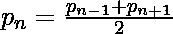

# 检查 N 是否为平衡素数

> 原文:[https://www . geesforgeks . org/check-if-n-is-a-balanced-prime-number-or-not/](https://www.geeksforgeeks.org/check-if-n-is-a-balanced-prime-number-or-not/)

给定一个正整数 **N** ，任务是检查 **N** 是否为[平衡素数](https://www.geeksforgeeks.org/balanced-prime/)数。

> 在数论中，一个 [**平衡素数**](https://www.geeksforgeeks.org/balanced-prime/) 是上下素数间隙大小相等的素数，因此等于上下最近素数的算术平均值。或者用代数的方法来说，给定一个素数 p < sub > n < /sub >，其中 n 是它在有序素数集中的索引，
> 
> 
> 
> 前几个平衡素数是 5，53，157，173……

**示例:**

> ***输入:** N = 5*
> ***输出:**是*
> *5 是第 3 素数，第 2 和第 4 素数即 3 和 7 的算术平均值是 5。*
> *所以 5 是一个*平衡的*质数。*
> 
> ***输入:** N = 11*
> ***输出:**否*

**进场:**

*   如果 **N** 不是素数或者是第一个素数，即 **2** ，则打印 **No** 。
*   否则，找到最接近 **N** 的素数(一个在左边，一个在右边)，并将它们的[算术平均值](https://www.geeksforgeeks.org/arithmetic-mean/)存储在**平均值**中。
    *   如果 **N ==表示**，则打印**是**。
    *   否则打印**否**。

下面是上述方法的实现:

## C++

```
// C++ program to check if a
// given number is Balanced prime
#include <bits/stdc++.h>
using namespace std;

// Utility function to check
// if a number is prime or not
bool isPrime(int n)
{

    // Corner cases
    if (n <= 1)
        return false;
    if (n <= 3)
        return true;

    // This is checked so that we can skip
    // middle five numbers in below loop
    if (n % 2 == 0 || n % 3 == 0)
        return false;

    for(int i = 5; i * i <= n; i = i + 6)
        if (n % i == 0 || n % (i + 2) == 0)
            return false;

    return true;
}

// Function that returns true
// if n is a Balanced prime
bool isBalancedPrime(int n)
{

    // If n is not a prime number or
    // n is the first prime then
    // return false
    if (!isPrime(n) || n == 2)
        return false;

    // Initialize previous_prime to
    // n - 1 and next_prime to n + 1
    int previous_prime = n - 1;
    int next_prime = n + 1;

    // Find next prime number
    while (!isPrime(next_prime))
        next_prime++;

    // Find previous prime number
    while (!isPrime(previous_prime))
        previous_prime--;

    // Arithmetic mean
    int mean = (previous_prime +
                next_prime) / 2;

    // If n is a weak prime
    if (n == mean)
        return true;
    else
        return false;
}

// Driver code
int main()
{
    int n = 53;

    if (isBalancedPrime(n))
        cout << "Yes";
    else
        cout << "No";

    return 0;
}

// This code is contributed by himanshu77
```

## Java 语言(一种计算机语言，尤用于创建网站)

```
// Java program to check if a
// given number is Balanced prime
class GFG{

// Utility function to check
// if a number is prime or not   
static boolean isPrime(int n)
{

    // Corner cases
    if (n <= 1)
        return false;
    if (n <= 3)
        return true;

    // This is checked so that we can skip
    // middle five numbers in below loop
    if (n % 2 == 0 || n % 3 == 0)
        return false;

    for(int i = 5; i * i <= n; i += 6)
        if (n % i == 0 ||
            n % (i + 2) == 0)
            return false;
    return true;
}

// Function that returns true
// if n is a Balanced prime    
static boolean isBalancedPrime(int n)
{

    // If n is not a prime number
    // or n is the first prime
    // then return false
    if (!isPrime(n) || n == 2)
        return false;

    // Initialize previous_prime to
    // n - 1 and next_prime to n + 1
    int previous_prime = n - 1;
    int next_prime = n + 1;

    // Find next prime number
    while (!isPrime(next_prime))
        next_prime++;

    // Find previous prime number
    while (!isPrime(previous_prime))
        previous_prime--;

    // Arithmetic mean
    int mean = (previous_prime +
                next_prime) / 2;

    // If n is a weak prime
    if (n == mean)
        return true;
    else
        return false;
}

// Driver code
public static void main(String[] args)
{
    int n = 53;

    if (isBalancedPrime(n))
        System.out.println("Yes");
    else
        System.out.println("No");
}
}

// This code is contributed by stutipathak31jan
```

## 蟒蛇 3

```
# Python3 program to check if a
# given number is Balanced prime

# Utility function to check
# if a number is prime or not
def isPrime(n):

    # Corner cases
    if n <= 1:
        return False
    if n <= 3:
        return True

    # This is checked so that we
    # can skip middle five numbers
    # in below loop
    if n % 2 == 0 or n % 3 == 0:
        return False

    i = 5
    while i * i <= n:
        if (n % i == 0 or
            n % (i + 2) == 0):
            return False
        i += 6

    return True

# Function that returns true
# if n is a Balanced prime
def isBalancedPrime(n):

    # If n is not a prime number
    # or n is the first prime
    # then return false
    if not isPrime(n) or n == 2:
        return False

    # Initialize previous_prime to 
    # n - 1 and next_prime to n + 1
    previous_prime = n - 1
    next_prime = n + 1

    # Find next prime number
    while not isPrime(next_prime):
        next_prime += 1

    # Find previous prime number
    while not isPrime(previous_prime):
        previous_prime -= 1

    # Arithmetic mean
    mean = (previous_prime +
            next_prime) / 2

    # If n is a weak prime
    if n == mean:
        return True
    else:
        return False

# Driver code
n = 53

if isBalancedPrime(n):
    print("Yes")
else:
    print("No")

# This code is contributed by stutipathak31jan
```

## C#

```
// C# program to check if a
// given number is Balanced  prime
using System;

class GFG {

    // Utility function to check
    // if a number is prime or not
    static bool isPrime(int n)
    {
        // Corner cases
        if (n <= 1)
            return false;
        if (n <= 3)
            return true;

        // This is checked so that we can skip
        // middle five numbers in below loop
        if (n % 2 == 0 || n % 3 == 0)
            return false;

        for (int i = 5; i * i <= n; i = i + 6)
            if (n % i == 0 || n % (i + 2) == 0)
                return false;

        return true;
    }

    // Function that returns true
    // if n is a Balanced prime
    static bool isBalancedPrime(int n)
    {

        // If n is not a prime number or
        // n is the first prime then return false
        if (!isPrime(n) || n == 2)
            return false;

        // Initialize previous_prime to n - 1
        // and next_prime to n + 1
        int previous_prime = n - 1;
        int next_prime = n + 1;

        // Find next prime number
        while (!isPrime(next_prime))
            next_prime++;

        // Find previous prime number
        while (!isPrime(previous_prime))
            previous_prime--;

        // Arithmetic mean
        int mean = (previous_prime
                    + next_prime)
                   / 2;

        // If n is a weak prime
        if (n == mean)
            return true;
        else
            return false;
    }

    // Driver code
    public static void Main()
    {
        int n = 53;

        if (isBalancedPrime(n))
            Console.WriteLine("Yes");
        else
            Console.WriteLine("No");
    }
}
```

## java 描述语言

```
<script>

    // Javascript program to check if a
    // given number is Balanced prime

    // Utility function to check
    // if a number is prime or not
    function isPrime(n)
    {

        // Corner cases
        if (n <= 1)
            return false;
        if (n <= 3)
            return true;

        // This is checked so that we can skip
        // middle five numbers in below loop
        if (n % 2 == 0 || n % 3 == 0)
            return false;

        for(let i = 5; i * i <= n; i = i + 6)
            if (n % i == 0 || n % (i + 2) == 0)
                return false;

        return true;
    }

    // Function that returns true
    // if n is a Balanced prime
    function isBalancedPrime(n)
    {

        // If n is not a prime number or
        // n is the first prime then 
        // return false
        if (!isPrime(n) || n == 2)
            return false;

        // Initialize previous_prime to
        // n - 1 and next_prime to n + 1
        let previous_prime = n - 1;
        let next_prime = n + 1;

        // Find next prime number
        while (!isPrime(next_prime))
            next_prime++;

        // Find previous prime number
        while (!isPrime(previous_prime))
            previous_prime--;

        // Arithmetic mean
        let mean = (previous_prime +
                    next_prime) / 2;

        // If n is a weak prime
        if (n == mean)
            return true;
        else
            return false;
    }

    let n = 53;

    if (isBalancedPrime(n))
        document.write("Yes");
    else
        document.write("No");

// This code is contributed by divyesh072019.
</script>
```

**Output:** 

```
Yes
```