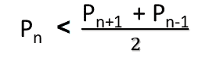

# 检查 N 是否为弱素数

> 原文:[https://www . geesforgeks . org/check-if-n-is-a-weak-prime-number-or-not/](https://www.geeksforgeeks.org/check-if-n-is-a-weak-prime-number-or-not/)

给定一个正整数 **N** ，任务是检查 **N** 是否是弱素数。

> 在数论中，弱素数是小于最近素数(即下一个和上一个素数)算术平均值的素数。
> 前几个弱素数是 **3、7、13、19、23、31、43、47、61、……**T3】一个弱素数**P<sub>n</sub>T7】可以表示为-**
> 
> 
> 
> 其中 **n** 是其在有序素数集中的索引。

**示例:**

> ***输入:** N = 13*
> ***输出:** Yes*
> *13 为第 6 素数，第 5 和第 7 素数即 11 和 17 的算术平均值为 14。*
> *13 小于 14 所以 13 是弱质数。*
> 
> ***输入:** N = 11*
> ***输出:**否*

**进场:**

*   如果 **N** 不是素数或者是第一个素数，即 **2** ，则打印 **No** 。
*   否则，找到最接近 **N** 的素数(一个在左边，一个在右边)，并将它们的算术平均值存储在**平均值**中。
    *   如果 **N <是指**，那么打印**是**。
    *   否则打印**否**。

下面是上述方法的实现:

## C++14

```
// C++ program to check
// if a given number is weak prime
#include <bits/stdc++.h>
using namespace std;

// Utility function to check
// if a number is prime or not
bool isPrime(int n)
{

    // Corner cases
    if (n <= 1)
        return false;
    if (n <= 3)
        return true;

    // This is checked so that we can skip
    // middle five numbers in below loop
    if (n % 2 == 0 || n % 3 == 0)
        return false;

    for(int i = 5; i * i <= n; i = i + 6)
        if (n % i == 0 || n % (i + 2) == 0)
            return false;

    return true;
}

// Function that returns true
// if n is a weak prime
bool isWeakPrime(int n)
{

    // If n is not a prime number or
    // n is the first prime then return false
    if (!isPrime(n) || n == 2)
        return false;

    // Initialize previous_prime to n - 1
    // and next_prime to n + 1
    int previous_prime = n - 1;
    int next_prime = n + 1;

    // Find next prime number
    while (!isPrime(next_prime))
        next_prime++;

    // Find previous prime number
    while (!isPrime(previous_prime))
        previous_prime--;

    // Arithmetic mean
    int mean = (previous_prime +
                next_prime) / 2;

    // If n is a weak prime
    if (n < mean)
        return true;
    else
        return false;
}

// Driver code
int main()
{
    int n = 13;

    if (isWeakPrime(n))
        cout << "Yes";
    else
        cout << "No";

    return 0;
}

// This code is contributed by himanshu77
```

## Java 语言(一种计算机语言，尤用于创建网站)

```
// Java program to check
// if a given number is weak prime
import java.util.*;
class GFG{

// Utility function to check
// if a number is prime or not
static boolean isPrime(int n)
{
    // Corner cases
    if (n <= 1)
        return false;
    if (n <= 3)
        return true;

    // This is checked so that we can skip
    // middle five numbers in below loop
    if (n % 2 == 0 || n % 3 == 0)
        return false;

    for (int i = 5; i * i <= n; i = i + 6)
        if (n % i == 0 || n % (i + 2) == 0)
            return false;

    return true;
}

// Function that returns true
// if n is a weak prime
static boolean isWeakPrime(int n)
{
    // If n is not a prime number or
    // n is the first prime then return false
    if (!isPrime(n) || n == 2)
        return false;

    // Initialize previous_prime to n - 1
    // and next_prime to n + 1
    int previous_prime = n - 1;
    int next_prime = n + 1;

    // Find next prime number
    while (!isPrime(next_prime))
        next_prime++;

    // Find previous prime number
    while (!isPrime(previous_prime))
        previous_prime--;

    // Arithmetic mean
    int mean = (previous_prime +
                next_prime) / 2;

    // If n is a weak prime
    if (n < mean)
        return true;
    else
        return false;
}

// Driver code
public static void main(String args[])
{
    int n = 13;

    if (isWeakPrime(n))
        System.out.print("Yes");
    else
        System.out.print("No");
}
}

// This code is contributed by Code_Mech
```

## 蟒蛇 3

```
# Python3 program to check if a given
# number is weak prime

# Utility function to check
# if a number is prime or not
def isPrime(n):

    # Corner cases
    if (n <= 1):
        return False
    if (n <= 3):
        return True

    # This is checked so that we can skip
    # middle five numbers in below loop
    if (n % 2 == 0 or n % 3 == 0):
        return False

    i = 5
    while (i * i <= n):
        if (n % i == 0 or n % (i + 2) == 0):
            return False
        i = i + 6

    return True

# Function that returns true
# if n is a weak prime
def isWeakPrime(n):

    # declaring variables as global
    global next_prime, previous_prime

    # If n is not a prime number or n is
    # the first prime then return false
    if(not isPrime(n) or n == 2):
        return False

    # Initialize previous_prime to n - 1
    # and next_prime to n + 1
    previous_prime = n - 1
    next_prime = n + 1

    # Find next prime number
    while(not isPrime(next_prime)):
        next_prime += 1

    # Find previous prime number
    while (not isPrime(previous_prime)):
        previous_prime -= 1

    # Arithmetic mean
    mean = (previous_prime + next_prime) // 2

    # If n is a weak prime
    if(n < mean):
        return True
    else:
        return False

# Driver code
if __name__ == '__main__':

    n = 13

    if(isWeakPrime(n)):
        print("Yes")
    else:
        print("No")

# This code is contributed by Shivam Singh
```

## C#

```
// C# program to check if a given number is weak prime
using System;
class GFG {

    // Utility function to check
    // if a number is prime or not
    static bool isPrime(int n)
    {
        // Corner cases
        if (n <= 1)
            return false;
        if (n <= 3)
            return true;

        // This is checked so that we can skip
        // middle five numbers in below loop
        if (n % 2 == 0 || n % 3 == 0)
            return false;

        for (int i = 5; i * i <= n; i = i + 6)
            if (n % i == 0 || n % (i + 2) == 0)
                return false;

        return true;
    }

    // Function that returns true
    // if n is a weak prime
    static bool isWeakPrime(int n)
    {
        // If n is not a prime number or
        // n is the first prime then return false
        if (!isPrime(n) || n == 2)
            return false;

        // Initialize previous_prime to n - 1
        // and next_prime to n + 1
        int previous_prime = n - 1;
        int next_prime = n + 1;

        // Find next prime number
        while (!isPrime(next_prime))
            next_prime++;

        // Find previous prime number
        while (!isPrime(previous_prime))
            previous_prime--;

        // Arithmetic mean
        int mean = (previous_prime
                    + next_prime)
                   / 2;

        // If n is a weak prime
        if (n < mean)
            return true;
        else
            return false;
    }

    // Driver code
    public static void Main()
    {
        int n = 13;

        if (isWeakPrime(n))
            Console.WriteLine("Yes");
        else
            Console.WriteLine("No");
    }
}
```

## java 描述语言

```
<script>
    // Javascript program to check 
    // if a given number is weak prime 

    // Utility function to check 
    // if a number is prime or not 
    function isPrime(n) 
    { 

        // Corner cases 
        if (n <= 1)
            return false; 
        if (n <= 3) 
            return true; 

        // This is checked so that we can skip 
        // middle five numbers in below loop 
        if (n % 2 == 0 || n % 3 == 0) 
            return false; 

        for(let i = 5; i * i <= n; i = i + 6) 
            if (n % i == 0 || n % (i + 2) == 0) 
                return false; 

        return true; 
    } 

    // Function that returns true 
    // if n is a weak prime 
    function isWeakPrime(n) 
    { 

        // If n is not a prime number or 
        // n is the first prime then return false 
        if (!isPrime(n) || n == 2) 
            return false; 

        // Initialize previous_prime to n - 1 
        // and next_prime to n + 1 
        let previous_prime = n - 1; 
        let next_prime = n + 1; 

        // Find next prime number 
        while (!isPrime(next_prime)) 
            next_prime++; 

        // Find previous prime number 
        while (!isPrime(previous_prime)) 
            previous_prime--; 

        // Arithmetic mean 
        let mean = (previous_prime + 
                    next_prime) / 2; 

        // If n is a weak prime 
        if (n < mean) 
            return true; 
        else
            return false; 
    } 

    let n = 13; 

    if (isWeakPrime(n)) 
        document.write("Yes"); 
    else
        document.write("No"); 

// This code is contributed by divyesh072019.
</script>
```

**Output:** 

```
Yes
```