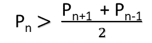

# 检查 N 是否为强素数

> 原文:[https://www.geeksforgeeks.org/check-if-n-is-strong-prime/](https://www.geeksforgeeks.org/check-if-n-is-strong-prime/)

给定一个正整数 **N** ，任务是检查 **N** 是否为[强素数](https://en.wikipedia.org/wiki/Strong_prime#Definition_in_number_theory)。
在数论中，强素数是大于最近素数(即下一个和上一个素数)算术平均值的素数。
前几个强素数是 **11、17、29、37、41、59、67、71、……**
一个强素数 **P <sub>n</sub>** 可以表示为-



其中 **n** 是其在有序素数集中的索引。

**示例:**

> **输入:** N = 11
> **输出:**是
> 11 是第 5 个素数，第 4 个和第 6 个素数即 7 和 13 的算术平均值是 10。
> 11 大于 10 所以 11 是强素数。
> 
> **输入:** N = 13
> **输出:**否
> 13 为第 6 素数，第 5(11)和第 7(17)的算术平均值为(11 + 17) / 2 = 14。
> 13 比 14 小，所以 13 不是强素数。

**进场:**

*   如果 **N** 不是素数或者是第一个素数，即 **2** ，则打印 **No** 。
*   否则，找到最接近 **N** 的素数(一个在左边，一个在右边)，并将它们的算术平均值存储在**平均值**中。
    *   如果 **N >是指**，那么打印**是**。
    *   否则打印**否**。

下面是上述方法的实现:

## C++

```
// C++ program to check if given number is strong prime
#include <bits/stdc++.h>
using namespace std;

// Utility function to check
// if a number is prime or not
bool isPrime(int n)
{
    // Corner cases
    if (n <= 1)
        return false;
    if (n <= 3)
        return true;

    // This is checked so that we can skip
    // middle five numbers in below loop
    if (n % 2 == 0 || n % 3 == 0)
        return false;

    for (int i = 5; i * i <= n; i = i + 6)
        if (n % i == 0 || n % (i + 2) == 0)
            return false;

    return true;
}

// Function that returns true if n is a strong prime
static bool isStrongPrime(int n)
{
    // If n is not a prime number or
    // n is the first prime then return false
    if (!isPrime(n) || n == 2)
        return false;

    // Initialize previous_prime to n - 1
    // and next_prime to n + 1
    int previous_prime = n - 1;
    int next_prime = n + 1;

    // Find next prime number
    while (!isPrime(next_prime))
        next_prime++;

    // Find previous prime number
    while (!isPrime(previous_prime))
        previous_prime--;

    // Arithmetic mean
    int mean = (previous_prime + next_prime) / 2;

    // If n is a strong prime
    if (n > mean)
        return true;
    else
        return false;
}

// Driver code
int main()
{

    int n = 11;

    if (isStrongPrime(n))
        cout << "Yes";
    else
        cout << "No";

    return 0;
}
```

## Java 语言(一种计算机语言，尤用于创建网站)

```
// Java program to check if given number is strong prime
class GFG {

    // Utility function to check
    // if a number is prime or not
    static boolean isPrime(int n)
    {
        // Corner cases
        if (n <= 1)
            return false;
        if (n <= 3)
            return true;

        // This is checked so that we can skip
        // middle five numbers in below loop
        if (n % 2 == 0 || n % 3 == 0)
            return false;

        for (int i = 5; i * i <= n; i = i + 6)
            if (n % i == 0 || n % (i + 2) == 0)
                return false;

        return true;
    }

    // Function that returns true if n is a strong prime
    static boolean isStrongPrime(int n)
    {
        // If n is not a prime number or
        // n is the first prime then return false
        if (!isPrime(n) || n == 2)
            return false;

        // Initialize previous_prime to n - 1
        // and next_prime to n + 1
        int previous_prime = n - 1;
        int next_prime = n + 1;

        // Find next prime number
        while (!isPrime(next_prime))
            next_prime++;

        // Find previous prime number
        while (!isPrime(previous_prime))
            previous_prime--;

        // Arithmetic mean
        int mean = (previous_prime + next_prime) / 2;

        // If n is a strong prime
        if (n > mean)
            return true;
        else
            return false;
    }

    // Driver code
    public static void main(String args[])
    {

        int n = 11;

        if (isStrongPrime(n))
            System.out.println("Yes");

        else
            System.out.println("No");
    }
}
```

## 蟒蛇 3

```
# Python 3 program to check if given
# number is strong prime
from math import sqrt

# Utility function to check if a
# number is prime or not
def isPrime(n):

    # Corner cases
    if (n <= 1):
        return False
    if (n <= 3):
        return True

    # This is checked so that we can skip
    # middle five numbers in below loop
    if (n % 2 == 0 or n % 3 == 0):
        return False

    k = int(sqrt(n)) + 1
    for i in range(5, k, 6):
        if (n % i == 0 or n % (i + 2) == 0):
            return False

    return True

# Function that returns true if
# n is a strong prime
def isStrongPrime(n):

    # If n is not a prime number or
    # n is the first prime then return false
    if (isPrime(n) == False or n == 2):
        return False

    # Initialize previous_prime to n - 1
    # and next_prime to n + 1
    previous_prime = n - 1
    next_prime = n + 1

    # Find next prime number
    while (isPrime(next_prime) == False):
        next_prime += 1

    # Find previous prime number
    while (isPrime(previous_prime) == False):
        previous_prime -= 1

    # Arithmetic mean
    mean = (previous_prime + next_prime) / 2

    # If n is a strong prime
    if (n > mean):
        return True
    else:
        return False

# Driver code
if __name__ == '__main__':
    n = 11

    if (isStrongPrime(n)):
        print("Yes")
    else:
        print("No")

# This code is contributed by
# Sanjit_prasad
```

## C#

```
// C# program to check if a given number is strong prime
using System;
class GFG {

    // Utility function to check
    // if a number is prime or not
    static bool isPrime(int n)
    {
        // Corner cases
        if (n <= 1)
            return false;
        if (n <= 3)
            return true;

        // This is checked so that we can skip
        // middle five numbers in below loop
        if (n % 2 == 0 || n % 3 == 0)
            return false;

        for (int i = 5; i * i <= n; i = i + 6)
            if (n % i == 0 || n % (i + 2) == 0)
                return false;

        return true;
    }

    // Function that returns true if n is a strong prime
    static bool isStrongPrime(int n)
    {
        // If n is not a prime number or
        // n is the first prime then return false
        if (!isPrime(n) || n == 2)
            return false;

        // Initialize previous_prime to n - 1
        // and next_prime to n + 1
        int previous_prime = n - 1;
        int next_prime = n + 1;

        // Find next prime number
        while (!isPrime(next_prime))
            next_prime++;

        // Find previous prime number
        while (!isPrime(previous_prime))
            previous_prime--;

        // Arithmetic mean
        int mean = (previous_prime + next_prime) / 2;

        // If n is a strong prime
        if (n > mean)
            return true;
        else
            return false;
    }

    // Driver code
    public static void Main()
    {
        int n = 11;

        if (isStrongPrime(n))
            Console.WriteLine("Yes");
        else
            Console.WriteLine("No");
    }
}
```

## 服务器端编程语言（Professional Hypertext Preprocessor 的缩写）

```
<?php
// PHP program to check if given number
// is strong isPrime

// Utility function to check if a
// number is prime or not
function isPrime($n)
{
    // Corner cases
    if ($n <= 1)
        return false;
    if ($n <= 3)
        return true;

    // This is checked so that we can skip
    // middle five numbers in below loop
    if ($n % 2 == 0 || $n % 3 == 0)
        return false;

    for ($i = 5; $i * $i <= $n;
                      $i = $i + 6)
        if ($n % $i == 0 ||
            $n % ($i + 2) == 0)
            return false;

    return true;
}

// Function that returns true
// if n is a strong prime
function isStrongPrime($n)
{
    // If n is not a prime number or
    // n is the first prime then return false
    if (!isPrime($n) || $n == 2)
        return false;

    // Initialize previous_prime to n - 1
    // and next_prime to n + 1
    $previous_prime = $n - 1;
    $next_prime = $n + 1;

    // Find next prime number
    while (!isPrime($next_prime))
        $next_prime++;

    // Find previous prime number
    while (!isPrime($previous_prime))
        $previous_prime--;

    // Arithmetic mean
    $mean = ($previous_prime +
             $next_prime) / 2;

    // If n is a strong prime
    if ($n > $mean)
        return true;
    else
        return false;
}

// Driver code
$n = 11;

if (isStrongPrime($n))
    echo ("Yes");
else
    echo("No");

// This code is contributed
// by Shivi_Aggarwal
?>
```

## java 描述语言

```
<script>

// Javascript program to check if
// given number is strong prime

// Utility function to check
// if a number is prime or not
function isPrime(n)
{

    // Corner cases
    if (n <= 1)
        return false;
    if (n <= 3)
        return true;

    // This is checked so that we can skip
    // middle five numbers in below loop
    if (n % 2 == 0 || n % 3 == 0)
        return false;

    for(let i = 5; i * i <= n; i = i + 6)
        if (n % i == 0 || n % (i + 2) == 0)
            return false;

    return true;
}

// Function that returns true if
// n is a strong prime
function isStrongPrime(n)
{

    // If n is not a prime number or
    // n is the first prime then return false
    if (!isPrime(n) || n == 2)
        return false;

    // Initialize previous_prime to n - 1
    // and next_prime to n + 1
    let previous_prime = n - 1;
    let next_prime = n + 1;

    // Find next prime number
    while (!isPrime(next_prime))
        next_prime++;

    // Find previous prime number
    while (!isPrime(previous_prime))
        previous_prime--;

    // Arithmetic mean
    let mean = parseInt((previous_prime +
                         next_prime) / 2);

    // If n is a strong prime
    if (n > mean)
        return true;
    else
        return false;
}

// Driver code
let n = 11;

if (isStrongPrime(n))
    document.write("Yes");
else
    document.write("No");

// This code is contributed by souravmahato348

</script>
```

**Output:** 

```
Yes
```