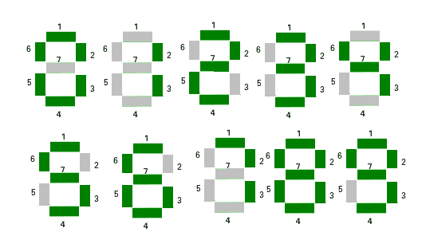

# 检查是否可以使用七段 led 显示数字

> 原文:[https://www . geesforgeks . org/check-if-number-can-display-使用七段 led/](https://www.geeksforgeeks.org/check-if-number-can-be-displayed-using-seven-segment-led/)

给定一个代表整数的字符串**和一个整数 **led** ，这是可用 led 的计数。任务是检查是否可以使用给定的指示灯显示数字。
请注意，一个数字将显示在一个 7 段发光二极管上。如果可以显示号码，则打印**是**，否则打印**否**。
这里有一个七段显示的例子:** 



**例:**

> **输入:** str = "999 "，led = 5
> **输出:**否
> 9 取 6 个 led 显示。因此 999 将需要 18 个 led
> 由于只有 5 个 led 可用，因此无法显示 999
> **输入:** str = "123456789 "，led = 43
> **输出:**是
> **输入:** str = "123456789 "，led = 20
> **输出:**否

**方法:**预先计算从 **0** 到 **9** 的数字使用的段数并存储。现在对字符串的每个元素计算它所使用的段的数量。现在，如果**计数≤ led** ，则打印**是**否则打印**否**。

> 数字使用的段号:
> 0->6
> 1->2
> 2->5
> 3->5
> 4->4
> 5->5
> 6->6
> 7->3
> 8->7
> 9->6

以下是上述方法的实现:

## C++

```
// C++ implementation of above approach
#include <bits/stdc++.h>
using namespace std;

// Pre-computed values of segment used by digit 0 to 9.
const int seg[10] = { 6, 2, 5, 5, 4, 5, 6, 3, 7, 6 };

// Check if it is possible to display the number
string LedRequired(string s, int led)
{
    int count = 0;

    // Finding sum of the segments used by
    // each digit of the number
    for (int i = 0; i < s.length(); ++i) {
        count += seg[int(s[i]) - 48];
    }

    if (count <= led)
        return "YES";
    else
        return "NO";
}

// Driven Program
int main()
{
    string S = "123456789";
    int led = 20;

    // Function call to print required answer
    cout << LedRequired(S, led) << endl;
    return 0;
}
```

## Java 语言(一种计算机语言，尤用于创建网站)

```
// Java implementation of the above approach
public class GfG{

    // Check if it is possible to display the number
    public static String LedRequired(String s, int led)
    {
        // Pre-computed values of segment used by digit 0 to 9.
        int seg[] = { 6, 2, 5, 5, 4, 5, 6, 3, 7, 6 };

        int count = 0;
        // Finding sum of the segments used by
        // each digit of the number
        for (int i = 0; i < s.length(); ++i) {
            count += seg[(int)(s.charAt(i)) - 48];
        }

        if (count <= led)
            return "YES";
        else
            return "NO";
    }

    public static void main(String []args){

        String S = "123456789";
        int led = 20;

        // Function call to print required answer
        System.out.println(LedRequired(S, led));
    }
}

// This code is contributed by Rituraj Jain
```

## 蟒蛇 3

```
# Python3 implementation of above approach

# Pre-computed values of segment
# used by digit 0 to 9.
seg = [ 6, 2, 5, 5, 4,
        5, 6, 3, 7, 6 ]

# Check if it is possible to
# display the number
def LedRequired(s, led) :

    count = 0

    # Finding sum of the segments used
    # by each digit of the number
    for i in range(len(s)) :
        count += seg[ord(s[i]) - 48]

    if (count <= led) :
        return "YES"
    else :
        return "NO"

# Driver Code
if __name__ == "__main__" :

    S = "123456789"
    led = 20

    # Function call to print
    # required answer
    print(LedRequired(S, led))

# This code is contributed by Ryuga
```

## C#

```
// C# implementation of the above approach
using System;
class GFG
{

// Check if it is possible to display the number
public static String LedRequired(string s, int led)
{
    // Pre-computed values of segment
    // used by digit 0 to 9.
    int[] seg = { 6, 2, 5, 5, 4, 5, 6, 3, 7, 6 };

    int count = 0;

    // Finding sum of the segments used by
    // each digit of the number
    for (int i = 0; i < s.Length; ++i)
    {
        count += seg[(int)(s[i]) - 48];
    }

    if (count <= led)
        return "YES";
    else
        return "NO";
}

// Driver Code
public static void Main()
{

    string S = "123456789";
    int led = 20;

    // Function call to print required answer
    Console.WriteLine(LedRequired(S, led));
}
}

// This code is contributed by Akanksha Rai
```

## 服务器端编程语言（Professional Hypertext Preprocessor 的缩写）

```
<?php
// PHP implementation of above approach

// Pre-computed values of segment
// used by digit 0 to 9.
$seg = array(6, 2, 5, 5, 4, 5, 6, 3, 7, 6 );

// Check if it is possible to display the number
function LedRequired($s, $led)
{
    $count = 0;
    global $seg;

    // Finding sum of the segments used by
    // each digit of the number
    for ($i = 0; $i < strlen($s) ; ++$i)
    {
        $count += $seg[ord($s[$i]) - 48];
    }

    if ($count <= $led)
        return "YES";
    else
        return "NO";
}

// Driver Code
$S = "123456789";
$led = 20;

// Function call to print required answer
echo LedRequired($S, $led);

// This code is contributed by ihritik
?>
```

## java 描述语言

```
<script>

// Javascript implementation of above approach

// Pre-computed values of segment used by digit 0 to 9.
const seg = [ 6, 2, 5, 5, 4, 5, 6, 3, 7, 6 ];

// Check if it is possible to display the number
function LedRequired(s, led)
{
    var count = 0;

    // Finding sum of the segments used by
    // each digit of the number
    for (var i = 0; i < s.length; ++i) {
        count += seg[(s[i]) - 48];
    }

    if (count <= led)
        return "YES";
    else
        return "NO";
}

    var S = "123456789";
    var led = 20;

    // Function call to print required answer
    document.write( LedRequired(S, led) + "<br>");

// This code is contributed by SoumikMondal

</script>
```

**Output:** 

```
NO
```