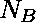

# 检查数字是否回文在 B 基数

> 原文:[https://www . geesforgeks . org/check-number-is-回文-or-in-base-b/](https://www.geeksforgeeks.org/check-if-number-is-palindrome-or-not-in-base-b/)

给定一个整数 **N** ，任务是检查



( **N** 在基地 **B** )是不是[回文](https://www.geeksforgeeks.org/check-if-a-number-is-palindrome/)。

**示例:**

> **输入:** N = 5，B = 2
> **输出:**是
> **解释:**
> (5)<sub>10</sub>=(101)<sub>2</sub>这是回文。因此，所需的输出是“是”。
> **输入:** N = 4，B = 2
> **输出:**否

**方法:**这个问题可以通过检查十进制值的逆序是否


是否等于 **N** 。按照以下步骤解决问题。

1.  初始化变量， **rev = 0** 存储 **N** 的倒数。
2.  提取的数字


1.  通过 **N % B** 。
2.  对于的每个数字


1.  更新 **rev= rev * B + N % B**
2.  最后，检查 **N** 是否等于 **rev**

以下是上述方法的实现:

## C++

```
// C++ program to implement
// the above approach

#include <bits/stdc++.h>
using namespace std;

// Function to check if N in
// base B is palindrome or not
int checkPalindromeB(int N, int B)
{
    // Stores the reverse of N
    int rev = 0;

    // Stores the value of N
    int N1 = N;

    // Extract all the digits of N
    while (N1) {
        // Generate its reverse
        rev = rev * B + N1 % B;
        N1 = N1 / B;
    }

    return N == rev;
}

// Driver Code
int main()
{
    int N = 5, B = 2;
    if (checkPalindromeB(N, B)) {
        cout << "Yes";
    }
    else {
        cout << "No";
    }
}
```

## Java 语言(一种计算机语言，尤用于创建网站)

```
// Java program to implement
// the above approach
class GFG{

// Function to check if N in
// base B is palindrome or not
static boolean checkPalindromeB(int N,
                                int B)
{

    // Stores the reverse of N
    int rev = 0;

    // Stores the value of N
    int N1 = N;

    // Extract all the digits of N
    while (N1 > 0)
    {

        // Generate its reverse
        rev = rev * B + N1 % B;
        N1 = N1 / B;
    }
    return N == rev;
}

// Driver code
public static void main(String[] args)
{
    int N = 5, B = 2;

    if (checkPalindromeB(N, B))
    {
        System.out.print("Yes");
    }
    else
    {
        System.out.print("No");
    }
}
}

// This code is contributed by Dewanti
```

## 蟒蛇 3

```
# Python3 program to implement
# the above approach

# Function to check if N in
# base B is palindrome or not
def checkPalindromeB(N, B):

    # Stores the reverse of N
    rev = 0;

    # Stores the value of N
    N1 = N;

    # Extract all the digits of N
    while (N1 > 0):

        # Generate its reverse
        rev = rev * B + N1 % B;
        N1 = N1 // B;

    return N == rev;

# Driver code
if __name__ == '__main__':
    N = 5; B = 2;

    if (checkPalindromeB(N, B)):
        print("Yes");
    else:
        print("No");

# This code is contributed by Princi Singh
```

## C#

```
// C# program to implement
// the above approach
using System;

class GFG{

// Function to check if N in
// base B is palindrome or not
static bool checkPalindromeB(int N,
                             int B)
{

    // Stores the reverse of N
    int rev = 0;

    // Stores the value of N
    int N1 = N;

    // Extract all the digits of N
    while (N1 > 0)
    {

        // Generate its reverse
        rev = rev * B + N1 % B;
        N1 = N1 / B;
    }
    return N == rev;
}

// Driver code
public static void Main(String[] args)
{
    int N = 5, B = 2;

    if (checkPalindromeB(N, B))
    {
        Console.Write("Yes");
    }
    else
    {
        Console.Write("No");
    }
}
}

// This code is contributed by Amit Katiyar
```

## java 描述语言

```
<script>

// Javascript program to implement
// the above approach

// Function to check if N in
// base B is palindrome or not
function checkPalindromeB(N, B)
{
    // Stores the reverse of N
    var rev = 0;

    // Stores the value of N
    var N1 = N;

    // Extract all the digits of N
    while (N1) {
        // Generate its reverse
        rev = rev * B + N1 % B;
        N1 = parseInt(N1 / B);
    }

    return N == rev;
}

// Driver Code
var N = 5, B = 2;
if (checkPalindromeB(N, B)) {
    document.write("Yes");
}
else {
    document.write("No");
}

</script>
```

**Output:** 

```
Yes
```

***时间复杂度:**O(log<sub>B</sub>N)*
***辅助空间:** O(1)*