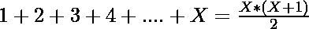
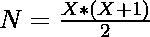
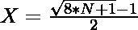

# 通过使用直到

的数字来检查帕斯卡三角形是否可能具有完整的层

> 原文:[https://www . geesforgeks . org/check-if-Pascal-triangle-a-complete-layer-by-numbers-up-n/](https://www.geeksforgeeks.org/check-if-pascals-triangle-is-possible-with-a-complete-layer-by-using-numbers-upto-n/)

给定一个数字 **N** ，任务是确定是否有可能通过使用总数 **N** 整数使**帕斯卡的**三角形具有完整的图层，如果可能的话打印是，否则打印否

**注:** [帕斯卡三角形](https://www.geeksforgeeks.org/pascal-triangle/)是二项式系数的三角形数组。下面是帕斯卡三角形的前 6 行。

```
1  
1 1 
1 2 1 
1 3 3 1 
1 4 6 4 1 
1 5 10 10 5 1 
```

在[帕斯卡三角形](https://www.geeksforgeeks.org/pascal-triangle/)中，从最顶层开始有 1 个整数，每下一层从上到下该层的大小增加 1。

**示例:**

> **输入:** N = 10
> **输出:**是
> **说明:**
> 可以用 1、2、3、4 个整数分别构成帕斯卡三角形的第一、二、三、四层，每层用(1 + 2 + 3 + 4)个整数= 10 也满足 N = 10。
> **输入:** N = 5
> **输出:**否
> **说明:**
> 你可以用 1 和 2 个整数分别做第一层和第二层，之后你只剩下 2 个整数了，不能做第三层完整，因为那层需要 3 个整数。

**方法:**这里我们在从第一层开始的每一层上使用整数 1，2，3，…，所以只有当有可能用 1 + 2 +的和来表示 N 时，我们才能使帕斯卡三角形完整…

1.  前 X 个整数之和由
    给出

> 

1.  我们只能用 N 个整数来做帕斯卡三角形当且仅当其中 X 必须是正整数。所以我们要检查 x 有没有正整数值存在。
2.  从第二步确定 **X** 的值，我们可以推导出公式为:

> 

1.  如果 **X** 的值为给定值 N 的整数，那么我们可以做帕斯卡三角形。否则，我们无法制作帕斯卡三角。

以下是上述方法的实现:

## C++

```
// C++ program for the above approach
#include <bits/stdc++.h>
using namespace std;

// Function to check if Pascaltriangle
// can be made by N integers
void checkPascaltriangle(int N)
{
    // Find X
    double x = (sqrt(8 * N + 1) - 1) / 2;

    // If x is integer
    if (ceil(x) - x == 0)
        cout << "Yes";

    else
        cout << "No";
}

// Driver Code
int main()
{
    // Given number N
    int N = 10;

    // Function Call
    checkPascaltriangle(N);
    return 0;
}
```

## Java 语言(一种计算机语言，尤用于创建网站)

```
// Java program for the above approach
class GFG{

// Function to check if Pascaltriangle
// can be made by N integers
static void checkPascaltriangle(int N)
{

    // Find X
    double x = (Math.sqrt(8 * N + 1) - 1) / 2;

    // If x is integer
    if (Math.ceil(x) - x == 0)
        System.out.print("Yes");
    else
        System.out.print("No");
}

// Driver Code
public static void main(String[] args)
{

    // Given number N
    int N = 10;

    // Function call
    checkPascaltriangle(N);
}
}

// This code is contributed by amal kumar choubey
```

## 蟒蛇 3

```
# Python3 program for the above approach
import math

# Function to check if Pascaltriangle
# can be made by N integers
def checkPascaltriangle(N):

    # Find X
    x = (math.sqrt(8 * N + 1) - 1) / 2

    # If x is integer
    if (math.ceil(x) - x == 0):
        print("Yes")
    else:
        print("No")

# Driver Code

# Given number N
N = 10

# Function call
checkPascaltriangle(N)

# This code is contributed by sanjoy_62
```

## C#

```
// C# program for the above approach
using System;

class GFG{

// Function to check if Pascaltriangle
// can be made by N integers
static void checkPascaltriangle(int N)
{

    // Find X
    double x = (Math.Sqrt(8 * N + 1) - 1) / 2;

    // If x is integer
    if (Math.Ceiling(x) - x == 0)
        Console.Write("Yes");
    else
        Console.Write("No");
}

// Driver Code
public static void Main(String[] args)
{

    // Given number N
    int N = 10;

    // Function call
    checkPascaltriangle(N);
}
}

// This code is contributed by amal kumar choubey
```

## java 描述语言

```
<script>

      // JavaScript program for the above approach

      // Function to check if Pascaltriangle
      // can be made by N integers
      function checkPascaltriangle(N) {
        // Find X
        var x = (Math.sqrt(8 * N + 1) - 1) / 2;

        // If x is integer
        if (Math.ceil(x) - x == 0)
        document.write("Yes");
        else
        document.write("No");
      }

      // Driver Code

      // Given number N
      var N = 10;

      // Function Call
      checkPascaltriangle(N);

    </script>
```

**Output:** 

```
Yes
```

***时间复杂度:** O(sqrt(N))*
***辅助空间:** O(1)*