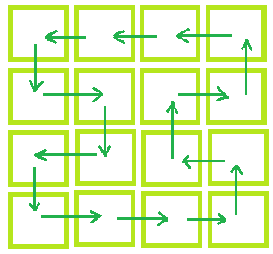

# 检查是否可以用相邻的移动来洗牌

> 原文:[https://www . geeksforgeeks . org/check-if-to-shuffle-a-matrix-with-only-movement/](https://www.geeksforgeeks.org/check-if-possible-to-shuffle-a-matrix-with-adjacent-movements/)

给定一个 N×M 矩阵，分别表示行数和列数。矩阵的每个单元正好被一个学生占据。任务是确定我们是否可以这样洗牌:每个学生应该占据一个与该学生的原始单元格相邻的单元格，即紧邻该单元格的左边、右边、顶部或底部，洗牌后每个单元格应该正好被一个学生占据。
**例:**

> **输入:** N = 3，M = 3
> **输出:**洗牌不可能
> **输入:** N = 4，M = 4
> **输出:**洗牌可能
> 洗牌的一种可能方式如下所示:
> 
> 

**方法:**检查行数或列数是否为偶数，则可以进行混洗，否则不能进行混洗。
以下是上述办法的实施情况:

## C++

```
// C++ implementation of above approach
#include <iostream>
using namespace std;

// Function that will check whether
// Shuffling is possible or not
void Shuffling(int N, int M)
{
    if (N % 2 == 0 || M % 2 == 0)
        cout << "Shuffling is possible";
    else
        cout << "Shuffling not possible";
}

// Driver code
int main()
{
    int N = 4, M = 5;

    // Calling function.
    Shuffling(N, M);
    return 0;
}
```

<gfg-tab role="tab" slot="tab" id="gfg-tab-1">爪哇</gfg-tab>T3

```
 // Java implementation of above approach
import java.io.*;

class GFG 
{

// Function that will check whether
// Shuffling is possible or not
static void Shuffling(int N, int M)
{
    if (N % 2 == 0 || M % 2 == 0)
        System.out.println("Shuffling is possible");
    else
        System.out.println("Shuffling not possible");
}

    // Driver code
    public static void main (String[] args) 
    {
        int N = 4, M = 5;

    // Calling function.
    Shuffling(N, M);
    }
}

// This code is contributed by anuj_67.. 
```

T4

## 蟒蛇 3

```
# Python3 implementation of above approach

# Function that will check whether
# Shuffling is possible or not
def Shuffling(N, M) :

    if (N % 2 == 0 or M % 2 == 0) :
        print("Shuffling is possible");
    else :
        print("Shuffling not possible");

# Driver Code
if __name__ == "__main__" :

    # Driver code
    N = 4;
    M = 5;

    # Calling function.
    Shuffling(N, M);

# This code is contributed by Ryuga
```

## C#

```
// C# implementation of above approach
using System;

class GFG
{

// Function that will check whether
// Shuffling is possible or not
static void Shuffling(int N, int M)
{
    if (N % 2 == 0 || M % 2 == 0)
        Console.Write("Shuffling is possible");
    else
        Console.Write("Shuffling not possible");
}

    // Driver code
    public static void Main ()
    {
        int N = 4, M = 5;

        // Calling function.
        Shuffling(N, M);
    }
}

// This code is contributed by Ita_c.
```

## 服务器端编程语言（Professional Hypertext Preprocessor 的缩写）

```
<?php
// PHP implementation of above approach

// Function that will check whether
// Shuffling is possible or not
function Shuffling($N, $M)
{
    if ($N % 2 == 0 || $M % 2 == 0)
        echo "Shuffling is possible";
    else
        echo "Shuffling not possible";
}

// Driver code
$N = 4;
$M = 5;

// Calling function.
Shuffling($N, $M);

// This code is contributed by
// Shivi_Aggarwal
?>
```

## java 描述语言

```
<script>
// Javascript implementation of above approach

// Function that will check whether
// Shuffling is possible or not
function Shuffling(N, M)
{
    if (N % 2 == 0 || M % 2 == 0)
        document.write( "Shuffling is possible");
    else
       document.write("Shuffling not possible");
}

// Driver code
var N = 4, M = 5;

// Calling function.
Shuffling(N, M);

// This code is contributed by rrrtnx.
</script>
```

**Output:** 

```
Shuffling is possible
```