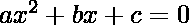
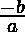

# 检查二次方程的根在数值上是否相等但符号相反

> 原文:[https://www . geesforgeks . org/check-如果一个二次方程的根在数字上相等但在符号上相反/](https://www.geeksforgeeks.org/check-if-roots-of-a-quadratic-equation-are-numerically-equal-but-opposite-in-sign-or-not/)

给定二次方程的系数(常数)，即 **a、b 和 c**；任务是检查由这些常数表示的方程的根在数字上是否相等，但在符号上是否相反。
**示例:**

> **输入:** a = 2，b = 0，c = -1
> **输出:**是
> **解释:**
> 给定的二次方程为
> 其根为(1，-1)，数值相等但符号相反
> **输入:** a = 1，b = -5，c = 6
> **输出:**否
> **解释:**T20

**方法:**
检查根在数字上是否相等但符号相反:

> 二次方程:
> 设根为
> 根之和=  = 
> 由于根只在符号上相反，故
> 故
> 
> 
> ，即 x 的系数为 0。

因此，我们只需要检查 b 是否为 0，因为根在数字上相等，但符号相反。
以下是上述方法的实现:

## C++

```
// C++ program to check if roots
// of a Quadratic Equation are
// numerically equal but opposite
// in sign or not

#include <iostream>
using namespace std;

// Function to find the required answer
void checkSolution(int a, int b, int c)
{
    if (b == 0)
        cout << "Yes";
    else
        cout << "No";
}

// Driver code
int main()
{
    int a = 2, b = 0, c = 2;

    checkSolution(a, b, c);

    return 0;
}
```

## Java 语言(一种计算机语言，尤用于创建网站)

```
// Java program to check if roots
// of a Quadratic Equation are
// numerically equal but opposite
// in sign or not
import java.util.*;
class GFG{

// Function to find the required answer
static void checkSolution(int a, int b, int c)
{
    if (b == 0)
        System.out.print("Yes");
    else
        System.out.print("No");
}

// Driver code
public static void main(String args[])
{
    int a = 2, b = 0, c = 2;

    checkSolution(a, b, c);
}
}

// This code is contributed by Akanksha_Rai
```

## 蟒蛇 3

```
# Python3 program to check if roots
# of a quadratic equation are
# numerically equal but opposite
# in sign or not

# Function to find the required answer
def checkSolution(a, b, c):

    if b == 0:
        print("Yes")
    else:
        print("No")

# Driver code
a = 2
b = 0
c = 2

checkSolution(a, b, c)

# This code is contributed by divyamohan123
```

## C#

```
// C# program to check if roots
// of a Quadratic Equation are
// numerically equal but opposite
// in sign or not
using System;
class GFG{

// Function to find the required answer
static void checkSolution(int a, int b, int c)
{
    if (b == 0)
        Console.Write("Yes");
    else
        Console.Write("No");
}

// Driver code
public static void Main()
{
    int a = 2, b = 0, c = 2;

    checkSolution(a, b, c);
}
}

// This code is contributed by Akanksha_Rai
```

## java 描述语言

```
<script>

// Javascript program to check if roots
// of a Quadratic Equation are
// numerically equal but opposite
// in sign or not

// Function to find the required answer
function checkSolution(a, b, c)
{
    if (b == 0)
        document.write("Yes");
    else
        document.write("No");
}

// Driver code
a = 2, b = 0, c = 2;
checkSolution(a, b, c);

</script>
```

**Output:** 

```
Yes
```

***时间复杂度:** O(1)*

***辅助空间:** O(1)*