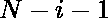
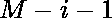

# 检查矩阵的行主序路径是否回文

> 原文:[https://www . geesforgeks . org/check-if-row-major-order-path-of-matrix-is-回文-or-not/](https://www.geeksforgeeks.org/check-if-row-major-order-path-of-matrix-is-palindrome-or-not/)

给定一个矩阵 **mat[][]** ，任务是检查矩阵的[行-主序路径](https://www.geeksforgeeks.org/row-wise-vs-column-wise-traversal-matrix/)是否是回文。

**示例:**

> **输入:** mat[][] = {{1，2，3}，{4，5，4}，{3，2， 1}}
> **输出:** YES
> **解释:**
> 矩阵的行-主序遍历是–
> 1 =>2 =>3 =>4 =>5 =>4 =>3 =>2 =>1
> 矩阵的反向行-主序遍历是–
> 1 =>2 =>3 =>4 = =
> 所以是回文。
> 
> **输入:** mat[][] = {{1，2}，{2，3 } }
> T3】输出:否

**方法:**思路是遍历半矩阵，同时检查其相对的半元素是否相同。那是 I 和 j 的指数，查一下和。如果任何索引不匹配，请打印否

下面是上述方法的实现:

## C++

```
// C++ implementation to check if
// row-major order traversal of
// matrix is palindrome or not

#include <bits/stdc++.h>
using namespace std;

// Function to check if row-major order
// traversal of the matrix is is palindrome
bool isPal(int a[3][3], int n, int m)
{
    // Loop to check if the matrix is
    // matrix is palindrome or not
    for (int i = 0; i < n / 2; i++) {
        for (int j = 0; j < m - 1; j++) {
            if (a[i][j] != a[n - 1 - i][m - 1 - j])
                return false;
        }
    }
    return true;
}

// Driver Code
int main()
{
    int n = 3, m = 3;
    int a[3][3] = { { 1, 2, 3 },
                    { 4, 5, 4 },
                    { 3, 2, 1 } };
    if (isPal(a, n, m)) {
        cout << "YES" << endl;
    }
    else {
        cout << "NO" << endl;
    }
}
```

## Java 语言(一种计算机语言，尤用于创建网站)

```
// Java implementation to check if
// row-major order traversal of
// matrix is palindrome or not
import java.util.*;

class GFG{

// Function to check if row-major order
// traversal of the matrix is is palindrome
static boolean isPal(int a[][], int n, int m)
{

    // Loop to check if the matrix is
    // matrix is palindrome or not
    for(int i = 0; i < n / 2; i++)
    {
       for(int j = 0; j < m - 1; j++)
       {
          if (a[i][j] != a[n - 1 - i][m - 1 - j])
              return false;
       }
    }
    return true;
}

// Driver Code
public static void main(String[] args)
{
    int n = 3, m = 3;
    int a[][] = { { 1, 2, 3 },
                  { 4, 5, 4 },
                  { 3, 2, 1 } };

    if (isPal(a, n, m))
    {
        System.out.print("YES" + "\n");
    }
    else
    {
        System.out.print("NO" + "\n");
    }
}
}

// This code is contributed by gauravrajput1
```

## 蟒蛇 3

```
# Python3 implementation to check if
# row-major order traversal of
# matrix is palindrome or not

# Function to check if row-major order
# traversal of the matrix is is palindrome
def isPal(a, n, m):

    # Loop to check if the matrix is
    # matrix is palindrome or not
    for i in range(0, n // 2):
        for j in range(0, m - 1):
            if (a[i][j] != a[n - 1 - i][m - 1 - j]):
                return False;

    return True;

# Driver Code
if __name__ == '__main__':
    n = 3;
    m = 3;
    a = [[1, 2, 3], [4, 5, 4], [3, 2, 1]];

    if (isPal(a, n, m)):
        print("YES");
    else:
        print("NO");

# This code is contributed by Princi Singh
```

## C#

```
// C# implementation to check if
// row-major order traversal of
// matrix is palindrome or not
using System;

class GFG{

// Function to check if row-major order
// traversal of the matrix is is palindrome
static bool isPal(int[,]a, int n, int m)
{

    // Loop to check if the matrix is
    // matrix is palindrome or not
    for(int i = 0; i < n / 2; i++)
    {
       for(int j = 0; j < m - 1; j++)
       {
           if (a[i, j] != a[n - 1 - i,
                            m - 1 - j])
               return false;
       }
    }
    return true;
}

// Driver Code
public static void Main(String[] args)
{
    int n = 3, m = 3;
    int[,]a = { { 1, 2, 3 },
                { 4, 5, 4 },
                { 3, 2, 1 } };

    if (isPal(a, n, m))
    {
        Console.Write("YES" + "\n");
    }
    else
    {
        Console.Write("NO" + "\n");
    }
}
}

// This code is contributed by gauravrajput1
```

## java 描述语言

```
<script>

// JavaScript implementation to check if
// row-major order traversal of
// matrix is palindrome or not

// Function to check if row-major order
// traversal of the matrix is is palindrome
function isPal(a, n, m)
{

    // Loop to check if the matrix is
    // matrix is palindrome or not
    for(let i = 0; i < n / 2; i++)
    {
       for(let j = 0; j < m - 1; j++)
       {
          if (a[i][j] != a[n - 1 - i][m - 1 - j])
              return false;
       }
    }
    return true;
}

// Driver Code
let n = 3, m = 3;
let a = [ [ 1, 2, 3 ],
          [ 4, 5, 4 ],
          [ 3, 2, 1 ] ];

if (isPal(a, n, m))
{
    document.write("YES" + "\n");
}
else
{
    document.write("NO" + "\n");
}

// This code is contributed by susmitakundugoaldanga

</script>
```

**Output:** 

```
YES
```