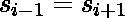

# 检查字符串是否可以重新排列，使得每个奇数长度的子字符串都是回文

> 原文:[https://www . geesforgeks . org/check-if-string-can-重排-以便每奇数长度的子串都是回文/](https://www.geeksforgeeks.org/check-if-string-can-be-rearranged-so-that-every-odd-length-substring-is-palindrome/)

给定一根绳子 **S** 。任务是检查是否有可能重新排列字符串，使得每个奇数长度的子字符串都是回文。
**例:**

> **输入:** S = "oiooi"
> **输出:** YES
> 字符串可以重新排列为“oio”
> **输入:**S = " yuoyo "
> **输出:** NO

**进场:**

*   第一个观察是，如果字符串的所有字符都相同，那么每个奇数长度的子字符串都是回文，我们不需要重新排列它们。
*   第二个观察是，如果不同字符的数量大于 **2** ，则不可能重新排列。
*   现在，如果不同字符的数量正好是 **2** ，那么为了使所有奇数长度的子串成为回文，它们的计数之差必须小于或等于 **1** ，如果满足这一点，那么我们以交替的方式重新排列字符串



*   对于 **i < — ( 1 到 n-1)**。其中 **n** 是弦的长度。

以下是上述方法的实现:

## C++

```
// C++ implementation of
// the above approach
#include <bits/stdc++.h>
using namespace std;

// Function to check is it
// possible to rearrange the string
// such that every odd length
// substring is palindrome
bool IsPossible(string s)
{

    // Length of the string
    int n = s.length();

    // To count number of distinct
    // character in string
    set<char> count;

    // To count frequency of
    // each character
    map<char, int> map;

    for (int i = 0; i < n; i++) {

        // Inserting into set
        count.insert(s[i]);

        // Incrementing the frequency
        map[s[i]] += 1;
    }

    // All characters in
    // the string are same
    if (count.size() == 1) {
        return true;
    }

    // There are more than 2 different
    // character in string
    if (count.size() > 2) {
        return false;
    }

    // Currently there is 2 different
    // character in string
    auto it = count.begin();

    // Get the frequencies of the
    // characters that present
    // in string
    int x = 0, y = 0;
    x = map[*it];

    it++;
    y = map[*it];

    // Difference between their
    // count is less than or
    // equal to 1
    if (abs(x - y) <= 1) {
        return true;
    }

    return false;
}

// Driver code
int main()
{
    string s = "aaaddad";

    if (IsPossible(s))
        cout << "YES\n";
    else
        cout << "NO\n";

    return 0;
}
```

## Java 语言(一种计算机语言，尤用于创建网站)

```
// Java implementation of the approach
import java.util.*;

class GFG
{

    // Function to check is it
    // possible to rearrange the string
    // such that every odd length
    // substring is palindrome
    static boolean IsPossible(String s)
    {

        // Length of the string
        int n = s.length();

        // To count number of distinct
        // character in string
        HashSet<Character> count = new HashSet<>();

        // To count frequency of
        // each character
        HashMap<Character, Integer> map = new HashMap<>();

        for (int i = 0; i < n; i++)
        {

            // Inserting into set
            count.add(s.charAt(i));

            // Incrementing the frequency
            map.put(s.charAt(i), map.get(s.charAt(i)) ==
                    null ? 1 : map.get(s.charAt(i)) + 1);
        }

        // All characters in
        // the string are same
        if (count.size() == 1)
            return true;

        // There are more than 2 different
        // character in string
        if (count.size() > 2)
            return false;

        String newString = count.toArray().toString();

        // Currently there is 2 different
        // character in string
        int j = 0;
        char it = newString.charAt(j);

        // Get the frequencies of the
        // characters that present
        // in string
        int x = 0, y = 0;
        x = map.get(it) == null ? 0 : map.get(it);
        j++;

        it = newString.charAt(j);
        y = map.get(it) == null ? 0 : map.get(it);

        // Difference between their
        // count is less than or
        // equal to 1
        if (Math.abs(x - y) <= 1)
            return true;
        return false;
    }

    // Driver Code
    public static void main(String[] args)
    {
        String s = "aaaddad";
        if (IsPossible(s))
            System.out.println("YES");
        else
            System.out.println("NO");
    }
}

// This code is contributed by
// sanjeev2552
```

## 蟒蛇 3

```
# Python3 implementation of
# the above approach

# Function to check is it
# possible to rearrange the string
# such that every odd length
# substring is palindrome
def IsPossible(s) :

    # Length of the string
    n = len(s);

    # To count number of distinct
    # character in string
    count = set();

    # To count frequency of
    # each character
    map = dict.fromkeys(s, 0);

    for i in range(n) :

        # Inserting into set
        count.add(s[i]);

        # Incrementing the frequency
        map[s[i]] += 1;

    # All characters in
    # the string are same
    if (len(count) == 1) :
        return True;

    # There are more than 2 different
    # character in string
    if (len(count) > 2) :
        return False;

    # Currently there is 2 different
    # character in string
    j = 0
    it = list(count)[j];

    # Get the frequencies of the
    # characters that present
    # in string
    x = 0; y = 0;
    x = map[it];

    j += 1
    it = list(count)[j];
    y = map[it];

    # Difference between their
    # count is less than or
    # equal to 1
    if (abs(x - y) <= 1) :
        return True;

    return False;

# Driver code
if __name__ == "__main__" :

    s = "aaaddad";

    if (IsPossible(s)) :
        print("YES");
    else :
        print("NO");

# This code is contributed by AnkitRai01
```

## C#

```
// C# implementation of the
// above approach
using System;
using System.Collections.Generic;
class GFG{

// Function to check is it
// possible to rearrange the string
// such that every odd length
// substring is palindrome
static bool IsPossible(String s)
{

  // Length of the string
  int n = s.Length;

  // To count number of distinct
  // character in string
  HashSet<char> count =
          new HashSet<char>();

  // To count frequency of
  // each character
  Dictionary<char,
             int> map = new Dictionary<char,
                                       int>();

  for (int i = 0; i < n; i++)
  {
    // Inserting into set
    count.Add(s[i]);

    // Incrementing the frequency
    if(map.ContainsKey(s[i]))
      map[s[i]] = map[s[i]] + 1;
    else
      map.Add(s[i], 1);
  }

  // All characters in
  // the string are same
  if (count.Count == 1)
    return true;

  // There are more than 2 different
  // character in string
  if (count.Count > 2)
    return false;

  String newString = count.ToString();

  // Currently there is 2 different
  // character in string
  int j = 0;
  char it = newString[j];

  // Get the frequencies of the
  // characters that present
  // in string
  int x = 0, y = 0;
  x = !map.ContainsKey(it) ?
       0 : map[it];
  j++;

  it = newString[j];
  y = !map.ContainsKey(it) ?
       0 : map[it];

  // Difference between their
  // count is less than or
  // equal to 1
  if (Math.Abs(x - y) <= 1)
    return true;
  return false;
}

// Driver Code
public static void Main(String[] args)
{
  String s = "aaaddad";
  if (IsPossible(s))
    Console.WriteLine("YES");
  else
    Console.WriteLine("NO");
}
}

// This code is contributed by 29AjayKumar
```

**Output:** 

```
YES

```