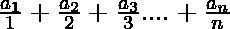
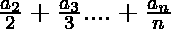
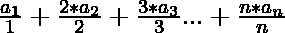
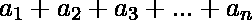

# 检查数组中所有可能的对(I，j)的 arr[I/j]之和是否为 0

> 原文:[https://www . geesforgeks . org/check-if-sum-arri-j-for-all-可能的对-I-j-in-a-array-is-0-or-not/](https://www.geeksforgeeks.org/check-if-sum-of-arri-j-for-all-possible-pairs-i-j-in-an-array-is-0-or-not/)

给定一个由 **N** 个整数组成的[数组](https://www.geeksforgeeks.org/introduction-to-arrays/) **arr[]** ，任务是检查所有对 **(i，j)** 的 **(arr[i] / j)** 的所有可能值之和是否为**0<I≤j<(N–1)**为 **0** 。如果发现**为真**，则打印**“是”**。否则，打印**“否”**。

**示例:**

> **输入:** arr[] = {1，-1，3，-2，-1}
> **输出:**是
> **解释:**
> 对于所有可能的对(I，j)，使得**0<I<= j<(N–1)**，要求的和= 1/1+-1/2+3/3+-2/4+-1/5+-1/2+3/3+-2/4+-1/5+5
> 
> **输入:** arr[] = {1，2，3，4，5}
> **输出:**否

**方法:**给定的问题可以基于以下观察来解决:

*   对于范围**【0，N-1】**内的 **i** 的每个可能值以及 **j** 的每个可能值，以下是表达式:
    *   **j = 1:** 
    *   **j = 2:** 
    *   **j = 3:**  **三线**等等…
*   因此，上述所有表达式的总和由下式给出:

> => 
> 
> => 

从上面的观察，如果数组的和是 **0** ，那么打印**是**。否则，打印**否**。

下面是上述方法的实现:

## C++

```
// C++ program for the above approach

#include <bits/stdc++.h>
using namespace std;

// Function to check if sum of all
// values of (arr[i]/j) for all
// 0 < i <= j < (N - 1) is 0 or not
void check(int arr[], int N)
{
    // Stores the required sum
    int sum = 0;

    // Traverse the array
    for (int i = 0; i < N; i++)
        sum += arr[i];

    // If the sum is equal to 0
    if (sum == 0)
        cout << "Yes";

    // Otherwise
    else
        cout << "No";
}

// Driver Code
int main()
{
    int arr[] = { 1, -1, 3, -2, -1 };
    int N = sizeof(arr) / sizeof(arr[0]);
    check(arr, N);

    return 0;
}
```

## Java 语言(一种计算机语言，尤用于创建网站)

```
// Java program for the above approach
import java.io.*;
import java.lang.*;
import java.util.*;

class GFG{

// Function to check if sum of all
// values of (arr[i]/j) for all
// 0 < i <= j < (N - 1) is 0 or not
static void check(int arr[], int N)
{

    // Stores the required sum
    int sum = 0;

    // Traverse the array
    for(int i = 0; i < N; i++)
        sum += arr[i];

    // If the sum is equal to 0
    if (sum == 0)
        System.out.println("Yes");

    // Otherwise
    else
        System.out.println("No");
}

// Driver Code
public static void main(String[] args)
{
    int arr[] = { 1, -1, 3, -2, -1 };
    int N = arr.length;

    check(arr, N);
}
}

// This code is contributed by Kingash
```

## 蟒蛇 3

```
# Python3 program for the above approach

# Function to check if sum of all
# values of (arr[i]/j) for all
# 0 < i <= j < (N - 1) is 0 or not
def check(arr, N):

    # Stores the required sum
    sum = 0

    # Traverse the array
    for i in range(N):
        sum += arr[i]

    # If the sum is equal to 0
    if (sum == 0):
        print("Yes")

    # Otherwise
    else:
        print("No")

# Driver Code
if __name__ == '__main__':

    arr = [ 1, -1, 3, -2, -1 ]
    N = len(arr)

    check(arr, N)

# This code is contributed by mohit kumar 29
```

## C#

```
// C# program for the above approach
using System;

class GFG {

    // Function to check if sum of all
    // values of (arr[i]/j) for all
    // 0 < i <= j < (N - 1) is 0 or not
    static void check(int[] arr, int N)
    {

        // Stores the required sum
        int sum = 0;

        // Traverse the array
        for (int i = 0; i < N; i++)
            sum += arr[i];

        // If the sum is equal to 0
        if (sum == 0)
            Console.WriteLine("Yes");

        // Otherwise
        else
            Console.WriteLine("No");
    }

    // Driver Code
    public static void Main(string[] args)
    {
        int[] arr = { 1, -1, 3, -2, -1 };
        int N = arr.Length;

        check(arr, N);
    }
}

// This code is contributed by ukasp.
```

## java 描述语言

```
<script>
// javascript program for the above approach
    // Function to check if sum of all
    // values of (arr[i]/j) for all
    // 0 < i <= j < (N - 1) is 0 or not
    function check(arr , N) {

        // Stores the required sum
        var sum = 0;

        // Traverse the array
        for (i = 0; i < N; i++)
            sum += arr[i];

        // If the sum is equal to 0
        if (sum == 0)
            document.write("Yes");

        // Otherwise
        else
            document.write("No");
    }

    // Driver Code

        var arr = [ 1, -1, 3, -2, -1 ];
        var N = arr.length;

        check(arr, N);

// This code contributed by umadevi9616
</script>
```

**Output:** 

```
Yes
```

***时间复杂度:**O(N)*
T5**辅助空间:** O(1)