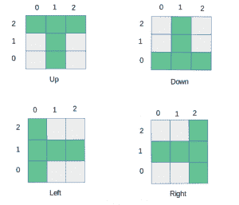

# 检查给定的二维点是否形成 T 形

> 原文:[https://www . geesforgeks . org/check-if-the-given-2-d-points-form-t-shape-or-not/](https://www.geeksforgeeks.org/check-if-the-given-2-d-points-form-t-shape-or-not/)

给定 5 个二维点的坐标，检查它们是否形成一个封闭的 T 形。如果它们形成 T 形，则打印“是”，否则打印“否”。**注意:**坐标应该是不同的整数。
根据给定的条件，有 4 种可能的丁字地层:



**示例:**

```
Input: [[7, 5], [8, 5], [6, 5], [7, 7], [7, 6]]
Output: Yes

Input: [[0, 0], [1, 0], [2, 0], [1, -1], [1, -2]]
Output: Yes
```

**进场:**

1.  考虑给定列表中的第一个点作为中心(x，y)(即形成 T 形的两条线的交点)。
2.  然后检查形成以(x，y)为中心的 T 形所需的所有点是否出现在给定点列表中。
3.  检查所有 4 种可能的丁字图案。

**以下是上述方法的实现:**

## 蟒蛇 3

```
# Python3 code to check if given 5
# 2-D points form T-shape or not

# Import the function to initialize the
# dictionary with a specific value
from collections import defaultdict

# This function checks if the points
# form T-shape pointing up

def isUpDirected(point, x, y):

    return (point[(x-1, y)] and
            point[(x, y)] and
            point[(x + 1, y)] and
            point[(x, y-1)] and
            point[(x, y-2)])

# This function checks if the points
# form T-shape pointing down

def isDownDirected(point, x, y):

    return (point[(x-1, y)] and
            point[(x, y)] and
            point[(x + 1, y)] and
            point[(x, y + 1)] and
            point[(x, y + 2)])

# This function checks if the points
# form T-shape pointing left

def isLeftDirected(point, x, y):

    return (point[(x, y + 1)] and
            point[(x, y)] and
            point[(x, y-1)] and
            point[(x + 1, y)] and
            point[(x + 2, y)])

# This function checks if the points
# form T-shape pointing right

def isRightDirected(point, x, y):

    return (point[(x, y + 1)] and
            point[(x, y)] and
            point[(x, y-1)] and
            point[(x-1, y)] and
            point[(x-2, y)])

# This function checks if given points
# form a T-shape or not
def solve(grid):

    # Initialize the dictionary with False value
    point = defaultdict(lambda: False)
    flag = False

    for i in range(len(grid)):

        # Assign True value to the points which
        # are present in the given list
        point[(grid[i][0], grid[i][1])] = True

    for i in range(len(grid)):

        # Check if the given points form any of the
        # 4 possible T-shaped formations
        if isUpDirected(point, grid[i][0], grid[i][1]) or
           isDownDirected(point, grid[i][0], grid[i][1]) or
            isLeftDirected(point, grid[i][0], grid[i][1]) or
            isRightDirected(point, grid[i][0], grid[i][1]):

            flag = True
            break

    if flag == True:
        return 'Yes'
    else:
        return 'No'

print(solve([[7, 5], [8, 5], [6, 5], [7, 7], [7, 6]]))
print(solve([[0, 0], [1, 0], [2, 0], [1, -1], [1, -2]]))
```

**Output:** 

```
Yes
Yes
```

**时间复杂度:** O(1)