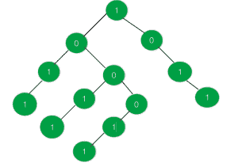

# 检查给定的二叉树是否有等于 1 和 0 的子树|集合 2

> 原文:[https://www . geeksforgeeks . org/check-如果给定的二叉树有一个等于 1 和 0 的子树集-2/](https://www.geeksforgeeks.org/check-if-the-given-binary-tree-has-a-sub-tree-with-equal-no-of-1s-and-0s-set-2/)

给定一棵每个节点的值都为 **0** 或 **1** 的树，任务是查找给定的二叉树是否包含任何具有相等数量的**0**和**1**的子树，如果找到这样的子树，则打印**是**否则打印**否**。
**示例:**

> **输入:**
> 
> 
> 
> **输出:**是
> 有两个子树，1 和 0 的个数相等
> 因此输出为“是”
> T5】输入:T7】
> 
> 
> 
> **输出:**否

**进场:**

*   更新树的所有节点，使它们代表以当前节点为根的子树中所有节点的总和。
*   现在，如果某个节点的值是根在同一节点的树中节点数的一半，那么它就是一个有效的子树。
*   如果不存在这样的节点，则打印**否**。

以下是上述方法的实现:

## C++

```
// C++ implementation of the approach
#include <iostream>
using namespace std;

// To store whether the tree contains a sub-tree
// with equal number of 0's and 1's
bool hasValidSubTree = false;

// Represents a node of the tree
struct node {
    int data;
    struct node *right, *left;
};

// To create a new node
struct node* newnode(int key)
{
    struct node* temp = new node;
    temp->data = key;
    temp->right = NULL;
    temp->left = NULL;
    return temp;
}

// Function to perform inorder traversal on
// the tree and print the nodes in that order
void inorder(struct node* root)
{
    if (root == NULL)
        return;
    inorder(root->left);
    cout << root->data << endl;
    inorder(root->right);
}

// Function to return the size of the
// sub-tree rooted at the current node
int size(struct node* root)
{

    int a = 0, b = 0;

    // If root is null or the valid sub-tree
    // has already been found
    if (root == NULL || hasValidSubTree)
        return 0;

    // Size of the right sub-tree
    a = size(root->right);

    // 1 is added for the parent
    a = a + 1;

    // Size of the left sub-tree
    b = size(root->left);

    // Total size of the tree
    // rooted at the current node
    a = b + a;

    // If the current tree has equal
    // number of 0's and 1's
    if (a % 2 == 0 && root->data == a / 2)
        hasValidSubTree = true;

    return a;
}

// Function to update and return the sum
// of all the tree nodes rooted at
// the passed node
int sum_tree(struct node* root)
{
    if (root == NULL)
        return 0;

    int a = 0, b = 0;

    // If left child exists
    if (root->left != NULL)
        a = sum_tree(root->left);

    // If right child exists
    if (root->right != NULL)
        b = sum_tree(root->right);
    root->data += (a + b);

    return root->data;
}

// Driver code
int main()
{
    struct node* root = newnode(1);
    root->right = newnode(0);
    root->right->right = newnode(1);
    root->right->right->right = newnode(1);
    root->left = newnode(0);
    root->left->left = newnode(1);
    root->left->left->left = newnode(1);
    root->left->right = newnode(0);
    root->left->right->left = newnode(1);
    root->left->right->left->left = newnode(1);
    root->left->right->right = newnode(0);
    root->left->right->right->left = newnode(1);
    root->left->right->right->left->left = newnode(1);

    sum_tree(root);
    size(root);

    if (hasValidSubTree)
        cout << "Yes";
    else
        cout << "No";

    return 0;
}
```

## Java 语言(一种计算机语言，尤用于创建网站)

```
// Java implementation of the approach
import java.util.Comparator;

class GFG
{

// To store whether the tree contains a sub-tree
// with equal number of 0's and 1's
static boolean hasValidSubTree = false;

// Represents a node of the tree
static class node
{
    int data;
    node right, left;
};

// To create a new node
static node newnode(int key)
{
    node temp = new node();
    temp.data = key;
    temp.right = null;
    temp.left = null;
    return temp;
}

// Function to perform inorder traversal on
// the tree and print the nodes in that order
static void inorder( node root)
{
    if (root == null)
        return;
    inorder(root.left);
    System.out.print(root.data);
    inorder(root.right);
}

// Function to return the size of the
// sub-tree rooted at the current node
static int size( node root)
{

    int a = 0, b = 0;

    // If root is null or the valid sub-tree
    // has already been found
    if (root == null || hasValidSubTree)
        return 0;

    // Size of the right sub-tree
    a = size(root.right);

    // 1 is added for the parent
    a = a + 1;

    // Size of the left sub-tree
    b = size(root.left);

    // Total size of the tree
    // rooted at the current node
    a = b + a;

    // If the current tree has equal
    // number of 0's and 1's
    if (a % 2 == 0 && root.data == a / 2)
        hasValidSubTree = true;

    return a;
}

// Function to update and return the sum
// of all the tree nodes rooted at
// the passed node
static int sum_tree( node root)
{
    if (root == null)
        return 0;

    int a = 0, b = 0;

    // If left child exists
    if (root.left != null)
        a = sum_tree(root.left);

    // If right child exists
    if (root.right != null)
        b = sum_tree(root.right);
    root.data += (a + b);

    return root.data;
}

// Driver code
public static void main(String args[])
{
    node root = newnode(1);
    root.right = newnode(0);
    root.right.right = newnode(1);
    root.right.right.right = newnode(1);
    root.left = newnode(0);
    root.left.left = newnode(1);
    root.left.left.left = newnode(1);
    root.left.right = newnode(0);
    root.left.right.left = newnode(1);
    root.left.right.left.left = newnode(1);
    root.left.right.right = newnode(0);
    root.left.right.right.left = newnode(1);
    root.left.right.right.left.left = newnode(1);

    sum_tree(root);
    size(root);

    if (hasValidSubTree)
        System.out.print( "Yes");
    else
        System.out.print( "No");
}
}

// This code is contributed by Arnab Kundu
```

## 蟒蛇 3

```
# Python3 implementation of the approach

class node:

    def __init__(self, key):
        self.data = key
        self.left = None
        self.right = None

# Function to perform inorder traversal on
# the tree and print the nodes in that order
def inorder(root):

    if root == None:
        return

    inorder(root.left)
    print(root.data)
    inorder(root.right)

# Function to return the size of the
# sub-tree rooted at the current node
def size(root):

    a, b = 0, 0
    global hasValidSubTree

    # If root is null or the valid
    # sub-tree has already been found
    if root == None or hasValidSubTree:
        return 0

    # Size of the right sub-tree
    a = size(root.right)

    # 1 is added for the parent
    a = a + 1

    # Size of the left sub-tree
    b = size(root.left)

    # Total size of the tree
    # rooted at the current node
    a = b + a

    # If the current tree has equal
    # number of 0's and 1's
    if a % 2 == 0 and root.data == a // 2:
        hasValidSubTree = True

    return a

# Function to update and return the sum
# of all the tree nodes rooted at
# the passed node
def sum_tree(root):

    if root == None:
        return 0

    a, b = 0, 0

    # If left child exists
    if root.left != None:
        a = sum_tree(root.left)

    # If right child exists
    if root.right != None:
        b = sum_tree(root.right)

    root.data += (a + b)
    return root.data

# Driver code
if __name__ == "__main__":

    # To store whether the tree contains a
    # sub-tree with equal number of 0's and 1's
    hasValidSubTree = False

    root = node(1)
    root.right = node(0)
    root.right.right = node(1)
    root.right.right.right = node(1)
    root.left = node(0)
    root.left.left = node(1)
    root.left.left.left = node(1)
    root.left.right = node(0)
    root.left.right.left = node(1)
    root.left.right.left.left = node(1)
    root.left.right.right = node(0)
    root.left.right.right.left = node(1)
    root.left.right.right.left.left = node(1)

    sum_tree(root)
    size(root)

    if hasValidSubTree:
        print("Yes")
    else:
        print("No")

# This code is contributed by Rituraj Jain
```

## C#

```
// C# implementation of the approach
using System;

class GFG
{

// To store whether the tree contains a sub-tree
// with equal number of 0's and 1's
static bool hasValidSubTree = false;

// Represents a node of the tree
public class node
{
    public int data;
    public node right, left;
};

// To create a new node
static node newnode(int key)
{
    node temp = new node();
    temp.data = key;
    temp.right = null;
    temp.left = null;
    return temp;
}

// Function to perform inorder traversal on
// the tree and print the nodes in that order
static void inorder( node root)
{
    if (root == null)
        return;
    inorder(root.left);
    Console.Write(root.data);
    inorder(root.right);
}

// Function to return the size of the
// sub-tree rooted at the current node
static int size( node root)
{

    int a = 0, b = 0;

    // If root is null or the valid sub-tree
    // has already been found
    if (root == null || hasValidSubTree)
        return 0;

    // Size of the right sub-tree
    a = size(root.right);

    // 1 is added for the parent
    a = a + 1;

    // Size of the left sub-tree
    b = size(root.left);

    // Total size of the tree
    // rooted at the current node
    a = b + a;

    // If the current tree has equal
    // number of 0's and 1's
    if (a % 2 == 0 && root.data == a / 2)
        hasValidSubTree = true;

    return a;
}

// Function to update and return the sum
// of all the tree nodes rooted at
// the passed node
static int sum_tree( node root)
{
    if (root == null)
        return 0;

    int a = 0, b = 0;

    // If left child exists
    if (root.left != null)
        a = sum_tree(root.left);

    // If right child exists
    if (root.right != null)
        b = sum_tree(root.right);
    root.data += (a + b);

    return root.data;
}

// Driver code
public static void Main(String []args)
{
    node root = newnode(1);
    root.right = newnode(0);
    root.right.right = newnode(1);
    root.right.right.right = newnode(1);
    root.left = newnode(0);
    root.left.left = newnode(1);
    root.left.left.left = newnode(1);
    root.left.right = newnode(0);
    root.left.right.left = newnode(1);
    root.left.right.left.left = newnode(1);
    root.left.right.right = newnode(0);
    root.left.right.right.left = newnode(1);
    root.left.right.right.left.left = newnode(1);

    sum_tree(root);
    size(root);

    if (hasValidSubTree)
        Console.Write( "Yes");
    else
        Console.Write( "No");
}
}

// This code contributed by Rajput-Ji
```

## java 描述语言

```
<script>

    // JavaScript implementation of the approach

    // To store whether the tree contains a sub-tree
    // with equal number of 0's and 1's
    let hasValidSubTree = false;

    // Binary tree node
    class node
    {
        constructor(key) {
           this.left = null;
           this.right = null;
           this.data = key;
        }
    }

    // To create a new node
    function newnode(key)
    {
        let temp = new node(key);
        return temp;
    }

    // Function to perform inorder traversal on
    // the tree and print the nodes in that order
    function inorder(root)
    {
        if (root == null)
            return;
        inorder(root.left);
        document.write(root.data);
        inorder(root.right);
    }

    // Function to return the size of the
    // sub-tree rooted at the current node
    function size(root)
    {

        let a = 0, b = 0;

        // If root is null or the valid sub-tree
        // has already been found
        if (root == null || hasValidSubTree)
            return 0;

        // Size of the right sub-tree
        a = size(root.right);

        // 1 is added for the parent
        a = a + 1;

        // Size of the left sub-tree
        b = size(root.left);

        // Total size of the tree
        // rooted at the current node
        a = b + a;

        // If the current tree has equal
        // number of 0's and 1's
        if (a % 2 == 0 && root.data == parseInt(a / 2, 10))
            hasValidSubTree = true;

        return a;
    }

    // Function to update and return the sum
    // of all the tree nodes rooted at
    // the passed node
    function sum_tree(root)
    {
        if (root == null)
            return 0;

        let a = 0, b = 0;

        // If left child exists
        if (root.left != null)
            a = sum_tree(root.left);

        // If right child exists
        if (root.right != null)
            b = sum_tree(root.right);
        root.data += (a + b);

        return root.data;
    }

    let root = newnode(1);
    root.right = newnode(0);
    root.right.right = newnode(1);
    root.right.right.right = newnode(1);
    root.left = newnode(0);
    root.left.left = newnode(1);
    root.left.left.left = newnode(1);
    root.left.right = newnode(0);
    root.left.right.left = newnode(1);
    root.left.right.left.left = newnode(1);
    root.left.right.right = newnode(0);
    root.left.right.right.left = newnode(1);
    root.left.right.right.left.left = newnode(1);

    sum_tree(root);
    size(root);

    if (hasValidSubTree)
        document.write( "Yes");
    else
        document.write( "No");

</script>
```

**Output:** 

```
No
```