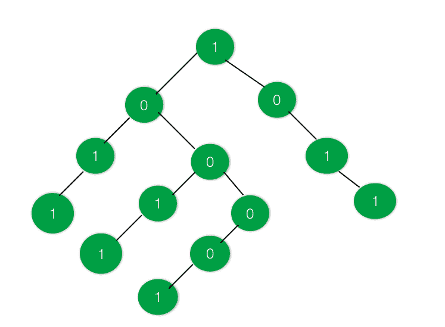
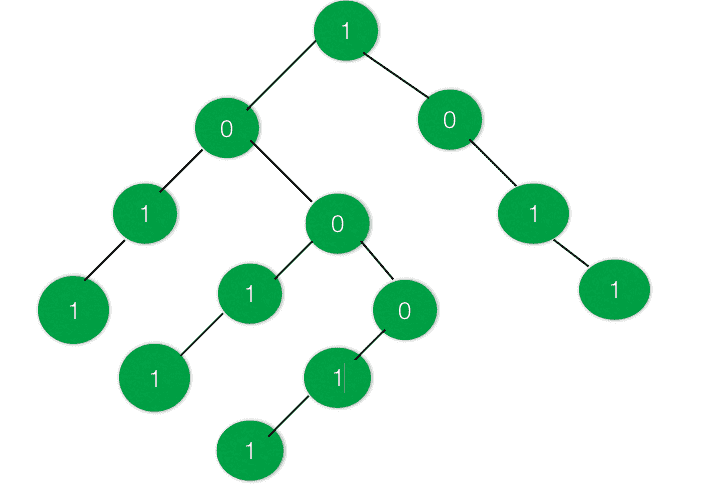

# 检查给定的二叉树是否有等于 1 和 0 的子树

> 原文:[https://www . geeksforgeeks . org/check-如果给定的二叉树有一个不等于 1 和 0 的子树/](https://www.geeksforgeeks.org/check-if-the-given-binary-tree-have-a-subtree-with-equal-no-of-1s-and-0s/)

给定一棵二叉树，其节点上的数据为 0 或 1。任务是找出是否存在 1 和 0 数目相等的子树

**示例:**

> **输入** :
> 
> 
> 
> **输出:**真
> 在上面的树中有两个子树，其中 1 的数量等于 0 的数量
> 
> **输入** :
> 
> 
> 
> **输出**:假
> 不存在 1 等于 0 的子树

**方法:**想法是将树的数据 0 更改为-1。这样就很容易找到 0 和 1 数量相等的子树。将所有 0 转换为-1 后，创建一个和树。创建求和树后，每个节点将包含位于其下的所有节点的和。

再次遍历树，如果有一个节点的和为 0，则表示有一个子树的 1 和-1 的个数相等，即 1 和 0 的个数相等。

下面是上述方法的实现:

## C++

```
// C++ program to check if there exist a
// subtree with equal number of 1's and 0's

#include <bits/stdc++.h>
using namespace std;

// Binary Tree Node
struct node {
    int data;
    struct node *right, *left;
};

// Utility function to create a new node
struct node* newnode(int key)
{
    struct node* temp = new node;
    temp->data = key;
    temp->right = NULL;
    temp->left = NULL;

    return temp;
}

// Function to convert all 0's in the
// tree to -1
void convert(struct node* root)
{
    if (root == NULL) {
        return;
    }

    // Move to right subtree
    convert(root->right);

    // Replace the 0's with -1 in the tree
    if (root->data == 0) {
        root->data = -1;
    }

    // Move to left subtree
    convert(root->left);
}

// Function to convert the tree to a SUM tree
int sum_tree(struct node* root)
{
    int a = 0, b = 0;

    if (root == NULL) {
        return 0;
    }

    a = sum_tree(root->left);
    b = sum_tree(root->right);

    root->data = root->data + a + b;

    return root->data;
}

// Function to check if there exists a subtree
// with equal no of 1s and 0s
int checkSubtree(struct node* root, int d)
{
    if (root == NULL) {
        return 0;
    }

    // Check if there is a subtree with equal
    // 1s and 0s or not
    if (d == 0) {
        d = checkSubtree(root->left, d);
    }

    if (root->data == 0) {
        d = 1;
        return d;
    }

    if (d == 0) {
        d = checkSubtree(root->right, d);
    }

    return d;
}

// Driver Code
int main()
{
    // Create the Binary Tree
    struct node* root = newnode(1);
    root->right = newnode(0);
    root->right->right = newnode(1);
    root->right->right->right = newnode(1);
    root->left = newnode(0);
    root->left->left = newnode(1);
    root->left->left->left = newnode(1);
    root->left->right = newnode(0);
    root->left->right->left = newnode(1);
    root->left->right->left->left = newnode(1);
    root->left->right->right = newnode(0);
    root->left->right->right->left = newnode(0);
    root->left->right->right->left->left = newnode(1);

    // Convert all 0s in tree to -1
    convert(root);

    // Convert the tree into a SUM tree
    sum_tree(root);

    // Check if required Subtree exists
    int d = 0;
    if (checkSubtree(root, d)) {
        cout << "True" << endl;
    }
    else {
        cout << "False" << endl;
    }

    return 0;
}
```

## Java 语言(一种计算机语言，尤用于创建网站)

```
// Java program to check if there exist a
// subtree with equal number of 1's and 0's

import java.util.*;
class GFG{

    // Binary Tree Node
    static class node {
        int data;
        node right, left;
    };

    // Utility function to create a new node
    static node newnode(int key)
    {
        node temp = new node();
        temp.data = key;
        temp.right = null;
        temp.left = null;

        return temp;
    }

    // Function to convert all 0's in the
    // tree to -1
    static void convert(node root)
    {
        if (root == null) {
            return;
        }

        // Move to right subtree
        convert(root.right);

        // Replace the 0's with -1 in the tree
        if (root.data == 0) {
            root.data = -1;
        }

        // Move to left subtree
        convert(root.left);
    }

    // Function to convert the tree to a SUM tree
    static int sum_tree(node root)
    {
        int a = 0, b = 0;

        if (root == null) {
            return 0;
        }

        a = sum_tree(root.left);
        b = sum_tree(root.right);

        root.data = root.data + a + b;

        return root.data;
    }

    // Function to check if there exists a subtree
    // with equal no of 1s and 0s
    static int checkSubtree(node root, int d)
    {
        if (root == null) {
            return 0;
        }

        // Check if there is a subtree with equal
        // 1s and 0s or not
        if (d == 0) {
            d = checkSubtree(root.left, d);
        }

        if (root.data == 0) {
            d = 1;
            return d;
        }

        if (d == 0) {
            d = checkSubtree(root.right, d);
        }

        return d;
    }

    // Driver Code
    public static void main(String args[])
    {
        // Create the Binary Tree
        node root = newnode(1);
        root.right = newnode(0);
        root.right.right = newnode(1);
        root.right.right.right = newnode(1);
        root.left = newnode(0);
        root.left.left = newnode(1);
        root.left.left.left = newnode(1);
        root.left.right = newnode(0);
        root.left.right.left = newnode(1);
        root.left.right.left.left = newnode(1);
        root.left.right.right = newnode(0);
        root.left.right.right.left = newnode(0);
        root.left.right.right.left.left = newnode(1);

        // Convert all 0s in tree to -1
        convert(root);

        // Convert the tree into a SUM tree
        sum_tree(root);

        // Check if required Subtree exists
        int d = 0;
        if (checkSubtree(root, d)>=1) {
            System.out.println("True");
        }
        else {
            System.out.println("False");
        }
    }
}

// This code is contributed by AbhiThakur
```

## 蟒蛇 3

```
# Python3 program to check if there exist a
# subtree with equal number of 1's and 0's

# Binary Tree Node
class node:

    def __init__(self, key):

        self.data = key
        self.left = None
        self.right = None

# Function to convert all 0's in the
# tree to -1
def convert(root):

    if (root == None):
        return

    # Move to right subtree
    convert(root.right)

    # Replace the 0's with -1
    # in the tree
    if (root.data == 0):
        root.data = -1

    # Move to left subtree
    convert(root.left)

# Function to convert the tree
# to a SUM tree
def sum_tree(root):

    a = 0
    b = 0

    if (root == None):
        return 0

    a = sum_tree(root.left)
    b = sum_tree(root.right)

    root.data = root.data + a + b

    return root.data

# Function to check if there exists
# a subtree with equal no of 1s and 0s
def checkSubtree(root, d):

    if (root == None):
        return 0

    # Check if there is a subtree with
    # equal 1s and 0s or not
    if (d == 0):
        d = checkSubtree(root.left, d)

    if (root.data == 0):
        d = 1
        return d

    if (d == 0):
        d = checkSubtree(root.right, d)

    return d

# Driver Code
if __name__ == '__main__':

    # Create the Binary Tree
    root = node(1)
    root.right = node(0)
    root.right.right = node(1)
    root.right.right.right = node(1)
    root.left = node(0)
    root.left.left = node(1)
    root.left.left.left = node(1)
    root.left.right = node(0)
    root.left.right.left = node(1)
    root.left.right.left.left = node(1)
    root.left.right.right = node(0)
    root.left.right.right.left = node(0)
    root.left.right.right.left.left = node(1)

    # Convert all 0s in tree to -1
    convert(root)

    # Convert the tree into a SUM tree
    sum_tree(root)

    # Check if required Subtree exists
    d = 0

    if (checkSubtree(root, d)):
        print("True")
    else:
        print("False")

# This code is contributed by mohit kumar 29
```

## C#

```
// C# program to check if there exist a
// subtree with equal number of 1's and 0's
using System;

class GFG{

    // Binary Tree Node
    class node {
        public int data;
        public node right, left;
    };

    // Utility function to create a new node
    static node newnode(int key)
    {
        node temp = new node();
        temp.data = key;
        temp.right = null;
        temp.left = null;

        return temp;
    }

    // Function to convert all 0's in the
    // tree to -1
    static void convert(node root)
    {
        if (root == null) {
            return;
        }

        // Move to right subtree
        convert(root.right);

        // Replace the 0's with -1 in the tree
        if (root.data == 0) {
            root.data = -1;
        }

        // Move to left subtree
        convert(root.left);
    }

    // Function to convert the tree to a SUM tree
    static int sum_tree(node root)
    {
        int a = 0, b = 0;

        if (root == null) {
            return 0;
        }

        a = sum_tree(root.left);
        b = sum_tree(root.right);

        root.data = root.data + a + b;

        return root.data;
    }

    // Function to check if there exists a subtree
    // with equal no of 1s and 0s
    static int checkSubtree(node root, int d)
    {
        if (root == null) {
            return 0;
        }

        // Check if there is a subtree with equal
        // 1s and 0s or not
        if (d == 0) {
            d = checkSubtree(root.left, d);
        }

        if (root.data == 0) {
            d = 1;
            return d;
        }

        if (d == 0) {
            d = checkSubtree(root.right, d);
        }

        return d;
    }

    // Driver Code
    public static void Main(String []args)
    {
        // Create the Binary Tree
        node root = newnode(1);
        root.right = newnode(0);
        root.right.right = newnode(1);
        root.right.right.right = newnode(1);
        root.left = newnode(0);
        root.left.left = newnode(1);
        root.left.left.left = newnode(1);
        root.left.right = newnode(0);
        root.left.right.left = newnode(1);
        root.left.right.left.left = newnode(1);
        root.left.right.right = newnode(0);
        root.left.right.right.left = newnode(0);
        root.left.right.right.left.left = newnode(1);

        // Convert all 0s in tree to -1
        convert(root);

        // Convert the tree into a SUM tree
        sum_tree(root);

        // Check if required Subtree exists
        int d = 0;
        if (checkSubtree(root, d) >= 1) {
            Console.WriteLine("True");
        }
        else {
            Console.WriteLine("False");
        }
    }
}

// This code is contributed by sapnasingh4991
```

## java 描述语言

```
<script>

// Javascript program to check if there exist a
// subtree with equal number of 1's and 0's
class Node
{
    constructor(key)
    {
        this.data = key;
        this.left = null;
        this.right = null;
    }
}

// Function to convert all 0's in the
// tree to -1
function convert(root)
{
    if (root == null)
    {
        return;
    }

    // Move to right subtree
    convert(root.right);

    // Replace the 0's with -1 in the tree
    if (root.data == 0)
    {
        root.data = -1;
    }

    // Move to left subtree
    convert(root.left);
}

// Function to convert the tree to a SUM tree
function sum_tree(root)
{
    let a = 0, b = 0;

    if (root == null)
    {
        return 0;
    }

    a = sum_tree(root.left);
    b = sum_tree(root.right);

    root.data = root.data + a + b;

    return root.data;
}

// Function to check if there exists a subtree
// with equal no of 1s and 0s
function checkSubtree(root, d)
{
    if (root == null)
    {
        return 0;
    }

    // Check if there is a subtree with equal
    // 1s and 0s or not
    if (d == 0)
    {
        d = checkSubtree(root.left, d);
    }

    if (root.data == 0)
    {
        d = 1;
        return d;
    }

    if (d == 0)
    {
        d = checkSubtree(root.right, d);
    }
    return d;
}

// Driver Code

// Create the Binary Tree
let root = new Node(1);
root.right = new Node(0);
root.right.right = new Node(1);
root.right.right.right = new Node(1);
root.left = new Node(0);
root.left.left = new Node(1);
root.left.left.left = new Node(1);
root.left.right = new Node(0);
root.left.right.left = new Node(1);
root.left.right.left.left = new Node(1);
root.left.right.right = new Node(0);
root.left.right.right.left = new Node(0);
root.left.right.right.left.left = new Node(1);

// Convert all 0s in tree to -1
convert(root);

// Convert the tree into a SUM tree
sum_tree(root);

// Check if required Subtree exists
let d = 0;
if (checkSubtree(root, d) >= 1)
{
    document.write("True<br>");
}
else
{
    document.write("False<br>");
}

// This code is contributed by unknown2108

</script>
```

**Output:** 

```
True
```

**时间复杂度**:O(N)
T3】空间复杂度 : O(1)