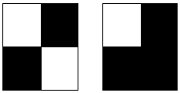

# 检查给定棋盘是否有效

> 原文:[https://www . geeksforgeeks . org/check-如果给定的棋盘有效或无效/](https://www.geeksforgeeks.org/check-if-the-given-chessboard-is-valid-or-not/)

给定一个 **NXN** 棋盘。任务是检查给定的棋盘是否有效。如果每两个相邻的单元格涂上不同的颜色，棋盘就被认为是有效的。如果两个像元共享一个边界，则认为它们是相邻的。



第一个棋盘有效，第二个无效。
**例:**

```
Input : N = 2
C = { 
      { 1, 0 },
      { 0, 1 }
    }
Output : Yes

Input : N = 2
C = { 
      { 0, 0 },
      { 0, 0 }
    }
Output : No
```

请注意，在棋盘上，每一对相邻的格子都涂上了不同的颜色。
因此，对于每个单元格(I，j)，检查相邻单元格即
(i + 1，j)，(i -1，j)，(I，j + 1)，(I，j–1)是否涂有与(I，j)不同的颜色。
伪代码:

```
int X[] = {0, -1, 0, 1};
int Y[] = {1, 0, -1, 0};

bool validateConfiguration(int M[N][N]) 
{
  bool isValid = true;
  for (int i = 0; i < N; i++)
  {
    for (int j = 0; j < N; j++)
    {
      for (int k = 0; k < 4; k++)
      {
         int newX = i + X[k];
         int newY = j + Y[k];
         if (newX < N && newY < N && newX >= 0 &&
             newY >= 0 && M[newX][newY] == M[i][j])
         {
              isValid = false;
         } 
       }
     }
  }
  return isValid;
}
```

以下是该方法的实现:

## C++

```
#include <bits/stdc++.h>
using namespace std;
#define MAX 2

// Check if the given chess board is valid or not.
bool isValid(int c[][MAX], int n)
{
    int X[] = { 0, -1, 0, 1 };
    int Y[] = { 1, 0, -1, 0 };
    bool isValid = true;

    // Traversing each cell of the chess board.
    for (int i = 0; i < n; i++) {
        for (int j = 0; j < n; j++) {

            // for each adjacent cells
            for (int k = 0; k < 4; k++) {
                int newX = i + X[k];
                int newY = j + Y[k];

                // checking if they have different color
                if (newX < n && newY < n && newX >= 0 &&
                    newY >= 0 && c[newX][newY] == c[i][j]) {
                    isValid = false;
                }
            }
        }
    }
    return isValid;
}

// Driven Program
int main()
{
    int n = 2;
    int c[2][2] = { { 1, 0 },
                    { 0, 1 } };

    (isValid(c, n)) ? (cout << "Yes") : (cout << "No");
    return 0;
}
```

## Java 语言(一种计算机语言，尤用于创建网站)

```
// Check if the given chess
// board is valid or not
class GFG
{
static int MAX = 2;

static boolean isValid(int c[][], int n)
{
    int X[] = { 0, -1, 0, 1 };
    int Y[] = { 1, 0, -1, 0 };
    boolean isValid = true;

    // Traversing each cell
    // of the chess board.
    for (int i = 0; i < n; i++)
    {
        for (int j = 0; j < n; j++)
        {

            // for each adjacent cells
            for (int k = 0; k < 4; k++)
            {
                int newX = i + X[k];
                int newY = j + Y[k];

                // checking if they have
                // different color
                if (newX < n && newY < n &&
                    newX >= 0 && newY >= 0 &&
                    c[newX][newY] == c[i][j])
                {
                    isValid = false;
                }
            }
        }
    }
    return isValid;
}

// Driver Code
public static void main(String[] args)
{
    int n = 2;
    int[][] c = {{ 1, 0 },
                 { 0, 1 }};

    if (isValid(c, n))
        System.out.println("Yes");
    else
        System.out.println("No");
}
}

// This code is contributed by ChitraNayal
```

## 蟒蛇 3

```
# Python 3 Program to Check
# if the given chessboard
# is valid or not
MAX = 2

# Check if the given chess
# board is valid or not.
def isValid(c, n) :

    X = [ 0, -1, 0, 1]
    Y = [ 1, 0, -1, 0]
    isValid = True

    # Traversing each cell
    # of the chess board.
    for i in range(n) :
        for j in range(n) :

            # for each adjacent cells
            for k in range(n) :
                newX = i + X[k]
                newY = j + Y[k]

                # checking if they have
                # different color
                if (newX < n and newY < n and
                    newX >= 0 and newY >= 0 and
                    c[newX][newY] == c[i][j]) :
                    isValid = false

    return isValid

# Driver Code
if __name__ == "__main__" :
    n = 2
    c = [ [1, 0],
          [0, 1] ]

    if isValid(c, n) :
        print("Yes")

    else :
        print("No")

# This code is contributed
# by ANKITRAI1
```

## C#

```
// Check if the given chess
// board is valid or not.
using System;

class GFG
{

static bool isValid(int[,] c, int n)
{
    int[] X = { 0, -1, 0, 1 };
    int[] Y = { 1, 0, -1, 0 };
    bool isValid = true;

    // Traversing each cell
    // of the chess board.
    for (int i = 0; i < n; i++)
    {
        for (int j = 0; j < n; j++)
        {

            // for each adjacent cells
            for (int k = 0; k < 4; k++)
            {
                int newX = i + X[k];
                int newY = j + Y[k];

                // checking if they have different color
                if (newX < n && newY < n &&
                    newX >= 0 && newY >= 0 &&
                    c[newX, newY] == c[i, j])
                {
                    isValid = false;
                }
            }
        }
    }
    return isValid;
}

// Driver Code
public static void Main()
{
    int n = 2;
    int[,] c = {{ 1, 0 },
                { 0, 1 }};

    if (isValid(c, n))
        Console.Write("Yes");
    else
        Console.Write("No");
}
}

// This code is contributed by ChitraNayal
```

## 服务器端编程语言（Professional Hypertext Preprocessor 的缩写）

```
<?php
// Check if the given chess
// board is valid or not.
function isValid(&$c, $n)
{
    $X = array( 0, -1, 0, 1 );
    $Y = array( 1, 0, -1, 0 );
    $isValid = true;

    // Traversing each cell
    // of the chess board.
    for ($i = 0; $i < $n; $i++)
    {
        for ($j = 0; $j < $n; $j++)
        {

            // for each adjacent cells
            for ($k = 0; $k < 4; $k++)
            {
                $newX = $i + $X[$k];
                $newY = $j + $Y[$k];

                // checking if they have different color
                if ($newX < $n && $newY < $n &&
                    $newX >= 0 && $newY >= 0 &&
                    $c[$newX][$newY] == $c[$i][$j])
                {
                    $isValid = false;
                }
            }
        }
    }
    return $isValid;
}

// Driver Code
$n = 2;
$c = array(array(1, 0),
           array(0, 1));

echo (isValid($c, $n)) ? "Yes" : "No";

// This code is contributed by ChitraNayal
?>
```

## java 描述语言

```
<script>

var MAX = 2;

// Check if the given chess
// board is valid or not.
function isValid(c, n)
{
    var X = [ 0, -1, 0, 1 ];
    var Y = [ 1, 0, -1, 0 ];
    var isValid = true;

    // Traversing each cell of the chess board.
    for (var i = 0; i < n; i++) {
        for (var j = 0; j < n; j++) {

            // for each adjacent cells
            for (var k = 0; k < 4; k++) {
                var newX = i + X[k];
                var newY = j + Y[k];

                // checking if they have
                // different color
                if (newX < n && newY < n &&
                newX >= 0 &&
                newY >= 0 &&
                c[newX][newY] == c[i][j]) {
                    isValid = false;
                }
            }
        }
    }
    return isValid;
}

// Driven Program
var n = 2;
var c = [ [ 1, 0 ],
                [ 0, 1 ] ];
(isValid(c, n)) ? (document.write( "Yes")) :
(document.write( "No"));

</script>
```

**输出:**

```
Yes
```

一种更简单的方法是检查具有偶数和的单元格是否具有相同的颜色。

## Java 语言(一种计算机语言，尤用于创建网站)

```
/*package whatever //do not write package name here */
import java.io.*;
class GFG
{

  static boolean checkBoard(int[][] board)
  {
    int base = board[0][0];
    boolean flag = true;

    for(int i = 0; i < board.length; i++)
    {
      for( int j = 0; j < board[i].length; j++)
      {
        if(( i + j ) % 2 == 0)
        {
          if( board[i][j] != base )
          {
            return false;
          }
        }
        else
        {
          if (board[i][j] == base)
          {
            return false;
          }
        }
      }
    }
    return true;
  }

  // Driver code
  public static void main (String[] args) {

    int[][] board1={{0, 1}, {1, 0}};
    int[][] board2={{1, 0, 1},{0, 1, 0},{1, 0, 1}};
    int[][] board3={{1, 0, 1},{0, 1, 0},{1, 1, 1}};

    System.out.println(checkBoard(board1));
    System.out.println(checkBoard(board2));
    System.out.println(checkBoard(board3));
  }
}

// This code is contributed by rag2127
```

## 蟒蛇 3

```
# Write Python3 code here
def checkBoard(board) :
    base = board[0][0]
    flag = True
    for i in range(len(board)) :
        for j in range(len(board[i])) :
            if( i + j ) % 2 == 0 :
                if board[i][j] != base :
                    return False
            else :
                if board[i][j] == base :
                    return False
    return True

board1 = [[0, 1], [1, 0]]
board2 = [[1, 0, 1], [0, 1, 0], [1, 0, 1]]
board3 = [[1, 0, 1], [0, 1, 0], [1, 1, 1]]
print(checkBoard(board1))
print(checkBoard(board2))
print(checkBoard(board3))
```

## C#

```
using System;
public class GFG
{

  static bool checkBoard(int[,] board)
  {
    int Base = board[0, 0];

    for(int i = 0; i < board.GetLength(0); i++)
    {
      for( int j = 0; j < board.GetLength(1); j++)
      {
        if(( i + j ) % 2 == 0)
        {
          if( board[i, j] != Base )
          {
            return false;
          }
        }
        else
        {
          if (board[i, j] == Base)
          {
            return false;
          }
        }
      }
    }
    return true;
  }

  // Driver code
  static public void Main ()
  {
    int[,] board1 = {{0, 1}, {1, 0}};
    int[,] board2 = {{1, 0, 1},{0, 1, 0},{1, 0, 1}};
    int[,] board3 = {{1, 0, 1},{0, 1, 0},{1, 1, 1}};

    Console.WriteLine(checkBoard(board1));
    Console.WriteLine(checkBoard(board2));
    Console.WriteLine(checkBoard(board3));
  }
}

// This code is contributed by avanitrachhadiya2155
```

## java 描述语言

```
<script>

    function checkBoard(board)
    {
        let base = board[0][0];
    let flag = true;

    for(let i = 0; i < board.length; i++)
    {
      for( let j = 0; j < board[i].length; j++)
      {
        if(( i + j ) % 2 == 0)
        {
          if( board[i][j] != base )
          {
            return false;
          }
        }
        else
        {
          if (board[i][j] == base)
          {
            return false;
          }
        }
      }
    }
    return true;
    }

    // Driver code
    let board1 = [[0, 1], [1, 0]];
    let board2 = [[1, 0, 1], [0, 1, 0], [1, 0, 1]];
    let board3 = [[1, 0, 1], [0, 1, 0], [1, 1, 1]];

    document.write(checkBoard(board1)+"<br>")
    document.write(checkBoard(board2)+"<br>")
    document.write(checkBoard(board3)+"<br>")

// This code is contributed by unknown2108

</script>
```

**Output**

```
true
true
false
```