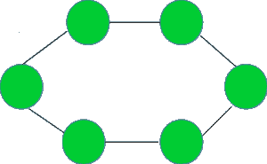

# 检查给定的图是否表示环形拓扑

> 原文:[https://www . geeksforgeeks . org/check-如果给定的图表示环拓扑/](https://www.geeksforgeeks.org/check-if-the-given-graph-represents-a-ring-topology/)

给定一个图 **G** ，任务是检查它是否表示环形拓扑。
下图所示为环形拓扑:


**示例:**

```
Input :  Graph =
```



```
Output : YES

Input : Graph =
```


```
Output : NO
```

如果满足以下三个条件，则 V 顶点图表示环形拓扑:

1.  顶点数> = 3。
2.  所有顶点都应该有度数 **2** 。
3.  边数=顶点数。

思路是遍历图，检查是否满足以上三个条件。如果是，则表示环形拓扑，否则不表示。

下面是上述方法的实现:

## C++

```
// C++ program to check if the given graph
// represents a Ring topology

#include <bits/stdc++.h>
using namespace std;

// A utility function to add an edge in an
// undirected graph.
void addEdge(vector<int> adj[], int u, int v)
{
    adj[u].push_back(v);
    adj[v].push_back(u);
}

// A utility function to print the adjacency list
// representation of graph
void printGraph(vector<int> adj[], int V)
{
    for (int v = 0; v < V; ++v) {
        cout << "\n Adjacency list of vertex "
             << v << "\n head ";
        for (auto x : adj[v])
            cout << "-> " << x;
        printf("\n");
    }
}

/* Function to return true if the graph represented
   by the adjacency list represents a Ring topology
   else return false */
bool checkRingTopologyUtil(vector<int> adj[], int V, int E)
{
    // Number of edges should be equal
    // to Number of vertices
    if (E != V)
        return false;

    // For a graph to represent a ring topology should have
    // greater than 2 nodes
    if (V <= 2)
        return false;

    int* vertexDegree = new int[V + 1];
    memset(vertexDegree, 0, sizeof vertexDegree);

    // calculate the degree of each vertex
    for (int i = 1; i <= V; i++) {
        for (auto v : adj[i]) {
            vertexDegree[v]++;
        }
    }

    // countDegree2 stores the count of
    // the vertices having degree 2
    int countDegree2 = 0;

    for (int i = 1; i <= V; i++) {
        if (vertexDegree[i] == 2) {
            countDegree2++;
        }
    }

    // if all three necessary conditions as discussed,
    // satisfy return true
    if (countDegree2 == V) {
        return true;
    }
    else {
        return false;
    }
}

// Function to check if the graph represents a Ring topology
void checkRingTopology(vector<int> adj[], int V, int E)
{
    bool isRing = checkRingTopologyUtil(adj, V, E);
    if (isRing) {
        cout << "YES" << endl;
    }
    else {
        cout << "NO" << endl;
    }
}

// Driver code
int main()
{
    // Graph 1
    int V = 6, E = 6;
    vector<int> adj1[V + 1];
    addEdge(adj1, 1, 2);
    addEdge(adj1, 2, 3);
    addEdge(adj1, 3, 4);
    addEdge(adj1, 4, 5);
    addEdge(adj1, 6, 1);
    addEdge(adj1, 5, 6);
    checkRingTopology(adj1, V, E);

    // Graph 2
    V = 5, E = 4;
    vector<int> adj2[V + 1];
    addEdge(adj2, 1, 2);
    addEdge(adj2, 1, 3);
    addEdge(adj2, 3, 4);
    addEdge(adj2, 4, 5);
    checkRingTopology(adj2, V, E);

    return 0;
}
```

## Java 语言(一种计算机语言，尤用于创建网站)

```
// Java program to check if the given graph
// represents a Ring topology
import java.util.*;

class GFG{

// A utility function to add an edge in an
// undirected graph.
static void addEdge(Vector<Integer> adj[],
                    int u, int v)
{
    adj[u].add(v);
    adj[v].add(u);
}

// A utility function to print the adjacency list
// representation of graph
static void printGraph(Vector<Integer> adj[], int V)
{
    for(int v = 0; v < V; ++v)
    {
        System.out.print("\n Adjacency list of vertex " +
                     v + "\n head ");
        for(int x : adj[v])
            System.out.print(". " +  x);

        System.out.printf("\n");
    }
}

// Function to return true if the graph represented
// by the adjacency list represents a Ring topology
// else return false
static boolean checkRingTopologyUtil(Vector<Integer> adj[],
                                     int V, int E)
{

    // Number of edges should be equal
    // to Number of vertices
    if (E != V)
        return false;

    // For a graph to represent a ring
    // topology should have greater
    // than 2 nodes
    if (V <= 2)
        return false;

    int[] vertexDegree = new int[V + 1];

    // Calculate the degree of each vertex
    for(int i = 1; i <= V; i++)
    {
        for(int v : adj[i])
        {
            vertexDegree[v]++;
        }
    }

    // countDegree2 stores the count of
    // the vertices having degree 2
    int countDegree2 = 0;

    for(int i = 1; i <= V; i++)
    {
        if (vertexDegree[i] == 2)
        {
            countDegree2++;
        }
    }

    // If all three necessary conditions
    // as discussed, satisfy return true
    if (countDegree2 == V)
    {
        return true;
    }
    else
    {
        return false;
    }
}

// Function to check if the graph represents
// a Ring topology
static void checkRingTopology(Vector<Integer> adj[],
                              int V, int E)
{
    boolean isRing = checkRingTopologyUtil(adj, V, E);
    if (isRing)
    {
        System.out.print("YES" + "\n");
    }
    else
    {
        System.out.print("NO" + "\n");
    }
}

// Driver code
public static void main(String[] args)
{

    // Graph 1
    int V = 6, E = 6;

    @SuppressWarnings("unchecked")
    Vector<Integer> []adj1 = new Vector[V + 1];
    for(int i = 0; i < adj1.length; i++)
        adj1[i] = new Vector<Integer>();

    addEdge(adj1, 1, 2);
    addEdge(adj1, 2, 3);
    addEdge(adj1, 3, 4);
    addEdge(adj1, 4, 5);
    addEdge(adj1, 6, 1);
    addEdge(adj1, 5, 6);

    checkRingTopology(adj1, V, E);

    // Graph 2
    V = 5; E = 4;

    @SuppressWarnings("unchecked")
    Vector<Integer> []adj2 = new Vector[V + 1];
    for(int i = 0; i < adj2.length; i++)
        adj2[i] = new Vector<Integer>();

    addEdge(adj2, 1, 2);
    addEdge(adj2, 1, 3);
    addEdge(adj2, 3, 4);
    addEdge(adj2, 4, 5);

    checkRingTopology(adj2, V, E);
}
}

// This code is contributed by Amit Katiyar
```

## 蟒蛇 3

```
# Python3 program to check if the given graph
# represents a star topology

# A utility function to add an edge in an
# undirected graph.

def addEdge(adj, u, v):
    adj[u].append(v)
    adj[v].append(u)

# A utility function to print the adjacency list
# representation of graph
def printGraph(adj, V):

    for v in range(V):
        print("Adjacency list of vertex ",v,"\n head ")
        for x in adj[v]:
            print("-> ",x,end=" ")
        printf()

# /* Function to return true if the graph represented
#    by the adjacency list represents a ring topology
#    else return false */
def checkRingTopologyUtil(adj, V, E):

    # Number of edges should be equal
    # to (Number of vertices - 1)
    if (E != (V)):
        return False

    # For a graph to represent a ring topology should have
    # greater than 2 nodes
    if (V <= 2):
        return False

    vertexDegree = [0]*(V + 1)

    # calculate the degree of each vertex
    for i in range(V+1):
        for v in adj[i]:
            vertexDegree[v] += 1

    # countDegree2 stores the count of
    # the vertices having degree 2
    countDegree2 = 0

    for i in range(1, V + 1):
        if (vertexDegree[i] == 2):
            countDegree2 += 1

    # if all three necessary conditions as discussed,
    # satisfy return true
    if (countDegree2 == V):
        return True
    else:
        return False

# Function to check if the graph represents a ring topology
def checkRingTopology(adj, V, E):

    isRing = checkRingTopologyUtil(adj, V, E)
    if (isRing):
        print("YES")

    else:
        print("NO" )

# Driver code

# Graph 1
V,E = 6,6
adj1 = [[] for i in range(V + 1)]
addEdge(adj1, 1, 2)
addEdge(adj1, 2, 3)
addEdge(adj1, 3, 4)
addEdge(adj1, 4, 5)
addEdge(adj1, 6, 1)
addEdge(adj1, 5, 6)
checkRingTopology(adj1, V, E)

# Graph 2
V,E = 5,4
adj2 = [[] for i in range(V + 1)]
addEdge(adj2, 1, 2)
addEdge(adj2, 1, 3)
addEdge(adj2, 3, 4)
addEdge(adj2, 4, 2)
checkRingTopology(adj2, V, E)

# This code is contributed by mohit kumar 29
```

## C#

```
// C# program to check if the given graph
// represents a Ring topology
using System;
using System.Collections.Generic;
class GFG
{

    // A utility function to add an edge in an
    // undirected graph.
    static void addEdge(List<List<int>> adj, int u, int v )
    {
        adj[u].Add(v);
        adj[v].Add(u);
    }

    // A utility function to print the adjacency list
    // representation of graph
    static void printGraph(List<List<int>> adj, int V)
    {
        for(int v = 0; v < V; ++v)
        {
            Console.Write("\n Adjacency list of vertex " + v + "\n head ");
            foreach(int x in adj[v])
            {
                Console.Write(". " +  x);
            }
            Console.WriteLine();
        }
    }

    // Function to return true if the graph represented
    // by the adjacency list represents a Ring topology
    // else return false   
    static bool checkRingTopologyUtil(List<List<int>> adj, int V, int E)
    {

        // Number of edges should be equal
        // to Number of vertices
        if (E != V)
            return false;

        // For a graph to represent a ring
        // topology should have greater
        // than 2 nodes
        if (V <= 2)
            return false;
        int[] vertexDegree = new int[V + 1];

        // Calculate the degree of each vertex
        for(int i = 1; i <= V; i++)
        {
            foreach(int v in adj[i])
            {
                vertexDegree[v]++;
            }
        }

        // countDegree2 stores the count of
        // the vertices having degree 2
        int countDegree2 = 0;

        for(int i = 1; i <= V; i++)
        {
            if (vertexDegree[i] == 2)
            {
                countDegree2++;
            }
        }

        // If all three necessary conditions
        // as discussed, satisfy return true
        if (countDegree2 == V)
        {
            return true;
        }
        else
        {
            return false;
        }
    }

    // Function to check if the graph represents
    // a Ring topology
    static void checkRingTopology(List<List<int>> adj, int V, int E)
    {
        bool isRing = checkRingTopologyUtil(adj, V, E);
        if (isRing)
        {
            Console.Write("YES" + "\n");
        }
        else
        {
            Console.Write("NO" + "\n");
        }
    }

    // Driver code
    static public void Main ()
    {

        // Graph 1
        int V = 6, E = 6;
        List<List<int>> adj1 = new List<List<int>>();
        for(int i = 0; i < V + 1; i++)
        {
            adj1.Add(new List<int>() );
        }
        addEdge(adj1, 1, 2);
        addEdge(adj1, 2, 3);
        addEdge(adj1, 3, 4);
        addEdge(adj1, 4, 5);
        addEdge(adj1, 6, 1);
        addEdge(adj1, 5, 6);

        checkRingTopology(adj1, V, E);

        // Graph 2
        V = 6;
        E = 6;
        List<List<int>> adj2 = new List<List<int>>();
        for(int i = 0; i < V + 1; i++)
        {
            adj2.Add(new List<int>() );
        }
        addEdge(adj2, 1, 2);
        addEdge(adj2, 1, 3);
        addEdge(adj2, 3, 4);
        addEdge(adj2, 4, 5);

        checkRingTopology(adj2, V, E);
    }
}

// This code is contributed by avanitrachhadiya2155
```

## java 描述语言

```
<script>

// JavaScript program to check if the given graph
// represents a Ring topology

 // A utility function to add an edge in an
  // undirected graph.
function addEdge(adj,u,v)
{
    adj[u].push(v);
    adj[v].push(u);
}

 // A utility function to print the adjacency list
  // representation of graph
function printGraph(adj,V)
{
    for (let v = 0; v < V; ++v)
    {
      document.write("\n Adjacency list of vertex " +
      v + "\n head ");
      for (let x=0;x<adj[v].length;x++)
      {
        document.write( "-> " + adj[v][x]);
      }
      document.write("<br>");
    }
}

/* Function to return true if the graph represented
    by the adjacency list represents a Ring topology
    else return false */
function checkRingTopologyUtil(adj,V,E)
{
    // Number of edges should be equal
    // to (Number of vertices - 1)
    if (E != V)
    {
      return false;
    }

    // a single node is termed as a bus topology
    if (V <= 2)
    {
      return false;
    }
    let vertexDegree = new Array(V + 1);
     for(let i=0;i<vertexDegree.length;i++)
    {
        vertexDegree[i]=0;
    }
    // calculate the degree of each vertex
    for (let i = 1; i <= V; i++)
    {
      for (let v=0;v<adj[i].length;v++)
      {
        vertexDegree[adj[i][v]]++;
      }
    }

    // countDegree2 stores the count of
    // the vertices having degree 2
    let countDegree2 = 0;

    for (let i = 1; i <= V; i++)
    {
      if (vertexDegree[i] == 2)
      {
        countDegree2++;
      }

    }

    // If all three necessary conditions
    // as discussed, satisfy return true
    if (countDegree2 == V)
    {
        return true;
    }
    else
    {
        return false;
    }

}

// Function to check if the graph represents a Ring topology
function checkRingTopology(adj,V,E)
{
    let isRing = checkRingTopologyUtil(adj, V, E);
    if (isRing)
    {
      document.write("YES<br>");
    }
    else
    {
      document.write("NO<br>");
    }
}

// Driver code

// Graph 1
    let V = 6, E = 6;
    let adj1=[];
    for(let i = 0; i < V + 1; i++)
    {
      adj1.push([]);
    }
    addEdge(adj1, 1, 2);
    addEdge(adj1, 2, 3);
    addEdge(adj1, 3, 4);
    addEdge(adj1, 4, 5);
    addEdge(adj1, 6, 1);
    addEdge(adj1, 5, 6);

    checkRingTopology(adj1, V, E);

    // Graph 2
    V = 5;
    E = 4;
    let adj2 = [];
    for(let i = 0; i < (V + 1); i++)
    {
      adj2.push([]);
    }
    addEdge(adj2, 1, 2);
    addEdge(adj2, 1, 3);
    addEdge(adj2, 3, 4);
    addEdge(adj2, 4, 2);
    checkRingTopology(adj2, V, E);

// This code is contributed by patel2127

</script>
```

**Output:** 

```
YES
NO
```

**时间复杂度** : O(V + E)，其中 V 和 E 分别是图中的顶点数和边数。
**辅助空间** : O(V + E)。