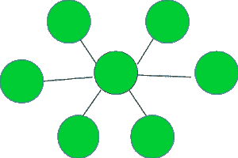

# 检查给定的图形是否代表星形拓扑

> 原文:[https://www . geeksforgeeks . org/check-如果给定的图形代表星形拓扑/](https://www.geeksforgeeks.org/check-if-the-given-graph-represents-a-star-topology/)

给定一个图形 **G** ，任务是检查它是否代表星形拓扑。
星形拓扑如下图所示:


**示例:**

```
Input : Graph = 
```



```
 Output : YES

Input : Graph =
```


```
Output : NO
```

如果 V 顶点的图形满足以下三个条件，则表示星形拓扑:

1.  一个节点(也称为中心节点)的度数为 V–1。
2.  除中心节点外，所有节点都具有 1 级。
3.  边数=顶点数–1。

思路是遍历图，检查是否满足以上三个条件。如果是，则表示星形拓扑。

下面是上述方法的实现:

## C++

```
// CPP program to check if the given graph
// represents a Star Topology
#include <bits/stdc++.h>

using namespace std;

// A utility function to add an edge in an
// undirected graph.
void addEdge(vector<int> adj[], int u, int v)
{
    adj[u].push_back(v);
    adj[v].push_back(u);
}

// A utility function to print the adjacency list
// representation of graph
void printGraph(vector<int> adj[], int V)
{
    for (int v = 0; v < V; ++v) {
        cout << "\n Adjacency list of vertex "
             << v << "\n head ";
        for (auto x : adj[v])
            cout << "-> " << x;
        printf("\n");
    }
}

/* Function to return true if the graph represented
   by the adjacency list represents a Star topology
   else return false */
bool checkStarTopologyUtil(vector<int> adj[], int V, int E)
{

    // Number of edges should be equal
    // to (Number of vertices - 1)
    if (E != (V - 1))
        return false;

    // a single node is termed as a star topology
    // having only a central node
    if (V == 1)
        return true;

    int* vertexDegree = new int[V + 1];
    memset(vertexDegree, 0, sizeof vertexDegree);

    // calculate the degree of each vertex
    for (int i = 1; i <= V; i++) {
        for (auto v : adj[i]) {
            vertexDegree[v]++;
        }
    }

    // countCentralNodes stores the count of nodes
    // with degree V - 1, which should be equal to 1
    // in case of star topology
    int countCentralNodes = 0, centralNode = 0;

    for (int i = 1; i <= V; i++) {
        if (vertexDegree[i] == (V - 1)) {
            countCentralNodes++;
            // Store the index of the central node
            centralNode = i;
        }
    }

    // there should be only one central node
    // in the star topology
    if (countCentralNodes != 1)
        return false;

    for (int i = 1; i <= V; i++) {
        // except for the central node
        // check if all other nodes have
        // degree 1, if not return false
        if (i == centralNode)
            continue;
        if (vertexDegree[i] != 1) {
            return false;
        }
    }

    // if all three necessary
    // conditions as discussed,
    // satisfy return true
    return true;
}

// Function to check if the graph
// represents a Star topology
void checkStarTopology(vector<int> adj[], int V, int E)
{
    bool isStar = checkStarTopologyUtil(adj, V, E);
    if (isStar) {
        cout << "YES" << endl;
    }
    else {
        cout << "NO" << endl;
    }
}

// Driver code
int main()
{
    // Graph 1
    int V = 5, E = 4;
    vector<int> adj1[V + 1];
    addEdge(adj1, 1, 2);
    addEdge(adj1, 1, 3);
    addEdge(adj1, 1, 4);
    addEdge(adj1, 1, 5);
    checkStarTopology(adj1, V, E);

    // Graph 2
    V = 5, E = 4;
    vector<int> adj2[V + 1];
    addEdge(adj2, 1, 2);
    addEdge(adj2, 1, 3);
    addEdge(adj2, 3, 4);
    addEdge(adj2, 4, 5);
    checkStarTopology(adj2, V, E);

    return 0;
}
```

## Java 语言(一种计算机语言，尤用于创建网站)

```
// Java program to check if the given graph
// represents a star topology
import java.io.*;
import java.util.*;

class GFG
{

  // A utility function to add an edge in an
  // undirected graph.
  static void addEdge(ArrayList<ArrayList<Integer>> adj, int u, int v)
  {
    adj.get(u).add(v);
    adj.get(v).add(u);
  }

  // A utility function to print the adjacency list
  // representation of graph
  static void printGraph(ArrayList<ArrayList<Integer>> adj, int V)
  {
    for (int v = 0; v < V; ++v)
    {
      System.out.print("\n Adjacency list of vertex " +
                       v + "\n head ");
      for (int x : adj.get(v))
      {
        System.out.print( "-> " + x);
      }
      System.out.println();
    }
  }

  /* Function to return true if the graph represented
    by the adjacency list represents a Star topology
    else return false */
  static boolean checkStarTopologyUtil(ArrayList<ArrayList<Integer>> adj, int V, int E)
  {
    // Number of edges should be equal
    // to (Number of vertices - 1)
    if (E != (V - 1))
    {
      return false;
    }

    // a single node is termed as a star topology
    // having only a central node
    if (V == 1)
    {
      return true;
    }
    int[] vertexDegree = new int[V + 1];

    // calculate the degree of each vertex
    for (int i = 1; i <= V; i++)
    {
      for (int v : adj.get(i))
      {
        vertexDegree[v]++;
      }
    }

    // countCentralNodes stores the count of nodes 
    // with degree V - 1, which should be equal to 1
    // in case of star topology
    int countCentralNodes = 0, centralNode = 0;    
    for (int i = 1; i <= V; i++)
    {
      if (vertexDegree[i] == (V - 1))
      {
        countCentralNodes++;

        // Store the index of the central node
        centralNode = i;
      }
    }

    // there should be only one central node
    // in the star topology
    if (countCentralNodes != 1)
      return false;  
    for (int i = 1; i <= V; i++)
    {

      // except for the central node 
      // check if all other nodes have
      // degree 1, if not return false
      if (i == centralNode)
        continue;
      if (vertexDegree[i] != 1)
      {
        return false;
      }
    }

    // if all three necessary
    // conditions as discussed,
    // satisfy return true
    return true;
  }

  // Function to check if the graph 
  // represents a Star topology
  static void checkStarTopology(ArrayList<ArrayList<Integer>> adj, int V, int E)
  {
    boolean isStar = checkStarTopologyUtil(adj, V, E);
    if (isStar)
    {
      System.out.println("YES");
    }
    else
    {
      System.out.println("NO");
    }
  }

  // Driver code
  public static void main (String[] args)
  {

    // Graph 1
    int V = 5, E = 4;
    ArrayList<ArrayList<Integer>> adj1 =
      new ArrayList<ArrayList<Integer>>();
    for(int i = 0; i < V + 1; i++)
    {
      adj1.add(new ArrayList<Integer>());
    }
    addEdge(adj1, 1, 2);
    addEdge(adj1, 1, 3);
    addEdge(adj1, 1, 4);
    addEdge(adj1, 1, 5);
    checkStarTopology(adj1, V, E);

    // Graph 2
    V = 5;
    E = 4;
    ArrayList<ArrayList<Integer>> adj2 =
      new ArrayList<ArrayList<Integer>>();
    for(int i = 0; i < (V + 1); i++)
    {
      adj2.add(new ArrayList<Integer>());
    }
    addEdge(adj2, 1, 2);
    addEdge(adj2, 1, 3);
    addEdge(adj2, 3, 4);
    addEdge(adj2, 4, 5);
    checkStarTopology(adj2, V, E);
  }
}

// This code is contributed by rag2127
```

## 蟒蛇 3

```
# Python3 program to check if the given graph
# represents a star topology

# A utility function to add an edge in an
# undirected graph.
def addEdge(adj, u, v):
    adj[u].append(v)
    adj[v].append(u)

# A utility function to print the adjacency list
# representation of graph
def printGraph(adj, V):

    for v in range(V):
        print("Adjacency list of vertex ",v,"\n head ")
        for x in adj[v]:
            print("-> ",x,end=" ")
        printf()

# /* Function to return true if the graph represented
#    by the adjacency list represents a star topology
#    else return false */
def checkStarTopologyUtil(adj, V, E):

    # Number of edges should be equal
    # to (Number of vertices - 1)
    if (E != (V - 1)):
        return False

    # a single node is termed as a bus topology
    if (V == 1):
        return True

    vertexDegree = [0]*(V + 1)

    # calculate the degree of each vertex
    for i in range(V+1):
        for v in adj[i]:
            vertexDegree[v] += 1

    # countCentralNodes stores the count of nodes
    # with degree V - 1, which should be equal to 1
    # in case of star topology
    countCentralNodes = 0
    centralNode = 0

    for i in range(1, V + 1):
        if (vertexDegree[i] == (V - 1)):
            countCentralNodes += 1
            # Store the index of the central node
            centralNode = i

    # there should be only one central node
    # in the star topology
    if (countCentralNodes != 1):
        return False

    for i in range(1, V + 1):
        # except for the central node
        # check if all other nodes have
        # degree 1, if not return false
        if (i == centralNode):
            continue
        if (vertexDegree[i] != 1):
            return False

    # if all three necessary
    # conditions as discussed,
    # satisfy return true
    return True

# Function to check if the graph represents a bus topology
def checkStarTopology(adj, V, E):

    isStar = checkStarTopologyUtil(adj, V, E)
    if (isStar):
        print("YES")

    else:
        print("NO" )

# Driver code

# Graph 1
V, E = 5, 4
adj1=[[] for i in range(V + 1)]
addEdge(adj1, 1, 2)
addEdge(adj1, 1, 3)
addEdge(adj1, 1, 4)
addEdge(adj1, 1, 5)
checkStarTopology(adj1, V, E)

# Graph 2
V, E = 4, 4
adj2=[[] for i in range(V + 1)]
addEdge(adj2, 1, 2)
addEdge(adj2, 1, 3)
addEdge(adj2, 3, 4)
addEdge(adj2, 4, 2)
checkStarTopology(adj2, V, E)

# This code is contributed by mohit kumar 29
```

## C#

```
// C# program to check if the given graph
// represents a star topology
using System;
using System.Collections.Generic;
class GFG
{

  // A utility function to add an edge in an
  // undirected graph.
  static void addEdge(List<List<int>> adj, int u, int v)
  {
    adj[u].Add(v);
    adj[v].Add(u);
  }

  // A utility function to print the adjacency list
  // representation of graph
  static void printGraph(List<List<int>> adj, int V)
  {
    for (int v = 0; v < V; ++v)
    {
      Console.WriteLine("\n Adjacency list of vertex " + v + "\n head ");
      foreach (int x in adj[v])
      {
        Console.Write( "-> " + x);
      }
      Console.WriteLine();
    }
  }

  /* Function to return true if the graph represented
    by the adjacency list represents a Star topology
    else return false */
  static bool checkStarTopologyUtil(List<List<int>> adj, int V, int E)
  {
    // Number of edges should be equal
    // to (Number of vertices - 1)
    if (E != (V - 1))
    {
      return false;
    }

    // a single node is termed as a bus topology
    if (V == 1)
    {
      return true;
    }
    int[] vertexDegree = new int[V + 1];

    // calculate the degree of each vertex
    for (int i = 1; i <= V; i++)
    {
      foreach (int v in adj[i])
      {
        vertexDegree[v]++;
      }
    }

    // countCentralNodes stores the count of nodes 
    // with degree V - 1, which should be equal to 1
    // in case of star topology
    int countCentralNodes = 0, centralNode = 0;    
    for (int i = 1; i <= V; i++)
    {
      if (vertexDegree[i] == (V - 1))
      {
        countCentralNodes++;

        // Store the index of the central node
        centralNode = i;
      }
    }

    // there should be only one central node
    // in the star topology
    if (countCentralNodes != 1)
      return false;  
    for (int i = 1; i <= V; i++)
    {

      // except for the central node 
      // check if all other nodes have
      // degree 1, if not return false
      if (i == centralNode)
        continue;
      if (vertexDegree[i] != 1)
      {
        return false;
      }
    }

    // if all three necessary
    // conditions as discussed,
    // satisfy return true
    return true;
  }

  // Function to check if the graph 
  // represents a Star topology
  static void checkStarTopology(List<List<int>> adj, int V, int E)
  {
    bool isStar = checkStarTopologyUtil(adj, V, E);
    if (isStar)
    {
      Console.WriteLine("YES");
    }
    else
    {
      Console.WriteLine("NO");
    }
  }

  // Driver code
  static public void Main ()
  {

    // Graph 1
    int V = 5, E = 4;
    List<List<int>> adj1 = new List<List<int>>();
    for(int i = 0; i < V + 1; i++)
    {
      adj1.Add(new List<int>());
    }
    addEdge(adj1, 1, 2);
    addEdge(adj1, 1, 3);
    addEdge(adj1, 1, 4);
    addEdge(adj1, 1, 5);
    checkStarTopology(adj1, V, E);

    // Graph 2
    V = 5;
    E = 4;
    List<List<int>> adj2 = new List<List<int>>();
    for(int i = 0; i < V + 1; i++)
    {
      adj2.Add(new List<int>());
    }
    addEdge(adj2, 1, 2);
    addEdge(adj2, 1, 3);
    addEdge(adj2, 3, 4);
    addEdge(adj2, 4, 4);
    checkStarTopology(adj2, V, E);
  }
}

// This code is contributed by avanitrachhadiya2155
```

## java 描述语言

```
<script>

// JavaScript program to check if the given graph
// represents a star topology

 // A utility function to add an edge in an
  // undirected graph.
function addEdge(adj,u,v)
{
    adj[u].push(v);
    adj[v].push(u);
}

 // A utility function to print the adjacency list
  // representation of graph
function printGraph(adj,V)
{
    for (let v = 0; v < V; ++v)
    {
      document.write("\n Adjacency list of vertex " +
      v + "\n head ");
      for (let x=0;x<adj[v].length;x++)
      {
        document.write( "-> " + adj[v][x]);
      }
      document.write("<br>");
    }
}

/* Function to return true if the graph represented
    by the adjacency list represents a star topology
    else return false */
function checkStarTopologyUtil(adj,V,E)
{
    // Number of edges should be equal
    // to (Number of vertices - 1)
    if (E != (V - 1))
    {
      return false;
    }

    // a single node is termed as a bus topology
    if (V == 1)
    {
      return true;
    }
    let vertexDegree = new Array(V + 1);
     for(let i=0;i<vertexDegree.length;i++)
    {
        vertexDegree[i]=0;
    }
    // calculate the degree of each vertex
    for (let i = 1; i <= V; i++)
    {
      for (let v=0;v<adj[i].length;v++)
      {
        vertexDegree[adj[i][v]]++;
      }
    }

    // countCentralNodes stores the count of nodes
    // with degree V - 1, which should be equal to 1
    // in case of star topology
    let countCentralNodes = 0, centralNode = 0; 

    for (let i = 1; i <= V; i++)
    {
      if (vertexDegree[i] == (V - 1))
      {
        countCentralNodes++;

        // Store the index of the central node
        centralNode = i;
      }

    }

    // there should be only one central node
    // in the star topology
    if (countCentralNodes != 1)
      return false; 
    for (let i = 1; i <= V; i++)
    {

      // except for the central node
      // check if all other nodes have
      // degree 1, if not return false
      if (i == centralNode)
        continue;
      if (vertexDegree[i] != 1)
      {
        return false;
      }
    }

    // if all three necessary
    // conditions as discussed,
    // satisfy return true
    return true;
}

// Function to check if the graph represents a star topology
function checkStarTopology(adj,V,E)
{
    let isStar = checkStarTopologyUtil(adj, V, E);
    if (isStar)
    {
      document.write("YES<br>");
    }
    else
    {
      document.write("NO<br>");
    }
}

// Driver code

// Graph 1
    let V = 5, E = 4;
    let adj1=[];
    for(let i = 0; i < V + 1; i++)
    {
      adj1.push([]);
    }
    addEdge(adj1, 1, 2);
    addEdge(adj1, 1, 3);
    addEdge(adj1, 1, 4);
    addEdge(adj1, 1, 5);
    checkStarTopology(adj1, V, E);

    // Graph 2
    V = 5;
    E = 4;
    let adj2 = [];
    for(let i = 0; i < (V + 1); i++)
    {
      adj2.push([]);
    }
    addEdge(adj2, 1, 2);
    addEdge(adj2, 1, 3);
    addEdge(adj2, 3, 4);
    addEdge(adj2, 4, 2);
    checkStarTopology(adj2, V, E);

// This code is contributed by patel2127

</script>
```

**Output:** 

```
YES
NO
```

**时间复杂度:** O(V + E)，其中 V 和 E 分别是图中的顶点数和边数。