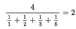
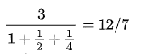

# 检查给定号码是否为矿石号

> 原文:[https://www . geesforgeks . org/check-如果给定的数字是或不是数字/](https://www.geeksforgeeks.org/check-if-the-given-number-is-ore-number-or-not/)

给定一个正整数 n，检查它是否是一个 Ore 数。如果 *n* 是矿石编号，则打印“是”，否则打印“否”。
[**矿石号**](https://en.wikipedia.org/wiki/Harmonic_divisor_number) **:** 在数学中，矿石号是正整数，其除数具有整数调和值。Ore 数通常被称为调和除数。矿石编号以“矿石”命名。
例如，6 有四个除数，即 1、2、3 和 6。
除数的调和平均值为-



6 的除数的调和平均数是 2，一个整数。所以，6 是一个 Ore 数或调和除数。
首先，少数矿石数或调和除数为:

> 1、6、28、140、270、496、672、1638、2970、6200、8128、8190

**示例** :

```
Input : N = 6
Output : Yes

Input : N = 4
Output: No
Explanation : Harmonic mean of divisors of 4 
              is not an Integer. 
```



**先决条件:**

*   [调和平均值](https://www.geeksforgeeks.org/program-harmonic-mean-numbers/)
*   [如何生成一个数的所有除数](https://www.geeksforgeeks.org/find-divisors-natural-number-set-1/)

其思想是生成给定数的所有除数，然后检查除数的调和平均数是否为整数。

1.  生成给定数字的所有除数–' n '
2.  计算 n 的除数的调和平均数
3.  检查调和平均值是否为整数
4.  如果是，则该号码是矿石号码，否则不是

以下是上述方法的实现:

## C++

```
// CPP program to check if the given number is
// Ore number

#include <bits/stdc++.h>
using namespace std;

vector<int> arr;

// Function that returns harmonic mean
void generateDivisors(int n)
{
    // Note that this loop runs till square root
    for (int i = 1; i <= sqrt(n); i++) {
        if (n % i == 0) {

            // If divisors are equal, store 'i'
            if (n / i == i)
                arr.push_back(i);

            else // Otherwise store 'i' and 'n/i' both
            {
                arr.push_back(i);
                arr.push_back(n / i);
            }
        }
    }
}

// Utility function to calculate harmonic
// mean of the divisors
double harmonicMean(int n)
{
    generateDivisors(n);

    // Declare sum variables and initialize
    // with zero.

    double sum = 0.0;

    int len = arr.size();

    // calculate denominator
    for (int i = 0; i < len; i++)
        sum = sum + double(n / arr[i]);

    sum = double(sum / n);

    // Calculate harmonic mean and return

    return double(arr.size() / sum);
}

// Function to check if a number is ore number
bool isOreNumber(int n)
{
    // Calculate Harmonic mean of divisors of n
    double mean = harmonicMean(n);

    // Check if harmonic mean is an integer or not
    if (mean - int(mean) == 0)
        return true;
    else
        return false;
}

// Driver Code
int main()
{
    int n = 28;

    if (isOreNumber(n))
        cout << "YES";
    else
        cout << "NO";

    return 0;
}
```

## Java 语言(一种计算机语言，尤用于创建网站)

```
// Java program to check if the given
// number is Ore number

import java.util.*;
class GFG {

    static Vector<Integer> arr = new Vector<Integer>();

    // Function that returns harmonic mean.
    static void generateDivisors(int n)
    {
        // Note that this loop runs till square root
        for (int i = 1; i <= Math.sqrt(n); i++) {
            if (n % i == 0) {

                // If divisors are equal, store 'i'
                if (n / i == i)
                    arr.add(i);

                else // Otherwise store 'i' and 'n/i' both
                {
                    arr.add(i);
                    arr.add(n / i);
                }
            }
        }
    }

    // Utility function to calculate harmonic mean
    // of the divisors
    static double harmonicMean(int n)
    {
        generateDivisors(n);

        // Declare sum variables and initialize
        // with zero.

        double sum = 0.0;

        int len = arr.size();

        // calculate denominator
        for (int i = 0; i < len; i++)
            sum = sum + n / arr.get(i);

        sum = sum / n;

        // Calculate harmonic mean and return

        return arr.size() / sum;
    }

    // Function to check if a number
    // is Ore number
    static boolean isOreNumber(int n)
    {
        // Calculate Harmonic mean of divisors of n
        double mean = harmonicMean(n);

        // Check if Harmonic mean is an Integer or not
        if (mean - Math.floor(mean) == 0)
            return true;
        else
            return false;
    }

    // Driver Code
    public static void main(String[] args)
    {
        int n = 28;

        if (isOreNumber(n))
            System.out.println("YES");
        else
            System.out.println("NO");
    }
}
```

## 蟒蛇 3

```
# Python3 program to check if the
# given number is Ore number
arr = []

# Function that returns harmonic mean
def generateDivisors(n):

    # Note that this loop runs till square root
    for i in range(1, int(n**(0.5)) + 1):
        if n % i == 0:

            # If divisors are equal, store 'i'
            if n // i == i:
                arr.append(i)

            # Otherwise store 'i' and 'n/i' both
            else:
                arr.append(i)
                arr.append(n // i)

# Utility function to calculate harmonic
# mean of the divisors
def harmonicMean(n):

    generateDivisors(n)

    # Declare sum variables and initialize
    # with zero.
    Sum = 0
    length = len(arr)

    # calculate denominator
    for i in range(0, length):
        Sum = Sum + (n / arr[i])

    Sum = Sum / n

    # Calculate harmonic mean and return
    return length / Sum

# Function to check if a number
# is ore number
def isOreNumber(n):

    # Calculate Harmonic mean of
    # divisors of n
    mean = harmonicMean(n)

    # Check if harmonic mean is an
    # integer or not
    if mean - int(mean) == 0:
        return True
    else:
        return False

# Driver Code
if __name__ == "__main__":

    n = 28

    if isOreNumber(n) == True:
        print("YES")
    else:
        print("NO")

# This code is contributed
# by Rituraj Jain
```

## C#

```
// C# program to check if the given
// number is Ore number
using System;
using System.Collections;

class GFG
{

static ArrayList arr = new ArrayList();

// Function that returns harmonic mean.
static void generateDivisors(int n)
{
    // Note that this loop runs
    // till square root
    for (int i = 1; i <= Math.Sqrt(n); i++)
    {
        if (n % i == 0)
        {

            // If divisors are equal,
            // store 'i'
            if (n / i == i)
                arr.Add(i);

            else // Otherwise store 'i'
                 // and 'n/i' both
            {
                arr.Add(i);
                arr.Add(n / i);
            }
        }
    }
}

// Utility function to calculate
// harmonic mean of the divisors
static double harmonicMean(int n)
{
    generateDivisors(n);

    // Declare sum variables and
    // initialize with zero.
    double sum = 0.0;

    int len = arr.Count;

    // calculate denominator
    for (int i = 0; i < len; i++)
        sum = sum + n / (int)arr[i];

    sum = sum / n;

    // Calculate harmonic mean
    // and return
    return arr.Count / sum;
}

// Function to check if a number
// is Ore number
static bool isOreNumber(int n)
{
    // Calculate Harmonic mean of
    // divisors of n
    double mean = harmonicMean(n);

    // Check if Harmonic mean is
    // an Integer or not
    if (mean - Math.Floor(mean) == 0)
        return true;
    else
        return false;
}

// Driver Code
public static void Main()
{
    int n = 28;

    if (isOreNumber(n))
        Console.WriteLine("YES");
    else
        Console.WriteLine("NO");
}
}

// This code is contributed by mits
```

## java 描述语言

```
<script>

// Javascript program to check
// if the given number is
// Ore number

var arr = [];

// Function that returns harmonic mean
function generateDivisors(n)
{
    // Note that this loop runs till square root
    for (var i = 1; i <= Math.sqrt(n); i++) {
        if (n % i == 0) {

            // If divisors are equal, store 'i'
            if (n / i == i)
                arr.push(i);

            else // Otherwise store 'i' and 'n/i' both
            {
                arr.push(i);
                arr.push(n / i);
            }
        }
    }
}

// Utility function to calculate harmonic
// mean of the divisors
function harmonicMean(n)
{
    generateDivisors(n);

    // Declare sum variables and initialize
    // with zero.

    var sum = 0.0;

    var len = arr.length;

    // calculate denominator
    for (var i = 0; i < len; i++)
        sum = sum + (n / arr[i]);

    sum = (sum / n);

    // Calculate harmonic mean and return

    return (arr.length / sum);
}

// Function to check if a number is ore number
function isOreNumber(n)
{
    // Calculate Harmonic mean of divisors of n
    var mean = harmonicMean(n);

    // Check if harmonic mean is an integer or not
    if (mean - parseInt(mean) == 0)
        return true;
    else
        return false;
}

// Driver Code
var n = 28;
if (isOreNumber(n))
    document.write( "YES");
else
    document.write( "NO");

</script>
```

**Output: **

```
YES
```