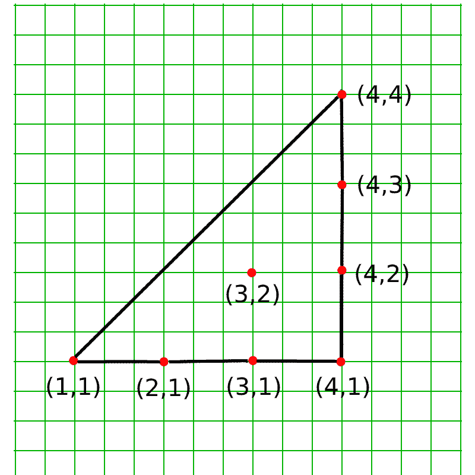

# 检查给定点是否位于凸多边形的给定点内

> 原文:[https://www . geesforgeks . org/检查给定点是否位于凸多边形的给定点内/](https://www.geeksforgeeks.org/check-if-the-given-point-lies-inside-given-n-points-of-a-convex-polygon/)

给定一个**凸多边形**的 **N** 点的坐标。任务是检查给定点 **(X，Y)** 是否位于多边形内。

**示例:**

> **输入:** N = 7，点:{(1，1)，(2，1)，(3，1)，(4，1)，(4，2)，(4，3)，(4，4)}，查询:X = 3，Y = 2
> 下图为给定点的标绘图像:
> [](https://media.geeksforgeeks.org/wp-content/uploads/20200620071239/New-Project.png) 
> 输出: YES
> 
> **输入:** N = 7，点数:{(1，1)，(2，1)，(3，1)，(4，1)，(4，2)，(4，3)，(4，4)}，查询:X = 3，Y = 9
> **输出:**否

**方法:**想法是使用[格雷厄姆扫描算法](https://www.geeksforgeeks.org/convex-hull-set-2-graham-scan/)来发现给定点是否位于凸多边形内。以下是一些观察结果:

*   假设点 **(X，Y)** 是凸多边形点集中的一个点。如果在这组点上使用**格拉汉姆扫描算法**，将获得另一组点，组成凸包。
*   如果点 **(X，Y)** 位于多边形内部，它不会位于凸包上，因此不会出现在新生成的凸包点集中。
*   如果点 **(X，Y)** 位于多边形之外，那么它将位于形成的凸包上，因此将出现在新生成的凸包点集中。

以下是解决问题的步骤:

1.  [按照横坐标值的递增顺序对给定点和查询点进行排序](https://www.geeksforgeeks.org/sorting-algorithms/)。如果任意两点的横坐标值(x 坐标)相同，则根据它们的纵坐标值对它们进行排序。
2.  将左下点设置为凸包的**起点**，右上点设置为凸包的**终点**。
3.  迭代所有的点，找出点，形成凸多边形，位于顺时针方向的起点和终点之间。将这些点存储在向量中。
4.  迭代所有的点，找出点，形成凸多边形，位于逆时针方向的起点和终点之间。将这些点存储在向量中。
5.  检查查询点是否存在于向量中，然后该点位于凸包之外。所以返回**“否”**。
6.  如果该点不存在于向量中，则该点位于凸包打印内**“是”**。

下面是基于上述方法的实现:

```
// C++ program for the above approach
#include <bits/stdc++.h>
using namespace std;

// Sorting Function to sort points
bool cmp(pair<int, int>& a,
         pair<int, int>& b)
{

    if (a.first == b.first)
        return a.second < b.second;
    return a.first < b.first;
}

// Function To Check Clockwise
// Orientation
int cw(pair<int, int>& a,
       pair<int, int>& b,
       pair<int, int>& c)
{

    int p = a.first * (b.second - c.second)
            + b.first * (c.second - a.second)
            + c.first * (a.second - b.second);

    return p < 0ll;
}

// Function To Check Counter
// Clockwise Orientation
int ccw(pair<int, int>& a,
        pair<int, int>& b,
        pair<int, int>& c)
{

    int p = a.first * (b.second - c.second)
            + b.first * (c.second - a.second)
            + c.first * (a.second - b.second);

    return p > 0ll;
}

// Graham Scan algorithm to find Convex
// Hull from given points
vector<pair<int, int> > convexHull(
    vector<pair<int, int> >& v)
{
    // Sort the points
    sort(v.begin(),
         v.end(), cmp);

    int n = v.size();
    if (n <= 3)
        return v;

    // Set starting and ending points as
    // left bottom and top right
    pair<int, int> p1 = v[0];
    pair<int, int> p2 = v[n - 1];

    // Vector to store points in
    // upper half and lower half
    vector<pair<int, int> > up, down;

    // Insert StartingEnding Points
    up.push_back(p1);
    down.push_back(p1);

    // Iterate over points
    for (int i = 1; i < n; i++) {

        if (i == n - 1 || !ccw(p1, v[i], p2)) {

            while (up.size() > 1
                   && ccw(up[up.size() - 2],
                          up[up.size() - 1],
                          v[i])) {

                // Exclude this point
                // if we can form better

                up.pop_back();
            }

            up.push_back(v[i]);
        }

        if (i == n - 1 || !cw(p1, v[i], p2)) {

            while (down.size() > 1
                   && cw(down[down.size() - 2],
                         down[down.size() - 1],
                         v[i])) {

                // Exclude this point
                // if we can form better
                down.pop_back();
            }
            down.push_back(v[i]);
        }
    }

    // Combine upper and  lower half
    for (int i = down.size() - 2;
         i > 0; i--)
        up.push_back(down[i]);

    // Remove duplicate points
    up.resize(unique(up.begin(),
                     up.end())
              - up.begin());

    // Return the points on Convex Hull
    return up;
}

// Function to find if point lies inside
// a convex polygon
bool isInside(vector<pair<int, int> > points,
              pair<int, int> query)
{
    // Include the query point in the
    // polygon points
    points.push_back(query);

    // Form a convex hull from the points
    points = convexHull(points);

    // Iterate over the points
    // of convex hull
    for (auto x : points) {

        // If the query point lies
        // on the convex hull
        // then it wasn't inside
        if (x == query)
            return false;
    }

    // Otherwise it was Inside
    return true;
}

// Driver Code
int main()
{

    // Points of the polygon
    // given in any order
    int n = 7;
    vector<pair<int, int> > points;

    points = { { 1, 1 }, { 2, 1 }, { 3, 1 },
               { 4, 1 }, { 4, 2 }, { 4, 3 },
               { 4, 4 } };

    // Query Points
    pair<int, int> query = { 3, 2 };

    // Check if its inside
    if (isInside(points, query)) {
        cout << "YES" << endl;
    }
    else {
        cout << "NO" << endl;
    }

    return 0;
}
```

**Output:**

```
YES

```

***时间复杂度:** O(N * log(N))
**辅助空间:** O(N)*