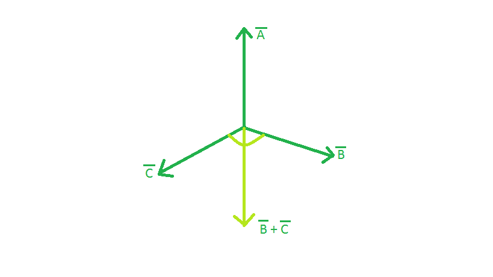

# 检查给定向量是否处于平衡状态

> 原文:[https://www . geeksforgeeks . org/check-如果给定向量处于平衡或不平衡状态/](https://www.geeksforgeeks.org/check-if-the-given-vectors-are-at-equilibrium-or-not/)

给定三个向量的 x、y 和 z 坐标，任务是检查它们是否处于平衡状态。
**例:**

> **输入:** x1 = -2，y1 = 1，z1 = 0，x2 = 5，y2 = 0，z2 = 5，x3 = -3，y3 = -1，z3 = -5
> **输出:**矢量处于平衡状态。
> **输入:** x1 = 2，y1 = -17，z1 = 0，x2 = 5，y2 = 1，z2 = -5，x3 = 4，y3 = 2，z3 = -4
> **输出:**矢量不均衡。

**当三个矢量处于平衡状态时**



**方法:**当三个向量的结果为空向量，即没有大小和方向时，这三个向量处于平衡状态。三个向量的合力等于向量的向量和。当，∑x = 0，∑y = 0，∑ z = 0 时，结果向量为 Null。因此，我们可以说，当所述条件满足时，矢量处于平衡状态，否则不处于平衡状态。

## C++

```
// CPP program to check the equilibrium of three vectors
#include <bits/stdc++.h>
using namespace std;

// Function to check the equilibrium of three vectors
bool checkEquilibrium(int x1, int y1, int z1, int x2, int y2,
                     int z2, int x3, int y3, int z3)
{

    // summing the x coordinates
    int resx = x1 + x2 + x3;

    // summing the y coordinates
    int resy = y1 + y2 + y3;

    // summing the z coordinates
    int resz = z1 + z2 + z3;

    // Checking the condition for equilibrium
    if (resx == 0 and resy == 0 and resz == 0)
        return true;
    else
        return false;
}

// Driver code
int main()
{
    int x1 = -2, y1 = -7, z1 = -9, x2 = 5, y2 = -14, z2 = 14,
        x3 = -3, y3 = 21, z3 = -5;

    // Checking for equilibrium
    if (checkEquilibrium(x1, y1, z1, x2, y2, z2, x3, y3, z3))
        cout << "The vectors are at equilibrium.";
    else
        cout << "The vectors are not at equilibrium.";

    return 0;
}
```

## Java 语言(一种计算机语言，尤用于创建网站)

```
// Java program to check the equilibrium of three vectors

public class GFG {

    // Function to check the equilibrium of three vectors
    static boolean checkEquilibrium(int x1, int y1, int z1, int x2, int y2,
                        int z2, int x3, int y3, int z3)
    {

        // summing the x coordinates
        int resx = x1 + x2 + x3;

        // summing the y coordinates
        int resy = y1 + y2 + y3;

        // summing the z coordinates
        int resz = z1 + z2 + z3;

        // Checking the condition for equilibrium
        if (resx == 0 & resy == 0 & resz == 0)
            return true;
        else
            return false;
    }

    // Driver code
    public static void main(String args[])
    {
        int x1 = -2, y1 = -7, z1 = -9, x2 = 5, y2 = -14,
              z2 = 14, x3 = -3, y3 = 21, z3 = -5;

                // Checking for equilibrium
                if (checkEquilibrium(x1, y1, z1, x2, y2,
                                    z2, x3, y3, z3))
                    System.out.println("The vectors are at equilibrium.");
                else
                    System.out.println("The vectors are not at equilibrium.");

    }

}
// This code is contributed by ANKITRAI1
```

## 蟒蛇 3

```
# Python 3 program to check the
# equilibrium of three vectors

# Function to check the equilibrium
# of three vectors
def checkEquilibrium(x1, y1, z1, x2, y2,
                    z2, x3, y3, z3) :

    # summing the x coordinates
    resx = x1 + x2 + x3

    # summing the y coordinates
    resy = y1 + y2 + y3

    # summing the z coordinates
    resz = z1 + z2 + z3

    # Checking the condition for equilibrium
    if (resx == 0 and resy == 0 and
                      resz == 0):
        return True
    else:
        return False

# Driver code
x1 = -2; y1 = -7; z1 = -9
x2 = 5; y2 = -14; z2 = 14
x3 = -3; y3 = 21; z3 = -5

# Checking for equilibrium
if (checkEquilibrium(x1, y1, z1,
                    x2, y2, z2,
                    x3, y3, z3)):
    print("The vectors are at equilibrium.")

else:
    print("The vectors are not at equilibrium.")

# This code is contributed
# by Akanksha Rai
```

## C#

```
// C# program to check the equilibrium
// of three vectors
class GFG
{

// Function to check the equilibrium
// of three vectors
static bool checkEquilibrium(int x1, int y1, int z1,
                            int x2, int y2,    int z2,
                            int x3, int y3, int z3)
{

    // summing the x coordinates
    int resx = x1 + x2 + x3;

    // summing the y coordinates
    int resy = y1 + y2 + y3;

    // summing the z coordinates
    int resz = z1 + z2 + z3;

    // Checking the condition for equilibrium
    if (resx == 0 & resy == 0 & resz == 0)
        return true;
    else
        return false;
}

// Driver code
public static void Main()
{
    int x1 = -2, y1 = -7, z1 = -9,
        x2 = 5, y2 = -14, z2 = 14,
        x3 = -3, y3 = 21, z3 = -5;

    // Checking for equilibrium
    if (checkEquilibrium(x1, y1, z1, x2, y2,
                        z2, x3, y3, z3))
        System.Console.WriteLine("The vectors are " +
                                  "at equilibrium.");
    else
        System.Console.WriteLine("The vectors are not " +
                                      "at equilibrium.");

}
}

// This code is contributed by mits
```

## 服务器端编程语言（Professional Hypertext Preprocessor 的缩写）

```
<?php
// PHP program to check the equilibrium
// of three vectors

// Function to check the equilibrium
// of three vectors
function checkEquilibrium($x1, $y1, $z1,
                         $x2, $y2, $z2,
                         $x3, $y3, $z3)
{

    // summing the x coordinates
    $resx = $x1 + $x2 + $x3;

    // summing the y coordinates
    $resy = $y1 + $y2 + $y3;

    // summing the z coordinates
    $resz = $z1 + $z2 + $z3;

    // Checking the condition
    // for equilibrium
    if ($resx == 0 and $resy == 0 and
                       $resz == 0)
        return true;
    else
        return false;
}

// Driver code
$x1 = -2; $y1 = -7; $z1 = -9;
$x2 = 5; $y2 = -14; $z2 = 14;
$x3 = -3; $y3 = 21; $z3 = -5;

// Checking for equilibrium
if (checkEquilibrium($x1, $y1, $z1,
                    $x2, $y2, $z2,
                    $x3, $y3, $z3))
    echo "The vectors are at equilibrium.";
else
    echo "The vectors are not at equilibrium.";

// This code is contributed by akt_mit
?>
```

## java 描述语言

```
<script>

// Javascript program to check the
// equilibrium of three vectors

// Function to check the equilibrium
// of three vectors
function checkEquilibrium(x1, y1, z1, x2, y2,
                         z2, x3, y3, z3)
{

    // Summing the x coordinates
    var resx = x1 + x2 + x3;

    // Summing the y coordinates
    var resy = y1 + y2 + y3;

    // Summing the z coordinates
    var resz = z1 + z2 + z3;

    // Checking the condition for equilibrium
    if (resx == 0 & resy == 0 & resz == 0)
        return true;
    else
        return false;
}

// Driver Code
var x1 = -2, y1 = -7, z1 = -9,
    x2 = 5, y2 = -14, z2 = 14,
    x3 = -3, y3 = 21, z3 = -5;

// Checking for equilibrium
if (checkEquilibrium(x1, y1, z1, x2, y2,
                    z2, x3, y3, z3))
    document.write("The vectors are at equilibrium.");
else
    document.write("The vectors are not at equilibrium.");

// This code is contributed by Kirti

</script>
```

**Output:** 

```
The vectors are at equilibrium.
```