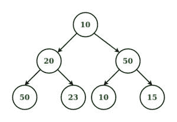

# 检查给定树的左视图是否排序

> 原文:[https://www . geeksforgeeks . org/检查给定树的左视图是否已排序/](https://www.geeksforgeeks.org/check-if-the-left-view-of-the-given-tree-is-sorted-or-not/)

给定一个**树**，我们的任务是检查它的左视图是否排序。如果是则返回**真**否则**假。**
**例:**

> **输入:**
> 
> 
> 
> **输出:**真
> **解释:**
> 树的左视图是 10、20、50，按排序顺序排列。

**方法:**
为了解决上面提到的问题，我们必须在树上执行[级别顺序遍历](https://www.geeksforgeeks.org/level-order-tree-traversal/)，并寻找每个级别的第一个节点。然后初始化一个变量，检查它的左视图是否排序。如果没有排序，那么我们可以打破循环，打印假的，否则循环继续，最后打印真的。
以下是上述方法的实施:

## C++

```
// C++ implementation to Check if the Left
// View of the given tree is Sorted or not

#include <bits/stdc++.h>
using namespace std;

// Binary Tree Node
struct node {
    int val;
    struct node *right, *left;
};

// Utility function to create a new node
struct node* newnode(int key)
{
    struct node* temp = new node;
    temp->val = key;
    temp->right = NULL;
    temp->left = NULL;

    return temp;
}

// Function to find left view
// and check if it is sorted
void func(node* root)
{
    // queue to hold values
    queue<node*> q;

    // variable to check whether
    // level order is sorted or not
    bool t = true;
    q.push(root);

    int i = -1, j = -1, k = -1;

    // Iterate until the queue is empty
    while (!q.empty()) {
        int h = q.size();

        // Traverse every level in tree
        while (h > 0) {
            root = q.front();

            // variable for initial level
            if (i == -1) {
                j = root->val;
            }
            // checking values are sorted or not
            if (i == -2) {
                if (j <= root->val) {
                    j = root->val;
                    i = -3;
                }
                else {
                    t = false;
                    break;
                }
            }
            // Push left value if it is not null
            if (root->left != NULL) {
                q.push(root->left);
            }
            // Push right value if it is not null
            if (root->right != NULL) {
                q.push(root->right);
            }
            h = h - 1;

            // Pop out the values from queue
            q.pop();
        }
        i = -2;

        // Check if the value are not
        // sorted then break the loop
        if (t == false) {
            break;
        }
    }
    if (t)
        cout << "true" << endl;

    else
        cout << "false" << endl;
}

// Driver code
int main()
{
    struct node* root = newnode(10);
    root->right = newnode(50);
    root->right->right = newnode(15);
    root->left = newnode(20);
    root->left->left = newnode(50);
    root->left->right = newnode(23);
    root->right->left = newnode(10);

    func(root);

    return 0;
}
```

## Java 语言(一种计算机语言，尤用于创建网站)

```
// Java implementation to check if the left
// view of the given tree is sorted or not
import java.util.*;

class GFG{

// Binary Tree Node
static class node
{
    int val;
    node right, left;
};

// Utility function to create a new node
static node newnode(int key)
{
    node temp = new node();
    temp.val = key;
    temp.right = null;
    temp.left = null;

    return temp;
}

// Function to find left view
// and check if it is sorted
static void func(node root)
{

    // Queue to hold values
    Queue<node> q = new LinkedList<>();

    // Variable to check whether
    // level order is sorted or not
    boolean t = true;
    q.add(root);

    int i = -1, j = -1;

    // Iterate until the queue is empty
    while (!q.isEmpty())
    {
        int h = q.size();

        // Traverse every level in tree
        while (h > 0)
        {
            root = q.peek();

            // Variable for initial level
            if (i == -1)
            {
                j = root.val;
            }

            // Checking values are sorted or not
            if (i == -2)
            {
                if (j <= root.val)
                {
                    j = root.val;
                    i = -3;
                }
                else
                {
                    t = false;
                    break;
                }
            }

            // Push left value if it is not null
            if (root.left != null)
            {
                q.add(root.left);
            }

            // Push right value if it is not null
            if (root.right != null)
            {
                q.add(root.right);
            }
            h = h - 1;

            // Pop out the values from queue
            q.remove();
        }
        i = -2;

        // Check if the value are not
        // sorted then break the loop
        if (t == false)
        {
            break;
        }
    }
    if (t)
        System.out.print("true" + "\n");

    else
        System.out.print("false" + "\n");
}

// Driver code
public static void main(String[] args)
{
    node root = newnode(10);
    root.right = newnode(50);
    root.right.right = newnode(15);
    root.left = newnode(20);
    root.left.left = newnode(50);
    root.left.right = newnode(23);
    root.right.left = newnode(10);

    func(root);
}
}

// This code is contributed by gauravrajput1
```

## C#

```
// C# implementation to check if the left
// view of the given tree is sorted or not
using System;
using System.Collections.Generic;

class GFG{

// Binary Tree Node
class node
{
    public int val;
    public node right, left;
};

// Utility function to create a new node
static node newnode(int key)
{
    node temp = new node();
    temp.val = key;
    temp.right = null;
    temp.left = null;

    return temp;
}

// Function to find left view
// and check if it is sorted
static void func(node root)
{

    // Queue to hold values
    Queue<node> q = new Queue<node>();

    // Variable to check whether
    // level order is sorted or not
    bool t = true;
    q.Enqueue(root);

    int i = -1, j = -1;

    // Iterate until the queue is empty
    while (q.Count != 0)
    {
        int h = q.Count;

        // Traverse every level in tree
        while (h > 0)
        {
            root = q.Peek();

            // Variable for initial level
            if (i == -1)
            {
                j = root.val;
            }

            // Checking values are sorted or not
            if (i == -2)
            {
                if (j <= root.val)
                {
                    j = root.val;
                    i = -3;
                }
                else
                {
                    t = false;
                    break;
                }
            }

            // Push left value if it is not null
            if (root.left != null)
            {
                q.Enqueue(root.left);
            }

            // Push right value if it is not null
            if (root.right != null)
            {
                q.Enqueue(root.right);
            }
            h = h - 1;

            // Pop out the values from queue
            q.Dequeue();
        }
        i = -2;

        // Check if the value are not
        // sorted then break the loop
        if (t == false)
        {
            break;
        }
    }
    if (t)
        Console.Write("true" + "\n");

    else
        Console.Write("false" + "\n");
}

// Driver code
public static void Main(String[] args)
{
    node root = newnode(10);
    root.right = newnode(50);
    root.right.right = newnode(15);
    root.left = newnode(20);
    root.left.left = newnode(50);
    root.left.right = newnode(23);
    root.right.left = newnode(10);

    func(root);
}
}

// This code is contributed by gauravrajput1
```

## java 描述语言

```
<script>
    // Javascript implementation to check if the left
    // view of the given tree is sorted or not

    // Binary Tree Node
    class node
    {
        constructor(key) {
           this.left = null;
           this.right = null;
           this.val = key;
        }
    }

    // Utility function to create a new node
    function newnode(key)
    {
        let temp = new node(key);
        return temp;
    }

    // Function to find left view
    // and check if it is sorted
    function func(root)
    {

        // Queue to hold values
        let q = [];

        // Variable to check whether
        // level order is sorted or not
        let t = true;
        q.push(root);

        let i = -1, j = -1;

        // Iterate until the queue is empty
        while (q.length > 0)
        {
            let h = q.length;

            // Traverse every level in tree
            while (h > 0)
            {
                root = q[0];

                // Variable for initial level
                if (i == -1)
                {
                    j = root.val;
                }

                // Checking values are sorted or not
                if (i == -2)
                {
                    if (j <= root.val)
                    {
                        j = root.val;
                        i = -3;
                    }
                    else
                    {
                        t = false;
                        break;
                    }
                }

                // Push left value if it is not null
                if (root.left != null)
                {
                    q.push(root.left);
                }

                // Push right value if it is not null
                if (root.right != null)
                {
                    q.push(root.right);
                }
                h = h - 1;

                // Pop out the values from queue
                q.shift();
            }
            i = -2;

            // Check if the value are not
            // sorted then break the loop
            if (t == false)
            {
                break;
            }
        }
        if (t)
            document.write("true" + "</br>");

        else
            document.write("false" + "</br>");
    }

    let root = newnode(10);
    root.right = newnode(50);
    root.right.right = newnode(15);
    root.left = newnode(20);
    root.left.left = newnode(50);
    root.left.right = newnode(23);
    root.right.left = newnode(10);

    func(root);

// This code is contributed by decode2207.
</script>
```

**Output:** 

```
true
```

***时间复杂度:**O(N)*T4】