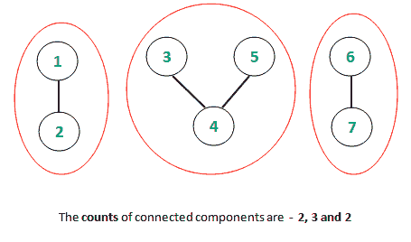

# 检查所有连接组件的长度是否为斐波那契数

> 原文:[https://www . geesforgeks . org/check-如果所有连接组件的长度都是斐波那契数/](https://www.geeksforgeeks.org/check-if-the-length-of-all-connected-components-is-a-fibonacci-number/)

给定一个有 **V** 顶点和 **E** 边的无向图，任务是找到图的所有连通分支，并检查它们的每个长度是否是一个**斐波那契数**。
例如，考虑以下图表。



如上所述，连接组件的长度是 2、3 和 2，它们是斐波那契数。
**例:**

> **输入:** E = 4，V = 7
> 
> 
> 
> **输出:**是
> T3】输入: E = 6，V = 10
> 
> 
> 
> **输出:**否
> **说明:**连接组件{1}、{2，3，4，5}、{6，7，8}、{9，10}的长度分别为 1、 **4** 、3、2。

**方法:**
预先计算斐波那契数并将其存储在哈希集中。如本文中[所述，使用离散傅立叶变换方法遍历顶点并生成连接的组件。检查所有长度是否都存在于预计算的斐波那契数列中。
以下是上述方法的实施:](https://www.geeksforgeeks.org/connected-components-in-an-undirected-graph/)

## C++

```
// C++ program to check if the length of
// all connected components are a
// Fibonacci or not
#include <bits/stdc++.h>
using namespace std;

// Function to traverse graph using
// DFS algorithm and track the
// connected components
void depthFirst(int v, vector<int> graph[],
                vector<bool>& visited, int& ans)
{
    // Mark the current vertex as visited
    visited[v] = true;

    // Variable ans to keep count of
    // connected components
    ans++;
    for (auto i : graph[v]) {
        if (visited[i] == false) {
            depthFirst(i, graph, visited, ans);
        }
    }
}

// Function to check and print if the
// length of all connected components
// are a Fibonacci or not
void countConnectedFibonacci(vector<int> graph[],
                                int V, int E)
{
    // Hash Container (Set) to store
    // the Fibonacci sequence
    unordered_set<int> fibonacci;
    fibonacci.insert(0);
    fibonacci.insert(1);
    // Pre-computation of Fibonacci sequence
    long long a = 0,b = 1;
    for (int i = 2; i < 1001; i++) {
        fibonacci.insert(a + b);
        a = a+b;
        swap(a,b);
    }

    // Initializing boolean visited array
    // to mark visited vertices
    vector<bool> visited(10001, false);

    // Following loop invokes DFS algorithm
    for (int i = 1; i <= V; i++) {
        if (visited[i] == false) {
            // ans variable stores the
            // length of respective
            // connected components
            int ans = 0;

            // DFS algorithm
            depthFirst(i, graph, visited, ans);
            if(fibonacci.find(ans) == fibonacci.end())
            {
                cout << "No"<<endl;
                return;
            }
        }
    }

    cout<<"Yes"<<endl;
}

// Driver code
int main()
{
    // Initializing graph in the form of adjacency list
    vector<int> graph[1001];

    // Defining the number of edges and vertices
    int E = 4,V = 7;

    // Constructing the undirected graph
    graph[1].push_back(2);
    graph[2].push_back(5);
    graph[3].push_back(4);
    graph[4].push_back(3);
    graph[3].push_back(6);
    graph[6].push_back(3);
    graph[8].push_back(7);
    graph[7].push_back(8);

    countConnectedFibonacci(graph, V, E);
    return 0;
}
```

## Java 语言(一种计算机语言，尤用于创建网站)

```
// Java program to check if the length of
// all connected components are a
// Fibonacci or not

import java.util.*;

class GFG{

// Function to traverse graph using
// DFS algorithm and track the
// connected components
static void depthFirst(int v, Vector<Integer> graph[],
                boolean []visited, int ans)
{
    // Mark the current vertex as visited
    visited[v] = true;

    // Variable ans to keep count of
    // connected components
    ans++;
    for (int i : graph[v]) {
        if (visited[i] == false) {
            depthFirst(i, graph, visited, ans);
        }
    }
}

// Function to check and print if the
// length of all connected components
// are a Fibonacci or not
static void countConnectedFibonacci(Vector<Integer> graph[],
                                int V, int E)
{
    // Hash Container (Set) to store
    // the Fibonacci sequence
    HashSet<Integer> fibonacci = new HashSet<Integer>();
    fibonacci.add(0);
    fibonacci.add(1);
    // Pre-computation of Fibonacci sequence
    int a = 0,b = 1;
    for (int i = 2; i < 1001; i++) {
        fibonacci.add(a + b);
        a = a + b;
        a = a + b;
        b = a - b;
        a = a - b;
    }

    // Initializing boolean visited array
    // to mark visited vertices
    boolean []visited = new boolean[10001];

    // Following loop invokes DFS algorithm
    for (int i = 1; i <= V; i++) {
        if (visited[i] == false) {
            // ans variable stores the
            // length of respective
            // connected components
            int ans = 0;

            // DFS algorithm
            depthFirst(i, graph, visited, ans);
            if(!fibonacci.contains(ans))
            {
                System.out.println("No");
                return;
            }
        }
    }

    System.out.println("Yes");
}

// Driver code
public static void main(String[] args)
{
    // Initializing graph in the form of adjacency list
    Vector<Integer> []graph = new Vector[1001];
    for(int i = 0; i < graph.length; i++)
        graph[i] = new Vector<Integer>();

    // Defining the number of edges and vertices
    int E = 4,V = 7;

    // Constructing the undirected graph
    graph[1].add(2);
    graph[2].add(5);
    graph[3].add(4);
    graph[4].add(3);
    graph[3].add(6);
    graph[6].add(3);
    graph[8].add(7);
    graph[7].add(8);

    countConnectedFibonacci(graph, V, E);
}
}

// This code is contributed by 29AjayKumar
```

## C#

```
// C# program to check if the length of
// all connected components are a
// Fibonacci or not
using System;
using System.Collections.Generic;

class GFG{

// Function to traverse graph using
// DFS algorithm and track the
// connected components
static void depthFirst(int v, List<int> []graph,
                         bool []visited, int ans)
{

    // Mark the current vertex as visited
    visited[v] = true;

    // Variable ans to keep count of
    // connected components
    ans++;
    foreach(int i in graph[v])
    {
        if (visited[i] == false)
        {
            depthFirst(i, graph, visited, ans);
        }
    }
}

// Function to check and print if the
// length of all connected components
// are a Fibonacci or not
static void countConnectedFibonacci(List<int> []graph,
                                    int V, int E)
{

    // Hash Container (Set) to store
    // the Fibonacci sequence
    HashSet<int> fibonacci = new HashSet<int>();
    fibonacci.Add(0);
    fibonacci.Add(1);

    // Pre-computation of Fibonacci sequence
    int a = 0,b = 1;
    for(int i = 2; i < 1001; i++)
    {
        fibonacci.Add(a + b);
        a = a + b;
        a = a + b;
        b = a - b;
        a = a - b;
    }

    // Initializing bool visited array
    // to mark visited vertices
    bool []visited = new bool[10001];

    // Following loop invokes DFS algorithm
    for(int i = 1; i <= V; i++)
    {
        if (visited[i] == false)
        {

            // ans variable stores the
            // length of respective
            // connected components
            int ans = 0;

            // DFS algorithm
            depthFirst(i, graph, visited, ans);

            if(!fibonacci.Contains(ans))
            {
                Console.WriteLine("No");
                return;
            }
        }
    }
    Console.WriteLine("Yes");
}

// Driver code
public static void Main(String[] args)
{

    // Initializing graph in the
    // form of adjacency list
    List<int> []graph = new List<int>[1001];
    for(int i = 0; i < graph.Length; i++)
        graph[i] = new List<int>();

    // Defining the number of edges and vertices
    int E = 4,V = 7;

    // Constructing the undirected graph
    graph[1].Add(2);
    graph[2].Add(5);
    graph[3].Add(4);
    graph[4].Add(3);
    graph[3].Add(6);
    graph[6].Add(3);
    graph[8].Add(7);
    graph[7].Add(8);

    countConnectedFibonacci(graph, V, E);
}
}

// This code is contributed by amal kumar choubey
```

## java 描述语言

```
<script>

    // JavaScript program to check if the length of
    // all connected components are a
    // Fibonacci or not

    // Function to traverse graph using
    // DFS algorithm and track the
    // connected components
    function depthFirst(v, graph, visited, ans)
    {
        // Mark the current vertex as visited
        visited[v] = true;

        // Variable ans to keep count of
        // connected components
        ans++;
        for (let i = 0; i < graph[v].length; i++) {
            if (visited[graph[v][i]] == false) {
                depthFirst(graph[v][i], graph, visited, ans);
            }
        }
    }

    // Function to check and print if the
    // length of all connected components
    // are a Fibonacci or not
    function countConnectedFibonacci(graph, V, E)
    {
        // Hash Container (Set) to store
        // the Fibonacci sequence
        let fibonacci = new Set();
        fibonacci.add(0);
        fibonacci.add(1);
        // Pre-computation of Fibonacci sequence
        let a = 0,b = 1;
        for (let i = 2; i < 1001; i++) {
            fibonacci.add(a + b);
            a = a + b;
            a = a + b;
            b = a - b;
            a = a - b;
        }

        // Initializing boolean visited array
        // to mark visited vertices
        let visited = new Array(10001);

        // Following loop invokes DFS algorithm
        for (let i = 1; i <= V; i++) {
            if (visited[i] == false) {
                // ans variable stores the
                // length of respective
                // connected components
                let ans = 0;

                // DFS algorithm
                depthFirst(i, graph, visited, ans);
                if(!fibonacci.has(ans))
                {
                    document.write("No");
                    return;
                }
            }
        }

        document.write("Yes");
    }

    // Initializing graph in the form of adjacency list
    let graph = new Array(1001);
    for(let i = 0; i < graph.length; i++)
        graph[i] = [];

    // Defining the number of edges and vertices
    let E = 4,V = 7;

    // Constructing the undirected graph
    graph[1].push(2);
    graph[2].push(5);
    graph[3].push(4);
    graph[4].push(3);
    graph[3].push(6);
    graph[6].push(3);
    graph[8].push(7);
    graph[7].push(8);

    countConnectedFibonacci(graph, V, E);

</script>
```

## 蟒蛇 3

```
# Python3 program to check if the length of
# all connected components are a
# Fibonacci or not

# Function to traverse graph using
# DFS algorithm and track the
# connected components
def depthFirst( v, graph, visited):
    global ans
    # Mark the current vertex as visited
    visited[v] = True

    # Variable ans to keep count of
    # connected components
    ans+=1
    for i in graph[v] :
        if (visited[i] == False) :
            depthFirst(i, graph, visited)

# Function to check and print if the
# length of all connected components
# are a Fibonacci or not
def countConnectedFibonacci(graph, V, E):
    # Hash Container (Set) to store
    # the Fibonacci sequence
    fibonacci=set()
    fibonacci.add(0)
    fibonacci.add(1)
    # Pre-computation of Fibonacci sequence
    a = 0;b = 1
    for i in range(2,1001):
        fibonacci.add(a + b)
        a = a+b
        a,b=b,a

    # Initializing boolean visited array
    # to mark visited vertices
    visited=[False]*10001

    global ans
    # Following loop invokes DFS algorithm
    for i in range(1,V+1):
        if not visited[i]:
            # ans variable stores the
            # length of respective
            # connected components
            ans = 0

            # DFS algorithm
            depthFirst(i, graph, visited)
            if ans not in fibonacci:
                print("No")
                return

    print("Yes")

# Driver code
if __name__ == '__main__':
    # Initializing graph in the form of adjacency list
    graph=[[] for _ in range(1001)]

    # Defining the number of edges and vertices
    E = 4;V = 7

    # Constructing the undirected graph
    graph[1].append(2)
    graph[2].append(5)
    graph[3].append(4)
    graph[4].append(3)
    graph[3].append(6)
    graph[6].append(3)
    graph[8].append(7)
    graph[7].append(8)

    countConnectedFibonacci(graph, V, E)
```

**Output:** 

```
Yes
```

**复杂性分析:**
程序的整体复杂性主要由三个因素决定，即深度优先搜索遍历、从斐波那契容器中识别元素以及斐波那契序列的预计算。DFS 遍历的时间复杂度为 **O(E + V)** ，其中 E 和 V 是图的边和顶点。检查哈希集中是否存在特定长度需要 **O(1)** 时间复杂度。初始预计算的时间复杂度为 0(N)，其中 N 是存储斐波那契序列的最大值。
时间复杂度: *O(N)* 。
**高效方法:**
这种方法基本上避免了斐波那契数的预先计算，而是使用一个简单的公式来检查单个长度是否是斐波那契数。检测 N 是否为斐波那契数的公式是找出 **5N <sup>2</sup> + 4** 和**5N<sup>2</sup>–4**的值，检查它们是否为**完美平方**。所述配方由 I Gessel 配制，可参考[这个](http://www.maths.surrey.ac.uk/hosted-sites/R.Knott/Fibonacci/fibFormula.html#section5)链接。程序的其余部分与上面类似，通过 DFS 遍历计算连接的组件。
以下是上述方法的实施:

## C++

```
// C++ program to check if the length of
// all connected components are a
// Fibonacci or not
#include <bits/stdc++.h>
using namespace std;

// Function to traverse graph using
// DFS algorithm and track the
// connected components
void depthFirst(int v, vector<int> graph[],
                vector<bool>& visited, int& ans)
{
    // Mark the current vertex as visited
    visited[v] = true;

    // Variable ans to keep count of
    // connected components
    ans++;
    for (auto i : graph[v]) {
        if (visited[i] == false) {
            depthFirst(i, graph, visited, ans);
        }
    }
}

// Function to check and print if the
// length of all connected components
// are a Fibonacci or not
void countConnectedFibonacci(vector<int> graph[],
                                int V, int E)
{

    // Initializing boolean visited array
    // to mark visited vertices
    vector<bool> visited(10001, false);

    // Following loop invokes DFS algorithm
    for (int i = 1; i <= V; i++) {
        if (visited[i] == false) {
            // ans variable stores the
            // length of respective
            // connected components
            int ans = 0;

            // DFS algorithm
            depthFirst(i, graph, visited, ans);

            double x1 = sqrt(5*ans*ans + 4);
            int x2 = sqrt(5 * ans * ans + 4);

            double y1 = sqrt(5*ans*ans - 4);
            int y2 = sqrt(5 * ans * ans - 4);

            if(!(x1 - x2) || !(y1 - y2))
                continue;
            else
            {
                cout << "No"<<endl;
                return;
            }
        }
    }

    cout<<"Yes"<<endl;
}

// Driver code
int main()
{
    // Initializing graph in the form of adjacency list
    vector<int> graph[1001];

    // Defining the number of edges and vertices
    int E = 4,V = 7;

    // Constructing the undirected graph
    graph[1].push_back(2);
    graph[2].push_back(1);
    graph[2].push_back(5);
    graph[5].push_back(2);
    graph[3].push_back(4);
    graph[4].push_back(3);
    graph[3].push_back(6);
    graph[6].push_back(3);
    graph[8].push_back(7);
    graph[7].push_back(8);

    countConnectedFibonacci(graph, V, E);
    return 0;
}
```

## Java 语言(一种计算机语言，尤用于创建网站)

```
// Java program to check if the length of
// all connected components are a
// Fibonacci or not
import java.util.*;
class GFG{

// Function to traverse graph using
// DFS algorithm and track the
// connected components
static void depthFirst(int v, Vector<Integer> graph[],
                    Vector<Boolean> visited, int ans)
{
    // Mark the current vertex as visited
    visited.add(v, true);

    // Variable ans to keep count of
    // connected components
    ans++;
    for (int i : graph[v])
    {
        if (visited.get(i) == false)
        {
            depthFirst(i, graph, visited, ans);
        }
    }
}

// Function to check and print if the
// length of all connected components
// are a Fibonacci or not
static void countConnectedFibonacci(Vector<Integer> graph[],
                                    int V, int E)
{

    // Initializing boolean visited array
    // to mark visited vertices
    Vector<Boolean> visited = new Vector<>(10001);
    for(int i = 0; i < 10001; i++)
        visited.add(i, false);

    // Following loop invokes DFS algorithm
    for (int i = 1; i < V; i++)
    {
        if (visited.get(i) == false)
        {
            // ans variable stores the
            // length of respective
            // connected components
            int ans = 0;

            // DFS algorithm
            depthFirst(i, graph, visited, ans);

            double x1 = Math.sqrt(5 * ans * ans + 4);
            int x2 = (int)Math.sqrt(5 * ans * ans + 4);

            double y1 = Math.sqrt(5 * ans * ans - 4);
            int y2 = (int)Math.sqrt(5 * ans * ans - 4);

            if((x1 - x2) != 0 || (y1 - y2) != 0)
                continue;
            else
            {
                System.out.println("No");
                return;
            }
        }
    }
    System.out.println("Yes");
}

// Driver code
public static void main(String[] args)
{
    // Initializing graph in the form of adjacency list
    @SuppressWarnings("unchecked")
    Vector<Integer> []graph = new Vector[1001];
    for(int i = 0; i < 1001; i++)
        graph[i] = new Vector<Integer>();

    // Defining the number of edges and vertices
    int E = 4,V = 7;

    // Constructing the undirected graph
    graph[1].add(2);
    graph[2].add(1);
    graph[2].add(5);
    graph[5].add(2);
    graph[3].add(4);
    graph[4].add(3);
    graph[3].add(6);
    graph[6].add(3);
    graph[8].add(7);
    graph[7].add(8);

    countConnectedFibonacci(graph, V, E);
}
}

// This code is contributed by Rohit_ranjan
```

## 蟒蛇 3

```
# Python3 program to check if the length of
# all connected components are a
# Fibonacci or not
from math import sqrt

# Function to traverse graph using
# DFS algorithm and track the
# connected components
def depthFirst(v):
    global visited, ans, graph

    # Mark the current vertex as visited
    visited[v] = True

    # Variable ans to keep count of
    # connected components
    ans += 1
    for i in graph[v]:
        if (visited[i] == False):
            depthFirst(i)

# Function to check and prif the
# length of all connected components
# are a Fibonacci or not
def countConnectedFibonacci(V, E):
    global graph, ans

    # Initializing boolean visited array
    # to mark visited vertices
    # vector<bool> visited(10001, false)

    # Following loop invokes DFS algorithm
    for i in range(1, V + 1):
        if (visited[i] == False):

            # ans variable stores the
            # length of respective
            # connected components
            ans = 0

            # DFS algorithm
            depthFirst(i)
            x1 = sqrt(5*ans*ans + 4)
            x2 = sqrt(5 * ans * ans + 4)
            y1 = sqrt(5*ans*ans - 4)
            y2 = sqrt(5 * ans * ans - 4)
            if((not (x1 - x2)) or (not (y1 - y2))):
                continue
            else:
                print("No")
                return
    print ("Yes")

# Driver code
if __name__ == '__main__':

    # Initializing graph in the form of adjacency list
    graph = [[] for i in range(10001)]
    visited = [False for i in range(10001)]
    ans = 0

    # Defining the number of edges and vertices
    E, V = 4, 7

    # Constructing the undirected graph
    graph[1].append(2)
    graph[2].append(1)
    graph[2].append(5)
    graph[5].append(2)
    graph[3].append(4)
    graph[4].append(3)
    graph[3].append(6)
    graph[6].append(3)
    graph[8].append(7)
    graph[7].append(8)

    countConnectedFibonacci(V, E)

# This code is contributed by mohit kumar 29.
```

## C#

```
// C# program to check if the
// length of all connected
// components are a Fibonacci
// or not
using System;
using System.Collections;
class GFG{

// Function to traverse graph using
// DFS algorithm and track the
// connected components
static void depthFirst(int v, ArrayList []graph,
                       ArrayList visited, int ans)
{
  // Mark the current vertex
  // as visited
  visited[v] = true;

  // Variable ans to keep count of
  // connected components
  ans++;

  foreach(int i in graph[v])
  {
    if ((bool)visited[i] == false)
    {
      depthFirst(i, graph, visited, ans);
    }
  }
}

// Function to check and print if the
// length of all connected components
// are a Fibonacci or not
static void countConnectedFibonacci(ArrayList []graph,
                                    int V, int E)
{
  // Initializing boolean visited array
  // to mark visited vertices
  ArrayList visited = new ArrayList();
  for(int i = 0; i < 10001; i++)
    visited.Add(false);

  // Following loop invokes
  // DFS algorithm
  for (int i = 1; i < V; i++)
  {
    if ((bool)visited[i] == false)
    {
      // ans variable stores the
      // length of respective
      // connected components
      int ans = 0;

      // DFS algorithm
      depthFirst(i, graph, visited, ans);

      double x1 = Math.Sqrt(5 * ans * ans + 4);
      int x2 = (int)Math.Sqrt(5 * ans * ans + 4);

      double y1 = Math.Sqrt(5 * ans * ans - 4);
      int y2 = (int)Math.Sqrt(5 * ans * ans - 4);

      if((x1 - x2) != 0 || (y1 - y2) != 0)
        continue;
      else
      {
        Console.Write("No");
        return;
      }
    }
  }
  Console.Write("Yes");
}

// Driver code
public static void Main(string[] args)
{
  // Initializing graph in the
  // form of adjacency list
  ArrayList []graph =
              new ArrayList[1001];

  for(int i = 0; i < 1001; i++)
    graph[i] = new ArrayList();

  // Defining the number of
  // edges and vertices
  int E = 4,
      V = 7;

  // Constructing the
  // undirected graph
  graph[1].Add(2);
  graph[2].Add(1);
  graph[2].Add(5);
  graph[5].Add(2);
  graph[3].Add(4);
  graph[4].Add(3);
  graph[3].Add(6);
  graph[6].Add(3);
  graph[8].Add(7);
  graph[7].Add(8);

  countConnectedFibonacci(graph, V, E);
}
}

// This code is contributed by rutvik_56
```

## java 描述语言

```
<script>

    // JavaScript program to check if the length of
    // all connected components are a
    // Fibonacci or not

    // Function to traverse graph using
    // DFS algorithm and track the
    // connected components
    function depthFirst(v, graph, visited, ans)
    {
      // Mark the current vertex
      // as visited
      visited[v] = true;

      // Variable ans to keep count of
      // connected components
      ans++;

      for(let i = 0; i < graph[v].length; i++)
      {
        if (visited[graph[v][i]] == false)
        {
          depthFirst(i, graph, visited, ans);
        }
      }
    }

    // Function to check and print if the
    // length of all connected components
    // are a Fibonacci or not
    function countConnectedFibonacci(graph, V, E)
    {
      // Initializing boolean visited array
      // to mark visited vertices
      let visited = [];
      for(let i = 0; i < 10001; i++)
        visited.push(false);

      // Following loop invokes
      // DFS algorithm
      for (let i = 1; i < V; i++)
      {
        if (visited[i] == false)
        {
          // ans variable stores the
          // length of respective
          // connected components
          let ans = 0;

          // DFS algorithm
          depthFirst(i, graph, visited, ans);

          let x1 = Math.sqrt(5 * ans * ans + 4);
          let x2 = parseInt(Math.sqrt(5 * ans * ans + 4), 10);

          let y1 = Math.sqrt(5 * ans * ans - 4);
          let y2 = parseInt(Math.sqrt(5 * ans * ans - 4), 10);

          if((x1 - x2) != 0 || (y1 - y2) != 0)
            continue;
          else
          {
            document.write("No");
            return;
          }
        }
      }
      document.write("Yes");
    }

    // Initializing graph in the
    // form of adjacency list
    let graph = new Array(1001);

    for(let i = 0; i < 1001; i++)
      graph[i] = [];

    // Defining the number of
    // edges and vertices
    let E = 4, V = 7;

    // Constructing the
    // undirected graph
    graph[1].push(2);
    graph[2].push(1);
    graph[2].push(5);
    graph[5].push(2);
    graph[3].push(4);
    graph[4].push(3);
    graph[3].push(6);
    graph[6].push(3);
    graph[8].push(7);
    graph[7].push(8);

    countConnectedFibonacci(graph, V, E);

</script>
```

**Output:** 

```
Yes
```

**复杂度分析:**
时间复杂度:O(V + E)
该方法避免了较早的预计算，使用数学公式来检测个体长度是否为斐波那契数。因此，计算是在恒定的时间**0(1)**和恒定的空间中实现的，因为它避免了使用任何哈希集来存储斐波那契数。因此，该方法中程序的整体复杂性仅由 DFS 遍历决定。因此，复杂性是 **O(E + V)** ，其中 E 和 V 是无向图的边数和顶点数。