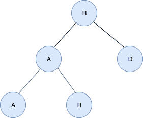
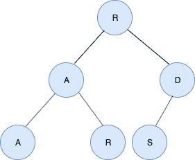

# 检查二叉树的水平顺序遍历是否产生回文

> 原文:[https://www . geesforgeks . org/check-if-the-level-order-遍历二叉树-结果在回文中/](https://www.geeksforgeeks.org/check-if-the-level-order-traversal-of-a-binary-tree-results-in-a-palindrome/)

给定一棵二叉树和检查它的层次顺序遍历是否产生回文的任务。
**例:**

> **输入:**
> 
> 
> 
> **输出:**是
> 雷达是
> 给定树的水平顺序遍历，它是一个回文。
> **输入:**
> 
> 
> 
> **输出:**否

**进场:**

*   按级别顺序遍历二叉树，并将节点存储在堆栈中。
*   再次按级别顺序遍历二叉树，并将节点中的数据与堆栈顶部的数据进行比较。
*   如果有匹配的，继续到下一个节点。
*   如果不匹配，停止并打印编号

以下是上述方法的实现:

## C++

```
// C++ implementation of the approach
#include <bits/stdc++.h>
using namespace std;

// Structure for a node of the tree
struct node {
    char data;
    node *left, *right;
};

// Function to add a node
// to the Binary Tree
node* add(char data)
{
    node* newnode = new node;
    newnode->data = data;
    newnode->left = newnode->right = NULL;
    return newnode;
}

// Function to perform level order traversal
// of the Binary Tree and add the nodes to
// the stack
void findInv(node* root, stack<node*>& S)
{
    if (root == NULL)
        return;

    // The queue holds the nodes which are being
    // processed starting from the root
    queue<node*> Q;
    Q.push(root);
    while (Q.size()) {
        node* temp = Q.front();
        Q.pop();

        // Take the node out of the Queue
        // and push it to the stack
        S.push(temp);

        // If there is a left child
        // then push it to the queue
        if (temp->left != NULL)
            Q.push(temp->left);

        // If there is a right child
        // then push it to the queue
        if (temp->right != NULL)
            Q.push(temp->right);
    }
}

// Function that returns true if the
// level order traversal of the
// tree results in a palindrome
bool isPalindrome(stack<node*> S, node* root)
{
    queue<node*> Q;
    Q.push(root);
    while (Q.size()) {

        // To store the element at
        // the front of the queue
        node* temp = Q.front();

        // To store the element at
        // the top of the stack
        node* temp1 = S.top();
        S.pop();
        Q.pop();

        // If the data in the node at the top
        // of stack does not match the data
        // in the node at the front of the queue
        if (temp->data != temp1->data)
            return false;
        if (temp->left != NULL)
            Q.push(temp->left);
        if (temp->right != NULL)
            Q.push(temp->right);
    }

    // If there is no mismatch
    return true;
}

// Driver code
int main()
{

    // Creating the binary tree
    node* root = add('R');
    root->left = add('A');
    root->right = add('D');
    root->left->left = add('A');
    root->left->right = add('R');

    // Stack to store the nodes of the
    // tree in level order traversal
    stack<node*> S;
    findInv(root, S);

    // If the level order traversal
    // results in a palindrome
    if (isPalindrome(S, root))
        cout << "Yes";
    else
        cout << "NO";

    return 0;
}
```

## Java 语言(一种计算机语言，尤用于创建网站)

```
// Java implementation of the approach
import java.util.*;

class GFG
{

// Structure for a node of the tree
static class node
{
    char data;
    node left, right;
};

// Function to add a node
// to the Binary Tree
static node add(char data)
{
    node newnode = new node();
    newnode.data = data;
    newnode.left = newnode.right = null;
    return newnode;
}

// Function to perform level order traversal
// of the Binary Tree and add the nodes to
// the stack
static void findInv(node root, Stack<node> S)
{
    if (root == null)
        return;

    // The queue holds the nodes which are being
    // processed starting from the root
    Queue<node> Q = new LinkedList<>();
    Q.add(root);
    while (Q.size() > 0)
    {
        node temp = Q.peek();
        Q.remove();

        // Take the node out of the Queue
        // and push it to the stack
        S.add(temp);

        // If there is a left child
        // then push it to the queue
        if (temp.left != null)
            Q.add(temp.left);

        // If there is a right child
        // then push it to the queue
        if (temp.right != null)
            Q.add(temp.right);
    }
}

// Function that returns true if the
// level order traversal of the
// tree results in a palindrome
static boolean isPalindrome(Stack<node> S, node root)
{
    Queue<node> Q = new LinkedList<>();
    Q.add(root);
    while (Q.size() > 0)
    {

        // To store the element at
        // the front of the queue
        node temp = Q.peek();

        // To store the element at
        // the top of the stack
        node temp1 = S.peek();
        S.pop();
        Q.remove();

        // If the data in the node at the top
        // of stack does not match the data
        // in the node at the front of the queue
        if (temp.data != temp1.data)
            return false;
        if (temp.left != null)
            Q.add(temp.left);
        if (temp.right != null)
            Q.add(temp.right);
    }

    // If there is no mismatch
    return true;
}

// Driver code
public static void main(String[] args)
{

    // Creating the binary tree
    node root = add('R');
    root.left = add('A');
    root.right = add('D');
    root.left.left = add('A');
    root.left.right = add('R');

    // Stack to store the nodes of the
    // tree in level order traversal
    Stack<node> S = new Stack<node>();
    findInv(root, S);

    // If the level order traversal
    // results in a palindrome
    if (isPalindrome(S, root))
        System.out.print("Yes");
    else
        System.out.print("NO");
}
}

// This code is contributed by 29AjayKumar
```

## 蟒蛇 3

```
# Python implementation of the approach

# Linked List node
class Node:
    def __init__(self, data):
        self.info = data
        self.left = None
        self.right = None

# Function to append a node
# to the Binary Tree
def append(data):

    newnode = Node(0)
    newnode.data = data
    newnode.left = newnode.right = None
    return newnode

# Function to perform level order traversal
# of the Binary Tree and append the nodes to
# the stack
def findInv(root, S):

    if (root == None):
        return

    # The queue holds the nodes which are being
    # processed starting from the root
    Q = []
    Q.append(root)
    while (len(Q) > 0) :

        temp = Q[0]
        Q.pop(0)

        # Take the node out of the Queue
        # and push it to the stack
        S.append(temp)

        # If there is a left child
        # then push it to the queue
        if (temp.left != None):
            Q.append(temp.left)

        # If there is a right child
        # then push it to the queue
        if (temp.right != None):
            Q.append(temp.right)

# Function that returns True if the
# level order traversal of the
# tree results in a palindrome
def isPalindrome(S,root):

    Q = []
    Q.append(root)
    while (len(Q) > 0) :

        # To store the element at
        # the front of the queue
        temp = Q[0]

        # To store the element at
        # the top of the stack
        temp1 = S[-1]
        S.pop()
        Q.pop(0)

        # If the data in the node at the top
        # of stack does not match the data
        # in the node at the front of the queue
        if (temp.data != temp1.data):
            return False
        if (temp.left != None):
            Q.append(temp.left)
        if (temp.right != None):
            Q.append(temp.right)

    # If there is no mismatch
    return True

# Driver code

# Creating the binary tree
root = append('R')
root.left = append('A')
root.right = append('D')
root.left.left = append('A')
root.left.right = append('R')

# Stack to store the nodes of the
# tree in level order traversal
S = []
findInv(root, S)

# If the level order traversal
# results in a palindrome
if (isPalindrome(S, root)):
    print("Yes")
else:
    print("NO")

# This code is contributed by Arnab Kundu
```

## C#

```
// C# implementation of the approach
using System;
using System.Collections.Generic;

class GFG
{

// Structure for a node of the tree
class node
{
    public char data;
    public node left, right;
};

// Function to.Add a node
// to the Binary Tree
static node add(char data)
{
    node newnode = new node();
    newnode.data = data;
    newnode.left = newnode.right = null;
    return newnode;
}

// Function to perform level order traversal
// of the Binary Tree and.Add the nodes to
// the stack
static void findInv(node root, Stack<node> S)
{
    if (root == null)
        return;

    // The queue holds the nodes which are being
    // processed starting from the root
    Queue<node> Q = new Queue<node>();
    Q.Enqueue(root);
    while (Q.Count > 0)
    {
        node temp = Q.Peek();
        Q.Dequeue();

        // Take the node out of the Queue
        // and push it to the stack
        S.Push(temp);

        // If there is a left child
        // then push it to the queue
        if (temp.left != null)
            Q.Enqueue(temp.left);

        // If there is a right child
        // then push it to the queue
        if (temp.right != null)
            Q.Enqueue(temp.right);
    }
}

// Function that returns true if the
// level order traversal of the
// tree results in a palindrome
static bool isPalindrome(Stack<node> S,
                               node root)
{
    Queue<node> Q = new Queue<node>();
    Q.Enqueue(root);
    while (Q.Count > 0)
    {

        // To store the element at
        // the front of the queue
        node temp = Q.Peek();

        // To store the element at
        // the top of the stack
        node temp1 = S.Peek();
        S.Pop();
        Q.Dequeue();

        // If the data in the node at the top
        // of stack does not match the data
        // in the node at the front of the queue
        if (temp.data != temp1.data)
            return false;
        if (temp.left != null)
            Q.Enqueue(temp.left);
        if (temp.right != null)
            Q.Enqueue(temp.right);
    }

    // If there is no mismatch
    return true;
}

// Driver code
public static void Main(String[] args)
{

    // Creating the binary tree
    node root = add('R');
    root.left = add('A');
    root.right = add('D');
    root.left.left = add('A');
    root.left.right = add('R');

    // Stack to store the nodes of the
    // tree in level order traversal
    Stack<node> S = new Stack<node>();
    findInv(root, S);

    // If the level order traversal
    // results in a palindrome
    if (isPalindrome(S, root))
        Console.Write("Yes");
    else
        Console.Write("NO");
}
}

// This code is contributed by Rajput-Ji
```

## java 描述语言

```
<script>

// JavaScript implementation of the approach

// Structure for a node of the tree
class node
{
    constructor()
    {
        this.data = '';
        this.left = null;
        this.right = null;
    }
};

// Function to.Add a node
// to the Binary Tree
function add(data)
{
    var newnode = new node();
    newnode.data = data;
    newnode.left = newnode.right = null;
    return newnode;
}

// Function to perform level order traversal
// of the Binary Tree and.Add the nodes to
// the stack
function findInv(root, S)
{
    if (root == null)
        return;

    // The queue holds the nodes which are being
    // processed starting from the root
    var Q = [];
    Q.push(root);
    while (Q.length > 0)
    {
        var temp = Q[0];
        Q.shift();

        // Take the node out of the Queue
        // and push it to the stack
        S.push(temp);

        // If there is a left child
        // then push it to the queue
        if (temp.left != null)
            Q.push(temp.left);

        // If there is a right child
        // then push it to the queue
        if (temp.right != null)
            Q.push(temp.right);
    }
}

// Function that returns true if the
// level order traversal of the
// tree results in a palindrome
function isPalindrome(S, root)
{
    var Q = [];
    Q.push(root);
    while (Q.length > 0)
    {

        // To store the element at
        // the front of the queue
        var temp = Q[0];

        // To store the element at
        // the top of the stack
        var temp1 = S[S.length-1];
        S.pop();
        Q.shift();

        // If the data in the node at the top
        // of stack does not match the data
        // in the node at the front of the queue
        if (temp.data != temp1.data)
            return false;
        if (temp.left != null)
            Q.push(temp.left);
        if (temp.right != null)
            Q.push(temp.right);
    }

    // If there is no mismatch
    return true;
}

// Driver code
// Creating the binary tree
var root = add('R');
root.left = add('A');
root.right = add('D');
root.left.left = add('A');
root.left.right = add('R');
// Stack to store the nodes of the
// tree in level order traversal
var S = [];
findInv(root, S);
// If the level order traversal
// results in a palindrome
if (isPalindrome(S, root))
    document.write("Yes");
else
    document.write("NO");

</script>
```

**Output:** 

```
Yes
```

**时间复杂度** : O(N)。
**辅助空间** : O(N)。