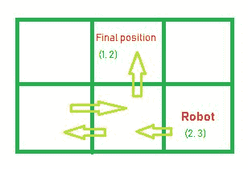

# 给定动作后检查机器人是否在网格范围内

> 原文:[https://www . geesforgeks . org/检查机器人在给定移动后是否在网格范围内/](https://www.geeksforgeeks.org/check-if-the-robot-is-within-the-bounds-of-the-grid-after-given-moves/)

给定尺寸为 **N X M** 的网格，机器人被放置在单元**(N–1，M–1)**处。此外，给定字符串 **str** ，该字符串仅由字符**【U】**(上)、**【D】**(下)、**【L】**(左)和**【R】**(右)组成，表示机器人将在网格内执行的移动。任务是发现机器人在最后一次移动结束时是否安全。机器人被认为是安全的，如果它在网格的边界内。
**注**:考虑数字线下方存在矩形网格，左上角位于原点。
**举例:**

> **输入:** N = 1，M = 1，str = "R"
> **输出:**否
> 由于只有 1 个单元格，不允许移动。
> **输入:** N = 2，M = 3，str = "LLRU"
> **输出:**是
> 
> 

**进场:**每次移动，更新机器人在网格内的位置。如果在任何一次移动中，机器人的位置在网格之外，那么输出将是**否**否则打印**是**如果对于所有的移动，机器人在网格的边界之内。
以下是上述方法的实现:

## C++

```
// C++ implementation of the approach
#include <bits/stdc++.h>
using namespace std;

// Function that returns true if the robot is safe
bool isSafe(int N, int M, string str)
{

    int coll = 0, colr = 0, rowu = 0, rowd = 0;

    for (int i = 0; i < str.length(); i++) {

        // If current move is "L" then
        // increase the counter of coll
        if (str[i] == 'L') {
            coll++;
            if (colr > 0) {
                colr--;
            }

            // If value of coll is equal to
            // column then break
            if (coll == M) {
                break;
            }
        }

        // If current move is "R" then
        // increase the counter of colr
        else if (str[i] == 'R') {
            colr++;
            if (coll > 0) {
                coll--;
            }

            // If value of colr is equal to
            // column then break
            if (colr == M) {
                break;
            }
        }

        // If current move is "U" then
        // increase the counter of rowu
        else if (str[i] == 'U') {
            -rowu++;
            if (rowd > 0) {
                rowd--;
            }

            // If value of rowu is equal to
            // row then break
            if (rowu == N) {
                break;
            }
        }

        // If current move is "D" then
        // increase the counter of rowd
        else if (str[i] == 'D') {
            rowd++;
            if (rowu > 0) {
                rowu--;
            }

            // If value of rowd is equal to
            // row then break
            if (rowd == N) {
                break;
            }
        }
    }

    // If robot is within the bounds of the grid
    if (abs(rowd) < N && abs(rowu) < N
        && abs(coll) < M && abs(colr) < M) {
        return true;
    }

    // Unsafe
    return false;
}

// Driver code
int main()
{
    int N = 1, M = 1;
    string str = "R";

    if (isSafe(N, M, str))
        cout << "Yes";
    else
        cout << "No";

    return 0;
}
```

## Java 语言(一种计算机语言，尤用于创建网站)

```
// Java implementation of the approach
class GFG {

    // Function that returns true if the robot is safe
    static boolean isSafe(int N, int M, char[] str)
    {

        int coll = 0, colr = 0, rowu = 0, rowd = 0;

        for (int i = 0; i < str.length; i++) {

            // If current move is "L" then
            // increase the counter of coll
            if (str[i] == 'L') {
                coll++;
                if (colr > 0) {
                    colr--;
                }

                // If value of coll is equal to
                // column then break
                if (coll == M) {
                    break;
                }
            }

            // If current move is "R" then
            // increase the counter of colr
            else if (str[i] == 'R') {
                colr++;
                if (coll > 0) {
                    coll--;
                }

                // If value of colr is equal to
                // column then break
                if (colr == M) {
                    break;
                }
            }

            // If current move is "U" then
            // increase the counter of rowu
            else if (str[i] == 'U') {
                rowu++;
                if (rowd > 0) {
                    rowd--;
                }

                // If value of rowu is equal to
                // row then break
                if (rowu == N) {
                    break;
                }
            }

            // If current move is "D" then
            // increase the counter of rowd
            else if (str[i] == 'D') {
                rowd++;
                if (rowu > 0) {
                    rowu--;
                }

                // If value of rowd is equal to
                // row then break
                if (rowd == N) {
                    break;
                }
            }
        }

        // If robot is within the bounds of the grid
        if (Math.abs(rowd) < N && Math.abs(rowu) < N
            && Math.abs(coll) < M && Math.abs(colr) < M) {
            return true;
        }

        // Unsafe
        return false;
    }

    // Driver code
    public static void main(String[] args)
    {
        int N = 1, M = 1;
        String str = "R";

        if (isSafe(N, M, str.toCharArray()))
            System.out.println("Yes");
        else
            System.out.println("No");
    }
}

// This code is contributed by 29AjayKumar
```

## 蟒蛇 3

```
# Python 3 implementation of the approach

# Function that returns true
# if the robot is safe
def isSafe(N, M, str):
    coll = 0
    colr = 0
    rowu = 0
    rowd = 0

    for i in range(len(str)):

        # If current move is "L" then
        # increase the counter of coll
        if (str[i] == 'L'):
            coll += 1
            if (colr > 0):
                colr -= 1

            # If value of coll is equal to
            # column then break
            if (coll == M):
                break

        # If current move is "R" then
        # increase the counter of colr
        elif (str[i] == 'R'):
            colr += 1
            if (coll > 0):
                coll -= 1

            # If value of colr is equal to
            # column then break
            if (colr == M):
                break

        # If current move is "U" then
        # increase the counter of rowu
        elif (str[i] == 'U'):
            rowu += 1
            if (rowd > 0):
                rowd -= 1

            # If value of rowu is equal to
            # row then break
            if (rowu == N):
                break

        # If current move is "D" then
        # increase the counter of rowd
        elif (str[i] == 'D'):
            rowd += 1
            if (rowu > 0):
                rowu -= 1

            # If value of rowd is equal to
            # row then break
            if (rowd == N):
                break

    # If robot is within the bounds of the grid
    if (abs(rowd) < N and abs(rowu) < N and
        abs(coll) < M and abs(colr) < M):
        return True

    # Unsafe
    return False

# Driver code
if __name__ == '__main__':
    N = 1
    M = 1
    str = "R"

    if (isSafe(N, M, str)):
        print("Yes")
    else:
        print("No")

# This code is contributed by
# Surendra_Gangwar
```

## C#

```
// C# implementation of the approach
using System;

class GFG {

    // Function that returns true if the robot is safe
    static bool isSafe(int N, int M, char[] str)
    {

        int coll = 0, colr = 0, rowu = 0, rowd = 0;

        for (int i = 0; i < str.Length; i++) {

            // If current move is "L" then
            // increase the counter of coll
            if (str[i] == 'L') {
                coll++;
                if (colr > 0) {
                    colr--;
                }

                // If value of coll is equal to
                // column then break
                if (coll == M) {
                    break;
                }
            }

            // If current move is "R" then
            // increase the counter of colr
            else if (str[i] == 'R') {
                colr++;
                if (coll > 0) {
                    coll--;
                }

                // If value of colr is equal to
                // column then break
                if (colr == M) {
                    break;
                }
            }

            // If current move is "U" then
            // increase the counter of rowu
            else if (str[i] == 'U') {
                rowu++;
                if (rowd > 0) {
                    rowd--;
                }

                // If value of rowu is equal to
                // row then break
                if (rowu == N) {
                    break;
                }
            }

            // If current move is "D" then
            // increase the counter of rowd
            else if (str[i] == 'D') {
                rowd++;
                if (rowu > 0) {
                    rowu--;
                }

                // If value of rowd is equal to
                // row then break
                if (rowd == N) {
                    break;
                }
            }
        }

        // If robot is within the bounds of the grid
        if (Math.Abs(rowd) < N && Math.Abs(rowu) < N
            && Math.Abs(coll) < M && Math.Abs(colr) < M) {
            return true;
        }

        // Unsafe
        return false;
    }

    // Driver code
    public static void Main(String[] args)
    {
        int N = 1, M = 1;
        String str = "R";

        if (isSafe(N, M, str.ToCharArray()))
            Console.WriteLine("Yes");
        else
            Console.WriteLine("No");
    }
}

// This code has been contributed by 29AjayKumar
```

## java 描述语言

```
<script>

// Javascript implementation of the approach

// Function that returns true if the robot is safe
function isSafe(N, M, str)
{

    var coll = 0, colr = 0, rowu = 0, rowd = 0;

    for (var i = 0; i < str.length; i++) {

        // If current move is "L" then
        // increase the counter of coll
        if (str[i] == 'L') {
            coll++;
            if (colr > 0) {
                colr--;
            }

            // If value of coll is equal to
            // column then break
            if (coll == M) {
                break;
            }
        }

        // If current move is "R" then
        // increase the counter of colr
        else if (str[i] == 'R') {
            colr++;
            if (coll > 0) {
                coll--;
            }

            // If value of colr is equal to
            // column then break
            if (colr == M) {
                break;
            }
        }

        // If current move is "U" then
        // increase the counter of rowu
        else if (str[i] == 'U') {
            -rowu++;
            if (rowd > 0) {
                rowd--;
            }

            // If value of rowu is equal to
            // row then break
            if (rowu == N) {
                break;
            }
        }

        // If current move is "D" then
        // increase the counter of rowd
        else if (str[i] == 'D') {
            rowd++;
            if (rowu > 0) {
                rowu--;
            }

            // If value of rowd is equal to
            // row then break
            if (rowd == N) {
                break;
            }
        }
    }

    // If robot is within the bounds of the grid
    if (Math.abs(rowd) < N && Math.abs(rowu) < N
        && Math.abs(coll) < M && Math.abs(colr) < M) {
        return true;
    }

    // Unsafe
    return false;
}

// Driver code
var N = 1, M = 1;
var str = "R";
if (isSafe(N, M, str))
    document.write( "Yes");
else
    document.write( "No");

</script>
```

**Output:** 

```
No
```