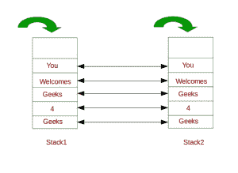

# 检查两个给定的堆栈是否相同

> 原文:[https://www . geesforgeks . org/check-如果两个给定的堆栈相同/](https://www.geeksforgeeks.org/check-if-the-two-given-stacks-are-same/)

给定两个堆栈，任务是检查给定的堆栈是否相同。
如果两个栈以相同的顺序包含相同的元素，则称它们是相同的。
**例** :



**进场:**

1.  取一个标志变量，初始设置为真，*标志=真*。该变量将指示堆栈是否相同。
2.  首先检查给定的**堆垛 1** 和**堆垛 2** 的尺寸是否相等。如果大小不相等，将 flag 设置为 false 并返回。
3.  如果大小相同，则比较两个给定堆栈的顶部元素。
4.  如果两个堆栈的顶部是**而不是**相同，将标志设置为 false 并返回，否则弹出两个堆栈的顶部元素。
5.  重复步骤 3 和 4，直到所有元素都从两个堆栈中弹出。
6.  如果两个堆栈都为空，并且标志变量仍然为真，这意味着堆栈是相同的。

以下是上述思路的实现:

## C++

```
// C++ program to check if the given
// stacks are equal or not

#include <bits/stdc++.h>
using namespace std;

// Function to check if the two given
// stacks are same
bool isSameStack(stack<string> stack1, stack<string> stack2)
{
    // Create a flag variable
    bool flag = true;

    // Check if size of both stacks are same
    if (stack1.size() != stack2.size()) {
        flag = false;
        return flag;
    }

    // Until the stacks are not empty
    // compare top of both stacks
    while (stack1.empty() == false) {
        // If the top elements of both stacks
        // are same
        if (stack1.top() == stack2.top()) {
            // Pop top of both stacks
            stack1.pop();
            stack2.pop();
        }
        else {
            // Otherwise, set flag to false
            flag = false;
            break;
        }
    }

    // Return flag
    return flag;
}

// Driver Code
int main()
{
    // Creating stacks
    stack<string> stack1;
    stack<string> stack2;

    // Inserting elements to stack1
    stack1.push("Geeks");
    stack1.push("4");
    stack1.push("Geeks");
    stack1.push("Welcomes");
    stack1.push("You");

    // Inserting elements to stack2
    stack2.push("Geeks");
    stack2.push("4");
    stack2.push("Geeks");
    stack2.push("Welcomes");
    stack2.push("You");

    if (isSameStack(stack1, stack2))
        cout << "Stacks are Same";
    else
        cout << "Stacks are not Same";

    return 0;
}
```

## Java 语言(一种计算机语言，尤用于创建网站)

```
// Java program to check if the given
// stacks are equal or not
import java.util.*;

class GFG
{

// Function to check if the two given
// stacks are same
static boolean isSameStack(Stack<String> stack1,
                            Stack<String> stack2)
{
    // Create a flag variable
    boolean flag = true;

    // Check if size of both stacks are same
    if (stack1.size() != stack2.size())
    {
        flag = false;
        return flag;
    }

    // Until the stacks are not empty
    // compare top of both stacks
    while (stack1.empty() == false)
    {
        // If the top elements of both stacks
        // are same
        if (stack1.peek() == stack2.peek())
        {
            // Pop top of both stacks
            stack1.pop();
            stack2.pop();
        }
        else
        {
            // Otherwise, set flag to false
            flag = false;
            break;
        }
    }

    // Return flag
    return flag;
}

// Driver Code
public static void main(String arr[])
{
    // Creating stacks
    Stack<String> stack1 = new Stack<String>();
    Stack<String> stack2 = new Stack<String>();

    // Inserting elements to stack1
    stack1.push("Geeks");
    stack1.push("4");
    stack1.push("Geeks");
    stack1.push("Welcomes");
    stack1.push("You");

    // Inserting elements to stack2
    stack2.push("Geeks");
    stack2.push("4");
    stack2.push("Geeks");
    stack2.push("Welcomes");
    stack2.push("You");

    if (isSameStack(stack1, stack2))
        System.out.println("Stacks are Same");
    else
        System.out.println("Stacks are not Same");

}
}

/* This code contributed by PrinciRaj1992 */
```

## 蟒蛇 3

```
# Python3 program to check if the given
# stacks are equal or not

# Function to check if the two given
# stacks are same
def isSameStack(stack1, stack2) :

    # Create a flag variable
    flag = True;

    # Check if size of both stacks are same
    if (len(stack1) != len(stack2)) :
        flag = False;
        return flag;

    # Until the stacks are not empty
    # compare top of both stacks
    while (len(stack1)) :

        # If the top elements of both stacks
        # are same
        if (stack1[0] == stack2[0]) :
            # Pop top of both stacks
            stack1.pop();
            stack2.pop();

        else :

            # Otherwise, set flag to false
            flag = False;
            break;

    # Return flag
    return flag;

# Driver Code
if __name__ == "__main__" :

    # Creating stacks
    stack1 = [];
    stack2 = [];

    # Inserting elements to stack1
    stack1.append("Geeks");
    stack1.append("4");
    stack1.append("Geeks");
    stack1.append("Welcomes");
    stack1.append("You");

    # Inserting elements to stack2
    stack2.append("Geeks");
    stack2.append("4");
    stack2.append("Geeks");
    stack2.append("Welcomes");
    stack2.append("You");

    if (isSameStack(stack1, stack2)) :
        print("Stacks are Same");
    else :
        print("Stacks are not Same");

# This code is contributed by AnkitRai01
```

## C#

```
// C# program to check if the given
// stacks are equal or not
using System;
using System.Collections.Generic;

class GFG
{

// Function to check if the two given
// stacks are same
static Boolean isSameStack(Stack<String> stack1,
                            Stack<String> stack2)
{
    // Create a flag variable
    Boolean flag = true;

    // Check if size of both stacks are same
    if (stack1.Count != stack2.Count)
    {
        flag = false;
        return flag;
    }

    // Until the stacks are not empty
    // compare top of both stacks
    while (stack1.Count!=0)
    {
        // If the top elements of both stacks
        // are same
        if (stack1.Peek() == stack2.Peek())
        {
            // Pop top of both stacks
            stack1.Pop();
            stack2.Pop();
        }
        else
        {
            // Otherwise, set flag to false
            flag = false;
            break;
        }
    }

    // Return flag
    return flag;
}

// Driver Code
public static void Main(String []arr)
{
    // Creating stacks
    Stack<String> stack1 = new Stack<String>();
    Stack<String> stack2 = new Stack<String>();

    // Inserting elements to stack1
    stack1.Push("Geeks");
    stack1.Push("4");
    stack1.Push("Geeks");
    stack1.Push("Welcomes");
    stack1.Push("You");

    // Inserting elements to stack2
    stack2.Push("Geeks");
    stack2.Push("4");
    stack2.Push("Geeks");
    stack2.Push("Welcomes");
    stack2.Push("You");

    if (isSameStack(stack1, stack2))
        Console.WriteLine("Stacks are Same");
    else
        Console.WriteLine("Stacks are not Same");

}
}

// This code has been contributed by 29AjayKumar
```

## java 描述语言

```
<script>

// JavaScript program to check if the given
// stacks are equal or not

// Function to check if the two given
// stacks are same
function isSameStack(stack1,stack2)
{
    // Create a flag variable
    let flag = true;

    // Check if size of both stacks are same
    if (stack1.length != stack2.length)
    {
        flag = false;
        return flag;
    }

    // Until the stacks are not empty
    // compare top of both stacks
    while (stack1.length == false)
    {
        // If the top elements of both stacks
        // are same
        if (stack1[stack1.length-1] == stack2[stack2.length-1])
        {
            // Pop top of both stacks
            stack1.pop();
            stack2.pop();
        }
        else
        {
            // Otherwise, set flag to false
            flag = false;
            break;
        }
    }

    // Return flag
    return flag;
}

// Driver Code

// Creating stacks
let stack1 = [];
let stack2 = [];

// Inserting elements to stack1
stack1.push("Geeks");
stack1.push("4");
stack1.push("Geeks");
stack1.push("Welcomes");
stack1.push("You");

// Inserting elements to stack2
stack2.push("Geeks");
stack2.push("4");
stack2.push("Geeks");
stack2.push("Welcomes");
stack2.push("You");

if (isSameStack(stack1, stack2))
    document.write("Stacks are Same");
else
    document.write("Stacks are not Same");

// This code is contributed by rag2127

</script>
```

**Output:** 

```
Stacks are Same
```