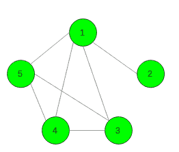

# 检查是否存在满足给定条件的连通图

> 原文:[https://www . geesforgeks . org/check-if-exists-a-满足给定条件的连通图/](https://www.geeksforgeeks.org/check-if-there-exists-a-connected-graph-that-satisfies-the-given-conditions/)

给定两个整数 **N** 和 **K** 。任务是找到一个具有 **N** 个顶点的连通图，使得正好有 **K** 对 **(i，j)** ，其中它们之间的最短距离是 **2** 。如果不存在这样的图形，则打印 **-1** 。

**注:**

1.  第一行输出应该是图中的边数(比如 m)，接下来的 m 行应该包含两个数字，代表顶点之间的边。
2.  如果有多个答案，打印其中任何一个。

**示例:**

> **输入:** N = 5，K = 3
> **输出:**7
> 1 2
> 1 3
> 1 4
> 1 5
> 3 4
> 3 5
> 4 5
> 
> 
> **输入:** N = 5，K = 8
> **输出:** -1

**方法:**一个 N 顶点连通图至少有 **N-1 条**边。每对最短距离等于 **1** 。所以很明显，如果**K>N *(N–1)/2–(N–1)=(N–1)*(N–2)/2**，显然不存在解。
反过来，通过构造满足条件的图，可以证明**K ≤( N–1)*(N–2)/2**存在解。首先，让我们考虑这样一个图，其中每个顶点都与所有其他顶点相连，那么任意两个顶点之间最短的是 **1** 。现在去掉任何 **K** 边，这样就正好有 **K** 这样的对。

以下是上述方法的实现:

## C++

```
// C++ implementation of the approach
#include <bits/stdc++.h>
using namespace std;

// Function to find the required graph
void connected_graph(int n, int k)
{
    // If no such graph exists
    if (k > (n - 1) * (n - 2) / 2) {
        cout << -1 << endl;
        return;
    }

    // Consider edge between all vertices
    bool isEdge[n][n] = {};
    for (int i = 0; i < n; i++) {
        for (int j = i + 1; j < n; j++)
            isEdge[i][j] = true;
    }

    // Remove K vertices
    int cnt = 0;
    for (int i = 1; i < n; i++) {
        for (int j = i + 1; j < n; j++) {
            if (cnt < k) {
                isEdge[i][j] = false;
                cnt++;
            }
        }
    }

    // Store all the edges
    vector<pair<int, int> > vec;
    for (int i = 0; i < n; i++) {
        for (int j = i + 1; j < n; j++) {
            if (isEdge[i][j])
                vec.emplace_back(i, j);
        }
    }

    // Print all the edges
    cout << vec.size() << endl;
    for (int i = 0; i < vec.size(); i++) {
        cout << vec[i].first + 1 << " "
             << vec[i].second + 1 << endl;
    }
}

// Driver code
int main()
{
    int n = 5, k = 3;

    // Function call
    connected_graph(n, k);

    return 0;
}
```

## Java 语言(一种计算机语言，尤用于创建网站)

```
// Java implementation of the approach
import java.util.*;

class GFG
{
static class pair
{ 
    int first, second; 
    public pair(int first, int second) 
    { 
        this.first = first; 
        this.second = second; 
    } 
}

// Function to find the required graph
static void connected_graph(int n, int k)
{
    // If no such graph exists
    if (k > (n - 1) * (n - 2) / 2) 
    {
        System.out.println(-1);
        return;
    }

    // Consider edge between all vertices
    boolean [][]isEdge = new boolean[n][n];
    for (int i = 0; i < n; i++) 
    {
        for (int j = i + 1; j < n; j++)
            isEdge[i][j] = true;
    }

    // Remove K vertices
    int cnt = 0;
    for (int i = 1; i < n; i++) 
    {
        for (int j = i + 1; j < n; j++) 
        {
            if (cnt < k)
            {
                isEdge[i][j] = false;
                cnt++;
            }
        }
    }

    // Store all the edges
    Vector<pair> vec = new Vector<>();
    for (int i = 0; i < n; i++) 
    {
        for (int j = i + 1; j < n; j++)
        {
            if (isEdge[i][j])
                vec.add(new pair(i, j));
        }
    }

    // Print all the edges
    System.out.println(vec.size());
    for (int i = 0; i < vec.size(); i++) 
    {
        System.out.println(vec.get(i).first + 1 + 
                    " " + (vec.get(i).second + 1));
    }
}

// Driver code
public static void main(String[] args) 
{
    int n = 5, k = 3;

    // Function call
    connected_graph(n, k);
}
}

// This code is contributed by 29AjayKumar
```

## 蟒蛇 3

```
# Python3 implementation of the approach 
import numpy as np;

# Function to find the required graph 
def connected_graph(n, k) : 

    # If no such graph exists 
    if (k > (n - 1) * (n - 2) / 2) :
        print(-1) ; 
        return; 

    # Consider edge between all vertices 
    isEdge = np.zeros((n, n)); 
    for i in range(n) :
        for j in range(i + 1, n) :
            isEdge[i][j] = True; 

    # Remove K vertices 
    cnt = 0; 
    for i in range(1, n) :
        for j in range(i + 1 , n) :
            if (cnt < k) :
                isEdge[i][j] = False; 
                cnt += 1; 

    # Store all the edges 
    vec = []; 
    for i in range(n) : 
        for j in range(i + 1, n) :
            if (isEdge[i][j]) :
                vec.append([i, j]); 

    # Print all the edges 
    print(len(vec)); 
    for i in range(len(vec)) :
        print(vec[i][0] + 1, vec[i][1] + 1); 

# Driver code 
if __name__ == "__main__" : 

    n = 5; k = 3;

    # Function call 
    connected_graph(n, k); 

# This code is contributed by Ankit Rai
```

## C#

```
// C# implementation of the approach
using System;
using System.Collections.Generic;

class GFG
{
public class pair
{ 
    public int first, second; 
    public pair(int first, int second) 
    { 
        this.first = first; 
        this.second = second; 
    } 
}

// Function to find the required graph
static void connected_graph(int n, int k)
{
    // If no such graph exists
    if (k > (n - 1) * (n - 2) / 2) 
    {
        Console.WriteLine(-1);
        return;
    }

    // Consider edge between all vertices
    bool [,]isEdge = new bool[n, n];
    for (int i = 0; i < n; i++) 
    {
        for (int j = i + 1; j < n; j++)
            isEdge[i, j] = true;
    }

    // Remove K vertices
    int cnt = 0;
    for (int i = 1; i < n; i++) 
    {
        for (int j = i + 1; j < n; j++) 
        {
            if (cnt < k)
            {
                isEdge[i, j] = false;
                cnt++;
            }
        }
    }

    // Store all the edges
    List<pair> vec = new List<pair>();
    for (int i = 0; i < n; i++) 
    {
        for (int j = i + 1; j < n; j++)
        {
            if (isEdge[i, j])
                vec.Add(new pair(i, j));
        }
    }

    // Print all the edges
    Console.WriteLine(vec.Count);
    for (int i = 0; i < vec.Count; i++) 
    {
        Console.WriteLine(vec[i].first + 1 + 
                   " " + (vec[i].second + 1));
    }
}

// Driver code
public static void Main(String[] args) 
{
    int n = 5, k = 3;

    // Function call
    connected_graph(n, k);
}
}

// This code is contributed by 29AjayKumar
```

**Output:**

```
7
1 2
1 3
1 4
1 5
3 4
3 5
4 5

```