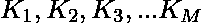
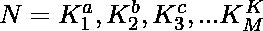
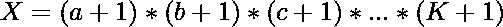

# 检查是否存在一个有 X 因子的数，其中正好 K 是质数

> 原文:[https://www . geesforgeks . org/check-if-exists-a-number-with-x-factors-out-of-确切地说-k-是-prime/](https://www.geeksforgeeks.org/check-if-there-exists-a-number-with-x-factors-out-of-which-exactly-k-are-prime/)

给定两个整数 **X** 和 **K** ，任务是确定是否存在一个数字，该数字具有精确的 **X** 因子，其中 **K** 为素数。
**举例:**

> **输入:** X = 8，K = 1
> **输出:**是
> **说明:**
> 数字为 128
> 128 的因子= {1，2，4，8，16，32，64，128}其中 8 在计数中= X
> 其中只有 2 是素数。因此素数因子的计数= 1 = K
> **输入:** X = 4，K = 2
> **输出:**是
> **说明:**
> 数字是 6
> 6 的因子= {1，2，3，6}其中 4 在计数中= X
> 其中只有 2 和 3 是素数。因此质因数计数= 2 = K

**进场:**

*   假设一个数 **N** 有 **X** 因子，其中 **K** 为素数，比如

*   因此，数可以写成，其中因子的总数由
    计算
*   观察到 X 是数的质因数“**次幂+1** ”的乘积。因此，如果我们能把 **X** 分成 **K** 个数的乘积，那么我们就能形成一个正好有 **X** 个因子的数，其中 **K** 是素数。

以下是上述方法的实现:

## C++

```
// C++ program to check if there exists
// a number with X factors
// out of which exactly K are prime

#include <bits/stdc++.h>
using namespace std;

// Function to check if such number exists
bool check(int X, int K)
{
    int prime, temp, sqr, i;

    // To store the sum of powers
    // of prime factors of X which
    // determines the maximum count
    // of numbers whose product can form X
    prime = 0;
    temp = X;
    sqr = sqrt(X);

    // Determining the prime factors of X
    for (i = 2; i <= sqr; i++) {

        while (temp % i == 0) {
            temp = temp / i;
            prime++;
        }
    }

    // To check if the number is prime
    if (temp > 2)
        prime++;

    // If X is 1, then we cannot form
    // a number with 1 factor and K
    // prime factor (as K is atleast 1)
    if (X == 1)
        return false;

    // If X itself is prime then it
    // can be represented as a power
    // of only 1 prime factor which
    // is X itself so we return true
    if (prime == 1 && K == 1)
        return true;

    // If sum of the powers of prime factors
    // of X is greater than or equal to K,
    // which means X can be represented as a
    // product of K numbers, we return true
    else if (prime >= K)
        return true;

    // In any other case, we return false
    // as we cannot form a number with X
    // factors and K prime factors
    else
        return false;
}

// Driver code
int main()
{
    int X, K;
    X = 4;
    K = 2;

    if (check(X, K))
        cout << "Yes";
    else
        cout << "No";
}
```

## Java 语言(一种计算机语言，尤用于创建网站)

```
// Java program to check if there exists
// a number with X factors
// out of which exactly K are prime

import java.util.*;

class GFG{

// Function to check if such number exists
static boolean check(int X, int K)
{
    int prime, temp, sqr, i;

    // To store the sum of powers
    // of prime factors of X which
    // determines the maximum count
    // of numbers whose product can form X
    prime = 0;
    temp = X;
    sqr = (int) Math.sqrt(X);

    // Determining the prime factors of X
    for (i = 2; i <= sqr; i++) {

        while (temp % i == 0) {
            temp = temp / i;
            prime++;
        }
    }

    // To check if the number is prime
    if (temp > 2)
        prime++;

    // If X is 1, then we cannot form
    // a number with 1 factor and K
    // prime factor (as K is atleast 1)
    if (X == 1)
        return false;

    // If X itself is prime then it
    // can be represented as a power
    // of only 1 prime factor which
    // is X itself so we return true
    if (prime == 1 && K == 1)
        return true;

    // If sum of the powers of prime factors
    // of X is greater than or equal to K,
    // which means X can be represented as a
    // product of K numbers, we return true
    else if (prime >= K)
        return true;

    // In any other case, we return false
    // as we cannot form a number with X
    // factors and K prime factors
    else
        return false;
}

// Driver code
public static void main(String[] args)
{
    int X, K;
    X = 4;
    K = 2;

    if (check(X, K))
        System.out.print("Yes");
    else
        System.out.print("No");
}
}

// This code contributed by Rajput-Ji
```

## 蟒蛇 3

```
# Python3 program to check if there exists
# a number with X factors
# out of which exactly K are prime

from math import sqrt
# Function to check if such number exists
def check(X,K):

    # To store the sum of powers
    # of prime factors of X which
    # determines the maximum count
    # of numbers whose product can form X
    prime = 0
    temp = X
    sqr = int(sqrt(X))

    # Determining the prime factors of X
    for i in range(2,sqr+1,1):
        while (temp % i == 0):
            temp = temp // i
            prime += 1

    # To check if the number is prime
    if (temp > 2):
        prime += 1

    # If X is 1, then we cannot form
    # a number with 1 factor and K
    # prime factor (as K is atleast 1)
    if (X == 1):
        return False

    # If X itself is prime then it
    # can be represented as a power
    # of only 1 prime factor w0hich
    # is X itself so we return true
    if (prime == 1 and K == 1):
        return True

    # If sum of the powers of prime factors
    # of X is greater than or equal to K,
    # which means X can be represented as a
    # product of K numbers, we return true
    elif(prime >= K):
        return True

    # In any other case, we return false
    # as we cannot form a number with X
    # factors and K prime factors
    else:
        return False

# Driver code
if __name__ == '__main__':
    X = 4
    K = 2

    if (check(X, K)):
        print("Yes")
    else:
        print("No")

# This code is contributed by Surendra_Gangwar
```

## C#

```
// C# program to check if there exists
// a number with X factors
// out of which exactly K are prime
using System;

class GFG{

    // Function to check if such number exists
    static bool check(int X, int K)
    {
        int prime, temp, sqr, i;

        // To store the sum of powers
        // of prime factors of X which
        // determines the maximum count
        // of numbers whose product can form X
        prime = 0;
        temp = X;
        sqr = Convert.ToInt32(Math.Sqrt(X));

        // Determining the prime factors of X
        for (i = 2; i <= sqr; i++) {

            while (temp % i == 0) {
                temp = temp / i;
                prime++;
            }
        }

        // To check if the number is prime
        if (temp > 2)
            prime++;

        // If X is 1, then we cannot form
        // a number with 1 factor and K
        // prime factor (as K is atleast 1)
        if (X == 1)
            return false;

        // If X itself is prime then it
        // can be represented as a power
        // of only 1 prime factor which
        // is X itself so we return true
        if (prime == 1 && K == 1)
            return true;

        // If sum of the powers of prime factors
        // of X is greater than or equal to K,
        // which means X can be represented as a
        // product of K numbers, we return true
        else if (prime >= K)
            return true;

        // In any other case, we return false
        // as we cannot form a number with X
        // factors and K prime factors
        else
            return false;
    }

    // Driver code
    static public void Main ()
    {
        int X, K;
        X = 4;
        K = 2;

        if (check(X, K))
            Console.WriteLine("Yes");
        else
            Console.WriteLine("No");
    }
}

// This code is contributed by shubhamsingh10
```

## java 描述语言

```
<script>
// javascript program to check if there exists
// a number with X factors
// out of which exactly K are prime   
// Function to check if such number exists
    function check(X , K) {
        var prime, temp, sqr, i;

        // To store the sum of powers
        // of prime factors of X which
        // determines the maximum count
        // of numbers whose product can form X
        prime = 0;
        temp = X;
        sqr = parseInt( Math.sqrt(X));

        // Determining the prime factors of X
        for (i = 2; i <= sqr; i++) {

            while (temp % i == 0) {
                temp = parseInt(temp / i);
                prime++;
            }
        }

        // To check if the number is prime
        if (temp > 2)
            prime++;

        // If X is 1, then we cannot form
        // a number with 1 factor and K
        // prime factor (as K is atleast 1)
        if (X == 1)
            return false;

        // If X itself is prime then it
        // can be represented as a power
        // of only 1 prime factor which
        // is X itself so we return true
        if (prime == 1 && K == 1)
            return true;

        // If sum of the powers of prime factors
        // of X is greater than or equal to K,
        // which means X can be represented as a
        // product of K numbers, we return true
        else if (prime >= K)
            return true;

        // In any other case, we return false
        // as we cannot form a number with X
        // factors and K prime factors
        else
            return false;
    }

    // Driver code

        var X, K;
        X = 4;
        K = 2;

        if (check(X, K))
            document.write("Yes");
        else
            document.write("No");

// This code contributed by gauravrajput1
</script>
```

**Output:** 

```
Yes
```

时间复杂度:O(sqrt(n) * log n)

辅助空间:0(1)