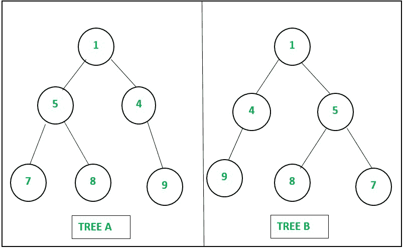
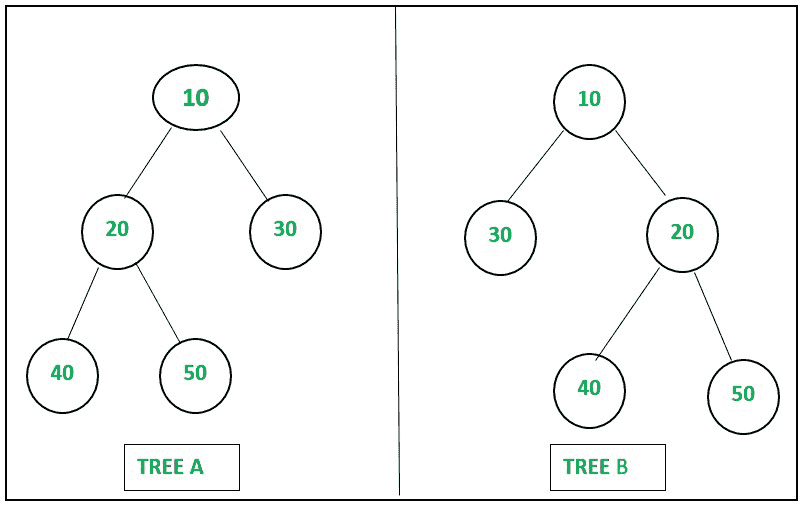

# 检查两个二叉树是否镜像|集合 3

> 原文:[https://www . geesforgeks . org/check-if-two-binary-trees-is-mirror-set-3/](https://www.geeksforgeeks.org/check-if-two-binary-trees-are-mirror-set-3/)

给定两个[数组](https://www.geeksforgeeks.org/introduction-to-arrays/)、 **A[]** 和 **B[]** 组成的 **M** [对](https://www.geeksforgeeks.org/pair-in-cpp-stl/)，按照[级顺序遍历](https://www.geeksforgeeks.org/level-order-tree-traversal/)表示 **N** 不同节点的两个[二叉树](https://www.geeksforgeeks.org/binary-tree-set-1-introduction/)的边，任务是检查[树是否是彼此的镜像。](https://www.geeksforgeeks.org/check-if-two-trees-are-mirror/)

**示例:**

> **输入:** N = 6，M = 5，A[][2] = {{1，5}、{1，4}、{5，7}、{5，8}、{4，9}}、B[][2] = {{1，4}、{1，5}、{4，9}、{5，8}、{5，7}}
> **输出:**是
> **解释:**
> 
> 
> 
> 例 1
> 
> **输入:** N = 5，M = 4，A[][2] = {{10，20}，{10，30}，{20，40}，{20，50}}，B[][2] = {{10，30}，{10，20}，{20，40}，{20，50}}
> **输出:** No
> **说明:**
> 
> 
> 
> 例 2

本文的[集 1](https://www.geeksforgeeks.org/check-if-two-trees-are-mirror/) 和[集 2](https://www.geeksforgeeks.org/check-two-trees-mirror-set-2/?ref=rp) 在之前的文章中已经讨论过了。

**方法:**给定的问题可以使用[地图](https://www.geeksforgeeks.org/map-associative-containers-the-c-standard-template-library-stl/)和[集合](https://www.geeksforgeeks.org/set-in-cpp-stl/)数据结构来解决。按照以下步骤解决问题:

*   初始化两个，[向量图](https://www.geeksforgeeks.org/map-of-vectors-in-c-stl-with-examples/)表示 **T1** 和 **T2** 分别存储树的[邻接表](https://www.geeksforgeeks.org/graph-and-its-representations/)**A**和 **B** 。
*   初始化一个[设置](https://www.geeksforgeeks.org/set-in-cpp-stl/)比如 **St** 来存储所有唯一节点的值。
*   [使用变量 **i、**遍历数组](https://www.geeksforgeeks.org/c-program-to-traverse-an-array/) **A[]** ，并执行以下步骤:
    *   将值 **A[i][1]** 推入向量 **T1[A[i][0]]** ，然后将 **A[i][0]** 和 **A[i][1]** 追加到集合 **St** 中。
*   由于边是根据[级顺序遍历](https://www.geeksforgeeks.org/level-order-tree-traversal/)给出的，因此在树 **A** 中，对于所有节点，首先插入左边的子节点，然后插入右边的子节点。
*   [使用变量 **i** 以相反的顺序遍历数组](https://www.geeksforgeeks.org/c-program-to-traverse-an-array/) **B[]** ，并执行以下步骤:
    *   将值 **B[i][1]** 推入向量**T2【B[I][0]】**中，然后将 **B[i][0]** 和 **B[i][1]** 追加到集合 **St** 中。
*   由于数组 **B[]** 是反向遍历的，因此在树 **B** 中，对于所有节点，首先插入右边的子节点，然后插入左边的子节点。
*   现在[迭代](https://www.geeksforgeeks.org/how-to-traverse-a-c-set-in-reverse-direction/) **St** 的集合，检查树 **A** 中当前节点的子节点的向量是否不等于树 **B** 中当前节点的子节点的向量，然后打印**否**作为答案，然后[返回](https://www.geeksforgeeks.org/return-statement-in-c-cpp-with-examples/)。
*   最后，如果以上情况都不满足，则打印“**是**”作为答案。

下面是上述方法的实现:

## C++

```
// C++ program for the above approach
#include <bits/stdc++.h>
using namespace std;

// Function to check whether two binary
// trees are mirror image of each other
// or not
string checkMirrorTree(int N, int M,
                       int A[][2], int B[][2])
{
    // Stores the adjacency list
    // of tree A
    map<int, vector<int> > T1;

    // Stores the adjacency list
    // of tree B
    map<int, vector<int> > T2;

    // Stores all distinct nodes
    set<int> st;

    // Traverse the array A[]
    for (int i = 0; i < M; i++) {

        // Push A[i][1] in the
        // vector T1[A[i][0]]
        T1[A[i][0]].push_back(A[i][1]);

        // Insert A[i][0] in the
        // set st
        st.insert(A[i][0]);

        // Insert A[i][1] in the
        // set st
        st.insert(A[i][1]);
    }

    // Traverse the array B[] in
    // reverse
    for (int i = M - 1; i >= 0; i--) {

        // Push B[i][1] in the
        // vector T2[B[i][0]]
        T2[B[i][0]].push_back(B[i][1]);

        // Insert B[i][0] in the
        // set st
        st.insert(B[i][0]);

        // Insert B[i][0] in the
        // set st
        st.insert(B[i][1]);
    }

    // Iterate over the set st
    for (auto node : st) {

        // If vector T1[node] is
        // not equals to T2[node]
        if (T1[node] != T2[node])
            return "No";
    }

    // Return "Yes" as
    // the answer
    return "Yes";
}

// Driver Code
int main()
{
    // Given Input
    int N = 6;
    int M = 5;

    int A[][2] = {
        { 1, 5 }, { 1, 4 }, { 5, 7 }, { 5, 8 }, { 4, 9 }
    };
    int B[][2] = {
        { 1, 4 }, { 1, 5 }, { 4, 9 }, { 5, 8 }, { 5, 7 }
    };

    // Function Call
    cout << checkMirrorTree(N, M, A, B);

    return 0;
}
```

## Java 语言(一种计算机语言，尤用于创建网站)

```
// Java program for the above approach
import java.util.*;
public class Main
{
    // Function to check whether two binary
    // trees are mirror image of each other
    // or not
    static String checkMirrorTree(int N, int M, int[][] A, int[][] B)
    {

        // Stores the adjacency list
        // of tree A
        HashMap<Integer, Vector<Integer>> T1 = new HashMap<Integer, Vector<Integer>>();

        // Stores the adjacency list
        // of tree B
        HashMap<Integer, Vector<Integer>> T2 = new HashMap<Integer, Vector<Integer>>();

        // Stores all distinct nodes
        Set<Integer> st = new HashSet<Integer>();

        // Traverse the array A[]
        for (int i = 0; i < M; i++) {

            // Push A[i][1] in the
            // vector T1[A[i][0]]
            if(T1.containsKey(A[i][0]))
            {
                T1.get(A[i][0]).add(A[i][1]);
            }
            else{
                T1.put(A[i][0], new Vector<Integer>());
                T1.get(A[i][0]).add(A[i][1]);
            }

            // Insert A[i][0] in the
            // set st
            st.add(A[i][0]);

            // Insert A[i][1] in the
            // set st
            st.add(A[i][1]);
        }

        // Traverse the array B[] in
        // reverse
        for (int i = M - 1; i >= 0; i--) {

            // Push B[i][1] in the
            // vector T2[B[i][0]]
            if(T2.containsKey(B[i][0]))
            {
                T2.get(B[i][0]).add(B[i][1]);
            }
            else{
                T2.put(B[i][0], new Vector<Integer>());
                T2.get(B[i][0]).add(B[i][1]);
            }

            // Insert B[i][0] in the
            // set st
            st.add(B[i][0]);

            // Insert B[i][0] in the
            // set st
            st.add(B[i][1]);
        }

        // Iterate over the set st
        for(int node : st) {

            // If vector T1[node] is
            // not equals to T2[node]
            if (!(T1.get(node) == T2.get(node)))
                return "Yes";
        }

        // Return "No" as
        // the answer
        return "No";
    }

    public static void main(String[] args) {
        // Given Input
        int N = 6;
        int M = 5;

        int[][] A = {
            { 1, 5 }, { 1, 4 }, { 5, 7 }, { 5, 8 }, { 4, 9 }
        };
        int[][] B = {
            { 1, 4 }, { 1, 5 }, { 4, 9 }, { 5, 8 }, { 5, 7 }
        };

        // Function Call
        System.out.print(checkMirrorTree(N, M, A, B));
    }
}

// This code is contributed by rameshtravel07.
```

## 蟒蛇 3

```
# Py program for the above approach

# Function to check whether two binary
# trees are mirror image of each other
# or not
def checkMirrorTree(N, M, A, B):

    # Stores the adjacency list
    # of tree A
    T1 = [[] for i in range(100)]

    # Stores the adjacency list
    # of tree B
    T2 = [[] for i in range(100)]

    # Stores all distinct nodes
    st = {}

    # Traverse the array A[]
    for i in range(M):

        # Push A[i][1] in the
        # vector T1[A[i][0]]
        T1[A[i][0]].append(A[i][1])

        # Insert A[i][0] in the
        # set st
        st[A[i][0]] = 1

        # Insert A[i][1] in the
        # set st
        st[A[i][1]] = 1

    # Traverse the array B[] in
    # reverse
    for i in range(M - 1, -1, -1):
        # Push B[i][1] in the
        # vector T2[B[i][0]]
        T2[B[i][0]].append(B[i][1])

        # Insert B[i][0] in the
        # set st
        st[B[i][0]] = 1

        # Insert B[i][0] in the
        # set st
        st[B[i][1]] = 1

    # Iterate over the set st
    for node in st:

        # If vector T1[node] is
        # not equals to T2[node]
        if (T1[node] != T2[node]):
            return "No"

    # Return "Yes" as
    # the answer
    return "Yes"

# Driver Code
if __name__ == '__main__':
    # Given Input
    N = 6
    M = 5

    A =[ [1, 5], [1, 4], [5, 7], [5, 8], [4, 9]]
    B =[ [ 1, 4 ],[ 1, 5 ],[ 4, 9 ],[ 5, 8 ],[ 5, 7 ]]

    # Function Call
    print (checkMirrorTree(N, M, A, B))

    # This code is contributed by mohit kumar 29.
```

## C#

```
// C# program for the above approach
using System;
using System.Collections.Generic;
class GFG {

    // Function to check whether two binary
    // trees are mirror image of each other
    // or not
    static string checkMirrorTree(int N, int M,
                           int[,] A, int[,] B)
    {

        // Stores the adjacency list
        // of tree A
        Dictionary<int, List<int>> T1 = new Dictionary<int, List<int>>();

        // Stores the adjacency list
        // of tree B
        Dictionary<int, List<int>> T2 = new Dictionary<int, List<int>>();

        // Stores all distinct nodes
        HashSet<int> st = new HashSet<int>();

        // Traverse the array A[]
        for (int i = 0; i < M; i++) {

            // Push A[i][1] in the
            // vector T1[A[i][0]]
            if(T1.ContainsKey(A[i,0]))
            {
                T1[A[i,0]].Add(A[i,1]);
            }
            else{
                T1[A[i,0]] = new List<int>();
                T1[A[i,0]].Add(A[i,1]);
            }

            // Insert A[i][0] in the
            // set st
            st.Add(A[i,0]);

            // Insert A[i][1] in the
            // set st
            st.Add(A[i,1]);
        }

        // Traverse the array B[] in
        // reverse
        for (int i = M - 1; i >= 0; i--) {

            // Push B[i][1] in the
            // vector T2[B[i][0]]
            if(T2.ContainsKey(B[i,0]))
            {
                T2[B[i,0]].Add(B[i,1]);
            }
            else{
                T2[B[i,0]] = new List<int>();
                T2[B[i,0]].Add(B[i,1]);
            }

            // Insert B[i][0] in the
            // set st
            st.Add(B[i,0]);

            // Insert B[i][0] in the
            // set st
            st.Add(B[i,1]);
        }

        // Iterate over the set st
        foreach(int node in st) {

            // If vector T1[node] is
            // not equals to T2[node]
            if (!T1[node].Equals(T2[node]))
                return "Yes";
        }

        // Return "No" as
        // the answer
        return "No";
    }

  static void Main()
  {

    // Given Input
    int N = 6;
    int M = 5;

    int[,] A = {
        { 1, 5 }, { 1, 4 }, { 5, 7 }, { 5, 8 }, { 4, 9 }
    };
    int[,] B = {
        { 1, 4 }, { 1, 5 }, { 4, 9 }, { 5, 8 }, { 5, 7 }
    };

    // Function Call
    Console.Write(checkMirrorTree(N, M, A, B));
  }
}

// This code is contributed by divyesh072019.
```

## java 描述语言

```
<script>
    // Javascript program for the above approach

    // Function to check whether two binary
    // trees are mirror image of each other
    // or not
    function checkMirrorTree(N, M, A, B)
    {

        // Stores the adjacency list
        // of tree A
        let T1 = [];

        // Stores the adjacency list
        // of tree B
        let T2 = [];

        for(let i = 0; i < 100; i++)
        {
            T1.push([]);
            T2.push([]);
        }

        // Stores all distinct nodes
        let st = new Map();

        // Traverse the array A[]
        for(let i = 0; i < M; i++)
        {
            // Push A[i][1] in the
            // vector T1[A[i][0]]
            T1[A[i][0]].push(A[i][1]);

            // Insert A[i][0] in the
            // set st
            st[A[i][0]] = 1;

            // Insert A[i][1] in the
            // set st
            st[A[i][1]] = 1;
        }

        // Traverse the array B[] in
        // reverse
        for(let i = M - 1; i < -1; i=-1)
        {
            // Push B[i][1] in the
            // vector T2[B[i][0]]
            T2[B[i][0]].push(B[i][1]);

            // Insert B[i][0] in the
            // set st
            st[B[i][0]] = 1;

            // Insert B[i][0] in the
            // set st
            st[B[i][1]] = 1;
        }

        // Iterate over the set st
        st.forEach((values,node)=>{
          // If vector T1[node] is
          // not equals to T2[node]
          if (T1[node] != T2[node])
          {
            return "No";
          }
        })

        // Return "Yes" as
        // the answer
        return "Yes";
    }

    // Given Input
    let N = 6;
    let M = 5;

    let A = [ [1, 5], [1, 4], [5, 7], [5, 8], [4, 9]];
    let B = [ [ 1, 4 ],[ 1, 5 ],[ 4, 9 ],[ 5, 8 ],[ 5, 7 ]];

    // Function Call
    document.write(checkMirrorTree(N, M, A, B));

    // This code is contributed by divyeshrabadiya07.
</script>
```

**Output**

```
Yes
```

***时间复杂度:**O((N+M)* log(N))*
***辅助空间:** O(N+M)*