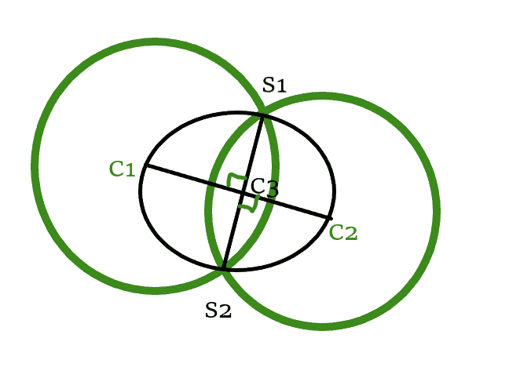

# 检查两个圆是否相交，使得第三个圆通过它们的交点和中心

> 原文:[https://www . geeksforgeeks . org/check-如果两个圆相交，那么第三个圆穿过它们的交点和中心/](https://www.geeksforgeeks.org/check-if-two-circles-intersect-such-that-the-third-circle-passes-through-their-points-of-intersections-and-centers/)

给定三个圆[的中心和半径](https://www.geeksforgeeks.org/equation-of-circle-when-three-points-on-the-circle-are-given/)**A****B**和 **C** 形式的 **{X，Y，R}** ，其中 **(X，Y)** 是圆的[中心， **R** 是该圆](https://www.geeksforgeeks.org/equation-of-circle-from-centre-and-radius/)的[半径。任务是](https://www.geeksforgeeks.org/radius-of-the-circle-when-the-width-and-height-of-an-arc-is-given/)[检查任意两个圆是否相交](https://www.geeksforgeeks.org/check-two-given-circles-touch-intersect/)，使得第三个圆穿过两个圆的交点和[中心](https://www.geeksforgeeks.org/number-of-common-tangents-between-two-circles-if-their-centers-and-radius-is-given/)。如果发现**为真**，则打印**“是”**。否则，打印**“否”**。

**示例:**

> **输入:** A = {0，0，8}，B = {0，10，6}，C = {0，5，5 }
> T3】输出:是
> 
> **输入:** arr[] = {{5，0，5}，{15，0，2}，{20，0，1 } }
> T3】输出:否

**方法:**给定的问题可以基于以下观察来解决:

[](https://media.geeksforgeeks.org/wp-content/uploads/20210320015416/Screenshot20210320015246.png)

*   假设 **C1C2** 、 **C1C3** 、 **C2C3** 为圆心[距离](https://www.geeksforgeeks.org/distance-between-centers-of-two-intersecting-circles-if-the-radii-and-common-chord-length-is-given/) **C1** 与 **C2** 、 **C1** 与 **C3** ，分别为 **C2** 与**C3****。**
*   如果 **C1C2 < r1 + r2** ，则圆 **C1** 和 **C2** 相交。
*   现在，由于第三个圆应该通过两个圆的中心及其交点，所以通过 **C1** 和 **C2** 的直线就成为弦 **S1S2** 的垂直平分线，如图所示。
*   所以可以观察到现在 **C1C3** 等于 **C3C2** 它和 **C1C3** 是第三个圆的半径，第三个圆的中心是 **C1** 和 **C2** 的中点。
*   因此，当且仅当 **C3** 的中心成为 **C1** 和 **C2** 的中点，并且如果 **C1** 和 **C2** 相交并且 **C3** 的半径成为 **C1C2** 的一半时，给定的三个圆满足给定的标准。

按照以下步骤解决问题:

*   生成给定三个圆的每个组合，并执行以下步骤:
    *   找出前两个圆的中心之间的距离，并将其存储在一个变量中，比如 **C1C2** 。
    *   如果 **C1C2** 小于前两个圆的半径之和，第三个圆的中心是前两个圆中心的中点，则打印**“是”**。
*   完成上述步骤后，如果不存在任何满足给定标准的圆的组合，则打印**“否”**。

下面是上述方法的实现:

## C++

```
// C++ program for the above approach

#include <bits/stdc++.h>
using namespace std;

// Structure of the circle
class circle {
public:
    double x;
    double y;
    double r;
};

//Utility function to check if given
// circles satisfy required criteria
bool check(circle C[])
{
    // Stores the distance between
    // the centres of C1 and C2
    double C1C2
        = sqrt((C[1].x - C[0].x)
                   * (C[1].x - C[0].x)
               + (C[1].y - C[0].y)
                     * (C[1].y - C[0].y));

    // Stores the status if the given
    // given criteria is satisfied or not
    bool flag = 0;

    // If C1C2 is less than the sum of
    // the radii of the first 2 circles
    if (C1C2 < (C[0].r + C[1].r)) {

        // If C3 is the midpoint of
        // the centres at C1 and C2
        if ((C[0].x + C[1].x)
                == 2 * C[2].x
            && (C[0].y + C[1].y)
                   == 2 * C[2].y) {

            // Mark flag true
            flag = 1;
        }
    }

    // Return flag
    return flag;
}

// Function to check if the given
// circles satisfy required criteria
bool IsFairTriplet(circle c[])
{
    bool f = false;

    // Check for the current
    // combination of circles
    f |= check(c);

    for (int i = 0; i < 2; i++) {

        swap(c[0], c[2]);

        // Check for the next
        // combination
        f |= check(c);
    }

    return f;
}

// Driver Code
int main()
{
    circle C[3];
    C[0] = { 0, 0, 8 };
    C[1] = { 0, 10, 6 };
    C[2] = { 0, 5, 5 };

    if (IsFairTriplet(C))
        cout << "Yes";
    else
        cout << "No";

    return 0;
}
```

## Java 语言(一种计算机语言，尤用于创建网站)

```
// Java approach for the above approach
class GFG{

// Structure of the circle
static class circle
{
    double x;
    double y;
    double r;

    public circle(int x, int y, int r)
    {
        this.x = x;
        this.y = y;
        this.r = r;
    }
}

// Utility function to check if given
// circles satisfy required criteria
static boolean check(circle C[])
{

    // Stores the distance between
    // the centres of C1 and C2
    double C1C2 = Math.sqrt(
        (C[1].x - C[0].x) * (C[1].x - C[0].x) +
        (C[1].y - C[0].y) * (C[1].y - C[0].y));

    // Stores the status if the given
    // given criteria is satisfied or not
    boolean flag = false;

    // If C1C2 is less than the sum of
    // the radii of the first 2 circles
    if (C1C2 < (C[0].r + C[1].r))
    {

        // If C3 is the midpoint of
        // the centres at C1 and C2
        if ((C[0].x + C[1].x) == 2 * C[2].x &&
            (C[0].y + C[1].y) == 2 * C[2].y)
        {

            // Mark flag true
            flag = true;
        }
    }

    // Return flag
    return flag;
}

// Function to check if the given
// circles satisfy required criteria
static boolean IsFairTriplet(circle c[])
{
    boolean f = false;

    // Check for the current
    // combination of circles
    f |= check(c);

    for(int i = 0; i < 2; i++)
    {
        swap(c[0], c[2]);

        // Check for the next
        // combination
        f |= check(c);
    }
    return f;
}

static void swap(circle circle1, circle circle2)
{
    circle temp = circle1;
    circle1 = circle2;
    circle2 = temp;
}

// Driver Code
public static void main(String[] args)
{
    circle C[] = new circle[3];
    C[0] = new circle(0, 0, 8);
    C[1] = new circle(0, 10, 6);
    C[2] = new circle(0, 5, 5);

    if (IsFairTriplet(C))
        System.out.println("Yes");
    else
        System.out.println("No");
}
}

// This code is contributed by abhinavjain194
```

## 蟒蛇 3

```
# Python3 program for the above approach
from math import sqrt

# Structure of the circle
class circle:
    def __init__(self, a, b, c):
        self.x = a
        self.y = b
        self.r = c

# Utility function to check if given
# circles satisfy required criteria
def check(C):

    # Stores the distance between
    # the centres of C1 and C2
    C1C2 = sqrt((C[1].x - C[0].x)
                   * (C[1].x - C[0].x)
               + (C[1].y - C[0].y)
                     * (C[1].y - C[0].y))

    # Stores the status if the given
    # given criteria is satisfied or not
    flag = 0

    # If C1C2 is less than the sum of
    # the radii of the first 2 circles
    if (C1C2 < (C[0].r + C[1].r)):

        # If C3 is the midpoint of
        # the centres at C1 and C2
        if ((C[0].x + C[1].x) == 2 * C[2].x and (C[0].y + C[1].y) == 2 * C[2].y):
            # Mark flag true
            flag = 1

    # Return flag
    return flag

# Function to check if the given
# circles satisfy required criteria
def IsFairTriplet(c):
    f = False

    # Check for the current
    # combination of circles
    f |= check(c)

    for i in range(2):

        c[0], c[2] = c[2], c[0]

        # Check for the next
        # combination
        f |= check(c)

    return f

# Driver Code
if __name__ == '__main__':
    C = [circle(0,0,0) for i in range(3)]
    C[0] = circle(0, 0, 8)
    C[1] = circle(0, 10, 6)
    C[2] = circle(0, 5, 5)

    if (IsFairTriplet(C)):
        print("Yes")
    else:
        print("No")

# This code is contributed by mohit kumar 29.
```

## C#

```
// C# approach for the above approach
using System;

class GFG{

// Structure of the circle
class circle
{
    public double x;
    public double y;
    public double r;

    public circle(int x, int y, int r)
    {
        this.x = x;
        this.y = y;
        this.r = r;
    }
}

// Utility function to check if given
// circles satisfy required criteria
static bool check(circle []C)
{

    // Stores the distance between
    // the centres of C1 and C2
    double C1C2 = Math.Sqrt(
        (C[1].x - C[0].x) * (C[1].x - C[0].x) +
        (C[1].y - C[0].y) * (C[1].y - C[0].y));

    // Stores the status if the given
    // given criteria is satisfied or not
    bool flag = false;

    // If C1C2 is less than the sum of
    // the radii of the first 2 circles
    if (C1C2 < (C[0].r + C[1].r))
    {

        // If C3 is the midpoint of
        // the centres at C1 and C2
        if ((C[0].x + C[1].x) == 2 * C[2].x &&
            (C[0].y + C[1].y) == 2 * C[2].y)
        {

            // Mark flag true
            flag = true;
        }
    }

    // Return flag
    return flag;
}

// Function to check if the given
// circles satisfy required criteria
static bool IsFairTriplet(circle []c)
{
    bool f = false;

    // Check for the current
    // combination of circles
    f |= check(c);

    for(int i = 0; i < 2; i++)
    {
        swap(c[0], c[2]);

        // Check for the next
        // combination
        f |= check(c);
    }
    return f;
}

static void swap(circle circle1, circle circle2)
{
    circle temp = circle1;
    circle1 = circle2;
    circle2 = temp;
}

// Driver Code
public static void Main(String[] args)
{
    circle []C = new circle[3];
    C[0] = new circle(0, 0, 8);
    C[1] = new circle(0, 10, 6);
    C[2] = new circle(0, 5, 5);

    if (IsFairTriplet(C))
        Console.WriteLine("Yes");
    else
        Console.WriteLine("No");
}
}

// This code is contributed by 29AjayKumar
```

## java 描述语言

```
<script>

// JavaScript approach for the above approach

// Structure of the circle
class circle
{
    constructor(x,y,r)
    {
        this.x = x;
        this.y = y;
        this.r = r;
    }
}

// Utility function to check if given
// circles satisfy required criteria
function check(C)
{
    // Stores the distance between
    // the centres of C1 and C2
    let C1C2 = Math.sqrt(
        (C[1].x - C[0].x) * (C[1].x - C[0].x) +
        (C[1].y - C[0].y) * (C[1].y - C[0].y));

    // Stores the status if the given
    // given criteria is satisfied or not
    let flag = false;

    // If C1C2 is less than the sum of
    // the radii of the first 2 circles
    if (C1C2 < (C[0].r + C[1].r))
    {

        // If C3 is the midpoint of
        // the centres at C1 and C2
        if ((C[0].x + C[1].x) == 2 * C[2].x &&
            (C[0].y + C[1].y) == 2 * C[2].y)
        {

            // Mark flag true
            flag = true;
        }
    }

    // Return flag
    return flag;
}

// Function to check if the given
// circles satisfy required criteria
function IsFairTriplet(c)
{
    let f = false;

    // Check for the current
    // combination of circles
    f |= check(c);

    for(let i = 0; i < 2; i++)
    {
        swap(c[0], c[2]);

        // Check for the next
        // combination
        f |= check(c);
    }
    return f;
}

function swap(circle1,circle2)
{
    let temp = circle1;
    circle1 = circle2;
    circle2 = temp;
}

// Driver Code
let C=new Array(3);
C[0] = new circle(0, 0, 8);
C[1] = new circle(0, 10, 6);
C[2] = new circle(0, 5, 5);

if (IsFairTriplet(C))
    document.write("Yes");
else
    document.write("No");

// This code is contributed by unknown2108

</script>
```

**Output:** 

```
Yes
```

***时间复杂度:**O(1)*
T5**辅助空间:** O(1)