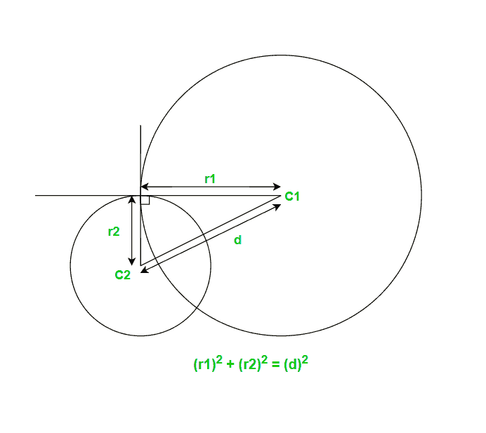

# 检查两个给定的圆是否正交

> 原文:[https://www . geeksforgeeks . org/check-如果两个给定的圆正交或不正交/](https://www.geeksforgeeks.org/check-if-two-given-circles-are-orthogonal-or-not/)

给定两个圆心为 C1(x1，y1)和 C2(x2，y2)的圆和半径为 r1 和 r2 的**，任务是检查这两个圆是否正交。
如果两条曲线的交角是直角，即它们的交点处的切线是垂直的，则称它们是正交的。** 

[](https://media.geeksforgeeks.org/wp-content/uploads/20191006111814/Screenshot-693.png)

以上两个圆是正交的

**例:**

```
Input: C1(4, 3), C2(0, 1), r1 = 2, r2 = 4 
Output: Yes

Input: C1(4, 3), C2(1, 2), r1 = 2, r2 = 2 
Output: No
```

**进场:**

*   用[距离公式](https://www.geeksforgeeks.org/program-calculate-distance-two-points/)求两个圆的圆心距离‘d’。
*   对于正交的圆，我们需要检查是否

```
r1 * r1 + r2 * r2 = d * d
```

*   如果是真的，那么这两个圆都是直角的。否则不行。

以下是上述方法的实现:

## C++

```
// C++ program to check if two
// circles are orthogonal or not

#include <bits/stdc++.h>
using namespace std;

// Function to Check if the given
// circles are orthogonal
bool orthogonality(int x1, int y1, int x2,
                   int y2, int r1, int r2)
{

    // calculating the square
    // of the distance between C1 and C2
    int dsquare = (x1 - x2) * (x1 - x2)
                  + (y1 - y2) * (y1 - y2);

    // Check if the given
    // circles are orthogonal
    if (dsquare == r1 * r1 + r2 * r2)
        return true;
    else
        return false;
}

// Driver code
int main()
{
    int x1 = 4, y1 = 3;
    int x2 = 0, y2 = 1;
    int r1 = 2, r2 = 4;

    bool f = orthogonality(x1, y1, x2,
                           y2, r1, r2);

    if (f)
        cout << "Given circles are"
             << " orthogonal.";
    else
        cout << "Given circles are"
             << " not orthogonal.";
    return 0;
}
```

## Java 语言(一种计算机语言，尤用于创建网站)

```
// Java program to check if two
// circ
import java.util.*;
import java.lang.*;
import java.io.*;

class GFG
{
    // Function to Check if the given
    // circles are orthogonal
    public static boolean orthogonality(int x1, int y1, int x2,
                                        int y2, int r1, int r2)
    {

        // calculating the square
        // of the distance between C1 and C2
        int dsquare = (x1 - x2) * (x1 - x2) +
                      (y1 - y2) * (y1 - y2);

        // Check if the given
        // circles are orthogonal
        if (dsquare == r1 * r1 + r2 * r2)
            return true;
        else
            return false;
    }

    // Driver Code
    public static void main(String[] args) throws java.lang.Exception
    {
        int x1 = 4, y1 = 3;
        int x2 = 0, y2 = 1;
        int r1 = 2, r2 = 4;

        boolean f = orthogonality(x1, y1, x2, y2, r1, r2);

        if (f)
            System.out.println("Given circles are orthogonal.");
        else
            System.out.println("Given circles are not orthogonal.");
    }
}

// This code is contributed by ashutosh450
```

## 蟒蛇 3

```
# Python3 program to check if two
# circles are orthogonal or not

# Function to Check if the given
# circles are orthogonal
def orthogonality(x1, y1, x2, y2, r1, r2):

    # calculating the square
    # of the distance between C1 and C2
    dsquare = (x1 - x2) * (x1 - x2) + \
              (y1 - y2) * (y1 - y2);

    # Check if the given
    # circles are orthogonal
    if (dsquare == r1 * r1 + r2 * r2):
        return True
    else:
        return False

# Driver code
x1, y1 = 4, 3
x2, y2 = 0, 1
r1, r2 = 2, 4

f = orthogonality(x1, y1, x2, y2, r1, r2)

if (f):
    print("Given circles are orthogonal.")
else:
    print("Given circles are not orthogonal.")

# This code is contributed by Mohit Kumar
```

## C#

```
// C# implementation for above program
using System;

class GFG
{
    // Function to Check if the given
    // circles are orthogonal
    public static bool orthogonality(int x1, int y1, int x2,
                                     int y2, int r1, int r2)
    {

        // calculating the square
        // of the distance between C1 and C2
        int dsquare = (x1 - x2) * (x1 - x2) +
                      (y1 - y2) * (y1 - y2);

        // Check if the given
        // circles are orthogonal
        if (dsquare == r1 * r1 + r2 * r2)
            return true;
        else
            return false;
    }

    // Driver Code
    public static void Main()
    {
        int x1 = 4, y1 = 3;
        int x2 = 0, y2 = 1;
        int r1 = 2, r2 = 4;

        bool f = orthogonality(x1, y1, x2, y2, r1, r2);

        if (f)
            Console.WriteLine("Given circles are orthogonal.");
        else
            Console.WriteLine("Given circles are not orthogonal.");
    }
}

// This code is contributed by AnkitRai01
```

## java 描述语言

```
<script>
    // Javascript program to check if two
    // circles are orthogonal or not 

    // Function to Check if the given
    // circles are orthogonal
    function orthogonality(x1, y1, x2, y2, r1, r2)
    {

        // calculating the square
        // of the distance between C1 and C2
        let dsquare = (x1 - x2) * (x1 - x2)
                      + (y1 - y2) * (y1 - y2);

        // Check if the given
        // circles are orthogonal
        if (dsquare == r1 * r1 + r2 * r2)
            return true;
        else
            return false;
    }

    // Driver code
    let x1 = 4, y1 = 3;
    let x2 = 0, y2 = 1;
    let r1 = 2, r2 = 4;

    let f = orthogonality(x1, y1, x2,
                           y2, r1, r2);

    if (f)
        document.write("Given circles are orthogonal.");
    else
        document.write("Given circles are not orthogonal.");

// This code is contributed by divyesh072019.
</script>
```

**Output:** 

```
Given circles are orthogonal.
```