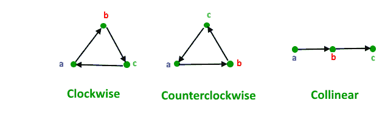
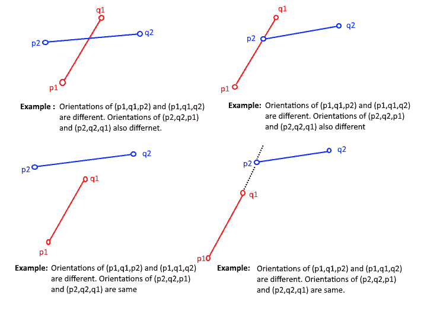
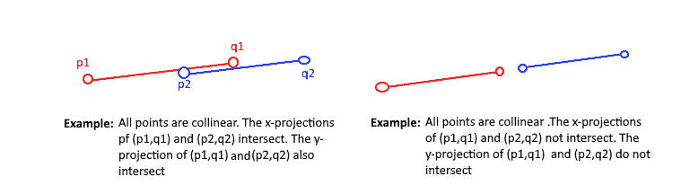

# 如何检查给定的两条线段是否相交？

> 原文:[https://www . geesforgeks . org/check-if-two-给定线段-intersect/](https://www.geeksforgeeks.org/check-if-two-given-line-segments-intersect/)

给定两条线段 (p1，q1) 和 (p2，q2)，查找给定线段是否相交。
在我们讨论解决方案之前，让我们定义 [**方向**](https://www.geeksforgeeks.org/orientation-3-ordered-points/) 的概念。平面中有序三元组点的方向可以是
–逆时针
–顺时针
–共线

下图显示了( a 、 b 、 c 的不同可能方位



**方位在这里有什么用？**
两个线段 (p1，q1) 和 (p2，q2) 相交的条件是且仅当下列两个条件之一得到验证

**1。** ***一般情况:***
–(P1、 q1 、 p2 )和( p1 、 q1 、 q2 )方位不同，
–(p2、 q2 、 p1 )和( p2

***例:***



**2。** ***特例***
–(P1、 q1 、 p2 )、( p1 、 q1 、 q2 )、( p2 、 q2 、 p1 )和( p2 、 q1 )和( p2 、 q2 相交
–的 y 投影( p1 、 q1 )和( p2 、 q2 相交

***例:***



以下是基于上述思想的实现。

## C++

```
// A C++ program to check if two given line segments intersect
#include <iostream>
using namespace std;

struct Point
{
    int x;
    int y;
};

// Given three collinear points p, q, r, the function checks if
// point q lies on line segment 'pr'
bool onSegment(Point p, Point q, Point r)
{
    if (q.x <= max(p.x, r.x) && q.x >= min(p.x, r.x) &&
        q.y <= max(p.y, r.y) && q.y >= min(p.y, r.y))
       return true;

    return false;
}

// To find orientation of ordered triplet (p, q, r).
// The function returns following values
// 0 --> p, q and r are collinear
// 1 --> Clockwise
// 2 --> Counterclockwise
int orientation(Point p, Point q, Point r)
{
    // See https://www.geeksforgeeks.org/orientation-3-ordered-points/
    // for details of below formula.
    int val = (q.y - p.y) * (r.x - q.x) -
              (q.x - p.x) * (r.y - q.y);

    if (val == 0) return 0;  // collinear

    return (val > 0)? 1: 2; // clock or counterclock wise
}

// The main function that returns true if line segment 'p1q1'
// and 'p2q2' intersect.
bool doIntersect(Point p1, Point q1, Point p2, Point q2)
{
    // Find the four orientations needed for general and
    // special cases
    int o1 = orientation(p1, q1, p2);
    int o2 = orientation(p1, q1, q2);
    int o3 = orientation(p2, q2, p1);
    int o4 = orientation(p2, q2, q1);

    // General case
    if (o1 != o2 && o3 != o4)
        return true;

    // Special Cases
    // p1, q1 and p2 are collinear and p2 lies on segment p1q1
    if (o1 == 0 && onSegment(p1, p2, q1)) return true;

    // p1, q1 and q2 are collinear and q2 lies on segment p1q1
    if (o2 == 0 && onSegment(p1, q2, q1)) return true;

    // p2, q2 and p1 are collinear and p1 lies on segment p2q2
    if (o3 == 0 && onSegment(p2, p1, q2)) return true;

     // p2, q2 and q1 are collinear and q1 lies on segment p2q2
    if (o4 == 0 && onSegment(p2, q1, q2)) return true;

    return false; // Doesn't fall in any of the above cases
}

// Driver program to test above functions
int main()
{
    struct Point p1 = {1, 1}, q1 = {10, 1};
    struct Point p2 = {1, 2}, q2 = {10, 2};

    doIntersect(p1, q1, p2, q2)? cout << "Yes\n": cout << "No\n";

    p1 = {10, 0}, q1 = {0, 10};
    p2 = {0, 0}, q2 = {10, 10};
    doIntersect(p1, q1, p2, q2)? cout << "Yes\n": cout << "No\n";

    p1 = {-5, -5}, q1 = {0, 0};
    p2 = {1, 1}, q2 = {10, 10};
    doIntersect(p1, q1, p2, q2)? cout << "Yes\n": cout << "No\n";

    return 0;
}
```

## Java 语言(一种计算机语言，尤用于创建网站)

```
// Java program to check if two given line segments intersect
class GFG
{

static class Point
{
    int x;
    int y;

        public Point(int x, int y)
        {
            this.x = x;
            this.y = y;
        }

};

// Given three collinear points p, q, r, the function checks if
// point q lies on line segment 'pr'
static boolean onSegment(Point p, Point q, Point r)
{
    if (q.x <= Math.max(p.x, r.x) && q.x >= Math.min(p.x, r.x) &&
        q.y <= Math.max(p.y, r.y) && q.y >= Math.min(p.y, r.y))
    return true;

    return false;
}

// To find orientation of ordered triplet (p, q, r).
// The function returns following values
// 0 --> p, q and r are collinear
// 1 --> Clockwise
// 2 --> Counterclockwise
static int orientation(Point p, Point q, Point r)
{
    // See https://www.geeksforgeeks.org/orientation-3-ordered-points/
    // for details of below formula.
    int val = (q.y - p.y) * (r.x - q.x) -
            (q.x - p.x) * (r.y - q.y);

    if (val == 0) return 0; // collinear

    return (val > 0)? 1: 2; // clock or counterclock wise
}

// The main function that returns true if line segment 'p1q1'
// and 'p2q2' intersect.
static boolean doIntersect(Point p1, Point q1, Point p2, Point q2)
{
    // Find the four orientations needed for general and
    // special cases
    int o1 = orientation(p1, q1, p2);
    int o2 = orientation(p1, q1, q2);
    int o3 = orientation(p2, q2, p1);
    int o4 = orientation(p2, q2, q1);

    // General case
    if (o1 != o2 && o3 != o4)
        return true;

    // Special Cases
    // p1, q1 and p2 are collinear and p2 lies on segment p1q1
    if (o1 == 0 && onSegment(p1, p2, q1)) return true;

    // p1, q1 and q2 are collinear and q2 lies on segment p1q1
    if (o2 == 0 && onSegment(p1, q2, q1)) return true;

    // p2, q2 and p1 are collinear and p1 lies on segment p2q2
    if (o3 == 0 && onSegment(p2, p1, q2)) return true;

    // p2, q2 and q1 are collinear and q1 lies on segment p2q2
    if (o4 == 0 && onSegment(p2, q1, q2)) return true;

    return false; // Doesn't fall in any of the above cases
}

// Driver code
public static void main(String[] args)
{
    Point p1 = new Point(1, 1);
    Point q1 = new Point(10, 1);
    Point p2 = new Point(1, 2);
    Point q2 = new Point(10, 2);

    if(doIntersect(p1, q1, p2, q2))
        System.out.println("Yes");
    else
        System.out.println("No");

    p1 = new Point(10, 1); q1 = new Point(0, 10);
    p2 = new Point(0, 0); q2 = new Point(10, 10);
    if(doIntersect(p1, q1, p2, q2))
            System.out.println("Yes");
    else
        System.out.println("No");

    p1 = new Point(-5, -5); q1 = new Point(0, 0);
    p2 = new Point(1, 1); q2 = new Point(10, 10);;
    if(doIntersect(p1, q1, p2, q2))
        System.out.println("Yes");
    else
        System.out.println("No");
}
}

// This code is contributed by Princi Singh
```

## 蟒蛇 3

```
# A Python3 program to find if 2 given line segments intersect or not

class Point:
    def __init__(self, x, y):
        self.x = x
        self.y = y

# Given three collinear points p, q, r, the function checks if
# point q lies on line segment 'pr'
def onSegment(p, q, r):
    if ( (q.x <= max(p.x, r.x)) and (q.x >= min(p.x, r.x)) and
           (q.y <= max(p.y, r.y)) and (q.y >= min(p.y, r.y))):
        return True
    return False

def orientation(p, q, r):
    # to find the orientation of an ordered triplet (p,q,r)
    # function returns the following values:
    # 0 : Collinear points
    # 1 : Clockwise points
    # 2 : Counterclockwise

    # See https://www.geeksforgeeks.org/orientation-3-ordered-points/amp/
    # for details of below formula.

    val = (float(q.y - p.y) * (r.x - q.x)) - (float(q.x - p.x) * (r.y - q.y))
    if (val > 0):

        # Clockwise orientation
        return 1
    elif (val < 0):

        # Counterclockwise orientation
        return 2
    else:

        # Collinear orientation
        return 0

# The main function that returns true if
# the line segment 'p1q1' and 'p2q2' intersect.
def doIntersect(p1,q1,p2,q2):

    # Find the 4 orientations required for
    # the general and special cases
    o1 = orientation(p1, q1, p2)
    o2 = orientation(p1, q1, q2)
    o3 = orientation(p2, q2, p1)
    o4 = orientation(p2, q2, q1)

    # General case
    if ((o1 != o2) and (o3 != o4)):
        return True

    # Special Cases

    # p1 , q1 and p2 are collinear and p2 lies on segment p1q1
    if ((o1 == 0) and onSegment(p1, p2, q1)):
        return True

    # p1 , q1 and q2 are collinear and q2 lies on segment p1q1
    if ((o2 == 0) and onSegment(p1, q2, q1)):
        return True

    # p2 , q2 and p1 are collinear and p1 lies on segment p2q2
    if ((o3 == 0) and onSegment(p2, p1, q2)):
        return True

    # p2 , q2 and q1 are collinear and q1 lies on segment p2q2
    if ((o4 == 0) and onSegment(p2, q1, q2)):
        return True

    # If none of the cases
    return False

# Driver program to test above functions:
p1 = Point(1, 1)
q1 = Point(10, 1)
p2 = Point(1, 2)
q2 = Point(10, 2)

if doIntersect(p1, q1, p2, q2):
    print("Yes")
else:
    print("No")

p1 = Point(10, 0)
q1 = Point(0, 10)
p2 = Point(0, 0)
q2 = Point(10,10)

if doIntersect(p1, q1, p2, q2):
    print("Yes")
else:
    print("No")

p1 = Point(-5,-5)
q1 = Point(0, 0)
p2 = Point(1, 1)
q2 = Point(10, 10)

if doIntersect(p1, q1, p2, q2):
    print("Yes")
else:
    print("No")

# This code is contributed by Ansh Riyal
```

## C#

```
// C# program to check if two given line segments intersect
using System;
using System.Collections.Generic;

class GFG
{

public class Point
{
    public int x;
    public int y;

    public Point(int x, int y)
    {
        this.x = x;
        this.y = y;
    }

};

// Given three collinear points p, q, r, the function checks if
// point q lies on line segment 'pr'
static Boolean onSegment(Point p, Point q, Point r)
{
    if (q.x <= Math.Max(p.x, r.x) && q.x >= Math.Min(p.x, r.x) &&
        q.y <= Math.Max(p.y, r.y) && q.y >= Math.Min(p.y, r.y))
    return true;

    return false;
}

// To find orientation of ordered triplet (p, q, r).
// The function returns following values
// 0 --> p, q and r are collinear
// 1 --> Clockwise
// 2 --> Counterclockwise
static int orientation(Point p, Point q, Point r)
{
    // See https://www.geeksforgeeks.org/orientation-3-ordered-points/
    // for details of below formula.
    int val = (q.y - p.y) * (r.x - q.x) -
            (q.x - p.x) * (r.y - q.y);

    if (val == 0) return 0; // collinear

    return (val > 0)? 1: 2; // clock or counterclock wise
}

// The main function that returns true if line segment 'p1q1'
// and 'p2q2' intersect.
static Boolean doIntersect(Point p1, Point q1, Point p2, Point q2)
{
    // Find the four orientations needed for general and
    // special cases
    int o1 = orientation(p1, q1, p2);
    int o2 = orientation(p1, q1, q2);
    int o3 = orientation(p2, q2, p1);
    int o4 = orientation(p2, q2, q1);

    // General case
    if (o1 != o2 && o3 != o4)
        return true;

    // Special Cases
    // p1, q1 and p2 are collinear and p2 lies on segment p1q1
    if (o1 == 0 && onSegment(p1, p2, q1)) return true;

    // p1, q1 and q2 are collinear and q2 lies on segment p1q1
    if (o2 == 0 && onSegment(p1, q2, q1)) return true;

    // p2, q2 and p1 are collinear and p1 lies on segment p2q2
    if (o3 == 0 && onSegment(p2, p1, q2)) return true;

    // p2, q2 and q1 are collinear and q1 lies on segment p2q2
    if (o4 == 0 && onSegment(p2, q1, q2)) return true;

    return false; // Doesn't fall in any of the above cases
}

// Driver code
public static void Main(String[] args)
{
    Point p1 = new Point(1, 1);
    Point q1 = new Point(10, 1);
    Point p2 = new Point(1, 2);
    Point q2 = new Point(10, 2);

    if(doIntersect(p1, q1, p2, q2))
        Console.WriteLine("Yes");
    else
        Console.WriteLine("No");

    p1 = new Point(10, 1); q1 = new Point(0, 10);
    p2 = new Point(0, 0); q2 = new Point(10, 10);
    if(doIntersect(p1, q1, p2, q2))
            Console.WriteLine("Yes");
    else
        Console.WriteLine("No");

    p1 = new Point(-5, -5); q1 = new Point(0, 0);
    p2 = new Point(1, 1); q2 = new Point(10, 10);;
    if(doIntersect(p1, q1, p2, q2))
        Console.WriteLine("Yes");
    else
        Console.WriteLine("No");
}
}

/* This code contributed by PrinciRaj1992 */
```

## java 描述语言

```
<script>
// Javascript program to check if two given line segments intersect

class Point
{
    constructor(x, y)
    {
        this.x = x;
            this.y = y;
    }
}

// Given three collinear points p, q, r, the function checks if
// point q lies on line segment 'pr'
function onSegment(p, q, r)
{
    if (q.x <= Math.max(p.x, r.x) && q.x >= Math.min(p.x, r.x) &&
        q.y <= Math.max(p.y, r.y) && q.y >= Math.min(p.y, r.y))
    return true;

    return false;
}

// To find orientation of ordered triplet (p, q, r).
// The function returns following values
// 0 --> p, q and r are collinear
// 1 --> Clockwise
// 2 --> Counterclockwise
function orientation(p, q, r)
{

    // See https://www.geeksforgeeks.org/orientation-3-ordered-points/
    // for details of below formula.
    let val = (q.y - p.y) * (r.x - q.x) -
            (q.x - p.x) * (r.y - q.y);

    if (val == 0) return 0; // collinear

    return (val > 0)? 1: 2; // clock or counterclock wise
}

// The main function that returns true if line segment 'p1q1'
// and 'p2q2' intersect.
function doIntersect(p1, q1, p2, q2)
{

    // Find the four orientations needed for general and
    // special cases
    let o1 = orientation(p1, q1, p2);
    let o2 = orientation(p1, q1, q2);
    let o3 = orientation(p2, q2, p1);
    let o4 = orientation(p2, q2, q1);

    // General case
    if (o1 != o2 && o3 != o4)
        return true;

    // Special Cases
    // p1, q1 and p2 are collinear and p2 lies on segment p1q1
    if (o1 == 0 && onSegment(p1, p2, q1)) return true;

    // p1, q1 and q2 are collinear and q2 lies on segment p1q1
    if (o2 == 0 && onSegment(p1, q2, q1)) return true;

    // p2, q2 and p1 are collinear and p1 lies on segment p2q2
    if (o3 == 0 && onSegment(p2, p1, q2)) return true;

    // p2, q2 and q1 are collinear and q1 lies on segment p2q2
    if (o4 == 0 && onSegment(p2, q1, q2)) return true;

    return false; // Doesn't fall in any of the above cases
}

// Driver code
let p1 = new Point(1, 1);
let q1 = new Point(10, 1);
let p2 = new Point(1, 2);
let q2 = new Point(10, 2);

if(doIntersect(p1, q1, p2, q2))
    document.write("Yes<br>");
else
    document.write("No<br>");

p1 = new Point(10, 1); q1 = new Point(0, 10);
p2 = new Point(0, 0); q2 = new Point(10, 10);
if(doIntersect(p1, q1, p2, q2))
    document.write("Yes<br>");
else
    document.write("No<br>");

p1 = new Point(-5, -5); q1 = new Point(0, 0);
p2 = new Point(1, 1); q2 = new Point(10, 10);;
if(doIntersect(p1, q1, p2, q2))
    document.write("Yes<br>");
else
    document.write("No<br>");

// This code is contributed by avanitrachhadiya2155
</script>
```

**输出:**

```
No
Yes
No
```

***时间复杂度:** O(1)*

**来源:**
[【http://www.dcs.gla.ac.uk/~pat/52233/slides/Geometry1x1.pdf】](http://www.dcs.gla.ac.uk/~pat/52233/slides/Geometry1x1.pdf)
[Clifford Stein，Thomas H. Cormen，Charles E. Leiserson，罗纳德·L·李维斯特《算法导论》第三版](http://www.flipkart.com/introduction-algorithms-3rd/p/itmczynzhyhxv2gs?pid=9788120340077&affid=sandeepgfg)
如发现任何不正确的地方，请写评论，或想分享更多关于上述话题的信息