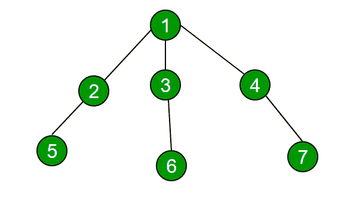
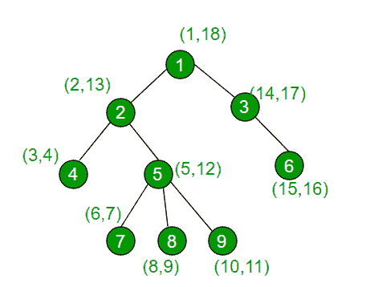

# 检查一棵树中两个节点是否在同一路径上

> 原文:[https://www . geeksforgeeks . org/check-if-two-node-on-on-path-in-a-tree/](https://www.geeksforgeeks.org/check-if-two-nodes-are-on-same-path-in-a-tree/)

给定一棵树(不一定是二叉树)和多个查询，使得每个查询都以树的两个节点作为参数。对于每个查询对，查找两个节点是否在从根到底部的同一路径上。

例如，考虑下面的树，如果给定的查询是(1，5)、(1，6)和(2，6)，那么答案应该分别为真、真和假。



请注意，1 和 5 位于同一根到叶路径上，1 和 6 也是如此，但 2 和 6 不在同一根到叶路径上。

很明显，深度优先搜索技术将用于解决上述问题，主要问题是如何快速响应多个查询。这里我们的图是一棵树，它可以有任意数量的孩子。现在，如果从根节点开始，树中的 DFS 以深度搜索方式进行，即假设根有三个子节点，而这些子节点只有一个子节点，因此如果 DFS 开始，那么它首先访问根节点的第一个子节点，然后将深入到该节点的子节点。小树的情况如下所示:

访问节点的顺序是–1253647。
因此，稍后访问其他子节点，直到完全成功访问一个子节点，直到深度。为了简化这一点，如果我们假设我们手里有一块手表，我们开始以 DFS 的方式从根开始走。

时间-当我们第一次访问节点时
超时-如果我们稍后再次访问节点，但是没有未访问的子节点，我们称之为超时，

*注意:其子树中的任何节点都将始终具有其子节点(或子节点的子节点)的 intime <，因为它总是在子节点之前被首先访问(由于 DFS)，并且在其子树中将具有 outtime >所有节点，因为在注意到 outtime 之前，它等待其所有子节点被标记为被访问。*

对于任意两个节点 u，v，如果它们在同一条路径上，

```
Intime[v] < Intime[u] and Outtime[v] > Outtime[u]
                 OR
Intime[u] < Intime[v] and Outtime[u ]> Outtime[v]
```

*   如果给定的一对节点符合这两个条件中的任何一个，那么它们在叶路径的同一个根上。
*   否则不在同一路径上(如果两个节点在不同的路径上，这意味着没有一个节点在彼此的子树中)。

**伪码**

我们使用一个全局变量 time，它将随着节点的 dfs 开始而递增，并且在之后也会递增

```
DFS(v)
    increment timer
    Intime[v] = timer
    mark v as visited
    for all u that are children of v
              DFS(u)
    increment timer
    Outtime[v] = timer
end
```

时间复杂度–预处理为 0(n)，每个查询为 0(1)。

**实现:**
下面是上面伪码的实现。

## C++

```
// C++ program to check if given pairs lie on same
// path or not.
#include<bits/stdc++.h>
using namespace std;
const int MAX = 100001;

// To keep track of visited vertices in DFS
bool visit[MAX] = {0};

// To store start and end time of all vertices
// during DFS.
int intime[MAX];
int outtime[MAX];

// initially timer is zero
int timer = 0;

// Does DFS of given graph and fills arrays
// intime[] and outtime[]. These arrays are used
// to answer given queries.
void dfs(vector<int> graph[], int v)
{
    visit[v] = true;

    // Increment the timer as you enter
    // the recursion for v
    ++timer;

    // Upgrade the in time for the vertex
    intime[v] = timer;

    vector<int>::iterator it = graph[v].begin();
    while (it != graph[v].end())
    {
        if (visit[*it]==false)
            dfs(graph, *it);
        it++;
    }

    // increment the timer as you exit the
    // recursion for v
    ++timer;

    // upgrade the outtime for that node
    outtime[v] = timer;
}

// Returns true if 'u' and 'v' lie on same root to leaf path
// else false.
bool query(int u, int v)
{
    return ( (intime[u]<intime[v] && outtime[u]>outtime[v]) ||
             (intime[v]<intime[u] && outtime[v]>outtime[u]) );
}

// Driver code
int main()
{
    // Let us create above shown tree
    int n = 9; // total number of nodes
    vector<int> graph[n+1];
    graph[1].push_back(2);
    graph[1].push_back(3);
    graph[3].push_back(6);
    graph[2].push_back(4);
    graph[2].push_back(5);
    graph[5].push_back(7);
    graph[5].push_back(8);
    graph[5].push_back(9);

    // Start dfs (here root node is 1)
    dfs(graph, 1);

    // below are calls for few pairs of nodes
    query(1, 5)? cout << "Yes\n" : cout << "No\n";
    query(2, 9)? cout << "Yes\n" : cout << "No\n";
    query(2, 6)? cout << "Yes\n" : cout << "No\n";

    return 0;
}
```

## Java 语言(一种计算机语言，尤用于创建网站)

```
// Java program to check if given
// pairs lie on same path or not.
import java.util.*;

class GFG{

static int MAX = 100001;

// To keep track of visited vertices in DFS
static boolean []visit = new boolean[MAX];

// To store start and end time of all vertices
// during DFS.
static int []intime = new int[MAX];
static int []outtime = new int[MAX];

// Initially timer is zero
static int timer = 0;

// Does DFS of given graph and fills arrays
// intime[] and outtime[]. These arrays are used
// to answer given queries.
static void dfs(Vector<Integer> graph[], int v)
{
    visit[v] = true;

    // Increment the timer as you enter
    // the recursion for v
    ++timer;

    // Upgrade the in time for the vertex
    intime[v] = timer;

    for(int it : graph[v])
    {
        if (visit[it] == false)
            dfs(graph, it);

        it++;
    }

    // Increment the timer as you exit the
    // recursion for v
    ++timer;

    // Upgrade the outtime for that node
    outtime[v] = timer;
}

// Returns true if 'u' and 'v' lie on
// same root to leaf path else false.
static boolean query(int u, int v)
{
    return ((intime[u] < intime[v] &&
            outtime[u] > outtime[v]) ||
            (intime[v] < intime[u] &&
            outtime[v] > outtime[u]));
}

// Driver code
public static void main(String[] args)
{

    // Let us create above shown tree
    int n = 9; // total number of nodes

    @SuppressWarnings("unchecked")
    Vector<Integer> []graph = new Vector[n + 1];
    for(int i = 0; i < graph.length; i++)
        graph[i] = new Vector<Integer>();

    graph[1].add(2);
    graph[1].add(3);
    graph[3].add(6);
    graph[2].add(4);
    graph[2].add(5);
    graph[5].add(7);
    graph[5].add(8);
    graph[5].add(9);

    // Start dfs (here root node is 1)
    dfs(graph, 1);

    // Below are calls for few pairs of nodes
    if (query(1, 5))
        System.out.print("Yes\n" );
    else
        System.out.print("No\n");

    if (query(2, 9))
        System.out.print("Yes\n");
    else
        System.out.print("No\n");

    if (query(2, 6))
        System.out.print("Yes\n" );
    else
        System.out.print("No\n");
}
}

// This code is contributed by Princi Singh
```

## 蟒蛇 3

```
# contributed by saurabh_jain861
# Python3 program to check if given
# pairs lie on same path or not.

# Does DFS of given graph and fills
# arrays intime[] and outtime[].
# These arrays are used to answer
# given queries.
def dfs(graph, v):
    global intime, outtime, visit, MAX, timer
    visit.add(v)

    # Increment the timer as you enter
    # the recursion for v
    timer += 1

    # Upgrade the in time for the vertex
    intime[v] = timer
    it = 0
    while it < len(graph[v]):
        if (graph[v][it] not in visit):
            dfs(graph, graph[v][it])
        it += 1

    # increment the timer as you
    # exit the recursion for v
    timer += 1

    # upgrade the outtime for that node
    outtime[v] = timer

# Returns true if 'u' and 'v' lie on
# same root to leaf path else false.
def query(u, v):
    global intime, outtime, visit, MAX, timer
    return ((intime[u] < intime[v] and
             outtime[u] > outtime[v]) or
            (intime[v] < intime[u] and
             outtime[v] > outtime[u]) )

# Driver code
MAX = 100001

# To keep track of visited vertices in DFS
visit =set()

# To store start and end time of
# all vertices during DFS.
intime = [0] * MAX
outtime = [0] * MAX

# initially timer is zero
timer = 0

# Let us create above shown tree
n = 9 # total number of nodes
graph = [[] for i in range(n+1)]
graph[1].append(2)
graph[1].append(3)
graph[3].append(6)
graph[2].append(4)
graph[2].append(5)
graph[5].append(7)
graph[5].append(8)
graph[5].append(9)

# Start dfs (here root node is 1)
dfs(graph, 1)

# below are calls for few pairs of nodes
print("Yes") if query(1, 5) else print("No")
print("Yes") if query(2, 9) else print("No")
print("Yes") if query(2, 6) else print("No")

# This code is contributed by PranchalK
```

## C#

```
// C# program to check if given
// pairs lie on same path or not.
using System;
using System.Collections.Generic;
class GFG{

static int MAX = 100001;

// To keep track of visited
// vertices in DFS
static bool []visit =
       new bool[MAX];

// To store start and end
// time of all vertices
// during DFS.
static int []intime =
       new int[MAX];
static int []outtime =
       new int[MAX];

// Initially timer is zero
static int timer = 0;

// Does DFS of given graph
// and fills arrays intime[]
// and outtime[]. These arrays
// are used to answer given queries.
static void dfs(List<int> []graph,
                int v)
{
  visit[v] = true;

  // Increment the timer as
  // you enter the recursion
  // for v
  ++timer;

  // Upgrade the in time
  // for the vertex
  intime[v] = timer;

  foreach(int it in graph[v])
  {
    if (visit[it] == false)
      dfs(graph, it);
  }

  // Increment the timer as
  // you exit the recursion for v
  ++timer;

  // Upgrade the outtime for
  // that node
  outtime[v] = timer;
}

// Returns true if 'u' and
// 'v' lie on same root to
// leaf path else false.
static bool query(int u,
                  int v)
{
  return ((intime[u] < intime[v] &&
           outtime[u] > outtime[v]) ||
          (intime[v] < intime[u] &&
           outtime[v] > outtime[u]));
}

// Driver code
public static void Main(String[] args)
{   
  // Let us create above shown tree
  // total number of nodes
  int n = 9;

  List<int> []graph =
       new List<int>[n + 1];

  for(int i = 0;
          i < graph.Length; i++)
    graph[i] = new List<int>();

  graph[1].Add(2);
  graph[1].Add(3);
  graph[3].Add(6);
  graph[2].Add(4);
  graph[2].Add(5);
  graph[5].Add(7);
  graph[5].Add(8);
  graph[5].Add(9);

  // Start dfs (here root
  // node is 1)
  dfs(graph, 1);

  // Below are calls for few
  // pairs of nodes
  if (query(1, 5))
    Console.Write("Yes\n" );
  else
    Console.Write("No\n");

  if (query(2, 9))
    Console.Write("Yes\n");
  else
    Console.Write("No\n");

  if (query(2, 6))
    Console.Write("Yes\n" );
  else
    Console.Write("No\n");
}
}

// This code is contributed by Amit Katiyar
```

**Output**

```
Yes
Yes
No
```

**图解:**
从下图了解更多，我们可以有一些例子。如上所述修改的 DFS 算法将导致树的顶点出现如下的开始时间和结束时间。现在我们将考虑所有的情况。



情况 1:节点 2 和 4:节点 2 的初始时间比节点 4 短，但由于节点 4 在其子树中，因此它的退出时间比节点 4 长。因此，条件有效，并且两者都在同一路径上。
情况 2:节点 7 和 6:节点 7 的初始时间小于节点 6，但由于两个节点都不在彼此的子树中，因此它们的退出时间不符合要求的条件。

本文由**绍拉布乔希供稿。**如果你喜欢 GeeksforGeeks 并想投稿，你也可以写一篇文章，把你的文章邮寄到 contribute@geeksforgeeks.org。看到你的文章出现在极客博客主页上，帮助其他极客。
如果你发现任何不正确的地方，或者你想分享更多关于上面讨论的话题的信息，请写评论。